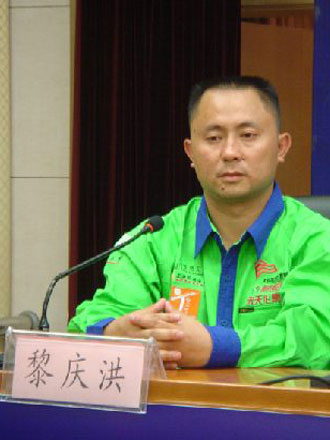
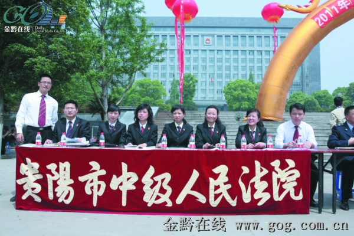
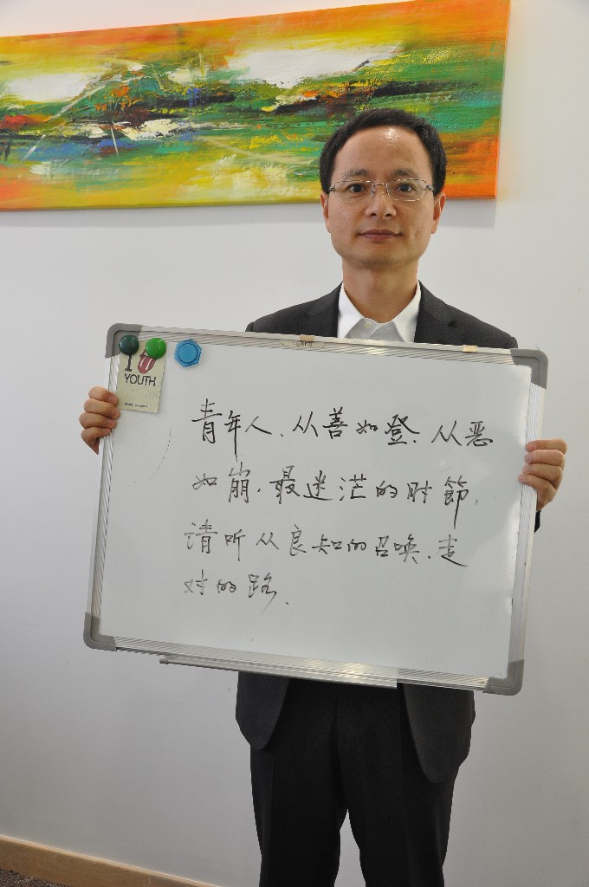

# ＜七星说法＞第四十二期：一条小河

**本期导读：1个月前，7月23日，被告多达57人的黎庆洪涉黑案，在贵阳市小河区法院审判结束。全国八十八位律师受聘为众被告无偿辩护。其中4名律师被驱逐出法庭，20多位律师收到了审判长的口头警告，19名外地律师在官方压力下“被当事人弃而不用”，除了75名当地律师，最后坐到法庭上的还剩下13名外地律师，而后者也成为律师团的核心。而13名外地律师所属地的北京、上海与湖南三地司法行政部门，均派员到贵阳“现管”。两高两部现场督办，最高法院一位庭长、高检院一位厅长，司法部律师司司长以及公安部的领导，齐集贵阳，听审于此。多达两百位全国业界顶尖法律人全力参与，陈有西、斯伟江、何兵、童之伟、王耀刚、周泽、贺卫方、江平、迟夙生、杨金柱、袁裕来……他们在网络上，在法庭上，进行着激烈的战斗，时间长达七个月之久。** **这就是吸引了众多媒体和法律人的黎庆洪黑社会性质组织犯罪集团案（也称小河案）。本期说法将向各位读者介绍这起被称为自“重庆李庄案”后又一个骇人听闻的“黑打案”的小河案，向大家讲述，黎庆洪到底是何许人也？他所涉嫌的案件为何如此引人注目，又是什么力量驱使着无数的法律人带着正义的呼声在此战斗？ ** 

# 一条小河

## 

 

### 企业家，黑社会，只有一线之隔？

黎庆洪，男，1974年2月出生，贵州腾龙宏升投资开发有限公司董事长，原贵阳市第十二届人大代表、贵州省第十届政协委员、第七届贵州省青年企业家协会副会长、中国青年创业奖获得者、全国汽车拉力赛车手。

1999年，黎庆洪进入开阳县腾龙矿产品经营部工作。他勤于学习，从一个大货车司机成长为一个采矿企业的中层管理人员，后晋升为总经理。他先后对经营部进行改革和重组，终于把一个亏损企业经营到年产值4600多万元的规模化企业，并逐步摸索和积累了一定的管理经验。**同年，他与同为货车司机的朋友们一道成立了互助性质的“同心会”。**

2005年，他注册成立了贵州腾龙宏升投资开发有限公司。2006年起，黎庆洪分别当选为贵阳市青年企业家协会副会长、贵阳市第十二届人大代表、政协第十届贵州省委员会委员等身份，并获得了贵阳市创业青年典型、第四届“中国青年创业奖”等荣誉称号。

2008年9月10日，他被贵阳警方以涉嫌赌博罪拘留。 2010年3月，贵阳市中院一审判处黎庆洪等17名被告人构成组织、领导、参加黑社会性质组织罪等8个罪名判处刑罚；

2010年7月12日，贵州省高院裁定“一审判决认定的部分事实不清”为由，撤销一审判决，并发回贵阳市中级法院重审；

2010年8月16日，贵阳市中院裁定准许贵阳市人民检察院撤回起诉；

然而，撤回起诉后，贵州省贵阳市公安局未释放被告人，反将在原案二审中接受过辩护律师取证的多位证人抓捕增列为黎庆洪黑社会性质组织成员，17名被告人的案件升级为嫌疑人达67人的“特大涉黑案”，同时，还将多位被告人的亲属违法关押一年余。

2011年8月26日，贵阳市小河区人民检察院将该“特大涉黑案”起诉至贵阳市小河法院，被告人增至57人，罪名从8个增至27个；

2012年1月9日，小河案在小河区人民法院开庭审理。

2012年7月23日，被告人黎庆洪因犯组织、领导黑社会性质组织罪等多项罪名，判处有期徒刑15年，其他49人判处有期徒刑14年至6个月不等或判处有期徒刑、适用缓刑。

黎庆洪原是以涉嫌赌博罪被刑拘，但最后却以组织领导黑社会“花梨帮”定案，并且确认其为帮会总头目，作恶多端。**检方的起诉书称黎“以同心会为基础，为黎家矿业提供非法保护、聚众斗殴、开设电玩城赌场聚众赌博以及殴打他人等违法犯罪活动，欺压群众，危害一方，形成黑社会性质犯罪组织”。**一审作出之后，所有被告全部不服，提起了上诉。

黎庆洪被捕后，贵阳当地有人认为黎庆洪是好人，不是黑社会老大。也有人认为拘捕黎庆洪大快人心。黎庆洪究竟是企业家还是黑社会，我们作为案外人，仅凭律师公布的信息和资料，并不能作出一个令人信服的判断。抛开这个疑问，小河案之所以吸引了如此多的目光，还是因为在案件的审理过程中，出现了似曾相识的重庆模式和许多罔顾法律的错误。

 

### 程序违法的“宗师”

斯伟江律师将该案的审理称为程序违法的集大成者。在“小河案”的审理中，其程序违法主要集中在以下几个方面。

**违法管辖**

2012年1月审理的黎庆洪涉黑案并未由原审法院“贵州市中院”审理，而是降低审级由“小河区法院”进行管辖，直接的结果是贵州市中院成为二审终审的管辖法院，这意味着原由贵阳市中院一审判处黎庆洪等有罪但未通过贵州省高院二审的案件，将由贵阳市中院进行终审。辩护律师认为，**这一违法管辖明晃晃地揭示了有关机关既想治罪于黎庆洪等人，又想逃避贵州省高院二审程序监督的意图。**

刑诉法第24条规定，刑事案件由犯罪地的人民法院管辖。黎庆洪等人涉黑案**犯罪行为发生地并不在贵阳市小河区，涉案人员也都不是小河区人，由小河区法院管辖违反了地域管辖原则；**

刑诉法第20条规定，案情重大、复杂、影响范围广、处罚重的三类案件由中级人民法院管辖。黎庆洪涉黑案一审，原被告人总计17名，涉嫌罪名8个，由贵阳市中院一审审理，然而，在贵州省高院撤销原一审发回重审后，经侦查机关补充侦查，被告人人数由17人上升到57人，涉嫌的罪名也由8个增加到27个，**重新审理人数更多、罪行更多、刑罚更重的该涉黑案，却降格由小河区法院管辖，违反了级别管辖原则。**周泽律师辩护认为，案件更加重大，案情更复杂、案件的影响也更大，一审至少应由与原审法院贵阳市中院级别相当的法院进行审理，而断无降低审级的道理；

刑诉法第192条规定，原审人民法院对于发回重新审判的案件，应当另行组成合议庭，依照一审程序进行审判。尽管在重审过程中，贵阳市中院裁定准许了贵阳市检察院的撤诉，案件终结。但其后小河区检察院向小河区法院提起的该案并非另案，而是贵阳市检察院撤诉后，公安机关未放人的情况下“重新立案重新侦查”而后移送贵阳市检察院起诉的案件，本质上仍属贵州省高院发回重审的案件，理应由原审法院即贵阳市中院审理，而不应由小河区法院审理。小河法院管辖在实质上违反了刑诉法关于发回重审的规定。同时也有** “将贵州省高院曾经发回重审的案件，改由小河区法院进行一审，最后由贵阳市中院终审，逃避贵州省高院对本案的审判监督之嫌。”**

对此，杨金柱直言，“贵阳中院将贵州省高院发回重审的黎庆洪等被告人涉黑案案指定小河法院管辖，其真正的要害就在于贵阳中院要自己控制二审终审权，将错案和冤案进行到底！” 而当年李庄案时，也是强行管辖，重庆模式的余毒可见影响深远。

**大规模侵犯辩护权**

小河法院此役也颇学了些重庆模式的精妙，对待律师，选择先驱逐外地律师，再和被告人做交易。首先，是四名大律被逐出法庭。其次，小河法院还通过思想工作“做通了”数十位被告人及其家属的思想包袱，解除数十位外地律师参与案件的资格，由法院指定的当地“援助律师”取而代之。我国《刑诉法》第34条规定：被告人因经济困难或其他原因没有委托辩护人的，人民法院可以指定承担法律援助义务的律师为其提供辩护。但是被告人有律师，又有什么理由再去指定其他所谓的“援助律师”？

事实在7月10日被当庭揭露。**7月10日，蔡峰、何菊建、李相建三名被告人当庭控诉，指证小河法院庭长、法官曾到看守所提审，跟他们提出“减刑换律师”的勾当。**

被告人蔡峰在庭上发言，“小河法院魏庭长、刘法官等人多次找我做工作，要求我解除北京的王誓华律师，说我解除了外地律师，就只判我5年左右，我当时迫于压力，在看守所他们魏庭长写了一份换律师的申请，让我抄了下来，让我签了字，在本次庭审过程中，我又提出要求恢复北京王誓华律师为我辩护，朱庭长、魏庭长，又来给我做工作，说是律师给你判决 还是法院给你判决，还要请外地律师，结果你自己考虑清楚。终上所述，我认为我的案件在小河法院将得不到公正审判，所以我申请法庭回避。”

审判长询问有无证据向法院提供，蔡峰说，我有，但是我不相信你们，看守所的录像记录了你们提审我的事实，看守所的监控录像足以说明一切。

次日庭审，法官驳回了回避申请，理由为已调取了相关卷宗材料，书面材料证明当事人要求换律师是出自本人意愿，无威逼利诱的事实。完全不顾当事人跪在地上要求调取监控录像的要求以及数位辩护律师的强烈抗议。

辩护律师在《贵阳记二十五》中写下这样一段话，对三位被告的控诉和申请回避的请求，审判长宣布休庭十分钟。庭外，一直在做义工的云南何丽、与杨金柱律师的助理夏亚平两个小姑娘对我说：我们都当庭痛哭了，这样的法庭，这是什么法庭啊。

**非法证据不排除**

本案被告多次提出遭受了数十种刑讯手段。比如羁押四年、外表仍有伤痕的黎庆洪，司法鉴定有伤。但是检方竟然只是提供了几个骨科医生摸了摸黎庆洪的骨头，就得出这些伤只是来自于他本人的疾病而并非刑讯逼供所导致的，简直是滑天下之大稽。

非法证据排除规则，应当是通过检察院的审查，由中立的法院分配举证责任，以制约警方为破案而滥用暴力。然而发生在小河法院里的非法证据排除，检方不仅未按照规定执行，反而用低劣的手法掩盖事实。而这种行为，竟然得到了法院的默认，对于没有完成举证的检方，直接采信。如此证据，难怪引得众多法律人闻风而动，此昏招不除，何来法律之公平正义？

**违法认定国家机密**

在贵阳公安局所出具的《侦查终结报告》上，并未标明其是国家机密。开庭中，辩护人斯伟江要求出示该份证据，证明程序违法，法院竟然出具通知，声称该报告是国家机密。《国家保密法》第13条，14条明确规定：国家机密是由出具文件的机关或者国家保密局定性。而法院又不是出具报告的机关，也不是国家保密局，何来决定国家秘密一说？更何况根据最高院《关于执行中华人民共和国刑事诉讼法若干问题的解释》第62条，在公开审理的案件中，如果证据涉及国家秘密，法官也应当转为不公开审理，再进行出示，国家秘密只是不能在公开开庭时出示，而非不可在法庭出示。然而，法官却直接不允许举证。随后，休庭，斯伟江接到电话，言有人做他工作，要求他不再举示此份证据，说什么早就定下此侦查终结报告不能举示为本案底线。青石律师脱口而出，底线？底线不应当是法律吗？

上述内容仅是“小河案“程序违法的缩影，诸如重新聘请律师，不给出准备时间，不复制证据材料，不允许证人出庭等数不胜数，在此就不一一赘述。

### 打着红旗反红旗

我国刑法规定，黑社会组织基本特征，形成较稳定的犯罪组织，有组织地通过违法犯罪活动或者其他手段获取经济利益，以暴力、威胁或者其他手段，有组织地多次进行违法活动，为非作恶，欺压、残害群众；通过实施违法犯罪活动，或者利用国家工作人员的包庇或者纵容，称霸一方，在一定区域或者行业内，形成非法控制或者重大影响，严重破坏经济、社会生活秩序。

对于案件中的“花梨帮”、“同心会”、“锅底酒联络册”，无一符合刑法中对黑社会组织的规定。根据律师的调查和检方自己出具的证据，**“花梨帮”本身就是一个松散的互助形式，完全没有进行犯罪活动，也没有经济实力，何来的黑社会组织一说？**怕还是为了给人安上罪名，才好进行下一步的“黑打”！花梨帮是一个自主成立的松散互助形式，而同心会则只存在了一年就再也没有了。更为可笑的是“锅底酒联络册”仅仅是一个喝喜酒，大家聚在一起而形成的联络名单（锅底酒，贵州方言喜酒的意思）。这三者如何符合黑社会组织的性质呢？检方所提供的诸多材料正是如此漏洞百出，却又被法院所采纳。

**华东政法大学童之伟教授曾到庭旁听了三天庭审，认为黎庆洪案是一个“没有被害人、没有民愤”的黑社会，实属罕见。**

黎庆洪全家男丁都被卷入此案，甚至连亲朋好友都在劫难逃，一股脑的成为被告。所以何兵老师戏称之为现代版的“贼开花”，又名“瓜蔓抄”。这是清代四川一带官场流行甚广的一种断案方式。民间发生盗案，衙役先把没有后台的富户指为窝赃户，大胆敲诈。每报一个案子，牵连数家。“小河案”想来也是如此，先制造一个黑社会首恶“黎庆洪”，之后一股脑的把他的亲朋好友兄弟姐妹全部都拉了进来。结果是数十户的财产都被查处。

事实上，黎家的财产，最开始积攒是从黎庆洪的父亲开餐馆而来的。之后之所以增加，则是源于磷矿投资。黎庆洪的父亲也被加上了黑社会的罪名，全家的财产被冻结扣押。甚至连黎父两个孙子的保险款都被强行抽出，打到了警察的个人账户上。所谓打黑，其实也就是“黑打”，此套路和重庆打黑如出一辙。黎父最终被撤回，但是财产却早已经被不明人士鲸吞一空。出汗出力流血流泪挣来的钱都被人挂上黑社会非法所得的财产而被没收，即便是家庭妇女，只要和黎家有关系，就必须是黑社会分子，就必须没收财产。

“打黑”，“黑打”，也许正是打着红旗反红旗。不仅名利双收，政治正确，而且荷包鼓鼓，养家糊口尚是小事，赢得一场不劳而获的富贵还是关键！

### 重庆模式的好学生

**“学习重庆好榜样，忠于打黑忠于抢，爱憎分明不忘本，立场鲜明斗志强！”**

贵阳可以说是重庆模式一脉相承的好徒弟。重庆抓律师，他们赶律师。重庆先罗织罪名，贵阳先扣上黑社会的帽子。重庆有刑讯逼供做假证，贵阳有刑讯逼供大串联。重庆能把李庄抓起来，贵阳能把四个律师驱逐出法庭。重庆能扣下财产不松口，贵阳能鲸吞钱财不撒嘴。

这样的办案模式，不办成冤案，看来都是极为困难的。打黑意在除恶，而“黑打”则意在敛财。本案公安机关熟练的采用“贼开花”的方式，不断地制造被告，从而产生了骇人听闻的五十多名被告，甚至还牵连了一审的十几名证人、两位检察官，甚至还有辩护律师周泽。

而最终的结果是：不仅查封和处置了黎庆洪的所有资产，而且连许多其他涉案和不涉案的财产都被贪墨。本案的一位被告，连自己家中破旧的老房子都被查封，一家人居无定所流落街头。可想而知，这次“黑打”对五十多个家庭造成了何等的伤害。

重庆可以说在全国开了一个先例，带出了一片乌黑的新气象。而贵阳则是继承其衣钵，将精神发扬光大。在执法的过程中，公安机关理应能够甄别出罪与非罪，这也是执法最好的结局。但是在本案中，公安局却和重庆一样，将其当做一个政治任务来进行。即使贵州省高院发回了重申的裁定，可是公安机关一如既往地发挥自己的特长，非要把案件办成铁案。就算不是黑社会，也要泼上些黑污，这样才方便行事。检察院审查逮捕时，不仅没有做到互相制约，反而学起重庆模式互相包庇的把戏来了。而法院在审理过程中，作为把守正义的最后一道闸门，若能够及时纠错，却也无妨。然而驱逐律师，临阵换帅，无视法律，着实看不出半点公平公正的样子。

如今重庆的薄都督已押往帝都，王捕头千里奔袭未遂只得反咬一口也归了京师。当年重庆办理案件的几位警界红人如今都被一一拿下，纷纷摘了警徽，丢了警号。重庆模式日薄西山，却又半路杀出了贵阳小河。的确是给建设法治国家的中国，打了一记清脆悦耳的耳光。

### 刑辩律师们，向你们致敬

小河案已经结束，黎庆洪涉黑案第二季已经进入二审，原审的辩护律师仍然马不停蹄地赶赴贵阳市中院，整理卷宗、接见被告人、赶赴贵州省检察院控告小河法院相关工作人员及黎庆洪案合议庭审判人员，滥用职权，徇私枉法，妨害作证。

这是一场旷日持久的战斗。面对黑暗，无数法律人携着光明而来。尽管“小河案”错综复杂，尽管其中的黑幕还没有被完全扫清，尽管一审中出现了那么多的程序违法问题，尽管最后的判决还没有做出，但是我们必须向他们致敬，向那些捍卫了法律公平公正的法律人致敬。**驱逐和恶语并不能打败法律人心中的信仰，威胁和黑暗也无法泯灭法律人心中的良知。**在这里，每一个参与了案件，哪怕仅仅只是转发和讨论的法律人，都值得尊敬，都值得赞扬。

我们当然希望“小河案”仅仅只是重庆模式的回光返照。这个国家，也应该走向正确的道路：尊重法律。“小河案”注定成为中国法制史上的碑刻式审判，成为推进法治进程的里程碑，而不是埋葬正义的墓碑。

在中国，两百多位顶尖法律人将自己的热情和正义投注到案件当中。在中国，更多的法律人，包括法学学子，开始关注，开始发声，开始向世人宣告我们的正义之言。

因为，我们深知，这一仗如果输了，只能得到更加灰暗的未来。

———— 

7月23日，一审审判结束，法律学者谌洪果也写下了这样一段话：从李庄案到北海案，再到今天的小河案，在中国法治的十字路口，中国的一批刑辩律师前赴后继，抱团取暖，形成了一支塑造中国未来美好制度的一支最为稳健和充满活力的力量。

### 【深入阅读】

[杨金柱律师致张军副院长的第六封公开信](http://blog.sina.com.cn/s/blog_4e00bcd90102e06l.html)

[违法管辖问题，将成黎庆洪案历史包袱](http://blog.caijing.com.cn/expert_article-151499-36794.shtml)

[黎猛涉嫌参与黑社会性质组织犯罪案辩护词](http://qianguzhou.fyfz.cn/art/1049896.htm)

[贵阳记](http://blog.sina.com.cn/s/blog_6386956701016gnl.html)

 

（编辑：戴正阳，陈蓉）

 
