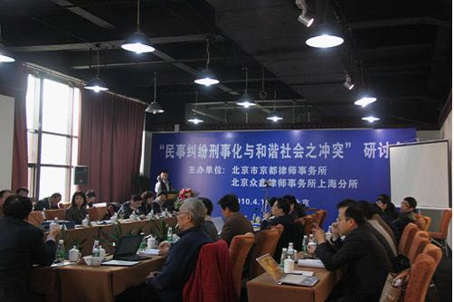

# ＜七星说法＞第四十五期: “民事案件刑事化”之忧

**本期导读：早在今年1****月份，七星说法就曾讨论过[吴英案](/?p=18749)****，其时舆论沸沸扬扬，纷纷保吴英不死，并指出这是民事纠纷“被刑事”的案件，所幸，民营企业家吴英最后被判处死缓。而早在此之前，2003****年底，河北民营企业家孙大午因“非法集资”被判处有期徒刑3****年，缓刑4****年。在经济领域，特别是融资纠纷中，孙大午是较早因为地方政府和司法机关随意插手民事纠纷，使“民事纠纷刑事化”被判刑的民营企业家代表。而其后的众多案件，甚至包括最近的“小河案”，都被指“民事纠纷刑事化”。江平教授指出，我国政府干预经济的行为和现象普遍存在。本期说法就来谈谈到底什么是“民事案件刑事化”，为什么在有关部门三令五申的情况下仍然泛滥成灾呢？**  

# ** ****“民事案件刑事化”之忧******

## **文****/ ****周大伟******

 

不久前，经朋友介绍，一位据称刚刚遭遇一起“重大合同纠纷”金融投资企业家从香港专程飞来北京，希望能和我面谈一次并“请教有关法律对策”。

在京城某座只有VIP会员才能享用的豪华商人会所里，这位企业家转弯抹角、事无巨细地向我叙述了“案情”的全部经过，在我的聆听耐心即将接近极限的时候，我才终于地从中听懂了他的真正想请教的“对策” —— 他并不想从民事诉讼的角度去请教什么“法律知识”，**他希望得到的唯一答案只是，能否在内地公安部门帮他找到关系，用刑事立案的方式将合同纠纷的另一方“抓捕归案”**？罪名可以是“合同诈骗罪”或其他别的什么罪名。他说，这是解决这起合同纠纷的最快和最好的办法，为此他可以支付不菲代价。

惊讶之余，我只好认真地对这位客人说：“真的非常抱歉！在这件事情上，我实在帮不上你的忙。从你叙述的案情和现有的证据看，仍然属于一起典型的商事合同纠纷，双方当事人应当通过协商、调解、仲裁或者民事诉讼等程序予以解决，要求警察机关的介入此案是缺乏事实和法律根据的。”

不难预料，我们结束这场会谈时，气氛多少有些尴尬。这位企业家最后满腹苦衷地告诉我，其实他自己并不是一个无情无义、心狠手辣的人，只是如果他不先下手，对方就可能对他先下此手。此听上去，简直像是一个现代版的“无间道”。

一场纯粹的民事纠纷由于一方的报案，就演变成了刑事案件。如今，这样的案例绝非个案。近年来，法律界人士所称的“民事纠纷刑事化”倾向，屡禁不止、愈演愈烈，已经引发了大量的社会矛盾，对法治社会建设危害甚大。**尤其是在经济领域，特别是融资合同纠纷中，由于一些地方政府和司法机关随意插手那些本来属于民事纠纷的案件，将民事纠纷刑事化，有可能导致一些冤假错案的发生。**

** **举个简单的例子，一个当事人从银行（或债权人）借了一百万元，但是到了还款的时候出现了资金困难，银行（或债权人）是不是就可以直接去公安局报案说借款人当初是诈骗呢？法院是不是就可以为了保护地方利益而匆忙立案呢？如果民事合同只要不能履行就可以视作有诈骗嫌疑，市场经济岂不成了人人赴汤蹈火、如履薄冰的险滩！

**一起普通的民事案件一夜之间转变为刑事案件，涉及的是一个公民的人身自由，同时也牵涉到一个家庭的命运。**我曾见过一个到安徽地区从事建筑承包工程的江苏企业家，因为和发包方发生经济纠纷，被当地公安局以“合同诈骗罪”拘捕。一月后被取保候审，从监狱走出来时，他原来的一头黑发已经变得花白。

我还遇到一位在沿海城市做企业高管的经济学博士，因为和民营企业老板在分配利益上闹得水火不容，争执中双方各有激烈的威胁言辞。结果被该企业以“敲诈勒索罪”向警方报案，民企老板一气之下动用了自己家乡的警察跨市、跨地区将“博士”缉拿归案。该博士在饱尝两年的牢狱之灾后，如今已经成为上访大军中的一员。

诚然，在实际办案过程中，的确存在着民事案件与刑事案件的区分问题。有时，由于办案人员的法律知识水平参差不齐，或由于当事人分属不同地区，可能致使公安机关和人民法院在办理这类案件时，出现认识上的不一致的情形。但是，这种情况随着改革开放三十多年来立法和司法实践的进步，已经不是主要原因。**“民事案件刑事化”的主要缘由，还是出自司法腐败的利益驱动，还有地方或部门公权力对司法的干扰。这些问题的存在，不仅严重损害公安机关的执法权威，败坏人民警察形象，而且影响社会经济正常活动，侵犯公民合法权益。**** **

实际生活中，主要有以下一些明显和极端的表现：把民事合同纠纷，包括人民法院正在办理的或已办结的民事合同纠纷案件作为合同诈骗案件办理；以追赃为名，扣押、冻结或者划扣合同双方以外的第三者正常经营的货物或款项； 将企业和公民个人之间的正常借贷融资合作行为，定性为“非法集资”；或由于借贷方拖欠贷款的行为定性为“集资诈骗”；将民事纠纷当事人之间由于某类过激语言冲突，定性为““敲诈勒索”；当民事纠纷发生后，一方当事人为了达到追款讨债的目的，罗织偷税漏税、挪用公款、行贿受贿、吸毒嫖娼等刑事罪名，将对方企业主要负责人举报归案，然后冻结并扣押其资产；出于部门利益以各种借口向受害人索要办案费用；在办案中违反规定随意到外地抓人；甚至还有个别公安机关插手民事纠纷，为了追款而非法抓人；更有甚者，因追不回款项而将无辜者长期关押。

在司法诉讼实践中，这类“民事案件刑事化”的案件通常都有诉讼程序复杂、审判周期漫长等特点。**往往由于抓捕嫌犯匆忙，在诉讼过程中，相关罪名会不断发生变化，最初抓人时的罪名，可能后来发现不合适，于是想办法再换一种罪名——反正不能让你轻易“漏网”。**诉讼过程中，律师的辩护权往往遇到障碍。这类案件还有一个共同特点，就是最后必然会引发当事人的申诉和上访。更有甚者，有些案件当事人为了自保，以毒攻毒，以同样的方法反击对方，最后引发连环式案中案。

值得人们引起关注是，在工商界，还流传着另外一个吊诡离奇的说法，这就是谈生意时最好能在身边带上拥有“双规”职权的“纪委朋友”。这位“纪委朋友”在宴席中只需“坐台亮相”，不必说话表态。据称有人利用此招术去各地催款或投标，竟连连得手。这位“纪委人士”虽然身着便装、神态坦然，不过宴席上的宾客心里都明白，这位兄弟急了的时候，也是可以抓人的。难怪这些年里，有些在“纪委”工作的朋友们也开始从幕后淡出，频频成为工商界人士宴会上的座上客。这情景看上去，真有点儿像是发生在几百年前的“明朝的那些事儿”。

有些人说，上述种种现象的不断发生，与中国历史上“重刑轻民”、“刑民不分”的落后传统有关。我以为，这种说法只是个美丽的借口，无异于将今人的过错推脱给我们的古人。改革开放以来，公安部在规范公安机关慎重介入平等民事主体之间的民事纠纷方面，曾三令五申，并发布了一个又一个相关的明确规定。**在今天发生的绝大部分“以刑代民”的冤假错案中，真正的原因既不是立法的疏漏，也不是个别人的认知糊涂，而是明明白白的有法不依和徇私枉法问题。**** **

在一个成熟的市场经济体系中，法律对经济主体实施保护的一个重要特征就是，民事主体之间的各种纠纷主要应当通过民事法律手段来加以解决。司法机关通常应当尽可能依照民事法律规范追究民事主体的合同责任或侵权责任，而不能任意动用公权力追求刑事处罚。刑事追责必须有明确的标准和构成要件，应当慎之又慎。目前，国际社会的司法进步趋势是尽量采取民事而非刑事手段解决经济领域内的纠纷，能不抓的尽可能不抓，能不判的尽可能不判，能不杀的尽可能不杀。**如果纵容严刑主义的泛滥，对社会进步和人民福祉只能是有百害而无一益。**** **

### 

### 【注】

作者：中国社会科学院法学研究所特聘研究员、北京理工大学兼职教授。此文是作者为最近一期的《中国新闻周刊》撰写的专栏稿的未删节版。（作者注）

 

### **【深入阅读】**

 [警惕“民事纠纷刑事化”](http://www.mzyfz.com/news/mag/b/20100729/161258_2.shtml) [利益驱动 民事纠纷刑事化呈蔓延趋势](http://www.legalinfo.gov.cn/pfkt/content/2010-04/30/content_2130631.htm?node=7908) [民事纠纷刑事化与和谐社会之冲突研讨会](http://www.66law.cn/domainblog/18251.aspx)  

（编辑：陈蓉）

 
