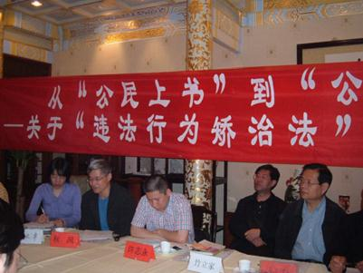

# ＜七星说法＞第四十四期：劳教存废之间

**本期导读：6年前，唐慧的11岁幼女被绑架强迫卖淫，遭到轮奸，染上性病，落下终身不育的疾病。在延宕6年后，法院终审判处被告两人死刑、4人无期徒刑、1人有期徒刑15年。而今年8月2日，因不满永州司法机关对该案的处理，曾多次上访的乐乐母亲唐慧被以“严重扰乱社会秩序，造成了极坏的社会影响”的名义劳教一年六个月。** **在唐慧被劳教的消息刚刚传出之后，新华社曾经发文悲愤责问：“欺负完女儿欺负母亲，怎能这样对待人民？”此案之后，2012年8月28日开始，甘肃、山东、江苏、河南的四个城市按照最高人民法院等十部委的专项安排、由违法行为矫治委员会负责进行劳动教养制度的试点改革。劳教制度在我国存在55年之久，其违宪性与制度漏洞广受诟病，经过近10年的公开讨论，改革劳教制度已是社会共识。那么，新生的“违法行为矫治”是否是劳教的“原汤原药”？此种温和的“改革”而非“废除”的背后是什么？劳教的存废之间为何阻碍重重？本期说法将带你走进中国特色的劳动教养制度。**  

# 劳教存废之间

## 

 

#### 唐慧被劳教始末

2006年10月，唐慧的女儿乐乐被诱骗、强奸并卖入“妓院”。在随后的三个月内，被逼卖淫100多次。得知11岁幼女被逼卖淫，受害人母亲只身将女儿救出，却在长达两个多月的时间里遭遇当地警方“无人受理”的不作为对待———直到唐慧“以死相逼”，警方才正式立案。

2012年6月5日，湖南省高院作出终审裁决：包括“妓院”老板秦星在内的两名被告因强迫卖淫罪被判死刑，4人被判无期徒刑，另有1人获刑15年。

8月2日，湖南省永州市劳动教养管理委员会因唐慧扰乱社会秩序，决定对其劳动教养一年零六个月。

8月4日上午永州市公安局通过12条长微博表示，“唐慧在案件审理期间为了达到判处七名被告人死刑的无理要求”，前后在多地“闹访、缠访、散发传单，不听工作人员劝说，案件判决后仍到有关部门缠访，严重扰乱了单位秩序和社会秩序”。 **但是据当事人及律师描述以及媒体的公开报道，永州司法机关特别是公安机关对乐乐被逼卖淫案的处理，存在大量争议性问题。其中，尤以100多名嫖客未被追究刑事责任、民警涉嫌帮助被告“假立功”事件最为突出，这也是唐慧“最不能接受”并持续上访，最终被劳教的关键原因**。网上民怨沸腾，正如当年邓玉娇被网民称为“烈女”，唐慧则被称为“史上最悲情的母亲”。

8月5日，《人民日报》官方微博称：“专家最近宣布，经三级指标体系测评，民族复兴任务已完成62%。然而，当湖南永州遭强暴幼女的母亲因上访被劳教的新闻传出，这一数字显得如此苍白。一个国家的强大，不应只有GDP和奥运金牌，复杂的数理模型中，更应包含百姓的权利与尊严、社会的公平与正义。我们共同努力。”

同时，人民网上发布《人民舆评：永州案，警惕民心渐行渐远》，迅速被各大网络媒体转发报道，整个事件都在公众面前铺开，从犯罪者对乐乐的暴行、“假立功”的疑点到唐慧被劳教，此案件的每一个细节都引起了舆论的强烈反应。

8月10日，湖南省劳动教养管理委员会调查认为，鉴于唐慧女儿尚未成年，且身心受到严重伤害，需要特殊监护等情况，对唐慧依法进行训诫，教育更为适宜，可以不予劳动教养。决定撤销永州市劳动教养管理委员会对唐慧的劳教决定。唐慧获释。

这一案件又一次将改革劳动教养制度的话题提起。借由此案，我们也再一次关注起了劳教制度。

#### 形形色色的劳教案

近年来公众视野中的劳教案件可谓五花八门层出不穷。**如果说因替女儿“讨说法”被劳教而在舆论关注下又被撤销劳教决定的唐慧案，让我们见证了劳教制度如同橡皮筋一样的弹性，那么，其他人的离奇遭遇，则向我们证明了劳教制度的极端随意和毫无原则。**

■一坨屎劳教案——2011年重庆方洪（方竹笋）因为在网上就李庄第二季开庭情况，于4月21日发微博，用“一坨屎”讽刺了薄西来、王立军，被劳动教养一年。2012年6月29日重庆市第三中级人民法院当庭宣判，确认被告重庆市人民政府劳动教养管理委员会作出的劳动教养决定违法。此前，百度上关于方洪案件的搜索几乎全部被屏蔽。

■跪国旗劳教案——2011年国庆前，长沙被拆迁户25人因集体向国旗下跪而遭致4人被追究刑事责任，21人被集体劳教。

■光屁股劳教案——2010年12月28日，重庆市黔江区，天气寒冷，倪振华被裸体铐在重庆市黔江区交巡警平台旁。刘勇很吃惊，拍了图片上传到QQ空间，配上了谴责警察的评语。此事导致3个人劳教：裸体男子倪振华一年；刘勇两年；陪刘勇去公安局“说明情况”的龚汉周，两年。

■打黑保护伞案——2009年，重庆渝北礼嘉镇人彭洪在天涯转发重庆打黑漫画《保护伞》，加点评“这把伞好怪哟”，结果出现了让他意想不到的一幕：电脑右下角当即弹出对话，叫他去市公安局网监总队自首。彭洪被处劳教两年。

■一元钱劳教案——2009年6月，3名江苏常州市民到北京反映问题，在乘坐14路公交车时，司机崔林以车上有上访人员为由报警。时隔一年多后的2010年7月，常州警方“突然想起”这件事，以3人拒不购买1元公交车票为由，将她们先拘留、后劳教。3人不服，分别起诉当地劳教部门“非法劳教”，但一审、二审均败诉。

■无罪劳教案——2007年8月，27岁的伊川县农民陈超拿到释放证明后，更加沮丧:被“无罪释放”后，洛阳劳教委却对陈超处以两年劳教的决定。然而在他起诉劳教委一周后，他的家人收到的不是开庭通知，也不是劳教委的答辩状，而是伊川县公安局发来的一纸“逮捕通知书”——陈超因涉嫌寻衅滋事罪，于11月12日被逮捕了。

#### 中国特色的劳教

**劳动教养简称劳教，是将违法尚不够刑罚处罚的人员，送进劳动教养管理所（场）进行强制性劳动教育改造的一种行政措施**。劳动教养并非依据法律条例，从法律形式上亦非刑法规定的刑罚，而是依据国务院劳动教养相关法规的一种行政处罚，公安机关毋须经法庭审讯定罪，即可对疑犯投入劳教场所实行最高期限为四年的限制人身自由、强迫劳动、思想教育等措施。

1957年，第一届全国人大常委会批准了《关于劳动教养问题的决定》，意味着劳教制度在我国正式确立。1979年，经全国人大常委会批准，国务院于正式公布了《关于劳动教养的补充规定》，这是关于劳教制度的第二个法律文件。1982年，国务院转发公安部制定的《劳动教养试行办法》，这是目前劳教制度的主要依据。1986年通过的《治安管理处罚条例》、1990通过的《关于禁毒的决定》、1991通过的《关于严禁卖淫嫖娼的决定》，这些法律使更多的人员相继被纳入劳动教养的对象范畴。

《宪法》第三十七条明确规定：“任何公民，非经人民检察院批准或者决定或者人民法院决定，并由公安机关执行，不受逮捕 。”**但劳动教养制度却可以不经司法程序，不需审判，没有一审二审，就可以限制公民人身自由**。《立法法》明确了“法律保留”原则，即“限制人身自由的强制措施和处罚”只能由“法律”设定，这里的“法律”，专指全国人大及其常委会制定的法律。而法学界一致的观点是，有关劳教制度的两个法律文件虽然经过了全国人大常委会批准，但只是国务院转发的公安部文件，只能看做是部门规章。另外，《刑法》中规定，**限制自由的拘役的刑期是1个月以上6个月以下，数罪并罚不能超过1年，劳教制度不是法律，却可以限制公民人身自由最长4年之久，成为事实上的“法外之法”。**

“任何人都不能做自己的法官”，这是通行世界的司法基本准则。但是，现行的劳动教养制度在具体实施中，却由公安机关“自侦自审自判自执”，几乎无法监督和制约，甚至到了随心所欲的程度。这些劳教制度存在的明显缺陷和其违宪的性质，便成为了近十年来讨论改革的主要原因。

#### 违法行为矫治，原汤原药？

中国之声记者从权威部门获悉，在甘肃、山东、江苏、河南的四个城市正在进行劳教制度的改革试点，试点工作由违法行为矫治委员会负责，此项试点是根据最高人民法院等十部委关于印发《违法行为教育矫治委员会试点工作方案》的通知进行的。

其实早在七年前，违法行为矫治就被连续列入第十届和第十一届全国人大立法计划。在此期间召开的每次“两会”，均有多名全国人大代表提出相关议案，仅重庆大学法学院院长陈忠林一人，就连续九年提案改革这一制度。但已列入立法计划的法律草案，在实际审议中却始终未见踪影。

目前尚不清楚这四个城市改革试点的具体内容和实际效果，从媒体公布的2011年南京市违法行为教育矫治委员会试点工作领导小组的构成看，与以前的劳动教养管理委员会十分类似，具体办事机构和地点仍设在公安机关。**这与剥夺公民人身自由的处分措施，必须“由一个依法设立的合格的、独立的和无偏倚的法庭来裁判”相去甚远。这不免让人担心，违法行为矫治到底换了汤与药没有？**

对此，《新京报》的社论称：“以违法行为矫治取代劳教，并不仅仅是名称的改变。比之劳动教养，其适用对象应大大缩小，主要适用于违反治安管理、屡教不改，或犯罪情节轻微可以免予刑事处分、但又具有较大人身危险性的人员等。其适用期限亦应缩短为最长不超过一年半，执行方式上应实行开放或者半开放。更重要的是，在适用程序上必须进行司法化、诉讼化改造，由人民法院依司法程序进行审查决定，并保障被矫治人享有充分的辩护权，增加相应救济程序等。”如果能坚定的按照这个方向改革下去，我们也许在将来可以看到一种在性质、决定程序和执行方法上都更加合理、合法的全新制度。

#### 劳教的改与废

针对劳动教养制度，法学界基本分为两派观点：一派力主废除，一派主张改革。

**中国社会科学院研究员于建嵘力主废除劳教制度，他认为，劳教制度本质上是一种司法程序外的社会控制手段，行政权被用来高效率地剥夺公民人身自由，是公权力对公民权利的侵犯**。而且，劳教制度没有存在必要，现行刑事处罚制度本身就包含了管制、拘役等轻微惩罚，《治安管理处罚法》可以惩处轻微违法行为，没有必要将劳教制度改造成轻罪制度或是独立于刑罚与行政处罚之外的处罚制度。

长期关注劳教制度的中国社会科学院法学所研究员屈学武在接受中国青年报记者采访时表示，无论从劳教制度的性质、适用依据、适用机关还是从运行情况来看，现行劳教制度没有任何存在的合理性。不过，他同时认为，目前对危害社会的人群，并非都能用刑罚方法来惩罚，比如侵犯了他人人身权益的精神病人、酗酒吸毒者、实施违法“犯罪”行为但没有达到刑事责任年龄的人等，对于这一部分人，不能对其施加刑罚，也无法用治安管理处罚来教育感化或者矫治他们的精神疾患、毒瘾或大量酗酒的酒瘾等。然而，**这些有心理、生理疾患的人的存在，在给自己制造种种风险的同时，也对社会构成严重威胁。因此，为了有效地保护社会秩序，对他们应当采取刑罚以外的类似国外的保安处分的特殊司法处分方法。**

****同时也有学者支持通过立法方式进行改革，改革的核心问题即赋予这一制度合法性基础。

王公义主张，应由全国人大正式通过实施《违法行为教育矫治法》，但其矫治时间应与《刑法》相衔接，以不超过半年为界。同时，将劳教决定司法化，在人民法院建立轻罪法庭，专门处理劳教决定，以简易方式独任法官决定，不得上诉，以改变目前公安机关行政决定的格局。

**姜明安认为劳教制度出路有三：其一，要通过法律途径来重新明确确立劳教的标准、条件和范围**；**其二，必须明确劳教判决的法律程序**。应遵循正当法律程序，即说明理由、听取申辩和职能分离以及公开、公正的程序。应设立有相对独立性的裁决机构；裁决应实行听证制度，听证原则上公开，允许相对人与调查、指控机构辩论；相对人在听证中所作的申辩，裁决机构认为有理的应予采纳；**其三，完善劳教对象的救济途径**。在裁决阶段，对裁决不服，可以申请复议或提起诉讼；在实施劳教或矫治阶段，对劳教措施、方式，实施的惩戒行为不服，同样应该可以申请复议或提起诉讼。

在姜明安看来，最好能将之纳入《刑法》，这样的保障最为有力。决定劳教应经过辩论和两审终审。如果不能，可以简化过程，由公安机关经过听证程序外加法院简单的一审程序。但必须要经过法律，也不能走复杂程序。

无论是坚决的废除还是温和的改革，再实际的立法执行起来都是阻碍重重。2005年全国人大将“违法行为矫治法”纳入立法议程，最初的几次会议后，王公义等立法者感受到了阻力：“这部法律最重要的是将劳教制度的决定权交给法院，这样一来，公安部门不同意。他们的意见是，可以给，但是如果社会治安乱了、出现问题，到时不要找我。”2005年4月，《违法行为矫治法》未能如约上会审议。同样的情节，在2010年重演。北京大学法学院教授姜明安对《财经》记者说，《违法行为矫治法》被搁置的原因很多。尤其是目前群体性事件多发，如果废除劳教制度，主管部门自然担心对“维稳”不利。劳动教养程序上比较“快”，实践中，县级公安机关就可以自行决定。

不管怎样，我国的劳教制度改革总算迈出了艰难的第一步，对于今后的走向，我们拭目以待。**法治社会就是要让每一个公民对自己的行为后果可以依照法律作出预判，而不会担心由非法律的因素决定的意外灾祸。**劳教制度的存与废，还请立法者慎思之。

 

### 【深入阅读】

 [原创][盘点近年来十大令人震惊的劳教案例和诡异的劳教死法](http://club.kdnet.net/dispbbs.asp?page=1&boardid=1&id=8601087%20) [从唐慧到彭洪，劳教改革须提速](http://news.sina.com.cn/o/2012-09-07/105525122451.shtml%20) [晶报：劳教制度有没有一次性废除的可能](http://jb.sznews.com/html/2012-08/29/content_2180792.htm%20) [中国青年报：劳教制度改革受阻 地方视其为高效管制手段](http://legal.people.com.cn/BIG5/n/2012/0906/c42510-18932805.html%20) [财经：劳教废立之间](http://magazine.caijing.com.cn/2012-08-26/112081975.html%20) [新京报：劳教制度改革要迈好立法“第一步”](http://www.bjnews.com.cn/opinion/2012/08/29/219517.html) [检视劳教存废，为了自由与尊严](http://club.kdnet.net/dispbbs.asp?page=1&boardid=1&id=8583452%20%20) [四城市试点劳教制度改革 专家呼吁纳入法制轨道](http://news.sohu.com/20120828/n351683729.shtml%20)  

（编辑：石味诗，陈蓉）

 
