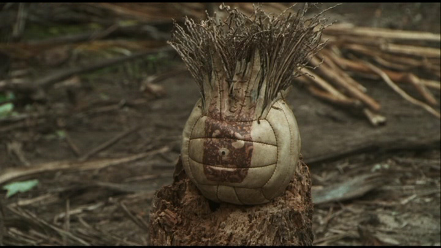

# ＜七星说法＞第四十期：荒岛求生，死一个，还是死五个？

**本期导读：《南方周末》于前几日发布了一则有趣的活动，“敢再‘考’一次吗？”——文科高考题。其中提到，我们相信蔡元培先生所说：教育者，养成人格之事业。在人生的维度上，有“标准答案”的考题比有标准答案的普通高考要实更难。命题委员围绕人文精神为价值观出题，以之检测参考人的人文素养所达到的广度和深度。本期说法将试图回答其中一道法学问题，也希望能够与广大读者切磋，以文会友，有不同想法的朋友，可以回复邮件到qixingshuofa@163.com，说法将予以刊登，共同探讨法律的人文精神。**  

# 荒岛求生，死一个，还是死五个？

## 

 

### 试题

6.我国刑法第232条规定，故意杀人的，处死刑、无期徒刑或者十年以上有期徒刑；情节较轻的，处三年以上十年以下有期徒刑。

2012年1月1日，五位探险队员在四川洞穴探险中发生山崩被困，由于没有按时回家，故营救几乎是立即展开。营救途中有十个营救人员死亡。探险者只带有勉强的食物。

在被困的第二十天，营救人员与他们取得无线电联络，被困者知道尚有最少十天方得被救。专家告诉他们在没有食物的情况下再活十天是不可能的。八个小时后，被困者再问专家如果他们吃掉其中一个人是否可再活十天，得到的答案是肯定的。被困者问以抽签的形式决定谁该死亡是否可行，包括医学家、法官、政府官员、神学家在内的人都保持缄默，之后他们自愿关上了无线电；

在进入洞穴第二十三天，其中一名同伴被杀死吃掉。被杀害的人是最先提出吃人及最先提出抽签的人。大家曾反复讨论抽签的公平性。在掷骰子前，最先提出抽签的人（即之后的被害者）撤出约定，期望再等一星期。其他同伴只询问他是否认为掷骰是公平，受害者并无异议，其他人替他掷骰，结果是对被害者不利。

营救在进入洞穴后第三十二日成功，四名探险队员存活。该四人被检察院公诉到人民法院。四名被告人的辩护律师都作了无罪辩护。

一审法院查明了上述事实，依法判处被告人有罪并处死刑，理由就是依据刑法第232条。（根据著名法学家富勒提出的虚拟案例改编）

如果你是法官，你会如何判决，是否有罪，理由是什么？如果你认为有罪，但你有赦免权，你是否会赦免他们，为什么？

 

### **有罪但应当得到赦免**

#### **马特/北京师范大学珠海分校**

我认为他们有罪，但应该得到赦免。理由如下：

**首先他们是有罪的。**他们四个存活下来的人显然是构成了故意杀人，他们明知自己的行为会导致被害人的死亡，但故意追求这种行为，这就构成了杀人的故意。

我们来看看整个过程。在抽签以前，被害人已经明确退出了吃人的约定，这就意味着不存在被害人承诺这种可能的免罪情形，也就是被害人没有承诺自己愿意受到伤害。因此，被害人受到的伤害并不是被害人自己愿意接受的。虽然在抽签以前被害人并不知道自己被杀，但参与抽签便是承担了被杀的可能性，或者说承诺了自己愿意承担被杀的风险。被害人没有做此承诺，因此也就不能认定被害人应该承担被杀的风险和后果。

**其次，他们应该得到赦免。**这里涉及期待可能性问题，也就是我们能不能期待在危险处境中的人必须做出合法的行为，或者必须严格按照合法的决定程序来进行。我觉得答案是否定的，因为在那种涉及死亡的情况下，我们不能够要求另外几个人必须考虑被害人已经不参与抽签的情况。在极其危急的情况下，被告人们将自身视为一个整体，不允许有人不参与他们的抽签活动中，我觉得这是当时情况下正常的反应，不能对他们有过高的要求。同时我们也应该注意到，对于被害人的伤害，并不是事前针对性的故意，而是一种风险和可能性。

**我赞同将被告人定罪但是赦免，因为他们的行为的确构成了故意杀人，但是同时他们的行为又是在情急之下的行为，而且还是一种可能性而不是完全针对性的故意。这种犯罪危害性是很小的，也是很容易避免的。**

站在功利性的角度，对被告人应当被赦免强有力的辩护是：考虑到当时可怕的情境，他们有必要杀死一个人以挽救其他四个人的生命。如果不杀死一个人并吃掉它的话，五个人可能都已经死了。受害者是当时符合逻辑的候选人，因为他自己也认可了抽签的公正性。

这种论证至少会受到两种反驳：第一，人们会质疑，杀死受害者所获得的利益从总体上讲是否真的大于它所带来的损失。即使我们考虑所挽救生命的数量以及幸存者和家人的幸福，允许这种杀害仍然会对社会整体产生不良后果——例如，会削弱反对谋杀的规范，或强化人们将法律掌握在自己手中的趋势。 第二，即使考虑所有因素，杀死被害人在功力上的确利大于弊。但从情感上看，杀死并吃掉一个毫无反抗能力的人怎么会是对的呢？难道以这种方式利用一个人——利用他的脆弱，未经本人同意而剥夺了他的生命——是对的吗？即使这样做使人受益。

对于任何一个对杀人行为感到震惊的人而言，第一种反驳似乎只是一种温和的抱怨。因为它接受了功利主义的假设——道德在于权衡得失，道德仅仅期望一种更完备、对社会结果的估算。而第二种抱怨则更切中要害。它反驳了这样一种观念：正当的行为仅仅是对结果——代价和收益——的一种算计。它暗示道德意味着更多的东西——某种与人类恰当地对待他人的方式相当的东西。

以上两种不同的思路旨在阐明两种不同的公正。功利主义认为，一种行为道德与否仅仅取决于其带来的后果；正当的行为就是人们经过综合考虑后得出的，任何能够产生事物最佳状态的行为。而反驳者则认为从道德上来说，结果并不是我们应该关注的全部。某些义务和权力应该受到我们的尊重，而这样做的原因并不依赖于社会性的后果。

如果从功利性的角度看，杀死一人（无论他是不是自愿的），保全其他四个人的生命，从而把五个人的整体损失降到最低，这是一种合理的判断。那么，从法律上能不能这么思考呢？

我认为在这一点上法律的功能应该是提供最恰当的解决问题的方式，而不是一个最恰当的结果。**也就是说法律在这种危机之下，应该提供给人们的是最合理的解决问题的途径而不是一个看似最恰当的结论，**而这个恰当的结论是可以通过其它方式比如道德来解决的。

在本案中，抽签决定吃掉谁这显然是犯罪，可以规避的方法是这个人自杀然后别人吃掉他。但是如果这个人在抽签后不遵守规则拒绝自杀呢？那么其他人杀死他可不可以？再或者如果在抽签前受害者答应了抽签解决问题的方式，但是在实际抽签时又反悔了，那么其他人又可以强迫其参与抽签吗？

刑法规范人的行为并不是为了机械刻板地惩罚，归根结底是为了规范人与人的关系，维护社会所保护的法益。所以考虑刑法问题在这个案件中是否适用，还要考虑法条所保护的法益是如何在这个案件体现的。**我们禁止杀人，正是因为在一般的社会秩序下，人的生命权是社会所保护的法益，但是当人们脱离了正常社会的秩序之后，是否还具备保护生命权这样的法益呢？**这正是本案应该讨论的一点。

在那样一种危机状况下，显然就不是一般的社会秩序维持的状态，那么也就是说法律所保护的法益是否继续依照原样来维护呢？我觉得此时法益是发生了变化的，也就是说法律该不该允许人们用他们自己认为的最恰当的方式来解决面临的困难，尽管这种方式违背了现行法律。在一些危急时刻发生的犯罪事件人们一般认为没有脱离社会秩序，比如战争期间的犯罪依然按照犯罪处理除非有特别规定，再比如灾区的犯罪行为依然不可免罪，因为人们普遍认为那种能够情况下是没有脱离人类社会的基本秩序的，或者说人们希望即使在那种情况下也可以维持社会的一般基本秩序。因为此时社会对个人还有救济方式，因此也就形成了约束。但是在特殊危急关头，社会对个体无法形成救济，那么个体是否就可以突破了社会的约束了呢？这恐怕也是这个案件在法理上的关键分歧。

 

### **有罪且不可赦免**

#### **林骥/华东政法大学**

当这样的一个情形出现，你会判他们有罪吗？从构成要件来看，的确，他们的行为是典型的故意杀人行为，不但把人杀了，还把人吃了！但是，特殊的是，如果没有这个人的牺牲，那么5个被困于洞穴的人就都将失去他们的生命，在这样的一个背景下，牺牲一人来保全剩下几个的抉择是否可被宽恕和原谅呢？那么我来谈谈我的看法：不行！

 **1.生命法益的不可叠加性，生命权在天平的两端是平衡的**

从表面上看，牺牲一人来保全多数的选择是有其合理性的，一个人的牺牲能带来更大利益的实现，这无疑是符合效率原则的，而且在利益平衡的思维下，这也显得相当合理，牺牲一个较小的利益，保护了一个更大的利益，这也符合法律上所认为的公平性和合理性。

但是关键在于，现在我们放弃的是一个人的生命权，而非财产利益。生命权和发展权是人的两大基本权利，在法律上受到极大的保护，也是法律存在的基础，法律使人成为人，只有人在其生命权得到保障的基础之上，人才有了交易的可能性，才有了所谓的财产权、人格权、身份权等一系列权利，法律的大厦才得以建立起来。所以即使在严厉的刑法领域，生命权也是神圣不可侵犯的。故而，生命权不能如财产权一般简单地进行叠加。举个例子，在多次犯罪中，如果一人犯的是诸如盗窃、诈骗、抢劫等财产性犯罪，我们可只定一罪，将其多次实施所得的犯罪金额相加进行量刑即可，然而如果其犯的是故意杀人、故意伤害等侵犯人身权利的犯罪，我们必须数罪并罚，因为人身权利是不可叠加的。人身权利具有专属性，不能被替代，每个人是那么的不同而有个性，绚烂而又多彩，如将人身权利视若财产权利那般简单叠加和替换，无疑是对人的极大蔑视和践踏，这是以人文精神为支撑的现代法律制度所不能容忍的。所以我们说，生命法益在天平的两端是平衡的，无论两端的人数是多么的悬殊，他们都值得我们一体保护，一个生命和一百个生命是一样的，并不因为一百生命而让那一个生命的价值和权利受到忽视和侵犯。

 **2. 剥夺生命实体条件**

紧承第一点来说，既然人的生命法益是无价的，不能被简单衡量和叠加，那么是否一个人的生命是无论如何不可被剥夺的？那显然也并不是这样，在现在很多国家，死刑并没有被废除，也有很多人被国家机器合法的剥夺去了生命。那么我们如何去判断一个人的生命是否可以被合法剥夺呢？

在几乎所有国家的法律体系里，可被判处死刑的都被认为是重罪，比如故意杀人、恐怖犯罪等，这些犯罪都有其共性，即它们都严重威胁到了他人以及这个社会的生存发展的根本。一个人剥夺了他人的生命，那么自然他也必然有了被同样剥夺生命的可能性，杀人偿命这个最为原始朴素的观念无论在哪个历史时期哪个国度都会有其存在的市场。一个人危害到了这个社会的根本，那么，覆巢安有完卵，作为这个社会的有机组成部分，其他人自然会将这个不安定的因素彻底去除。故而，我们可以发现，当一个人的行为已经威胁到他人的生命利益时，那么他的生命利益也就不再那么神圣而又高贵了，既然生命法益是相互平等的，那么我尊重你的，你也必须尊重我的。

但是是否所有威胁到他人生命的行为都可以作为剥夺他生命权的理由呢？显然不是，如果这个人是无辜的，他没有任何不适当的行为，只不过处于一种特殊的环境下，他威胁到了他人的生存可能性，也不能被合法的剥夺生命。因为他人生命的危险状态并非由其造成的，我们又有何理由去让他承担这个责任呢？这也是刑法上所说的归责性，如果无法归责，那么刑罚也是无从安放的。

所以，一个人的生命法益只有在其实施了足以威胁到他人和社会根本利益，并且具有可归责性的时候，才可以被剥夺，除此以外，我们都应当充分的尊重他人的生命权。

 **3. 剥夺生命的程序适用性**

即使我们在一定条件下可以剥夺人的生命，这个条件也是极为严苛和谨慎的。什么人能剥夺他人的生命权？

在谈这个之前，我们首先先要来简单的分析一下我们这个社会是如何建立起来的。在一个民主国家里，程序应该是这样的：公民选举他们的代表成立一个代表机构，比如议会，制定法律，把他们认为自己无法忍受的、可能威胁到他们最根本的权利、危害到这个社会存在的一些行为定为重罪，悬上死刑这样一柄达摩克利斯之剑，以震慑他们中的每一个人不越雷池半步，然后这个代表公民的机构又选举出一个更为精简、专业和高效的机构——我们称之为政府——来管理和建设这个社会，并赋予他们相应的权力，再选出一个专业的机构——即司法机构——来控制有着强大权力的政府，使其更好的为民众服务；惩罚犯罪行为，保护人的最基本权利；调整民众之间的关系，促进交易的发展，维护人与人之间的和谐状态。

所以我们看到一个社会最早是由一群人组成的，他们基于发展的需要，逐步建立起了一个个精简、高效又相互制约的机构，并赋予他们相应的权力。而剥夺人生命权的权力自然被赋予了其中最为公正和专业的司法系统，只有法院经过公正的审判和其专业的判断，辅之以内部严苛的程序，才能决定对一个人实施剥夺生命的行为，除了它，没有任何人可被允许剥夺他人生命，即使是代表全体公民利益的、产生一切的代议机构。议会可以决定对什么行为施以极刑，因为这本来就是人们最朴素的情感和最基本的需要的体现——当人们对一种行为忍无可忍的时候，他们当然可以被赋予权力决定对这样一个行为进行严厉的禁止。但是议会显然不能被授权允许决定死刑，因为这进一步牵涉到了某个具体的人的生命利益，这需要公平而深入的探究以及专业审慎的判断决定，而不是狂热、盲目、易被煽动的民意（这也是在很多国家，法官并不是由选举产生的原因）。那么法院通过什么程序来剥夺一个人的生命？

剥夺一个人的生命需要经过公诉、审判、定罪量刑、然后交由执行机关才可被付诸实施。在审判中，我们应当举出各种强有力的证据，并使之符合排除一切合理怀疑的标准，然后经过激烈的辩论和质证之后，查明这个案件的法律事实，使其无限贴近客观事实，最后才能被定罪量刑。无论一个人犯有多么显而易见的罪行，哪怕如东条英机这样的战犯，也必须经过审判才能被处以死刑。

 **4. 为什么是我？**

从上面三点，我们可以很清楚的看出，一个人的生命是值得被绝对尊重和保护的，只有这个人的行为真的已经触碰到了社会的底线，并经过公平、谨慎并专业的程序之后，才能被剥夺。

而在这个案件中，显然，首先，被牺牲掉的那个人，他的行为不具有丝毫的违法性，他们的生命威胁完全是由客观的环境造成的，即使那个人最先提出了要牺牲一人来保全大家的提议，也不足以被认为是一种威胁行为，人不因言论而获罪，即使在刑法中，单纯的犯意表露也不被认为是犯罪，所以他并没有被合法剥夺生命的基础，其次几个人组成的大多数群体，并不具备剥夺他人生命的资格，最后，通过抽签这种极具随意性的程序便剥夺了一个人的生命，是无论如何都不可能具有合理性和合法性基础的。这毫无疑问是一个非法剥夺他人生命的行为。

对于这么一个显而易见的犯罪行为，我们自然要课以刑罚，让他们为他们的行为付出代价，但是毕竟他们的行为是在一个十分特殊的环境下做出的，主观恶意和社会危险性都较小，所以罪不至死，我们应当给予他们一个有期限的刑罚，而关于特赦，这只不过是使他人逃脱刑罚的一种婉转措施罢了，这显然不利于引导这个社会树立一个对他人生命法益的尊重感，故而，我们应当让他们承担刑罚，但无需处死。

如果当我们落入这样的一个环境之中，当我们有丝毫想牺牲他人来保全包括自己在内的大多数人时，先想想，也许，这个人就是你。

 

（撰稿人：马特，林骥；编辑：陈蓉）

 
