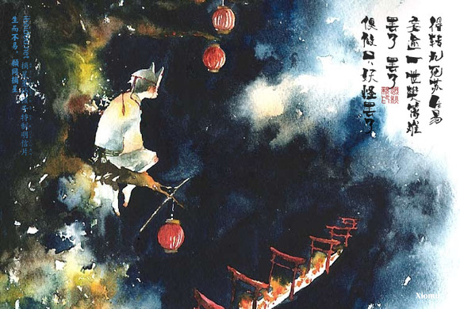
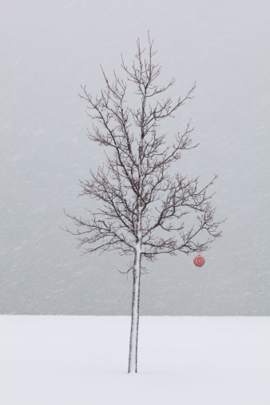

# ＜中秋节特稿＞便做只妖怪罢了

**可人类竟有如此渴望被爱与被理解，人类歌颂友谊，人类向往爱情。前者是尝试与另一个人建立一种理解，后者则是尝试与另一个人建立一种更加深层次的——或者更广泛——的理解。无论哪种情况，却最终都是在尽力回避一个无法回避的事实：人从根本上，是孤独的，不可理解的。你永远也无法和一个人建立根本意义上的理解，最讽刺的是，无论你选择任何一个至亲至爱的人来尝试建立这种理解，最终都将把原本隐藏的不理解显现并放大出来，结果往往不但是无法建立根本的理解，甚至连之前的关系都将被破坏。**  

# 便做只妖怪罢了

## 文/张苏樊（武汉体育学院）

 

 

中秋的晚上襄儿给我送吃的来，过后送她回寝室，走到外面抬头看见玉一样的月亮，透着饱满的光。阳台上的视线被窗栏被房屋的四壁捉捏着，即便屋檐不吝啬这一轮美玉，还是得走到外面才能触摸到月的光亮。秋天的武汉性情温柔起来，不久前回家和母亲说起这些，母亲说可真羡慕你，晚上沿着湖边散步可真美，你们行政楼下那一围桂花树，长得真好。今年的桂花开得稍微比往年早些，九月中旬就按捺不住，走在市里的街巷，有时经几家院落，有时过一幕绿荫，桂花香气忽然就伸出手来，在你脸上痒痒地挠一下。可你若驻足，它又无情地消散了，我昨晚走在湖边，一再想要抓住那魂絮亲泽，却只有月亮落在东湖里摇晃。 

小时候家里有一瓶桂花糖，平平常常的玻璃瓶子里装着我当时所有的热切。我贪吃甜食，这桂花糖是每天都心痒期待的约会，母亲上班时、出门后，我就会偷偷取来，那瓶盖很紧，打开不易。偷吃一点，再吃一点，才恋恋不舍地把盖子重又拧上。现在想起来，每次费力拧紧瓶盖只是给自己徒增麻烦罢了，母亲几乎很少碰那瓶子。桂花酒入桂花梦，传说是吴刚把桂花树的种子带给凡间，善良的人种出桂树开出桂花，而心术不正者却什么也种不出。神话传统总是这么单纯与质朴，在善与恶的矛盾里少却纠缠烦恼，幸福与痛苦旗帜鲜明。就好像月饼，内里无论是什么馅料，都装着一句阖家团圆的愿景。 

人是多么孤独的存在。 

在喧嚣的世界里，一个人会与另一个人、一百人、一万人、一千万人乃至所有人产生各种各样的交集，口渴舌燥也不能穷尽的对话充斥了每一个人的每一个听觉频道，人们近乎疯狂地交换着彼此的声音，尽可能地追求空间与时间上的高效。人们的手机通讯录里躺着无数的联系人，社交网络平台把每个人都隐性地漂浮在海面之下140个字的距离，有数千数万个形形色色的人点击过你的页面，周末的聚餐不得不推掉因为那天有一个新鲜的舞会。喧嚣的世界里，无数的诉求、信息、垃圾在天空穿行，人们很忙碌，在与其他个体的交流中疲于应付。 

而当有一天，骑着马，依着栈道徐行在山谷，裹挟着雪花的风在山口呼啸出歌声与吼叫，只有马儿的踩踏积雪的声音和它们共鸣。夜里总是这么安静，月光洒下来，洒在树枝上变成妖魔，洒在雪地上变成冰河。你抬起头看到那碧玉一样的月亮，似乎涌上一些话想要说，却最终闷在胸口，再也无法消却，只能低下头默默徐行。 

于是人们有了月饼，渴盼相亲相爱的人们可以长相守，不要总分离。人们是多么渴望自己能够和别人建立关系、形成理解啊，是多么憎恶孤独、不愿影单啊。人们寄送贺卡，人们制作月饼，把桂花酿在酒里，与尔同销万古愁。中秋的这一天，人们对着那“十五不圆十六圆”的月亮，寄托的与其是团圆的愿景和欢乐，不如是感受爱与被爱、理解与被理解的诉求及满足吧。 

而人与人之间的理解竟是可能的么，人是多么孤独的存在。 

一个人作为一个独立个体存在，利益的立场即便包含利他的行为，却无法根除利己的源义。每一个人，这蓝色星球上生存的数十亿人中的每一个人，都有自己的独立立场，每一个人，都有自己的利益诉求，每一个人，都在根本上是一个完全不同的人。这每一个人，从根本上来讲，对于任意一个他者，都是不可理解、不可接受的。 

可人类竟有如此渴望被爱与被理解，人类歌颂友谊，人类向往爱情。前者是尝试与另一个人建立一种理解，后者则是尝试与另一个人建立一种更加深层次的——或者更广泛——的理解。无论哪种情况，却最终都是在尽力回避一个无法回避的事实：人从根本上，是孤独的，不可理解的。你永远也无法和一个人建立根本意义上的理解，最讽刺的是，无论你选择任何一个至亲至爱的人来尝试建立这种理解，最终都将把原本隐藏的不理解显现并放大出来，结果往往不但是无法建立根本的理解，甚至连之前的关系都将被破坏。 

幸运的是人并不自知自觉，对于孤独的感知也因人而异。即便每个人的利益立场从根本来说是不同的，但如果全面来看，个体与个体的立场之间是完全可以找到相似甚至相符之处的，这也就成为了人们建立部分的理解的基础。与此同时那些利益立场比较难以与大多数人找到局部相符的人，自然就显得孤单与小圈子。这些特立独行的人只不过放大了人与人之间利益立场的不同罢了，当这种特立独行加深到一定程度，就叫怪人，再加深就被称为怪物，再加深，就是妖怪。卡里古拉可不就是个妖怪么，同性恋被视为魔鬼，像人说：“I'm not an animal.”也说明人与人之间所谓的理解是多么脆弱。每个人事实上都是孤独的，无论是觥筹交错或是形单影只，根本上都是孤独的截然不同的个体。 

所以月饼是非常美好的东西，不在于它能带来团圆美满，祛除一只桌子一副碗筷的孤单，也不在于它能够解除人们的孤独。这或圆或方或甜或咸的中秋点心，正如传说中仙酒娘子用吴刚怜惜她天真善意而赠赐人间的桂花做成的桂花酿酒一样，让人们相信这世界有全真全善存在，让人们暂时消减对孤独的感受。至于十分清醒，又或怪僻非人的人们，月饼或是桂花酒，已经无法掩盖这种痛苦。 

得转九死苏生易，妄逾一世樊篱难。罢了罢了，便做只妖怪罢了。 

 

（编辑：周拙恒；组稿：应鹏华，周拙恒）

 
