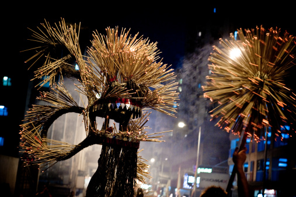
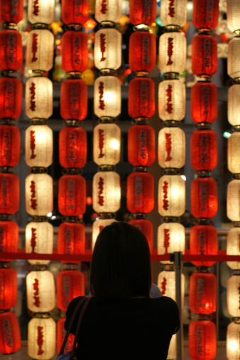

# ＜中秋节特稿＞灯笼下的中秋

**那次大概是我人生中第一次也是最后一次“煲蜡”。本来就这样围着烛光聊一整夜的天就结束了。但收拾的时候，一位男同学吐了一口唾沫下去想灭掉蜡烛上的火舌，悲剧就发生了。那火舌反而“轰”一声地往上窜，火势一刹那大了起来，吓倒在场的一大群人。幸亏没发生什么意外，也让我在最后一刻明白了“煲蜡”的魅力——大概青春都迷恋一切疯狂与刺激。**  

# 灯笼下的中秋

## 文/黄梅林（广东商学院）

 

夜深归家，楼下的小卖部却依然营业。悬挂着的中秋灯笼堆满了店面。这才想起，哦，又是一年中秋节。

小卖部卖的灯笼仍然跟十多年前的款式无甚差别：用电池的，打开手柄上的开关会发出音乐，单调的发出些依依呀呀的声响，竟也与儿时的旋律一样；点蜡烛的，就更千篇一律了，无非都是各种颜色的彩纸糊成的，像手风琴一般可以拉伸的圆柱体。

一般来说，提起元宵节才会想到灯笼，连英文中的元宵节也是译为The Lantern Festival；而提到中秋节，大多都想起月饼罢。

现在的月饼除了传统的口味，还有新制的冰皮月饼、水果月饼和雪糕月饼云云。月饼的口味变化五花八门，甚至变得越来越不像月饼，更像是徒有虚名的馅饼糕点而已。相比之下，灯笼的一成不变实在让人费解。

在我的记忆中，灯笼不是元宵节的主角，反而是中秋节的。我不喜甜食，所以月饼只是应节食品，浅尝即可，甚至可有可无。小时候把一个手掌大的月饼切开四份，把中间的咸蛋黄挑了吃了，又按原样把吃剩的只有莲蓉的部分拼回去，为此没少挨大人的骂。但灯笼是一定要有的。记得有一年，父母没在节前给我把灯笼备好，到了中秋节那天我发现没有灯笼，就大吵大闹，父母没办法只好连夜到街上给我买一个，我这才破涕为笑。

虽然至今我仍不知为何中秋节要点灯笼，似乎别的地方没这样的风俗。但童年时若能提着一个灯笼在中秋节那晚上街，是一件极风光极值得高兴的事儿。小时候父母怕小孩夜晚上街不安全，总不让我在中秋节晚跟筒子楼里其他小孩一起玩灯笼；也怕小孩子用点蜡烛的灯笼一不小心就烧着了，烧伤自己，所以一般都是买了电灯笼让我提着，一起到附近的广场玩。至今想起才觉得那段时光最是温馨：一对初婚的夫妇，没有日后关于柴米油盐的争吵，牵了自己的小孩子，一家三口出行，和和睦睦，仿佛未来永远没有烦忧。这光景是如此的温柔，教人心折。

上了小学，搬到奶奶家寄住。奶奶家有大我四岁的堂哥。每到中秋夜，吃罢饭，两兄妹便搬了凳子到阳台玩灯笼。我们两兄妹都有一种癖好：爱点上一根蜡烛，然后用一个玻璃的果酱罐盖住蜡烛。因为缺乏氧气助燃，烛火也随之熄灭，飘出的一缕白烟像是亭亭舞女的一袭素白长裙，轻轻摇曳便布满了一个果酱罐，整个果酱罐便由透明变成了奶白色。那时候我们俩都爱看介绍灵异事件的书，里面的插图描绘人的灵魂飘出肉体的场景就跟蜡烛火舌熄灭飘出一缕白烟的情景差不多。所以我们都一致认为，蜡烛熄灭飘出的白烟就是蜡烛的灵魂，并对此笃信不疑。而这种现在看来无聊乏味的把戏我们每个中秋节都会上演，乐此不疲。

再大点，上了初中，还是走读。中秋节夜晚可以约上一班同学去“煲蜡”。所谓“煲蜡”，其实就是拿一个铁皮造的月饼盒子，在里面布满蜡烛，待蜡烛都燃尽了，又在蜡层上再点燃新的蜡烛，这样一晚下来，整个月饼盒子里装的都是熔化后重新凝结的蜡，沉甸甸的。然而，就“煲蜡”这个行为本身而言，是完全找不到趣味所在的。但小时候因为父母管教极严，所以也不知“煲蜡”为何物；而香港的公益广告，每年都会苦口婆心地宣传煲蜡的种种祸害，但也没说明什么是煲蜡。这种秘而不宣更加加剧了初中处于青春叛逆期的小屁孩的好奇心。于是有一年的中秋，便瞒着父母偷偷跟初中的同学去“煲蜡”。一班少男少女围着烛光，倾吐着各种青春期的心事，大有围炉夜话的兴奋。再者，在青春少艾的心中，烛光几乎就是浪漫的代名词，所以自然对“煲蜡”这个浪漫的活动更心生向往了。那次大概是我人生中第一次也是最后一次“煲蜡”。本来就这样围着烛光聊一整夜的天就结束了。但收拾的时候，一位男同学吐了一口唾沫下去想灭掉蜡烛上的火舌，悲剧就发生了。那火舌反而“轰”一声地往上窜，火势一刹那大了起来，吓倒在场的一大群人。幸亏没发生什么意外，也让我在最后一刻明白了“煲蜡”的魅力——大概青春都迷恋一切疯狂与刺激。

十六岁，到了花季雨季，独独缺了过往的那种激情。每年的中秋节就巴望着高中食堂的那张加餐的鸡腿票。中秋夜与同学度过的愿望此刻都得以实现了——虽然不是在街上而是在教室；虽然不再是点灯笼而是晚自习。这样一年一年下来，对中秋的期盼也随之消失。翻了一页日历，上面写着今天是中秋，“哦，今天原来是中秋啊”，便又转身继续埋首伟大的作业持久战中了。

这样年复一年，每逢中秋就总觉得缺了些什么，却又道不明白。

——去挑了蛋黄吃，留下那些莲蓉吧。

我已经学会了一整块月饼，和着蛋黄莲蓉吃下去了。

——去提着灯笼上街吧，和父母一起。

你是存心看我被那些小屁孩笑话吧？

——去拿个果酱罐盖灭燃着的蜡烛吧。

这太无聊了吧，太浪费时间了吧。我的论文还没写好呢。

——约上一班同学去秉烛谈心吧。

大家都有QQ，有什么事在网上说就行了。没事打扰别人干嘛呢。

我抬头看了看小卖部店面悬挂着的那堆灯笼，想要寻找儿时最喜欢的印着黑猫警长的图案的那款，却只看见一堆印着喜羊羊的。

我诧异，原以为一成不变的东西，也已经在不知不觉中改变了。

    

（编辑：周拙恒；组稿：应鹏华，周拙恒）

 
