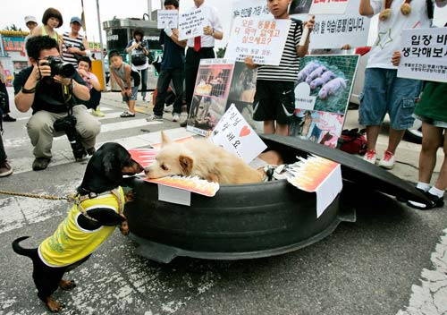
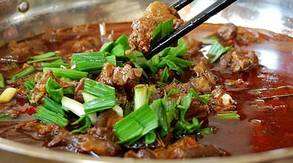

# ＜人与狗特稿＞不就是几条狗嘛

**针对“该不该吃狗肉”的争论，实在既无必要，也无意义。就算争到头破血流吧，喜欢狗肉的，也许会趁着周末去吃个狗肉火锅；不喜欢狗肉的，你就是在现场，也没权利拦着。狗肉不是独一无二的道德准绳，甚至于根本不能算是道德的准绳。假如非得把这种事上升到人性的高度，假如非得表现自己人性高尚、富有爱心，何妨在救狗爱狗之余，也关心一下周围人类的生存处境？或者，有的人根本对此毫无兴趣，甚至已经麻木，只是把对几条狗的热爱挂在嘴上，以为替代和安慰剂？** ****ibeidou.org ibeidou.org

# 不就是几条狗嘛

ibeidou.org

## 文/乔淼（北京师范大学）

ibeidou.org ibeidou.org 要说最近今天最出名的动物是什么，答案毫无疑问是在高速公路上被拦下来的那一卡车狗。对这几百条狗的命运的关注，以及随之再度被提起的“该不该吃狗肉”的讨论，简直让人有一种错觉，仿佛狗比大熊猫还要金贵。——可谁也不能说这种“错觉”一定是“错的”：你喜欢大熊猫，我喜欢狗；你觉得大熊猫珍贵，我觉得狗重要。有什么对错之分呢？可是，偏偏在“要不要吃狗肉”的问题上，一些人争得不可开交，动辄还把它上升到人性层面……这就不但显得很蠢，而且还显得幼稚。 ibeidou.org

ibeidou.org 有些人反对人类吃狗肉，当然，还有些更加“高尚”的人，主张我们应该什么肉都不吃——后一类人不在本文讨论范围内，我们只讨论前一类反对“人吃狗肉”的。我是一个几乎没吃过狗肉的人，对狗肉也没什么特别的兴趣，但我不觉得吃狗肉有什么不对。据我所知，我国没有任何一条法律禁止人吃狗肉；狗不是野生动物，也不是濒危动物，杀狗吃肉，在现阶段显然不是法律能管得了的。既然不违法，吃狗肉就是个道德问题。但你也很难说吃狗肉的人一定不守公德、不吃狗肉的人就一定道德高尚；如果非得这么说，你也需要先做个研究，还得证明存在这种因果关系——吃不吃狗肉只要一观察就知道，可人的道德水平你又怎么测呢，心理学家对此都没有个定论，你一个外行人也不太好办……既然如此，我们似乎暂时只能得出结论，就是吃狗肉不是严格的是非问题。不是是非问题，就只能算是个人倾向问题，说白了也就是私德的问题：以自己的私德标准，要求别人也去遵守，这不是赤裸裸的道德绑架，还是什么？ 一些反对吃狗肉的人大概不像我这么理性。他们，尤其是他们中的她们，会以一种相当夸张（至少在我看来如此）的方式表达其观点，有点类似于几十年前的一首歌《就是好》。他们的一种典型观点大体上是这样：狗通人性，所以不该吃。“通人性”是一种感性的表达方式，意思就是人的想法和感情，狗在一定程度上懂，杀了这样的动物吃肉，他们在感情上不能接受。这当然是有道理的。可是赞成吃狗肉的人，特别是喜欢吃狗肉的人不一定会这么看。在他们看来，“闻到狗肉香，神仙也发慌”，老子凭什么不能吃？不让老子吃，老子感情上也不能接受……你也不能说这就是错的。所谓“情绪”或者“感情”，其实来自于现实条件与个人需要的比较：现实能满足个人的需要，情绪就会比较积极，反之就会比较消极。反对吃狗肉的人有保护狗的需要，有人吃了狗肉，他们就不开心；赞成或者喜欢吃狗肉的人有吃掉狗的需要，不让吃狗肉，他们也不开心。既然不违法，又不能证明是公德问题，你怎么好说自己就一定对，别人就一定错呢？ 何况，反对吃狗肉的人，只靠“狗通人性”这种理由，也很难说就完全理直气壮。首先，“通人性”是以人类为中心（特别是以自己为中心）作的一种主观判断：我有什么感情和想法，你作为动物，部分理解，还懂得来安慰我，所以你是好的。这本质上不是无私，恰恰是最大的自私：我喜欢你是因为你能满足我的情感需要，如果满足不了，我就未必这么喜欢你。因此，很难说你同情狗就一定是高尚的、纯粹的，至少你不是必然比吃狗肉的人高尚，无权指责人家。其次，假如“通人性”能成为“不该吃”的理由，那所有的动物其实都不该吃。人就是动物，人性和动物性之间没那么明确不可逾越的界限，猪牛羊鸡鸭鱼这些动物未必就不通人性——按照荣格学派的观点，每个人在心理层面上甚至都可能有这些动物的动物性，也就是说它们其实也可能是通人性的。因此，如果你觉得狗“通人性”而不该吃，那其实就什么动物都不该吃。反对吃狗肉的人应该不全是净素食者，吃猪肉牛肉的时候，你怎么就没关心它们呢？可见还是一种主观偏好。没有法律依据，也不能确定地说是公德问题，把自己的主观偏好强加于人，这当然很蠢。 同时，这样的做法也显得很孩子气。发展心理学上有个重要的概念叫“去自我中心化”，在社会化的、人际的层面上，这个概念意味着接受别人有别人的观点、承认别人的看法有其合理性，从而懂得分清自己与他人的界限。“去自我中心化”不良的孩子，会觉得只有自己正确，别人一定不正确；如果你问他为什么，他也很难给你讲出理由；你要是不同意他，他就会跟你生气。就目前看来，既然吃不吃狗肉是个人偏好的不同，那吃和不吃就都有其合理性：对你来说，你的观点是对的，但你不能因此就认为对方一定不对。——当然，你可以想办法去证明对方不对，比如努力推动“禁止吃狗肉”成为法律的明文规定，或者做个科学研究，证实吃狗肉的人确实在道德水平、心智发育上比不吃狗肉的人差距显著。这是最现实的、最成年人化的做法。如果只是到高速公路上去拦卡车，掏钱买下狗再放掉，或者嚷嚷“就是不该吃狗肉”，就有点像小孩子撒泼不讲道理，既不能真正保护这些狗（万一它们被抓到，还是可能被吃掉），也很难保护更多的狗。作为成年人，用小孩子的方式对待问题，当然是很不理智的。 ibeidou.org

ibeidou.org 总之，针对“该不该吃狗肉”的争论，实在既无必要，也无意义。就算争到头破血流吧，喜欢狗肉的，也许会趁着周末去吃个狗肉火锅；不喜欢狗肉的，你就是在现场，也没权利拦着。狗肉不是独一无二的道德准绳，甚至于根本不能算是道德的准绳。假如非得把这种事上升到人性的高度，假如非得表现自己人性高尚、富有爱心，何妨在救狗爱狗之余，也关心一下周围人类的生存处境？或者，有的人根本对此毫无兴趣，甚至已经麻木，只是把对几条狗的热爱挂在嘴上，以为替代和安慰剂？ 言者无罪，闻者足戒。 ibeidou.org ibeidou.org

（采编：安镜轩；责编：陈轩）

ibeidou.org ibeidou.org
