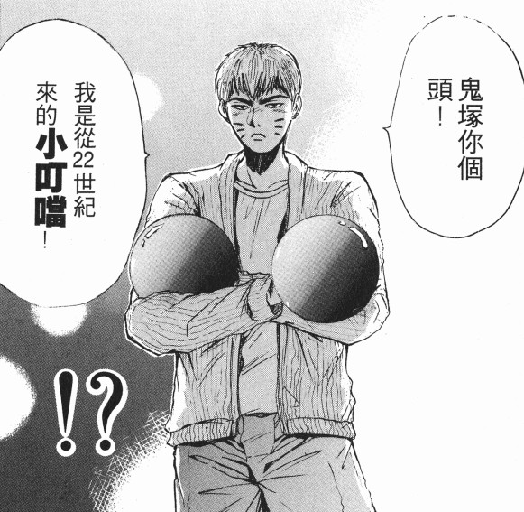
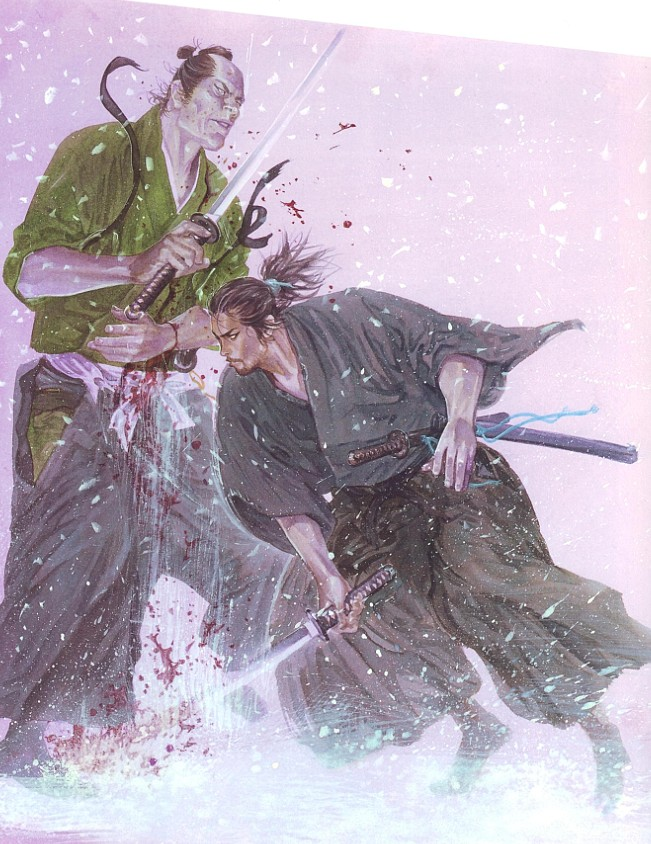
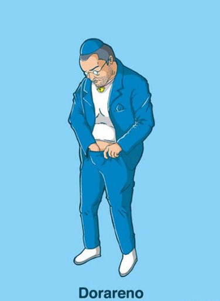

# ＜儿童节特稿＞哆啦A梦与儿童节杀人事件

**这注定是一个漫长的等待的夜晚，我的忐忑将包含鲜血的泪珠。过去18年的种种往事注定将浮上心头。那些在白云朵朵上奔跑的鲤鱼幡和竹蜻蜓，你们是否还在啊。我想你们想到心痛，泪奔。是的，我叫大雄，我最好的朋友叫机器猫，你们中的有些人叫他哆啦A梦。明天这个时候，你们也许永远见不到了。而我，也将过完我最后一个儿童节。再见，过去的18年，再见，童年。**  

# 哆啦A梦与儿童节杀人事件

## 文/张亮（北京大学）

 

今天是我的18岁生日，6月1日。理论上讲，也是我最后一个儿童节。我准备杀一个人。

我妈妈告诉我，每一个不满18岁的孩子，都在天上有一个守护神。

天上的守护神在人间的助手，就是鲤鱼幡。我每过一个生日，就过一个儿童节，每长大一岁，就多挂一条鲤鱼幡。今天是我最后一个儿童节，我挂上了第18具鲤鱼幡。

我曾经骑着鲤鱼幡在天上飞翔。在天上，云朵在你身体下面，慢慢吞吞好像一头一头藏在水底爬行的田螺。飞累了，扑通扑通一起掉到云朵的胳肢窝里面睡眠。睡眠有很多种形状，有立方体，有海绵体，有玻璃体的。这些知识，都不是生理卫生课上老师教我们的。这些知识都是我们在课底下偷学的。我们上生理卫生课，一个班分成两个班，男生跟着男老师上，女生跟着女老师上。男生上课的时候，耳朵全都盯着隔壁，隔壁全是女生。女生呢，耳朵也盯着隔壁，但她们不表现出来。男生的黑板上挂着一幅男性外生殖器的巨大照片，上面密密麻麻用勾画出这是什么部位，那是什么部位。男老师长了很多大胡子，我奇怪他为什么长那么大的胡子，还老师教育我们不准留长头发。长在头上的毛和长在嘴巴上的毛有什么不同么？我们不关心黑板上的巨幅照片，我们自己那玩意要逼真和好看的多。但是，一直到毕业，我们都只看过黑板上的那玩意儿。

我的中学生活因此变的很无聊，豆子样的，一粒一粒，接着掉到地上，蹦跳起来，咯噔咯噔。我老是想象隔壁女生上生理卫生课时候，黑板上挂的照片是怎样的。上课上，下课想，晚上睡觉之前，睡觉中间，睡觉之后也想。一直想到早晨起来尿裤子。尿完裤子，底下的那东西还直翘翘的立起来，像一只饥渴的提着脖子张望的鸭头。

这些，我的父亲和母亲都不知道。他们只知道让我好好学习。我不是一个聪明的孩子，甚至不是一个好孩子。我贪玩，胆子小，还怕生人。我父亲为此经常打我，脱了裤子打，打到见血为止。我妈经常在旁边劝。父亲就说：“我们自己的儿子，如果不好好教育，长大了没出息，最后的祸害还是我们自己来收拾！”我妈听后，就不再做声。

从小学到高中，我的屁股总是处于红肿状态。但，成绩并未因此变得不红肿。红灯笼照样年年高挂。在这样地狱般的生活里，我没有选择离家出走，或者自杀。完全是因为，有他这么一个朋友。他是我形影不离的朋友，在我小学时候就寄住我家。喜欢睡在我桌子的抽屉里。还有很多神奇的好玩具。你瞧，我刚刚跟隔壁大妈说，我曾经有这么个朋友，他带着我，骑了鲤鱼幡，在云朵上面飞，她不但要打我，还拿着笤帚，要赶我走，嘴里面骂：“你个小不要脸的，别跟你那上吊的爹娘一样，穷死赖账！”

哦，忘记交待了，我的逻辑有些混乱。我爸我妈没见到我考上名牌大学就死了。是上吊死的。他们两个都是小职员。一辈子老实本分，没想过挣什么大钱，也挣不了什么大钱。但是，在我17岁那年，他们突然想挣大钱了。原因是，他们知道我考不上名牌大学，想要弄一笔钱把我送出国去读书。有个卖高利贷的家伙告诉他们，炒股票可以赚大钱。那个时候，正好是有一拨人炒了股票的。他们都赚了大钱。等他们都赚完大钱，屁股一拍走人后，我爹妈把一辈子积攒下来的钱投了进去。具体多少我不清楚，但我知道，是没剩下几个钱了。

结果，当然如你们所猜想的。赔光了。一个字儿不剩。家里有三天没开火。他们两个连续三天坐在地上不说话，累了就相互靠着。我不知道好歹，那时候正好高二，作业多，压力大，他们竟突然不管我。于是，我整天和小孩子们一起玩。我们骑着鲤鱼幡，有些时候是竹蜻蜓，在天上飞。从一朵云，飞到另一朵云。每一朵云的怀抱里，都有一个太阳，每一滴水珠里，都住着一条鲤鱼幡。让我心里面痒痒的是，除了我们的玩伴，居然没有一个人知道，我们正在天上飞。

我们玩累了，叫我的好朋友，住在抽屉里的那个小家伙，放我们下来，找到我家后院的空地上，那里有一片光秃秃的草坪。那家伙从口袋里拿出几张小纸片，呼啦呼啦变戏法似的，就盖起几栋楼来。我们欢天喜地冲进楼去。到中午了，我们决定自己做饭。我读书不行，厨艺却还很厉害。于是，自告奋勇，偷偷摸进家里找吃的。我很小心。虽然知道爸妈在发呆，也懒的去管，但这个时候，把大房子撑在家里后院，生活做饭起来，还是得小心加上小心。我就这么小心翼翼的摸进厨房。每一个拐角处，每一个楼梯口，每一个衣架，酱油瓶子，醋瓶子，我都熟悉到掉渣。我在这里住了17年了。

把所有酱油瓶子、醋瓶子、冰箱里的肉菜蛋奶都放进大篮子里，顺手还放上那小家伙最喜欢吃的一大盒子豆沙饼。这个时候，我突然想尿尿。于是，我摸到洗手间，推开门，看到我的母亲悬在洗手间的天花板上，头耷拉着，一条系在她脖子上的白色绸带，从脖子上一直拖到地上，很长很长，长到我的脚底下来。白色布带上写满了红色的：“儿子加油！儿子加油！”

我吓的一下瘫坐到地上，尿止不住涌出。完全没有感觉。这个时候，卫生间的门慢慢朝我坐着的方向旋转过来，向我展示它背后的景象。我的父亲歪了脖子倒在血泊里，他的喉管被切开，血正突突往外冒，像泉水似的，突突往外冒。他还没有完全死掉，张大了嘴巴出气，手挣扎着要抓住我。

他没有抓住我，我爬到客厅里。因为腿已经吓的不能动弹。我没有打电话，没有叫人，一个人在房间里面嚎啕大哭。等我眼泪快要哭干的时候，我的朋友们跑进来，他们以为我在偷吃东西。一个个的笑着，拍我的脑袋和肚子，让我把吃到肚子里面的好东西吐出来。很快，他们一个接一个把昨天吃的东西都吐出来了。他们看到了从卫生间里面流出来的一滩滩血。

从此以后，我变的沉默。不再跟别的孩子一般玩。所有亲戚朋友，都把我避的远远的，因为我爸我妈欠的那笔巨债务，他们谁也不想帮忙偿还。我只是笑笑。爸爸对我说过：“儿子，这世界上最重要的一个人的荣誉，不是金钱。男人可以没有足够多的金钱，但必须要有足够多的荣誉。”老爸以往跟我说这话的时候，我总是心不在焉，他的话像一只永不疲倦的瞌睡虫，引诱我在似醉非醉的梦想里缠绵。现在，他死了，每想到这句话，我就想起，他歪了脖子，脖子里插把剃须刀的情形。那血好像慢慢渗透进我的血液里面。咸咸的，淡淡的，让我一边噙着眼泪，一边舔着舌头；

“儿子，加油！儿子，加油！”我就这样咬着牙，拼了命，去复习，为了高考。我希望我的住在抽屉里的好朋友，帮我一把，他有一支可以自动答题的铅笔，我以前用过，只要有了它，我可以考上世界上任何一所顶尖的大学。有了他，我，一个原本籍籍无名的坏儿童，人生一片暗淡，从双亲尚未冷硬的尸体上爬过来的失败者，可以一跃成为全国瞩目的高考状元。创造人间的奇迹。

“我要为我的父母洗去耻辱。”我跪在我的朋友面前，旁边放了一大堆他最爱吃的豆沙饼。声泪俱下。“这是我为父母挽回名誉，为我们家还清欠债的最后机会了，求求您了。求求您了。”但是，我的这个和我从小一起长大的朋友，还是那么顽强的拒绝我，摆出一副油盐不进，软硬不吃的姿态。往常，只要几个豆沙饼就可以打发他，现在，一大堆豆沙饼摆在他面前，他居然一点心都不动。

“对叔叔阿姨的去世，我也很心痛。但是，你忘记了他们的遗言了嘛？他们希望你加油，加油！不是用什么歪门邪道，而是靠自己的努力，考上全国最好的大学，光宗耀祖！”他喋喋不休的重复了一千多年来重复过的道德教条。可是，就像生理卫生课上的那副男性外生殖器照片那样，他以为，我就是需要那样的，可是，他不知道，我的脑袋一直望着隔壁。

我从来不是什么坚强的人，也从来不能够创造奇迹。可是，从我父母，到我最好的朋友，都坚定的认为，我能够创造奇迹。我的父母，因此搭上了性命。我的最好的朋友，对我铁面无私。

我彻底绝望了。高考一如我事先所预料的，不可避免的成为我葬礼上最后一支安魂曲。不仅没有考上全国最好的大学，连全国最差的大学也没有上。呵呵。我是尽了力的。可是，我注定将是一个失败者。对于一个贪玩了18年的懒惰的笨孩子，最后三个月的废寝忘食不过是一个悲壮的自杀冲锋的注脚。

考完试，别的孩子都一个个欢天喜地的结伴玩耍。我一个人走在空荡荡的街角里。走过第一个街角。我看到小静，从小到大一直默默喜欢着的，因为自卑却不敢承认喜欢她的小静，和小强亲密的手牵牵，走到卖雪糕的小店铺面前。我没有一点悲伤的表示。可是，我又觉得，如果表都不表示一样，太不给面子。于是我大声叫道：“小静！”

小静和小强回头看到我。小静吓的把手里拎的包掉了。我走过去，给她拣起来，拍干净。他们两个立刻像抢跑的短跑运动员，在我面前迅速的消失了。当然，是说了再见的。

时间在此刻停滞。往事如同被水浸烂的面包，粉碎、湿润，成为灰烬。我踏在他们刚刚站立过的地方。弯下腰去。那里有一本书，应该是小静书包里掉下来的。自从我父母双亡以后，他们都疯狂逃避我。

“坏孩子总是会克死父母的。”大人小孩都这么说。所以，我并不感到特别的悲伤。倒是，这几个月与书籍和文字的相伴，让我对书籍本身，有了超乎寻常的关注和乐趣。我拣起这本书。上面写了几个字《武士道》，作者的名字叫做“新渡户稻造”。那一刻，天光击中了我，那道天光来自遥远的天庭深处，他照耀我，告诉我，一切过去的怯懦，都应该然位于武士的尊严。我的最好的朋友能够回到过去，他仿佛告诉过我，我的祖先是宫本武藏，日本战国第一剑客！在著名的与佐佐木小次郎的对决中，用木浆带刀，将著名剑客佐佐木从中间劈开成为两半。在举世瞩目的关原之战中，我的祖先宫本武藏也是挥舞双刀，杀人如麻，那才是男人的尊严，武士的荣誉！

一页一页翻看着这本《武士道》，让我血脉喷张。我感到，男人的尊严在心底复活。为荣誉而战，为荣誉而死，这才是宫本武藏的后代。我把这书悄悄藏在书包里，放到阁楼最深的角落，再在外面放上不用的皮箱子，纸箱子。我害怕有人发现他。

我最后一次跪在我最好的朋友面前，求他用他的装满了无数宝贝的大口袋再救我一次。就在昨天下午。我的理想是进全国最好的大学。在我心目中，只要进了全国最好的大学，就可以有最好的工作，挣最多的钱，小静也会看的起我，那些无时不刻追踪我，鄙视我的债主们，才会消停，那些，因为父母亲去世，家道中落，避之唯恐不及的亲戚朋友们，才会重新回到我的生活里。

我不是不知道他们的虚伪，但是，我更怕孤独。我宁愿花着自己的钱，挥霍自己的尊严，和他们一起吃喝玩乐，也不愿意，像狗一样，躲在阴暗湿冷的角落里，为明天后天或者大后天可能蜂拥而至的债主们数钱。

“如果没有钱，可以数硬币。如果没有硬币，可以当房子。”当初竭力劝我父母倾囊炒股，并且借给他们高利贷的，是我的干叔叔。父亲十几年的好朋友。如今，乘着新房产经济的泡沫，他发老大财，仍然不忘记惦记我们家的老房子——那是我祖父留下的财产，隔着东京最繁华的银座，只有一条街。

新渡户的书在我心底里燃烧，在考上最好的大学之前。我要将他，这个无耻的叔叔收拾掉。如果谁胆敢阻挡我，我都会杀掉他。我最好的朋友仍然是我最好的朋友，但，他太懦弱了。他以为，我在我最亲的干叔叔面前痛哭流涕是真实的软弱。但他不知道，仇恨，从很小时候就已经埋下了。从小因为成绩差，性子软弱，被同学欺负，家长老师责骂，无数次的当众出丑，他以为，这些都是童话故事，都可以在竹蜻蜓和鲤鱼幡的一次次飞翔中得到化解么？在得到那本书之前，如果我的父母亲们都还在，是那样的。但现在，不可以了。

我决定干掉我的干叔叔，如果谁阻挡我，我就一并干掉他。我最好的朋友有个神奇的大口袋，童年的时候，给了我最多的快乐。他以为童年可以继续。但我知道，童年就是童年，成年就是成年，不可以继续了。父母亲死去的幽灵永远在我头脑的林间游荡，如果仇人的血没有血溅，我是不会安心的。我静静的准备好他最爱吃的豆沙饼，还有他最喜欢的超霸电池——这是他的能源。跪在他面前。我最后一次跪在他面前。

“求求您了，求求您。”

“不行。这样的事情有违我的名誉。也有违您家的名誉。我这里有一种非常先进的辅导机器，你只要犯困，他就自动给你头脑按摩的，要不要试试……”

我已经懒的听他废话了。这个食古不化的家伙。我要像一个真正的武士那样，夺过我应该拥有的东西。我在想，怎么把这个顽固的猫的电源给拔掉。猫怕水，他尤其怕水。因为他是机器猫。想要干掉他很方便，因为他对我没有过防备。18年来，我们都患难与共，他对我没有防备。一想到他，我眼睛里就满是泪花。那些美好的日子，真的是和他一起度过的。但现在，我长大了。他没有帮到我，成为一个成年人。我们所有度过的童话般的日子都解体了。而祖先的武士的血，则刚刚开始在我胸膛里流淌。按照书里面武士的插页。我到古董商店去买了一把武士道。那是一把叫“鬼丸”的刀，古董商人说，是一个著名武士用过的。那个武士出生在战国，这把刀，缀饮过无数武士的鲜血。

“比宫本武藏那把如何？”我弹着亮闪闪的刀身，问老板。

“宫本武藏是日本第一剑客，但他的刀，注意，是两把，不是一把，早已经和他的身体一起埋葬到日本不知名的冢里面去了。而这把鬼丸，才是世间你真正能够把握的。你真正能够把握的刀，在你的心里。”

我承认，这个古董商人是一个精明的说客。但这个世界里，卖什么的不是说客呢？那个游说我父母炒股，逼得他们上吊的家伙，不也是我的干叔叔，一个精明的说客么?

怀里抱着我的刀，心里火却渐渐平息。我已经想好了对付我最好的朋友的方法。我会买回去一个很大很大的生日蛋糕，当然是为了庆祝我的18岁生日，还有儿童节，理论上，我最后一个可以赖着不走的儿童节。他肯定会很高兴。我会装作若无其事的为他倒上酒。他虽然是机器，对酒也是很喜欢。等他喝的烂醉了，我向往常一样把他扶进去。不是扶进他的卧室，而是扶进澡堂。澡堂的浴缸里面事先放好了满缸子的开水。我把他泡进去，立马就会短路。然后，手起刀落，把他圆圆的头割下来。我需要的是他的万能口袋。把他的万能口袋穿到身上，我会摸出我所能想要的一切有魔力的东西。我一切的尊严，成年人的尊严，将在那一刻得到满足。一切屈辱，将成为历史。我将杀死我的仇人，考上全国最好的大学。我将一洗从孩提时代就深刻于脊背与内心的耻辱。宫本武藏原本就是一个胆小鬼，他的成功，无非就是我最好的朋友，回到古代，无意中留给他一把战无不胜的刀。如今，这把叫做“鬼丸”的刀，将在今天重写这个故事。

我就这样美美的想着，沿途走进每一个糕饼店，把所需要的豆沙饼和生日蛋糕都买好，包好。我需要花花绿绿的纸张，还需要18支生日蜡烛。我将在最后一次生日PARTY上为我们18年的友情唱一支歌。当然，我会再求他一次，为了我们18年的友情。可是，我知道，这是徒劳的。他说过，这将玷污他的名誉。而我，也有我的名誉。

这注定是一个漫长的等待的夜晚，我的忐忑将包含鲜血的泪珠。过去18年的种种往事注定将浮上心头。那些在白云朵朵上奔跑的鲤鱼幡和竹蜻蜓，你们是否还在啊。我想你们想到心痛，泪奔。是的，我叫大雄，我最好的朋友叫机器猫，你们中的有些人叫他哆啦A梦。明天这个时候，你们也许永远见不到了。而我，也将过完我最后一个儿童节。

再见，过去的18年，再见，童年。

 

（采编：何凌昊；责编：陈锴）

 
