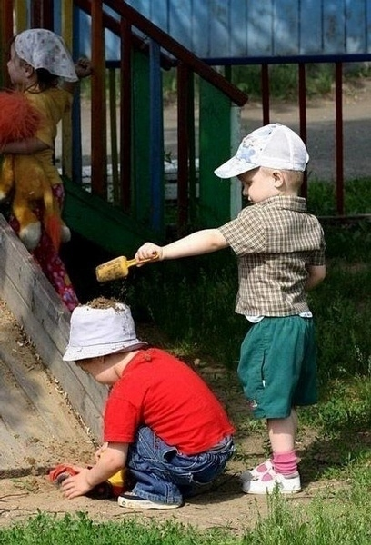

# ＜儿童节特稿＞小时候

**小时候不听爹妈的话，爹妈不让干啥偏要干啥，惹了祸就被一顿胖揍，身上青一块紫一块。现在爹妈不听我的话，烂苹果不叫他们吃偏要吃，把好的留给我。可他们不听话我也不能揍回去啊。**

### 

### 

# 小时候

### 

## 文/李路（东北师范大学）

### 

### 

### 

二十年前，如果碰到六一儿童节，那简直是天下间唯二最美的事儿。另一件是过生日。 那时街上没这么多车，公交车还是那种拖着两条大辫子，分为两截，中间像火车一样连在一起的大家伙。出门轻易不坐车，除非远门，因为车票两毛有点贵。我爹骑着大二八，开始我个子小坐横梁，后来横梁放不下了，就坐后座。每次坐完自行车都腿麻。那时小学的旧楼还没拆，也没扩建，三层的破楼，面向自由大路。那时树比现在多，高楼大厦没这么多。那时看一次飞机拉线儿叫唤半天，现在飞机天天在脑袋上转悠熟视无睹。 那时做梦都想去一次儿童公园，可是门票要一块钱，去不起，就算儿童节当天孩子免费，可我爸我妈也去不起。那时还没有什么麦当劳，肯德基，当然也没有什么游乐场。倒是满大街都是游戏厅，玩街机，不过家长和老师不让我们去。那时候天天放学以后跑到大院里捉迷藏，玩电报哒哒，扇pia即，弹溜溜，后来又流行奇多圈，能玩到被爹妈揪着耳朵揍回家去。为了pia即厉害还往上面涂蜡。 春天到了就烧杨树毛，满树撸榆钱儿洗都不洗放嘴里就吃，拎着个塑料袋儿漫山遍野挖婆婆丁（蒲公英）、唧唧菜还有地环儿，看见黑天天儿都能抢得打起来。夏天捉蚂蚱、扁带钩，比谁抓的腿儿长，捅蚂蚁窝，把蚂蚁吓得天下大乱，到河里抓蛤蟆青蛙，然后想淹死它们，现在想抓蛤蟆只能去郊区。拿放大镜烤蚂蚁，以为能把蚂蚁烤死。看到毛毛虫扬揦子必群起而弄死之，整得满地绿脓。还抓蜜蜂，以为能长蜜，总被蜇。秋天就找粗壮的树叶梗，比谁的坚韧拉不坏，叫拉钩，为此还拿盐水泡。冬天就堆雪人，打雪仗，往别人脖颈子里塞雪，把人冻的一激灵。路上要是被人走出一道冰印，就反复在上面打哧溜滑，比谁滑的远，经常坐一屁股墩。下雪后雪被踩实了，就把糖葫芦棍儿踩在脚底下，以为自己踩着雪橇。 还有不分季节的。 工地是圣地，水泥是圣土，沙堆是宝藏，砖头是金块，搅拌机是变形金刚，卡车里能飞出克赛，管材是时间隧道，戴安全帽的都是格格巫，因为总把我们打出来。一块泥巴能玩一天，卧泥蛋，一摔一声响，比谁声音脆。踢球，不分昼夜冬夏。夏天啵乐盖总卡秃了皮，冬天棉鞋准准湿透也不觉得冷。一个球从新踢到旧，从旧踢到就剩一橡胶囊，也就是内胆，继续踢。羡慕踢球好的。没事儿还抱团整个足球队，特专业。收集球星卡，尤其国足的，那时孙继海刚出道，彭伟国正当打，郝海东还青涩，延边敖东是主队，觉得巴西就是在国外横，要是碰上中国队准歇菜。爬杆儿，吊在最顶上看下面的脑袋。 吃小浣熊的干脆面，8BQ就是烤肉味，收集三国卡，108将都是那时候认识的。喝格瓦斯和大白梨，一口吹一瓶不打奔儿，后来开始喝宏宝莱。吃长春饭店的雪糕，指定要麻酱味的。2毛钱崩一袋爆米花，3毛钱现做的康乐果，用的还是拖拉机，那时候叫小突突。羊肉串两毛，钱不够只能吃两不解馋，现在依然爱吃，没事儿整两串儿。愿意闻汽车尾气，觉得特仙境，现在知道那是一氧化碳中毒了。 讨好女孩子的时候就跳房子，跳皮筋，还玩过家家，死皮懒脸演人家老公，长大了那脸皮都没了。喜欢哪个女生就欺负谁，喜欢得越甚欺负得越厉害，往人家身上扔虫子，铅笔盒里藏青蛙，揪辫子揪到散花，欺负到哭就一哄而散。总到处宣传XX喜欢XX，XX给XX写情书。跟同桌划楚河汉界，自己的地盘占80%，后来看同桌哭了，又偷偷把线擦了，还主动把橡皮借给人家。春游的时候主动帮女生拿东西，累得半死硬挺。被别人揍了哭得比谁都甚，自己摔坏了就装英雄。 上课撒谎说上厕所，然后就跑出去玩，老师管这叫逃课，总告诉我爸。上厕所也不老实，净玩恶心的，比谁拉粑粑快，还比谁拉粑粑慢。互相比谁尿尿远，那时顶风尿十丈不是传说，现在……不说也罢。最闹心的是把鞭炮点着了扔到公共厕所里，然后嘭的一声，里面的人就开始破口大骂，我们狂笑奔逃。现在想起来还闹心。 

 怕打针，不吃药。打针必须蒙着眼睛，之前还要一顿哭嚎，像上刑场。吃药必须伴糖，不然死不张嘴。但是要是旁边有女孩，就要多坚强有多坚强，眼睛瞪的那叫一张嘎。 看动画片，看漫画。《圣斗士星矢》《七龙珠》《阿拉蕾》《机器猫》（一直不习惯叫哆拉A梦）《变形金刚》《花仙子》《美少女战士》《恐龙特级克塞号》《聪明的一休》《小蝌蚪找妈妈》《天空战记》《布雷斯特警长》《时间飞船》《六神合体》《太空堡垒》《篮球飞人》（不习惯叫灌篮高手）《足球小将》《猫和老鼠》《唐老鸭》《鼹鼠的故事》《大力水手》《神龙斗士》《北斗神拳》…… 看电视剧，看电影、电视节目。《小兵张嘎》《狼牙山五壮士》《刘胡兰》《闪闪的红星》《地道战》《地雷战》《铁道游击队》《红岩》《英雄儿女》《董存瑞》《西游记》《水浒传》《三国演义》《红楼梦》《新白娘子传奇》《楚留香传奇》《戏说乾隆》《宰相刘罗锅》《封神演义》《小龙人》《渴望》《七巧板》《大风车》《综艺大观》……那时一旦有个电影电视剧，那叫一万人空巷，没电视的都跑有电视的家里看去了。现在的电视剧，100部里能有一部好看的，就算不错啦。 小时候爹妈总为我操心，给我收拾各种烂摊子，爹妈是天，无所不能。现在轮到我经常为他们操心，虽然还轮不到我给他们收拾烂摊子，但他们已经变成了老人。 小时候不听爹妈的话，爹妈不让干啥偏要干啥，惹了祸就被一顿胖揍，身上青一块紫一块。现在爹妈不听我的话，烂苹果不叫他们吃偏要吃，把好的留给我。可他们不听话我也不能揍回去啊。 瞅瞅过去，瞧瞧现在，搔搔后脑勺，有点不好意思，已经早就不过儿童节了，可还一事无成呢。 

### 

### 

（采编：李卓然 责编：黄理罡）

### 

### 
