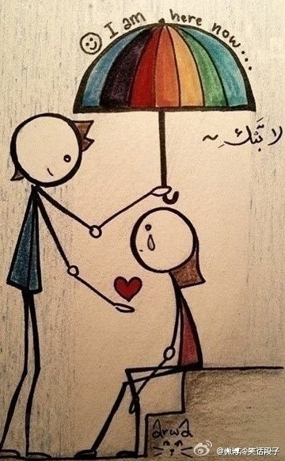

# ＜光棍节特稿＞一个人是如何爱上明月与流水

**我们匆忙的爱，匆忙的分开，匆忙的相见，却又匆忙的不再理会，却又怎知岁月与流水，才是最大的坚持与力量。明月亘古，流水不绝，这让我想到那句话了：“年轻的时候会想要谈很多次恋爱，但是随着年龄的增长，终于领悟到爱一个人，就算用一辈子的时间，还是会嫌不够。慢慢地去了解这个人，体谅这个人，直到爱上为止，是需要有非常宽大的胸襟才行（《初恋50次》）。”这诚然是极有道理的了。**

# 

#  一个人是如何爱上明月与流水

## 文/ 李路（东北师范大学）

 

写在前面：这是一篇充满了文艺小清新范儿的酸文。但我就是一个文艺小清新的酸男啊。所以，请谅解吧。

当我意识到我不再想找一个如正午阳光般炽热的爱人时，我已经27岁了。那时候我走在学校夜晚的湖畔，月光如舞台的幕布般把湖水展开，湖心岛凉亭的轮廓围上了一圈瑰奇的光晕，垂杨的阴影像在湖畔梳洗的姑娘。那时候，我情不自禁的想要拥抱，拥抱一种不可名状的存在，那似乎是天上的星辰，又似乎是水里的明眸皓齿，不可琢磨，难以参详。我以为什么东西从我的身体里失去了，我还发觉一种存在自我胸臆中生长了。

这是如此充满形而上意义的，带有某种足以让人喜悦又悲伤的特殊感受，付诸言表就总难以启齿，也许别人会说：“看，这人的癔症，竟也在写诗呢。”

那时我经历过爱情了。

谁没有经历过爱情呢？

我曾以为，两个人，就是爱情的全部。那些嬉笑打闹娇嗔羞恼毒言恶语冷漠背叛纵使没有任何道理可言却也只是两个人的事。两个人相爱，两个人甜蜜，两个人争执，两个人分手。

我们偷偷而极隐秘的喜欢过一个人。那时候，她或他坐在你的前座或左右，在那个因共同生活着几十个人而显得狭小的空间里，你却只因和他（她）呼吸着同样的空气而暗自欣慰。你时而偷偷的瞄上几眼她的秀发或暗自注视着他的脸颊，若是突然四目交汇，便在偷窥的羞耻感下急速的躲闪目光。你以为你做错了什么，可谁也不知道你做错了什么。你从未对这个人说过你的感受，甚至从未与哪怕是最亲密的朋友分享，更有甚者，也许这个人也从来都不知道自己竟然在另外一个人的心中占有过如此坚固的世界，因为你的羞于启齿，也因为你善意的固执。那时如果你恰巧看见《大鼻子情圣》，也会默默的心酸不止。

我们还热烈而纵情的亲吻过一个人。那时候，这个人走在你左边或右边了。你们走到哪里都要牵着手，吃饭时，走路时，甚至碰到师长时。你们不再像更早时候那样，拥抱也要偷偷摸摸，你们光明正大，你们意气飞扬，深情相拥，热烈亲吻，连吵架也要轰轰烈烈，尽人皆知。你想把这个人介绍给你的家人，尽管内心忐忑不安，担心自己的父亲或母亲大人眼光苛刻，言语挑剔，可在你心里，这些都不是事儿。你想和这个人至少要走过很长的一段生命，心心相印，幸福甜蜜，未来也许还要结婚，或者还没来得及计划到那时。你们不断的争吵，又不断的重归于好。不断的感到离不开彼此，又不断的抱怨爱情的枯燥。可是，你们唯一确信的一件事，就是这个牵着你的手的人儿，对你是如此重要，如水之于鱼儿，如风之于飞鸟。你们知道彼此是对的，知道爱情是对的。然后，你们分开了。

我们还有意或无意的伤害过一个人。出于坚守的自尊、轻率的许诺、冲动的诱惑、年轻的无知，或者其他什么难以启齿的理由。每每深夜里，想起曾经有那么一个人在你的生活里出现过，然后留下一滴泪水，你就会默默的一声叹息。也许还会暗自悔恨，如果当初我没有那样，又会如何？可是你又总会极坚定而理智的奉劝自己，他或她，终究不是你想要找的那个人啊……纵使那是极美好的一个人，却终还是与自己的世界格格不入呢。也许还有些许的遗憾，但错过就是错过，人生又何必执着？

当然，我们还曾极惨重的被一个人伤害过。那时候，你的世界崩溃了。你突然发现，当你说话是错，出现是错，连呼吸都是错的时候，活着的每一分每一秒竟都变成煎熬。你不知为何，你惶恐猜测，你悲伤欲泣，你无处诉说。于是你竟放低了姿态，抛弃了自尊，不惜恳求，即使低头。可是这一切除了换回一个冷漠的背影，竟是什么也挽回不了。然后你突然知道，谁又能是谁的谁，如青松与山石般的坚守，终究只是传说。你还发现，原来诺言的存在，就是用来背叛，昨日的深情，今天已经随风飘散。所以，爱情之于自己，不过是饭间的作料，茶余的消遣，若是再动深情，连自己也要责怪自己。再然后，或许男女的追逐于你而言已经变成一种游戏，那么，谨守规则就好。你开始不再肯放开自己的心扉，纵使和朋友彻夜交心，却也难得与情人诚挚相谈。这一切，归根结底还是要追溯到那个人吧。

我想说的是，这些我们所经历的，都曾经是我们的爱情。爱情，无论是好是坏，那些情绪的交汇，感情的交流，品格的考验，人格的碰撞，甜蜜痛苦悲伤绝望甚至恨，归根结底都是两个人的事儿，也只是两个人的事。

可是如果给爱情套上一个现实的枷锁，两个人，即使紧握双手，仍是如此脆弱。甚至于，若是在现实之前两个人就已各行陌路，也许还会暗自庆幸了。

这些爱，都一如阳光般炽热而强烈，所以断裂时，也格外的冰冷而坚硬。

可是，我也曾如此坚信爱情就应该就是炽热而强烈的，如浪潮奔涌，如万物生长，如宇宙诞生，为此直可以胸怀壮烈，义无反顾，如勇士般与一切搏斗。为的就是那个人，为的就是那个人的爱。

直到有一天，我参加了一个姑娘的婚礼。那曾是一个敢爱敢恨爱的勇敢恨的决绝敢于用最沉重的勇气去追求爱情的可爱姑娘。她曾暗恋过一个人，与一个人相爱，伤害过一个人，被一个人伤害。在她的每一次爱情过程中，她都曾用尽自己的全身力气，毫无保留，即使面对命运也要挣扎一番。可是新郎却不是那些人，不是那些曾在她的生命中留下痕迹的人中的任何一个，可却将要陪伴她的一生。她曾经渴望的长长久久，那些人都没有给她，而这个新郎做到了。

婚礼上的她格外美丽而脱俗，如星光般耀眼。那时我分明从她的笑容里看到了与从前的她格外不同的东西，那是时间与岁月，那是明月与流水。我笑问她，为何选择了这个人？她嫣然一笑，美的不可方物，因为他，爱我平淡却悠长。

那时我突然产生了一个巨大的疑问，我们的爱，我们的爱情，我们两个人，轰轰烈烈顽强挣扎与天作对与地为敌，我们求的到底是什么？我们要的到底是什么？是过把瘾就死，还是想要找一个人，和自己慢慢的走过长长的一生？

我看着那个可爱的姑娘，内心无比羡慕。她终于明白自己要的是什么了，她也以一种极令人艳羡的方式得到了。

所以，那个湖畔的夜晚，我极为从容而镇静的拥抱了明月与流水。我感到月光触过我的脸庞，轻柔却坚定。我还感到流水拂过我的眼角，平和而绵长。我感到明月与流水是如此坚定的让我安宁着。

原来爱情，当如月光般皎洁，当如流水般长久吧。

我们可以轰轰烈烈的爱上一个人，却终究无法轰轰烈烈的认识一个人。人呐，这样复杂的生物，若是不仔细的精心参详，又怎么能看清他本来的模样？又或者，若是不认真而坚定的体会，又怎么能明白自己到底是何等的存在呢？我们要什么，我们追求什么，终究要抽丝剥茧的细致发掘，才会显露出一个更接近真相的答案。我们匆忙的爱，匆忙的分开，匆忙的相见，却又匆忙的不再理会，却又怎知岁月与流水，才是最大的坚持与力量。明月亘古，流水不绝，这让我想到那句话了：“年轻的时候会想要谈很多次恋爱，但是随着年龄的增长，终于领悟到爱一个人，就算用一辈子的时间，还是会嫌不够。慢慢地去了解这个人，体谅这个人，直到爱上为止，是需要有非常宽大的胸襟才行（《初恋50次》）。”这诚然是极有道理的了。

也许我不会再那样炽热的去非寻一个结果不行。也许我也不会再那样热烈的去追求一个姑娘。甚至于，连我的爱情，也不会再如以往般倾泻而出一无保留了。这真的不是害怕伤害，也不是不再相信，而是我以为，也许只有平淡从容却胜在长久坚定的爱情，才适合度过一生。

我愿意安静的等待，愿意从容的守候。也愿意用时间照看自己的心灵，也愿意用岁月温暖你的胸怀。我还愿意做出持续而坚定的改变，我更愿意长久而平和的包容——把你包容进我的世界，把我容纳成你的清风。这是我最柔软的情感，最善意的野心，也许也是最固执的爱情。

如果爱情仍然是两个人的事，也许爱情从来是两个人的事，而且也许笨拙的我将来仍然是这个样子：

有个姑娘我很喜欢，但我不会说好听的话，不会逗她笑，更不会让人觉得充满新鲜感。我能做的只是努力去想一些好玩的事情告诉她，努力让自己变得幽默。也许我，还会说错话，还会去做一些蠢到不行的事，还会像一个傻瓜一般无可救药。

但我唯一的希望是，用如明月与流水般长久的时间去和一个人过更好的生活。

而不是用我的整个生命，去找一个更好的人。

书于2011神棍节凌晨

2011-11-11

（采编：陈锴；责编：陈锴）
