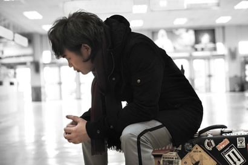
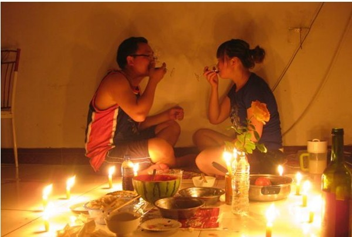

# ＜光棍节特稿＞你像我见过的那个男孩

**过去十年的我，就是漂泊，我似乎习惯了漂泊，就像我习惯了单身，我一直认为只要我还单身，我就有着不切实际的爱情，只要我还漂泊，我就有着不切实际的理想，但是现在，我想念当年一起成长的小伙伴，想念当年爱过我的姑娘，此时此刻，他们知道我在哪吗，他们记得我是谁吗，他们会不会在同样的异乡的灯火璀璨中忘记自己是谁。**

# 你像我见过的那个男孩

## 文/蛋蛋（河北师范大学03级老生）

1

2007年夏，石家庄，我抛下新买的自行车和抓狂的邯郸老板，揣着五百块钱，提着一张军被几件衣服走向火车站，我忘乎所以，仿佛远方有我的爱人。

公交车窗外的五环，天空荒凉，地面肮脏，新开张的商场挂满彩旗，一派农贸市场的喧哗。陌生和不安中，下车，进村，昌平的中滩村，歪曲小街，拥挤小店，货物摆在外面。这村子是外来小生意者的天堂，住满了打工或准备打工的学生、工人、农民。村子房屋密集，最高的不过四层，临时加高，为拆迁前多吃瓦片儿。村子深处一户人家，院子也盖成屋舍，通道只够两人并行。主房是个筒子楼，有深邃通道，通道两侧分布数不清的房门，每个房门内有一间大小寝室。三楼是屋顶，排着一行屋子，出屋门便是天台，天台拉满绳索挂满洗晒被单，五颜六色，迎风摆动。先期到京的几个大学同学就住这里，康和崔一屋，三楼房间是里外间，亮子屋外间还住着小姨子小贺和男友，就是一张小床，再无其他。

起初，天台帮的人事是这样的：康在上班，大学老师介绍的排版，月入两千余；崔在择业，意向3D；我在择业，无明确意向；亮子在择业，意向影视后期；亮子女友做小文员，月入千余；小贺在小单位做设计，月入千余，小贺男友不知道干什么的，只亮了个相就滚蛋了。

我们屋三人分摊每月几百块的寄宿费用，外间有煤气罐，村里有菜市场，我掌勺，天台帮生活质量瞬间提高，有时也去亮子家露一手，我颠锅性感、专业，获得“炒王”称号。

天台帮很温暖，晚上各自摆好桌子在天台上吃饭聊天开玩笑，有时还能欣赏一轮满月。吃完饭站天台边四望，高低不等的小房子，参差不齐的灯火，还有远处街上的嘈杂，一个偌大的布满生灵和廉价食物的贫民窟，也许十六世纪的巴黎就是这个样子。

每天上午，我和崔去亮子家上网投履历。招人单位电话打来，不管什么地方，都过去，坐公交车去，那是07年，没有地铁10号线4号线，5号线也刚通，地铁站甚至还有打眼票。两个月，我和崔踏遍京城每一处车站，烈日、乌云、卷着冰棍袋子的风，生生把人折磨现实了，清华科技园内，炒王仰望苍穹，深感蝴蝶飞不过沧海燕雀毙坠于浩谷。

两家广告公司要我，试用半天跑出来，满脑都是数月前在石家庄昏天黑地加班改稿的情景。四个月后，京城进入冬天，我去海淀上班，学做项目，执着的崔，万念俱灰，回邢台老家。

我下班早，路过菜市场买菜，做饭，吃，剩半锅给康，半夜去一楼上厕所，隐约听到楼道里此起彼伏的叫床声，满是市井的诱惑。

2

第一个单位是给几个IT巨头做公关活动的小单位，只有我一个男生，同时入职的是大木，坐我边上，大木小我两岁，江苏人，美女，高个子，吃不胖，说话嗲，真嗲，跟木妈妈打电话也这味儿，勤奋好学，傻。

几乎每一个女人窝都富含八卦，一女生只要周围没人便说另一女生的坏话，比如那个妞被包养过比如那个妞爱过傻逼比如那个妞说反正也不是处女了干脆婚前多玩几个男人，久而久之你会觉得这公司只有大木一个好人，还是傻乎乎的。大木住着上下铺的廉价合租房，相信爱情，外地工作的男友来京出差，丑，黑，胖，高，大木笑嘻嘻在网上订房间，下班风尘仆仆赶过去，第二天回来撅着嘴说她男人脖子上有印儿，问怎么回事男人说被别人拉去按摩了，我劝大木分手，大木没分，几天后笑嘻嘻地在电话里跟男友撒娇。元旦长假，大木风尘仆仆赶到大连会郎君，回来上班撅着嘴说她男人屋里有女人住过的痕迹，她在空间里带“老公”字眼的留言被故意删除，我劝大木分手，大木没分，几天后笑嘻嘻地在电话里跟男友撒娇。夏天重新来临，我扔下项目不辞而别，自恃该学的都学到了，我厌倦这里，女主管气炸了在公司骂我，我听不到。

重新找工作，家人得知我失业，急了，他们当初就反对我进京，现在更有了理由。表姐的公公是北京人，介绍一家生物科技公司，我赴约，是个大肚子男人，他趾高气昂地说你是谁谁介绍来的吧下周直接来吧每月两千三如果你做得好我会有红包，我出门就把这公司忘了。此举招致大祸，家人与我彻底决裂，两月不接我电话，当时我兜里只剩下几百块钱，交完房租就得借钱吃饭。祸不单行，和我合住的康开始变化，记不清何时开始，他看我的眼神有点厌，只要我说话他便冷嘲热讽，约他谈，他终于说出来他想一个人住，话一出我心就碎了，原来冷漠仅仅因为单居情结，他是我大学四年最好的朋友之一，现在捅我一刀，我对他说我找到新工作后立刻搬走。

缺钱，把积攒的摇滚DVD变卖了，我挣扎一夜，还是卖了。网上登消息，见面，是个开黑色名车的富二代，我坐进他车，抽名牌香烟，听他唠叨“这些盘我都有，就是相中你那张九寸钉演唱会了”，听着他和另一个富二代用下流语言聊各自女人。地铁站我目送黑车远去，开始恨自己喜欢了十年的音乐，觉得它不过是富人的玩物穷人的辛酸。

那是我来京后最艰难的一段时间，我众叛亲离身无分文几乎一阵风就能把我掀翻在路边，那段时间也成就了两人，一个是来京借给我一千块的高老师，高老师这份恩情比党大，一个是用浓重湖南口音跟我电话聊天的拉拉，我时隔四年再次爱上一个姑娘。很快，新工作落实，我搬走，扬言五年之内不见康。

3

灯市口好润大厦，整栋楼在办公，密密麻麻爬满青壮男女。六楼有家保险公司，浩瀚的办公桌和无数台电话，仿佛一座精神煤窑，令无数无学历或烂学历的孩儿们喘不过气，孩儿们在楼道里喷云吐雾，两个月后又突然不见。新单位招兵买马很快也人满为患，我把正在找工作的大木拉过来落草，她在我跑掉不久也离开了那家公司，当然大木的离开是人道的和谐的，离职时也没忘和男友正式分手。新单位老板是个白面微胖的宝岛奸商，他把马来西亚活动交给我和另外一名广西女生，于是我有幸去异国他乡爽了一周，我在云顶给大木买了个布包包，大木没良心，拿着我的布包包转眼就在网上找了个其貌不扬的新男友。我怕坐飞机，被惊醒，机舱剧烈颤动，播报员说遇强气流大家镇静，我吓懵，双腿肌肉紧绷，算时间应该在海上，如果是陆地能迫降，海上就是抱团死。四点钟下机，首都机场满是参加奥运的各国代表团，坐大巴归，天亮，北京站下小雨，我看着眼前一切，仿佛做了场梦，醒了，被拉回现实。

前期经营不善，很多东北初赛区家长来找后账，奸商跑到珠海躲起来，工资忘发，谣言四起，年轻人不干了，造反，要搬走办公室的电脑和仪器，奸商让隔壁做基金的朋友给大家垫出薪水，一哄而散。奸商归来，蛊惑我跟着他去珠海做项目主管，我拒绝，一个电话打来说五粮液想和你谈谈，我说您哪位，他说你别管了。

时至今日，北京城还有很多这样的单位，打着正当生意旗号，其实就是一锤子买卖，常驻人员没有，都是临时劳动力，老板肆意妄为坑蒙拐骗，钱一到手消失得无影无踪，在这样的公司上班，几乎没有长远稳定一说，挣不到什么钱，最多学点东西交几个朋友，过了，变成不足轻重的回忆，回忆里的人，不怎么样。我算比较好的劳动力，不管到哪，都是最上进最能干的一个，但野心也往往使人不大安分。

后来，张大琳告诉我那个奸商被抓了，他在广州继续做艺术赛事活动，台北现场学生家长抱怨条件差怀疑受骗后报警，台北警方调查取证，起诉奸商，张大琳传来图片，奸商用上衣裹着被铐双手，跟着警察向电梯走去。

传媒大学南郊，生活空前解放，那段日子被我标榜为来京后最美好的日子。住六个月，变125斤瘦男，精神无比。夏天雨大，下班时地下桥水过腰身，我就这么游回来。上班走到地铁站25分钟，天桥上排队，经历全北京最恐怖的挤地铁运动。我很快乐，我从来没这么快乐过，单位老板赏识，办公室同龄人嬉闹，通惠河桥上看夕阳，和房东儿子玩耍，和对门大姐交流厨艺，凌晨熬夜观看欧洲杯，邻居在几步开外对面房，厕所在二百米外大街旁，尿尿归来常被路边野猫吓一跳。欧洲杯后，我得了咽炎，严重的咽炎，大半夜咳得上不来气，有时实在上不来气我就想万一咳死了怎么办，回石家庄办护照半夜起来咳，海利差点吓死。

村里有网吧，坐满非主流和杀马特，康在网上给我留言请我原谅，我原谅他，他接着打电话来问候。拉拉打电话说咱们结婚吧，我说现在什么都没有拿什么结，拉拉说咱们有音乐有书读就行了啊，我说你太幼稚了，拉拉不说话，我让她失望了，后来拉拉找了别的男孩子做男朋友。

4

康换工作，在国贸一家游戏公司上班，他喜欢画画，喜欢这份工作。我和康重新合租，在通州土桥，两室一厅，自此我们各自进入北漂平流层。元宵节，郊区工厂放了一夜的烟花，我陪着小区内几个正太萝莉观看，欢呼雀跃，康回到家说刚才大裤衩着火了比这壮观。

我住北屋，晚上光着上身靠床弹琴唱歌，对面楼上一对男女做爱，先是女上位，只能看见女孩子上半身，可惜她上身穿着衣服，然后是男上位，男的没穿衣服，接着下床站立式后入，游走到另一个窗口，女孩儿警觉，拉上窗帘，我睡前寻思自己是不是该找个女朋友了。

两天后，对面楼上的女孩子挽着另一男生的胳膊在超市购物，两人笑容甜蜜对话暧昧，我震惊，对女人的信任再次跌落谷底，难道北漂女子都有过很多男人吗。

新单位总经理对我很好，女同事对我很好，只是那个36岁的河南大哥有点懒，给他的案子都推给我做，我没说什么，做呗，不久他被总经理辞退。销售经理较恶心，40岁保定男，一口京片子，自恃不凡，很多工作也推给我做，还傻逼呵呵摆架子，我不鸟他，他没辙，要求总裁给他招个助理。一年后，销售经理被辞退，我这才发现原来公司没人喜欢他，以前那个河南大哥甚至和他矛盾公开化，总之，是些比较典型的职场小人，小人做不了大生意也容易耽误大生意，小人走，公司业绩翻了十倍，公司人情味和安逸度也冠绝京城，连前台姑娘都长肉了。

拉拉辞掉南方城市的工作孤注一掷跟着男友进京，刚来第二天就哭着鼻子来找我，说他们分手了。分手原因不说，只哭鼻子，我心乱如麻，谈一路闲话也不奏效，回到住处我去厨房做饭，她说要回长沙，我送她走，她那时皮肤微黑脸色憔悴活像个被拐卖的柴禾妞，拉拉上车，我惦记着巴西队的比赛，急急忙忙往回跑。遭遇情劫的拉拉回长沙后很少和我联系，2010年春，我梦见传媒大学和通惠河，突然恍悟，决定向拉拉求婚，正好她在线，我问她最近好吗，她说嫁了，我说啥时候，她说去年冬天瞒着家人和一个男生领证，她很得意，我一片空白。拉拉是我屈指可数爱过的姑娘，也是唯一一个匆匆一面就诀别的姑娘，我曾幻想有天我老了在最初相遇的地方等她，她来了，她老了，身边跟着一个忧心忡忡的南方老头。

我和拉拉是07年底博客上认识的，当时博客里还有个安徽男孩子，穷，很穷，他的博文几乎都是写自己童年少年以及青年如何穷的，09年初，他突然看破尘世，写下最后一篇博文，卖裤头去了。

5

康再次换工作，搬走，我留在通州住另一个三居室。隔壁和对门都是蒙牛阿拉的员工，人很好，周末阿拉们在客厅聚餐，邀我蹭饭，我不喜欢海鲜火锅。我也不喜欢主卧姑娘的男友，大龄贵州男，戴眼镜，皮肤黑糙身材矮瘦，在海淀工作，周末才来这边，贵州男普通话糟糕兼小心眼，我以为他对我有成见，后来别人说其实他是不满两个长得帅的男生和他女友同住。可怜的贵州男，挣得没有女友多朋友没有女友多见识也没女友多，常被闹分手，闹完再求和，最后还是分，分手时贵州男来拿东西并和女友吵最后一次架，原来双方都劈过腿。

阿拉们不解我是单身，介绍龅牙女阿拉一枚，我和龅牙女阿拉吃了顿饭，饭后散步，第二天龅牙女阿拉把我拉黑，其他阿拉说她刚离职要回老家工作，想找个在石家庄有房的，我说噢。农行有一个兜售理财长相酷似张惠妹的河南姑娘，笑起来真好看，两顿饭过后我赶紧和张惠妹古德拜，因为我发觉她以交朋友的手法同时处着好几个男人，目的是推销产品。女人物质如男人好色，这很正常，只是太多正常的女人加入到房子车子票子争夺战中，忘记了最重要的东西，同时也是最危险的东西。

海利成为我生活的一个符号，他的窝是我在石家庄唯一的据点，无论何地，见面都是他请客，守着一包烟两杯清水彻夜长谈，历史、地理、时政、生活、书籍，电影，音乐，女人，还有宿命和宗教，夜色布满房间，两本书在黑暗中燃烧，久久不熄，对于多年漂泊的我来说，这几乎就是最开心的时候。2009年，海利结婚，这个发表了著名的“结婚就开始下半辈子”的男人开始了下半辈子。

康在新单位附近请我吃饭，话间多出份无奈，奔三了，这年纪面临结婚、买房、生儿育女，身边拿父母钱买了房子娶了媳妇并沾沾自喜的人越来越多，我们的价值受到挑战。于是回到了一个老问题，我当初为什么来京城，为了摇滚乐？摇滚乐早变成商业小丑了，为了紫禁城？紫禁城里的玩意儿一半是赝品，为了钱？我们拼命挣的那点钱在这个荒唐国度根本换不来所需，为了前途？如今连国运都变幻莫测个人前途简直是赌博。我爱京城，我在这里住过村子住过楼房交过朋友爱过姑娘，但我的爱里夹杂了悲观，曾经我的悲观对象是工作、姑娘、家庭，如今作为纪录片控，我甚至怀疑明天就会有一个小行星出现在视野，街上的民工、白领、官员、乞丐统统停下脚步，呆傻地仰望天空那团光亮，人们的发型烧着了，人们的名牌融化了，人们的生殖器能吃了，所有是是非非瞬间进入倒计时，接着在巨大的冲击波与射线中灰飞烟灭。

2009年底，地铁永安里站看到一个姑娘，我跟着她下车，跟着她出站，目睹她的碎花裙子在灯火处飘散，那一刻我突然恨起京城，仿佛一个糊涂的人走了无数的路累倒在一个陌生的地方。过去十年的我，就是漂泊，我似乎习惯了漂泊，就像我习惯了单身，我一直认为只要我还单身，我就有着不切实际的爱情，只要我还漂泊，我就有着不切实际的理想，但是现在，我想念当年一起成长的小伙伴，想念当年爱过我的姑娘，此时此刻，他们知道我在哪吗，他们记得我是谁吗，他们会不会在同样的异乡的灯火璀璨中忘记自己是谁。

崔再没来过京城，他去相亲了，亮子婚后再没被媳妇埋怨，他回老家当老师了，康的痔疮再没犯，他回家结婚了，海利的公司再没内战，他父亲的病也好了，更多的老同学们选择离开京城，留在京城的也不再相见，京城太大，大得你真的可以忘了一切。

一个东北姑娘大学毕业，对长春的工作环境不满意，她辞职，和男友分手，她不忿，她苦恼，她美丽，她奔放，她有野心，她渴望钱，她渴望一段轰轰烈烈的真挚的爱情，我说你上京吧，她说为什么，我说因为你这样的姑娘适合京城，她说她害怕北漂害怕孤独和辛苦，我说京城就是这样一个地方，姑娘年轻美丽有野心不怕辛苦，就能得到一切，至少能得到钱，对于很多人来说，得到钱就意味着得到一切。

2011年夏末，我毅然决然地离开五粮液，转投另一家更高端更赤裸更残酷的公司，因为我需要钱，我29岁了，我在被家人逼婚，我想结婚，我在这个时代不例外，我只有拿钱才能留住一个女人，我只有拿钱才能赡养父母，我谁也靠不上，我得把自己豁出去，我得再次孤注一掷，我得迎着风向前走，就像三年前地铁传媒大学站奔涌向前的人群。我成了，会开心，不成，也没什么，人生还有其他的东西，不是吗。

张大琳说：“我们不是看不起外地人，我们只是没什么好感，你们这些人，带着青春和才华，带着势利和手段，来到这里，追求自己的利益，你们根本不爱这个地方，你们只爱这个地方的钱，到达目的就走，无情无义”。

很快，我回老家了，找到一份安定的小单位，认识一个安静的小剩女，结婚，买房，生孩子，每月把工资卡交给一个女人，围着桌子看电视吃晚饭，每周做爱一次，每月家长会两次，每季度出差三次，每年喝醉四次，我可能还会长胖，挺着大肚子与人争吵，滑倒在一个洒满夕阳的街头，手里的酱油瓶子打碎掺杂着泥土发出阵阵腥味儿，我迅速站起，拍拍尘土若无其事地走掉。我还会记得京城吗，还会记得永安里站那个姑娘吗，我想我会想起来，我会重新站在那片灯火璀璨中想起自己其实是谁。

7

送给所有北漂和结束北漂的朋友，送给所有爱着京城和爱过京城的朋友。

（采编：宋晓慧 责编：黄理罡）

