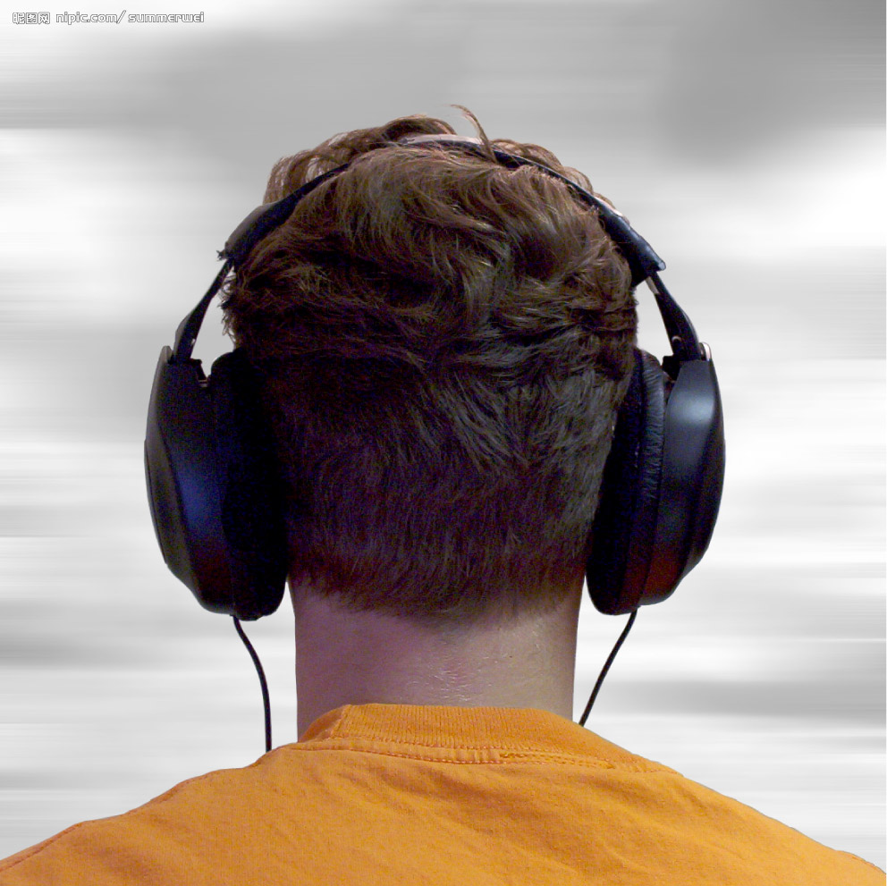

# ＜光棍节特稿＞当你遇见时，就表白吧

**许多的悲喜剧，无论是纸上的，还是世上的，今天你已看过。许多的邂逅，错过，无论是甜蜜的，还是怅惘的，昨天你也已经历。如今，当你再次和这个孤独的节日遭逢，自然又生出一种新的希望来，一种新的勇气在你胸中潜伏。你终于明白了，遇见是困难的，当你遇见时，就表白吧。**  

# 当你遇见时，就表白吧

## 文/ 张亮（北京大学）

 

一大早，你一个人走在学校里，或者地铁站，或者公车上，行色匆匆，满世界红男绿女，打情骂俏，谈笑风生，独你像一个白昼行走的游魂。

每个和你不期而遇遇见的人，笑容里仿佛都在说一句话：“今天是你的节日，我的朋友。”你条件反射把头缩回衣领里，在心里抗辩道：“是明天，明天”。

但明天总是会到来，一眨眼的功夫。

突然之间，你就剩下了。归根到底，都是自作孽，不可活。你的老子不是李刚，你没有貌似陈冠希，也没有才比周立波，这些都不是自作孽。真正自作孽，是你错过了许多。

你总是感慨自己无法遇见，但也许更重要的是遇见谁。每天，总有无数陌生人，流水般穿过指缝，匆匆来去，有的人只留下印迹，更多人渺无踪迹，像渗入流沙的水。每天，在别人的生活里，我们也许不过是窗外转瞬即逝的鸟影。林子大了，什么鸟都有，却到底哪一只是你的期许？最难的不是遇见，而是遇见谁。

你所遇见的，恰好就是你相信的。也许，这才是最重要的。

这样看来，你早遇见了很多，却未曾相信过什么。你也许经历过混沌未开的时代，那时你放学回家，路遇某女同学，恰好是你心仪的对象。你们聊起电影，你对女主角“赞不绝口”，却不料那女生突然抛出来句“不咸不淡”的话：“原来你竟然也喜欢女人”。大学时，你一定暗恋过某个女生，人家跟也许跟你借过书看，你也没往里夹张小纸条，更没有模仿《此间的少年》三天两头去讨论郭靖跟黄蓉的爱情，只忙着打游戏，看书，早把这从天而降的桃花运扔到太平洋里。不懂装懂，你是自作孽，不可活。那时，你是太青涩了。

后来，你慢慢懂得一些，也遇见过许多人，经历过一些事。却往往不尽如人意。偶然的遭际，必然的别离，日复一日的在你疲惫的生活中重复。终于，你已习惯在希望与失望的轮回中泅渡。偶尔你会自责，是否太容易退却，偶尔你也会抱怨，老天爷为何如此吝惜，不过是牵一个寻常人的红线。更多时候你伤感，甚或是绝望，在一个社交网络铺天盖地的时代，你一个星期所认识的好友，也许比你老子一辈子还多，却为何，被更彻底的孤独与寂寞笼罩？你越来越怀疑这个网络的时代，怀疑它的真实性。世界，在你眼中更大，选择，在你手里更多，但是通往幸福的路，却似乎更加不可言说。

细细想来，你其实是一个普通人，跟世界上所有渴望平凡幸福的人一样，你从来不曾对着星空思念过嫦娥姐姐，也从不怀念跟卓文君这样的富二代有一腿，你不过要一个看着顺眼，求其放心的女子。朋友们却往往调侃，这年头，文艺青年二逼青年二代青年满街走，唯独“求其放心”者，是濒危动物。某一天，你突然看到一张八戒的脸，你逃之夭夭，一转眼却又变成了观世音姐姐，你没来得及后悔，突然又蹦出来长袖善舞的天仙妹妹，眉来眼去，你屁颠屁颠儿凑过去，刚要想要个签名，却一转眼变成春光灿烂猪八戒。你于是感叹，一切坚固的东西都消散了，“不靠谱”成了你的口头禅。

然而你依旧顽固不化，“眼高于顶”。你既想人懂你，又要人温柔体贴，看的顺眼，还得守住底线，在这官富二代横行，小三劈腿成瘾的世界里做个女版柳下惠，完全就是找抽。即便你幸而找到了这样的女子，却也未必如愿，一不小心就是你在北京，人在巴黎，鞭长莫及，辗转反侧，一天睡不安稳。

虽然往事并不如烟，你依旧还有些勇气。年轻时候，你看过一部法国的浪漫电影《大鼻子情圣》，你曾为那个才华横溢的大鼻子情圣泪下，他把一辈子的暗恋埋藏心底，临死，才把遗书当做情书，在自己心爱的人面前诵读。当深情激越的朗诵终渐平静，只剩下爱人怀抱里缓慢冷却的尸体，你颇为感动，今天，却倍感凄凉，若是当他刚遇见时，就勇敢的捧出内心，形诸笔墨，诉诸言辞，何必在临死时写下如此凄凉的绝笔，留给看客玩味？

许多的悲喜剧，无论是纸上的，还是世上的，今天你已看过。许多的邂逅，错过，无论是甜蜜的，还是怅惘的，昨天你也已经历。如今，当你再次和这个孤独的节日遭逢，自然又生出一种新的希望来，一种新的勇气在你胸中潜伏。你终于明白了，遇见是困难的，当你遇见时，就表白吧。

“这世上总有一个特别的人，就躲藏在世界的某个角落。也许，她也在想，这世界上必然还有这么个人，就在世界的另一边等着你.”

有一个瞬间，你就这么在清冷的初冬里自言自语着些烂俗的句子，竟突然觉得，自己不再那么孤独了。

 

（采编：陈锴；责编：陈锴）

