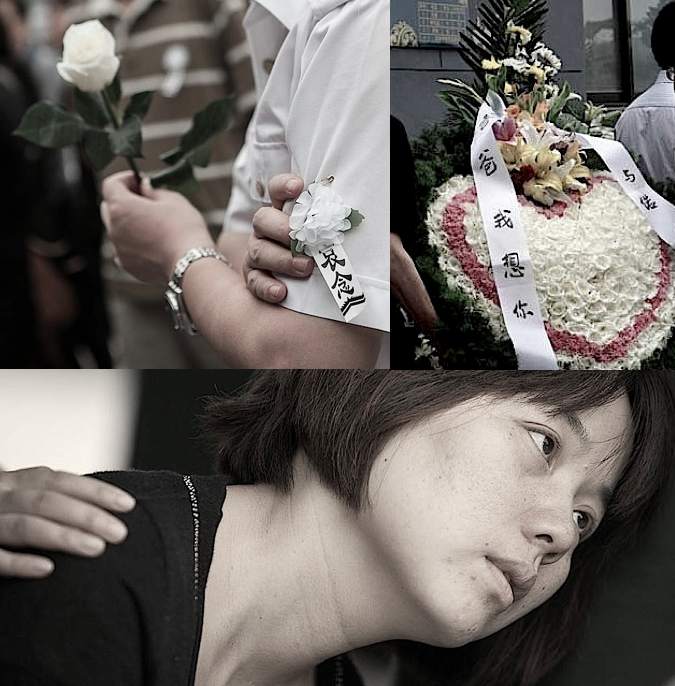
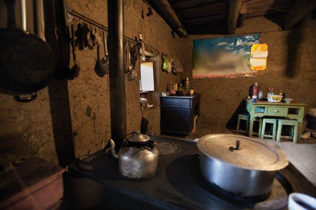
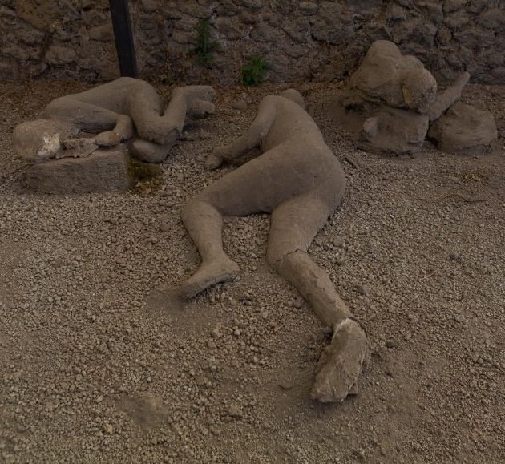
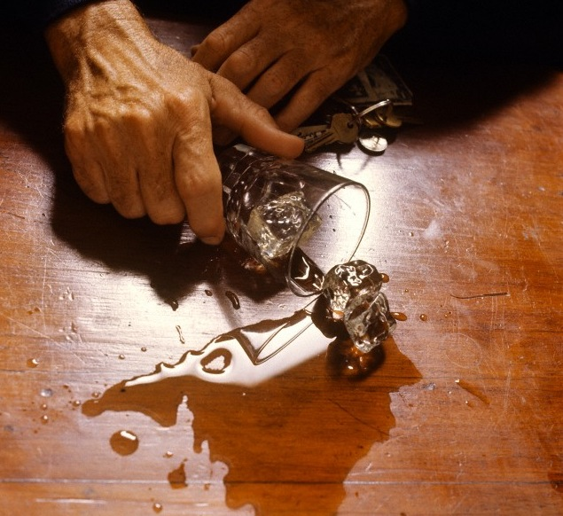
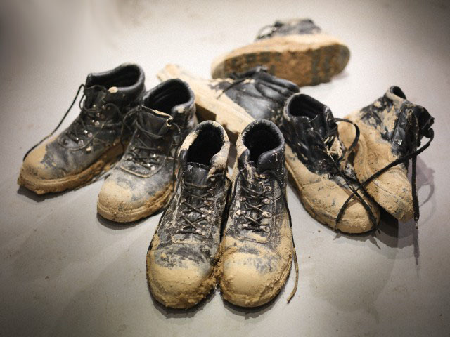
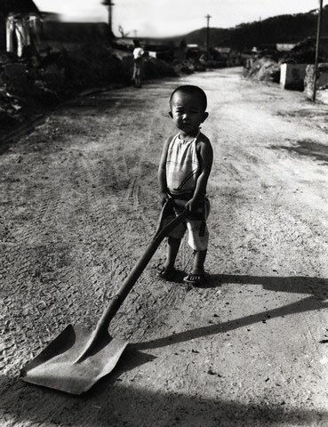

# ＜北京7.21雨灾专题特稿＞你的名字 你的故事

**七个记者，在北京跑了超过2000公里，加急采访了24名死难者家属。《南方周末》未能发表的文章：《你的名字你的故事》，25位死者，25段或轻或重的往事。** 

（图/网易）

 

# 你的名字 你的故事

## 曾鸣 张育群 周华蕾 朝格图 赵蕾 陈鸣（南方周末记者）/ 谢雪 张博岚 童丽丽 孔令钰 粱建强 罗亦龙 林珊瑜 赵一（南方周末实习生）

 

**广渠门桥下**

**（1）丁志健 （1978.11.21-2012.7.21）**

33岁的幼儿杂志《阿阿熊》编辑部主任丁志健在网友3个多小时的微博直播中死去。7月21日19点40分，做完菜等丈夫回家吃饭的妻子邱艳接到他的求救电话，他说，在车里挣扎了很久， 打不开车门，呼吸很困难了。20点，邱艳接到最后一个求救电话，挂掉电话后就拿着榔头往外跑。半个小时后，邱艳赶到己是一片汪洋的广渠门桥。她哀求消防员下水救人。22点后，一位带星带杠的官员到场下了指令。医院检验报告显示，丁志健为溺水而亡，手和头骨皆有挫伤。

十几天前，丁志健刚刚升任杂志社所在的龙门书局一分社社长 。因为身材瘦小且性格活泼，他的朋友经常喊他为“丁丁”。16岁时，他就从江苏常州来到北京，上学、工作 、恋爱、结婚、生子。这个外地的奋斗青年无疑是幸运的：2009年，他有了女儿秋秋；去年，他把60平米的一居室换了东四环外80平米的房子，今年又换了这辆北京现代途胜越野车。他拥有许多人梦寐以求的北京市户口。

他的死引发了舆论对城市基础设施建设和救援的及思。许多人还拿起各种工具敲打车窗。不少人感慨生命等不起，而人们自救常识却如此匮乏。

**从没住过带厕所的房子**

**（2）骆金 （1994.10.14-2012.7.21）**

1994年出生的骆金本有个孪生兄弟，只活了7天就不幸夭折。父亲骆校富给剩下的这个孩子取名为“京”，以纪念他在首都出生。后来他觉得，“京”字太大，怕不好养，又改成了“金 ”。

7月5日，骆金随一位老乡踏上北上列车，站了15多个小时到达北京。骆金出生不久就被送回安徽农村老家。他一生中来过三次北京。“在家里面他一个电话一个电话地打，要我回家接他过来。”骆校富说，和父母在一起，孩子很开心。

在北京的大部分时候，骆金窝在朝阳区东风乡辛庄村12平米的出租平房里看电视，或者去附近的大排档打工，帮忙烤羊肉串。

7月21日晚上7点半，在家里看了一天电视的骆金撑伞去上厕所时，桥面己隐没在雨水中。晚上8点以后，骆校富炒好了一个小白莱和咸菜炒鸡蛋，遍寻儿子不着，打电话提示己关机。7月22日凌晨1点46分，他打了110，去派出所登记的时候，他还想着：儿子可能是去网吧了？

第二天早上七点，积水退去，邻居们先是在屋外的小桥上看见了骆金的拖鞋，接着在河沟里看见了毁坏的雨伞，和陷在一米深淤泥里的尸体。

骆校富想过要让儿子“在大城市见见世面”，他带儿子去过最远的地方是离家900米的朝阳公园。他在这座城市走街串巷维修高压锅，打拼快27年了，从来没有住过带厕所的房子。他说， 儿子可能就是在上厕所途中一脚踩空，跌入了河中。一位老乡叹息：要是这边有个护栏，就没事了。

骆金身后留下了一只从老家带来的挎包，一双耐克的高仿鞋。 鞋是父亲花60块钱给他在地摊上买的，用来打工的时候穿。2011年，骆金曾利用暑假在北京打工一个半月，帮忙烤羊肉串，赚了一千五百块钱。他给自己买了一个一百多块钱的手机，给哥哥骆林买了副墨镜，剩下的钱都给了父亲。

骆林得知弟弟身亡后第二天就从合肥赶了过来。他右手捂着眼睛，眼泪从指缝中流下来。他说弟弟内向、懂事，平时会偷偷攒钱，在父母生日时，给他们送打火机和发卡之类的小礼物。

**一口有节律的钟**

**（3）段宝林（42岁）**

过去5年里，段宝林的人生是一口有节律的钟。总是深蓝色的工作服，总是每天走一段从大郊亭沃尔玛到观音堂村居民区的路，骑着自行车，上班、下班，主题：赚钱、养家。

这并不是一个表情生动的男人，他可以是沃尔玛员工人堆中任意的一个。共事多年，除了果蔬柜同事“工作认真、待人和气”这种可以扣在大多数善良百姓身上的评语，别人几乎想不起他。

在家里，他却是不可替代的顶粱柱。买不起房子，段宝林还和老去的爹妈同住，加一个上初中的女儿。他是举家唯一的壮年劳动力。段家住一条历史己逾半世纪的老式胡同里，据说屋前马路曾是能“跑130汽车”的，因为一再增筑，空间被反复倾轧，现在仅能容两人并肩通过。

7月21日夜，这口钟在原本驾轻就熟的回家路上意外停摆。己经离家不到一公里，华能铁路挢下那片低洼地带，距离水平线两米多。段宝林试图一个猛子冲过大水坑，却连人带车无可逆转地陷落，努力挣扎，失败。他的尸体在翌日清晨被迅速识别，因为那身深蓝色工作服。

离开段宝林的小家庭塌了，成为家族的附庸。家族在段宝林去世后迅速组成委员会，在媒体工作的岳培成为话事人，和沃尔玛展开了赔偿谈判；家族因为“老太太接受了北京某报紙的采访”吵得不可开交；在谈判遇到困难之前，家族不愿意让更多人还原生前的段宝林，惹出事端。

于是死去的段宝林以这样一种方式接着走完归家的钟摆轨迹。也许这最后猛的一叩响，是他仅剩的一次让家人过得更好的机会。

**没有故事的人生**

** （4）张开相（63岁）**

** （5）张景旺（40岁）**

一阵电闪雷鸣过后，天空瞬间拉黑，瓦片、树枝、彩钢板碎片漫天飞舞。2012年7月21日下午1点40分，通州张家湾枣林庄村，十几秒时间，龙卷风扫平了几十间房子。

张开相、张景旺兄弟被压死在枣林庄北口一间在建的彩钢板房屋内。今年6月麦收之后，俩兄弟刚从山东菏泽老家赶来。今年春节过后，他们第一次来到这个村子打工，修房子。

一位工友说，黑风掠过，还没回过神来，仓库己经全部坍塌，张家两兄弟被压在一扇门下，当时就一动不动了。他们的妻子己经第一时间赶到了村里，除了这些，厂里的工友什么也说不上来什么了，他们都对这两兄弟的家庭一无所知。

**唯一的遗产**

** （6）郭瑞海 （1967.12.27-2012.7.21）**

熟人最后一次看到老光棍郭瑞海，是在2012年7月19日上午10点。他自己看守的荒废的建筑工地，步行200米到通州枣林庄村口的超市，买了8块钱菜和6块钱馒头，离开的时候他踉老板娘说，继续挂我账上。

50多个小时后，郭海瑞被发现死在了建筑工地的铁门内侧，这是当天枣林庄村因龙卷风死去的第三个人。对于他的死因，旁边洗车房的人认为他是被龙卷风甩到铁门上砸中头部而死。村干部的“官方说法”是，老郭是因为龙卷风到来时想去关门，被雷电击中而死。

这名45岁的河北廊坊农民，四年前投靠嫁到枣林庄村的姐姐，在其姐夫承包的工地上看大门。去年姐姐一家搬去镇上，于是这个老实巴交的光棍更过着不与人往来、几乎与世隔绝的日子。这个异乡人留下的唯一遗产，是赊欠小卖部的2000块钱。

**忌讳提“死”字**

** （7）王静 （1979.12.6-2012.7.21)**

王静忌讳提“死”字，一定是去年那场暴雨把她困在办公室，实在恼了，才会一反内向温和的常态，在QQ空间上写道，“这下完蛋了”；今年这场更大的暴雨里，她如愿按时到了家，却真的淹死家中——一处租来的地下室中。

她前半生的家在山东省聊城王架村。1979年父母诞下第二个女婴，给了她这么个亳无识别特征的名字，而后接着生，直到第四胎终于是男孩。后半生她来到北京南城半台区五里店小区，大多数时间，她陪丈夫滕长峰开一个饮用水店。即便后来她生完小孩，改行卖刀削面、再去一个影印公司当了搞宣传的合同工，小区人仍不知道她姓甚名谁，只管她叫“水店那女的”。王静没下过地，不愿回到农村，她总想北京机会更多。据说她大眼睛，爱穿裙子，看上去年轻漂亮。她在缓慢由农村向城市进化，唯一没有发生质变的是生活，2006年儿子滕天宇出生，为了省钱，一家人搬进地下室。他们想攒点钱就搬出去，但一住就是六年。王静一直纠结的是，也许地下室的瘴气让孩子患上一种浑身小红点的皮肤病，只能把孩子送回老家。丈夫后来搬去了别处的单位宿舍。她继续地下室生涯，每天下班回家把两道门关死，鲜与人来往。

所以2012年7月21日这场暴雨中，她没有听到门外嘈杂的逃命声。原本不以为意的雨水竟然灌进屋里，直到过人高。王静不会水，扶着墙想要回到地面。尚不能确定，究竟是长达3个小时污水的浸泡，还是过道上那个漏电的电表箱，成为杀死她的罪魁祸首。最终她像一片树叶漂浮起来，命断自家门前的过道上。

**庆生**

** （8）王姣姣 （1990.5.26-2012.7.21）**

朋友把王姣姣23岁的庆生安排在7月21日。那天他们一起去朝阳区蓝调庄园看薰衣草。王姣姣爱笑，喜欢看美好的东西。原本她的生日是7月14日，但这一天她太忙了。

这个山西闻喜县农村出来的职高生一直都很忙。6年前夏天穿着一双拖鞋来到北京，一开始不适应大城市，给妈妈打电话的时候一直哭。她自学过计算机，换过很多份工，直到来到现在她喜欢的朝阳区这个餐馆。从服务员干起，一直干到她比较喜欢的财务，工资从600涨到了4000多。

老板眼里的王姣姣是一个踏实的孩子：“在店里人缘好，一个好朋友还给她买过一张回老家的机票”。

王姣姣极少买衣服。上次离开老家之前，火车还有半个小时就要开动，她拣最便宜的地方去买了一个T恤和一个裤子。她对小姨宋文秀抱怨说，北京的衣服太贵了。

而当表妹来北京时，王姣姣带着她去逛故宫长城颐和园。她送手机给自己的哥哥。回老家的时候，给父亲王景全做了个狮子球，上面写着“家和万事兴”。她自己酝酿的最大开销是，攒钱做一个近视眼手术。

那个吞噬了她的臭水沟，连同周边的道路己经被挖得面目全非。从老家赶来的亲人们只能昕人描述：朝阳区金盏乡，暴雨，三岔路口，没有防护栏的水沟。王姣姣的朋友走在她的斜前方。王姣姣叫了一声，扯住朋友的手，旁边有个小女孩，也突然拽着这个朋友的手——三人一起滑入污水，只有王姣姣没有生还。她在朋友的面前离开人世。她的遗物是一个沾满了泥污的随身包。

不久前她给妈妈打电话，兴奋地说自己的会计证己经考下来了，但证儿还没有发下来。王姣姣一直想让父母来北京转一转。

**我抱着树呢，你别过来**

** （9）王建生（30岁）**

做饲料生意的村民王建生是家人和乡亲们刨出来的。尸体被找到那一刻，他的弟弟王建学锤地长泣——房山区韩村河镇的东南章村的寻亲视频，成为灾后最震撼人心的画面。

7月21日晚上十点，王建生开车回到村口时受困。

最初到达现场的是王建学和他的父亲。夜里十点半，洪水肆虐之际，两人大声嘶喊他的名字。一个声音在子夜时分传过来，“我抱着树呢！你千万别过来！”再次一片沉寂。

几十个乡亲们在午夜后赶到。手电光沿着河道两岸摸索，不放过每一株草木。王建学嘶吼整夜，赤手刨石不止。

12个小时之后，河北的三位会水的亲戚赶到，跳入水中。岸上，乡亲们持续搜寻。接近两天的时间里发现了几具尸体，但不是王建生。

40个小时之后，王建学他对着树林水泽嘶吼：“王建生，你出来！妈和嫂子在等着你呢……”他的噪子再次嘶哑。

又一个半小时，仿佛所有的嘶吼都被听到了，在王建学低头点烟的时刻，他看到水面上漂浮着一个人。不知道谁喊了一噪子，“王建生，回家啦！”众人随之高声重复。——这真的是王建生。（据京华时报〉

**世界上最爱我的男人走了**

** （10）侯万林 （1963.2.25-2012.7.21）**

侯万林生前每天都会去钓鱼。在父亲尸体获寻后，女儿侯帅在微博上撰写讣闻称：“都说女儿是爸爸上辈子的情人，世界上最爱我的男人走了，可我还没让他过上好日子。”

49岁的侯万林是原石景山林业局退休职工。7月21日晚在驾车回家途中遇难。

**在上班的第一天**

** （11）贾晓涵 （1993.1.5-2012.7.21）**

洪水袭来的那一刻，19岁的女孩贾晓涵大声提醒着妹妹：“抱紧树！” 7月21日下午5点多，贾晓涵和妹妹琪琪乘坐继母李玉杰开的菲亚特汽车回家。行至房山区石楼镇下坡子村时，洪水奔涌而来。急流中，李玉杰慌忙放下车窗，努力将后门推开了一个窄缝，将两个女儿托送到了车顶。贾晓涵见车尾有一棵树，忙攀住，然后高声提醒妹妹也抱紧树。下一个浊浪打来时，她被打落。

她的父亲贾东辉记得，女儿曾说过自己的梦想是成为一名优秀的幼儿教师。遇难前，贾晓涵是北京市高级经贸技术学校幼儿师范专业的学生，即将读大二。她喜爱音乐和舞蹈，暑假前还在学校组织的一次比赛中获得二等奖。

一天前，贾晓涵找到了一份暑期兼职。工作是接线员，商定的每月基本工资为1800元。当时她还笑着对继母李玉杰说，等领工资了给她钱用来买菜。7月21日，是她上班首日。

**梦想上电视**

** （12）王永慧 （1989.9.25-2012.7.21）**

在发小徐菲的记忆中，13岁的永慧站在教室门口，还只是个小姑娘，“真是好看”。那时王永惠开始学习舞蹈，念过山东莱阳爱华艺校、烟台艺校，18岁时，独自一人来到北京闯荡。

一个人在北京打拼的永慧时常责备自己不够争气不够好。她和朋友住在石景山八角游乐园地铁站附近，一间18平米左右的小平房里。2009年王永慧成为石景山奧德国际健身俱乐部的一个教练，教爵士舞、肚皮舞和街舞。

她始终没有放弃梦想。大部分业余时间，她还在跟一个老师练歌舞，录视频。那个老师说很看好1米65、外形靓丽的她，承诺想办法让她上回电视。而王永慧最大的愿望，是登上中央电视台星光大道的舞台。

王永慧的父母在莱阳老家经营着一家很有名的饭店，但“从来不因家庭条件好而耍脾气”。徐菲说，她有些孩子气，总是开心，时常问出类似“姐姐你今年24岁属兔的，你明年25岁属什么？”的傻问题。看到周围的人不高兴，皱眉头，她会一个劲儿地问怎么回事。

7月19日，王永慧去影楼拍了一组写真照。第二天她把当天自拍的照片发给了徐菲。两人彼此约定有空再拍。

7月21日晚上9点。饭后回家的路上，王永慧经过石景山区古城大街憨豆面馆门口一个施工处。围栏很矮，内有深坑。同行的朋友先被绳子绊住摔了下去，接着王永慧也掉了进去。爱美的王永慧那天穿着徐菲送给她的黑白条纹连衣裙，眼睛半睁着，还带着黑色的美瞳。她再也没有醒来。

**班长**

** （13）郑冬洁 （1984.11.19-2012.7.21）**

7月24号，郑冬洁的孩子将过满岁生日。她性格温婉，尤其顾家，与丈夫结婚不足两年，生活和睦。

同事记忆中里这位新华人寿保险客服电话中心的班长，稳重，严于律己。作为客服的班长，她有时候更像是在管理自己，而不是在管理他人。

她重情义。一次旧同事回原单位探访，郑冬洁为了叙旧，下班后特意在单位等候近两小时。而郑冬洁平常回家单程，就需要两个小时。

她喜欢看书，尤其喜欢看名人传记和励志读物，比如李开复。这或许是她一贯积极进取的动力所在。21日晚上，郑冬洁踉所有人失去了联系：22日，遇难消息传来。至今，同事们仍不知道在她生命的最后一刻发生了些什么。

**从没看过天气预报**

** （14）张恩（5岁)**

张恩的父亲张晓东（音）和母亲张艳艳（音）在北京娄子水村一个石板厂打工。他还有两个妹妹，三个孩子平常都留在河南老家。这一次是因为父母过于想念，把儿子接来北京玩。他们平常住的地方就在石板厂里，没有电视机，从没看过天气预报。

据张晓东的工友朱先贺说，石板厂所在的地方地势低洼，一下大雨就会淹水。事发当天，石板厂老板在下午5点多钟的时候来过一趟石板厂，当时雨势还不是很大，所以老板并没有让他们转移。等到后来洪水冲开了厂房的大门，眼瞅着水位就往上涨的时候，他们才慌了。

大人们背着孩子，手挽手自发往外转移。母亲张艳艳无法站立，被卷入水中，张恩也摔入浊流。这一次跌倒成了母子的诀别。

**结婚七年，浪漫了一回**

** （15）石珊珊 （1982.6.30-2012.7.21）**

石珊珊初中毕业后，在一家屠宰加工厂找到了第一份工作，认识了从中技毕业的同事刘小松。相识五年，结婚七年，十二年里，这对韩村河镇西南章村的夫妇从未一起去过电影院，只是在2003年下雪天时在陶然亭公园雪中漫步，“浪漫了一回”。但她很知足。她喜欢购物，玩连连看、钻石迷情三和偷菜，喜欢吃京酱肉丝、糖醋里脊、炸臭豆腐、麻辣烫，还有丈夫烤的鸡翅。每逢节假日，丈夫就会亲自下厨，他说，“她每次都能吃20个，还不算其他的”。夫妇俩最大的快乐是带着孩子逛衔。夫妻俩本商量好了，等闺女再大点再照一次婚纱照。这不可能再实现。7月21日晚，从药厂下班的路上，石珊珊被水流冲走。

**在母亲的怀中**

** （16）曹付湘（30岁）**

** （17）贾静雅（8个月）**

30岁的河南人曹付湘几年前和家人一道来京，在房山区青龙湖镇常乐寺村租住，和姐姐一起在村里的家具厂打工。7月21日的暴雨引发了山洪，冲垮了村子东面河岸小院的围墙。8个月大的贾静雅正在妈妈曹付湘的怀中。母女被湍急的洪水吞噬，消失在了牤牛河一条支流中。贾静雅有一个双胞胎姐姐，当时在其大姨怀中，幸免于难，只是有些发烧。

**生意好起来了**

** （18）田丽娟 （1971.7.25-2012.7.21）**

** （19）刘晓卫 （1972.1.11-2012.7.21）**

田丽娟开的雅芳专卖店有两三年了。资金有限，她选择石景山赵山小区一个简易的房子当店面，后面靠着山，一下雨就漏水。这个店凝聚了她所有的心血，最先开始生意不好，因为小区里中年人居多，这两年比较好了。

7月21日，夫妇冒雨到店里，因为好多产品和衣服在那边。他们正在里屋扫水，一下子泥石流冲破墙，一面墙就塌了，把他们埋在下面。

夫妇都是北京石景山本地人。上周，因为拆迁，他们刚刚搬到回迁的新居。新房没下来的时候，夫妻俩还会带孩子住在店里，万幸地是那天没带孩子去。独生女今年6岁，7月份刚上学前班，一直在学舞蹈。田丽娟盼着她明年上小学的时候能上一个心仪的学校。

一个育儿妈妈的论坛里，田丽娟的朋友们无法接受她的死讯。大家一起团购东西，都放她店里，她从未不耐烦过。

**本想和孩子们同住**

** （20）李玉书（88岁）**

7月21日晚，家住房山区霞云岭乡庄户台村鱼骨寺的李玉书和老伴郑修彬一道被泥石流卷向了河沟，李老太太不幸遇雉，其遗体于22日凌晨4时在乱石堆下被找到，郑老汉则于21日23时被众人从石堆中救出。老太太本来和孩子们约定，中秋之后就和老伴儿“出山”，去和孩子们同住。〈据新京报〉

**“最大的收获是知足”**

** （21）李方洪（45岁）**

2012年7月21日19时20分许，北京市公安局燕山分局向阳路派出所所长李方洪在参加保卫、抢救被暴雨和山洪烕胁的燕山向阳凤凰亭村居民的生命财产时，被一根带电电线杆斜拉钢索击倒，年仅45岁。

当日在李方洪组织疏散救援之下，63名被困村民获救，全村百余村民无一伤亡。

李方洪1984年参加公安工作，一直在燕山地区刑侦、巡察、派出所等基层一线岗位工作，因成绩突出，他先后荣立个人三等功3次，个人嘉奖8次。

在去年第一党支部会议上，他说：“27年的工作生活经历可以说是酸甜苦辣，但总的感觉是过的充实、自信，最大的收获是知足。”

北京市委书记郭金龙、市委副书记王安顺、吉林通过市公安局，在第一时间对李方洪家属表示慰问，公安部政治部发来唁电表示沉痛哀悼。

李方洪的儿子去年刚考入山西医科大学就读，李方洪牺牲后，他在人人网上的状态栏写道：“老爸，一路走好，我为你骄傲，家里您放心，儿子扛得住。”

**未能迎来的40岁生日**

** （22）高大辉 （1972.8.15-2012.7. 21）**

1992年，高大辉在苏州城建环保学院读大二，认识了当时的师妹孙爱华。四年后，两人携手走入婚姻。当时家庭拮据，连婚礼都没有操办，“那时觉得形式并不重要，最重要的是恩爱一生”孙爱华说。

毕业后两个人都进入房山区政府工作，高大辉在去年8月当上了韩河村镇的副镇长，孙爱华则在区环保局工作。

高大辉的身体不是很好，血压高，孙爱华需要每天早上催他吃药。每天回到家里，高大辉总会说“很累”，有很多次孙爱华饭后洗碗回来，发现高大辉己经在沙发上睡着了。

高大辉的儿子今年11岁，即将读小学六年级，由于父母工作繁忙，平日寄宿在学校。孙爱华印象最深的场景，是一家人聚在一起吃饭的日子，谈天说地，其乐融融。

7月21日，在赶往房山区七贤村指挥抢险的路上，高大辉被洪水围困在车中。21时15分，他在车中向韩村河镇防汛指挥部拨通最后一个电话，此时车中己严重进水。此后，他的电话再也没有拨通过，直到7月22日14时被发现躺在车上。

当日，在东周各庄村，高大辉指挥了众多村民撤离。村民张桂涛在接受记者采访时介绍，13名村民踩着高大辉的肩膀，翻过围墙转移到高处。

高大辉遇雉时，孙爱华正在新疆出差。夫妇二人所在的两个单位商量后，以工作理由让孙爱华提前回京，下飞机后才得知高大辉死讯。

高大辉喜欢旅游，但很少能有时间去。一年前去云南的工作考查是高大辉最后一次出远门。当时高大辉给自己买里一个链子，很是喜欢，就在孙爱华前往新疆出差前不久，高大辉还嘱咐帮他找出来。如今，链子找到了，他却再也没法戴了。

即将来临的八月，对高大辉而言是一个特殊的月份。去年八月，他升任副镇长；今年8月15日，是他未能迎来的40岁生日。

**与死神的两次交道**

** （23）李建民(46岁）**

到大城子镇当镇长不到两年，李建民就与死神打过两次交道。2011年，7月24日，一场百年一遇的暴雨，李建民下村察看转移情况，经过一座小桥时，差点就让洪水要了命。2012年7月21 日，又是一场百年一遇的暴雨，晚上8点左右，密云县雨量增大，李建民向县里汇报完情况，走出会议室时突然晕倒。11点26 分，李建民在县医院急诊室去世。医生确认的死因是，心肌梗塞，猝死。

终年46岁的李建民生于密云，曾在县棉纱厂、富帛实业股份有限公司任过职，当过县发改委的副主任。他一生中大多时候的工作，都不需要直接面对暴雨、冰雹、地震这类来自大自然的危险。生命的最后两年，上天把他安排到山区里，把这些都尝了个遍。

大城子镇，人口一万七，在伟大首都北京的边上，车子一溜烟就会错过，晃过神来己经是河北的地界。它所在的密云县，是北京这个特大缺水城市的生命线。密云的两大河流洪门川河和清水河流经全镇，清水河直接流入密云水库。雨大的时候，河水会溢出河堤冲上街道，没及岸边的民宅。

去年受灾最重的粱峪村，水从村口的排水渠中诵入，来势汹诵，村中很快变成了一片海。当时，大量雨水汇集在村边的高速路上，从排水管道内直接流入排水渠中，排水渠因涵洞过小，被杂物堵形成“堰塞湖”。加之排水渠地势高于村庄，堰塞湖水直接从高处冲入村内。

大城子镇党委副书记刘继雄说，这些问题都己经解决好。今年降雨量比去年多了十几毫米，但初步统计的损失还是小得多。有报道记录了抢救李建民时面临的艰难：“大雨阻挡了一切，卫生所距离镇政府仅仅500米，但路面积了快1米的水，营救人员带着医疗器械，只能绕山路；县医院的救护车在布满雨水的山路只能缓慢行进。”

7月21日下午4点，李建民来到南沟村交代工作时，村民韩淑凤觉出了一点异样：“那天他说话语气很沉，好像特别不放心。”

李建民爱好书法、唱歌。刚到镇上时，他请书法协会的朋友写了牌匾“中囯红肖梨第一镇”，挂在镇机关的食堂。镇宣传委员秦秀芳两次听过他唱歌，唱的是同一首歌《国家》。

亲友的追忆中，刘继雄的一番话最令人心酸：“环境治理、防汛建设，李镇长从来没含糊，每次都说先解决隐患，钱的事他来想办法。”

**喜欢“拔尖儿”**

** （24）郭云峰 （1983.11.27-2012.7.22)**

年仅29岁的长阳供水厂抢险队队长郭云峰，是在暴雨过后的第二天遇难的。在7月21日的暴雨中，为了阻止雨水滲漏造成电器、设备短路，影晌正常供水，郭云峰在水厂己值守了一夜。

7月22日上午，暴雨后的房山良乡地区供水告急，30万人面临断水。北京市水务局的文章说，救援人员个个自告奋勇，但郭云峰说，“我是队长，我来！”郭云峰挽起裤管下到阀门井内，再也没能上来。因缺氧而昏迷的他送医不治。

2008年2月郭云峰就职于长阳第二供水厂任供水技术员，至今己四年有余，是水厂的主要技术骨干。

郭云峰喜欢踢足球。他的发小田野，5岁时就与他相识，他回忆说无论体育还是学习，郭云峰从小就爱争第一，“用北京话来说，就是喜欢‘拔尖儿’ ”。

今年9月，郭云峰的女儿就将满三岁了。郭云峰的父亲也在供水厂工作，母亲是一名司机。田野致电其父，其父无语凝噎，最后吐出来三个字：“人没了”。

**推完最后一铲土**

** （25）冷永成 （1954.7.9-2012. 7.21）**

冷永成所在的周口店镇新街村，降雨达400亳米。他惦记着村东头还有100来户居民。这位村委会千部一直没有撤离。他想用铲车垒起一座临时堤坝，挡住冲向村东头的水，为群众转移争取时间。当晚8点40分左右，他打来电话，“水太大了，坝刚垒到一半，可能要塌了”。干部们人轮番回拨，再也没打通。当晚9点，铲车司机带回确切的消息：冷永成指挥堆完最后一铲土后，准备爬出洪流登上高地上车撤离，结果被一股洪峰卷走。（据北京日报）

 

### 【编者注】

****本文原为南方周刊的稿件，后被撤。本站谨向该报社及所有参与采访撰写的记者致敬。

 

（采编：徐海星；责编：徐海星）

 
