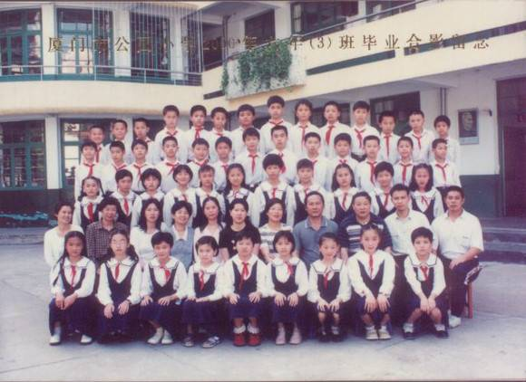

# ＜北斗人，北斗文＞ 某月某日蛋疼记

**确曾有数年不曾联系的小学好友不知如何得知了我在帝都的手机，时值奥运，他发来一条甚为真诚的短信：“如加啊，我真羡慕你能在我们伟大祖国的首都，参加这样的一场盛宴，一起见证祖国的繁荣与兴盛。这对国家而言，是无量的贡献啊。想一想吧，雄伟的天安门，万里长城，激动人心的奥运会，光是提到这些都令人兴奋不已。”** ** ** ** **

# 某月某日蛋疼记

## 文 / 迦南（北京）

是这么一回事。 那天晚上我早早地睡下，因为次日清晨要参加某见不得光的部门的笔试。在床上一直辗转到凌晨2点，不能寐，突然想起小学时中意的某女生。毕业之后再无伊的音讯，也未曾主动联系过。此时不知何故，格外想得到伊的消息。连我自己都倍感意外，这种冲动在过去的十年中不曾有过。 于是，穿衣，下床，开电脑。 虽然我每天都要骂好几遍校内傻逼，但我此时所能想到的最便捷的方法，却还是校内。 结果是令我意外的。伊的名字在我看来，是普通得不能再普通了，我甚至觉得这辈子可能还将遇到好几个叫这个名字的女人。但是，在校内上却连一个同名的人都没有。 显然，伊不同于我们这些蛋疼之辈，伊不用校内。 我并不甘心，于是求助百度，未果，求助人立方，未果。 还是谷歌好，终于使我获得了一个并无多大价值的信息——在我来帝都的那一年，伊去了一个我闻所未闻的学校的闻所未闻的专业。 这是我所能运用的现代科技带给我的，关于伊的全部消息。 仔细想来，那时的我是多么的令人发指啊。衣服上满是墨迹（小时候学书法的缘故），拖着条明晃晃的鼻涕，整日以作弄同桌的伊为乐。我还能记得某次一个喷嚏之后，一团屎黄色的鼻涕径直飞到我的左腿上（伊正是坐在我的左边），果冻般地颤动了一番，终于站稳了（很立体，很生动）。可怜的伊，直直地盯着我腿上的那团东西，那样子，俨然有一个天神降临在伊的面前。 相较之下，伊给我留下的印象是极好的。直至现在，在我眼中，女人总是无比善良，而伊则是这主观链条上的第一个环。那是一段怎样的时光呢？现在大概很难在脑中模拟了。在经历了诸多焦虑与不安之后，不太容易记起，在那一段任意妄为，无所顾忌，又总能得到伊原谅的日子里，我所感受到的那种舒适，究竟是什么样的呢。 想来颇为惭愧，我总自信于自己的忍耐力与度量，但恐怕现在的我亦不及那时的伊。只有我知道，那时的我是怎样的一个小恶魔。 不过，即便是恶魔，在那样的年纪，也不具备那样的勇气，让伊了解到我对伊的喜爱。我甚至不愿在心中承认伊是我所中意的。现在想来这很荒谬，但是想必诸位的心智都经历过这样的阶段，对越是中意的人越是故意表现得不屑。 十年似乎转瞬便过了，但这短短时光中，巨变无时不刻地发生着。确曾有数年不曾联系的小学好友不知如何得知了我在帝都的手机，时值奥运，他发来一条甚为真诚的短信：“如加啊，我真羡慕你能在我们伟大祖国的首都，参加这样的一场盛宴，一起见证祖国的繁荣与兴盛。这对国家而言，是无量的贡献啊。想一想吧，雄伟的天安门，万里长城，激动人心的奥运会，光是提到这些都令人兴奋不已。”当时我有些意外，因为我已许久不曾见到对这个国家尚怀如此真挚情感的人了。我该如何对他说？对他说帝都也不过如此？对他说我更喜欢那个东南海岛？对他说其实这个国家的种种并非他所想的那样，亦并非我所想的那样？最终只能模棱两可地回了句“嗯，是挺好的”。 那时我便想，若再见到小学与我一起洗厕所的兄弟们（没错，我们小学的厕所没有清洁员，是由学生们轮番洗净的），彼此间距离之大该使我们多么地惊异。而完全失去了音讯的伊，大概更是无法消弭这其中的沟壑。每次想起伊，总确信伊一定如那时一般，若再有交集，伊也能容忍现在这个奇形怪状的我。 但这样的臆想切不可牵扯进理性的因子，因为理性必会大声在我耳边吼道，吴先生，你在意淫，你在扯淡。 我想这便是老和尚手中的那串佛珠，其中某颗是我，某颗是伊，一条细线将诸多人串在一起，在单调的诵经声中挨着彼此。到了注定的那一日，这条细线断了，佛珠们噼里啪啦散落满地，滚向各处。有的滚至神圣的佛像之下，有的落至满是灰的香炉中，而究竟何者为佳，无人知晓。 有很大可能，伊已不记得我，若伊真如我所希望的那般一直宽容着，那么这个世界需要伊原谅和忍耐的人太多了。我想我的坏，还不足以让包容了种种恶行的伊记住。就如RPG游戏中，最能留给玩家印象的总是Boss级的魔王，而不是走迷宫时遇见的小杂兵。 无论记得与否，这文章是不希望伊看到的。 在不同的时光中忍耐了我的种种劣迹和蠢行的伊们….也不要看到的好。 幼儿园里因无节制吃糖而满嘴蛀牙的伊，小学里每日帮我记作业的伊，初中时干净地拒绝我第一次表白的伊，喜欢和我拌嘴打架的伊，因为傻事而与我断交的伊，为我织了围巾的伊，高中时致使我与别人大打出手的伊，情人节送我巧克力的伊，在电梯里侧身吻我的伊，大学时我单车后座上的伊，追问我何时娶她的伊….. 不知为何，在伊们一个个离开之后。我总愧疚于过往的恶行与粗心，大概也不会有可能致歉了（所谓的致歉本身或许对伊而言并无意义）。但我总希望，伊们不要记得那些不快的过往，纵然我是如此不堪，也总该给伊们留下过愉快的时光，记得那些时光就好。 就像我想起伊们时，总会不自觉地傻笑一样。伊们的善良之处也好，任性之处也罢，在回想中都显得异常可爱。  附记：那晚，在找伊的时候，偶然发现了我曾就读的小学有了自己的网站。更令我感动的是，那竟还存有我小学的毕业合照。虽然象素低得令人蛋疼，以至于我都无法辨认出哪个是我（这是真话，谁若能辨出我，劳驾告之一声），但还是一下就找到了伊。 编者按：时值新春佳节，北斗让辛苦忙碌了一年的编辑部同仁暂且休息一下。在初一至初七试推出《北斗人，北斗文》栏目，介绍北斗著名的撰稿人及其代表作。并给出一句话简介及作者人人网地址，方便读者关注交流。 作者简介：迦南，毕业于北京外国语学院，历任北斗常务总编，法务部总监 作者自述：吴如加，喜欢读书，更喜欢妹子 作者人人网地址：[http://www.renren.com/profile.do?id=276245886](http://www.renren.com/profile.do?id=276245886)
