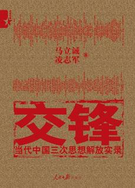

# ＜北斗荐书＞打左灯，向右行——读《交锋》

** **

据说在西方媒体上有这么一则政治笑话：布什、戈尔巴乔夫和邓小平各开一辆车，到了一十字路口，上面有两个路牌：东——社会主义，西——资本主义。布什连看都不看一拐就走西边去，戈尔巴乔夫到了，左想右想，犹豫了一会儿还是向西拐了。最后是邓小平，只见他手脚麻利地把两个牌子互换了一下，向着“社会主义”方向前进了。这个戏谑幽默的政治隐喻跟我们平常说的“打左灯，向右行”相差无几，把中国三十年来的改革转型描绘得栩栩如生。正如我们平常老百姓所说：“中国特色是个筐，不管啥都往里装。”这种“中国特色”便是由政府主导的计划经济到自由贸易主导的市场经济的转型所催生。即便改革已有三十年之久，但“左右”之争从未断绝，加之如今改革已进入“深水区”，争论更加激烈，改革则更是步履维艰。

英国历史学家科林伍德说：“一切历史都是思想史。”马立诚、凌志军的《交锋》通过历史思想，思考社会思潮的交锋给我们提供了一把理解这三十年的改革史的一把钥匙。本书记录了自1978年来的三次思想解放：第一次思想解放冲破了“个人崇拜”，第二次思想解放冲破了“计划经济崇拜”，第三次思想解放冲破了“所有制崇拜”。让我意外的是，本书的大胆言论，它突破以往禁忌，详细介绍了曾令京师震惊的四份“万言书”，甚至还提到了“魏京生”、“西单民主墙”、“九评”。这些敏感词以前也多多少少听说过，可是每当想进一步了解时，互联网上通常会出现“根据相关法律，搜索结果未予显示”或者“该页无法显示”。本书虽然无法详细展开，只是稍带一提却也让人欣喜不已。

本书的作者为右派人士，倾向性很强。本书书写三次思想解放的比例大约是2:1:3，第三次突破“公有制崇拜”占了重大比例，大概是想借古喻今，为推进改革摇旗呐喊。结束语更是旗帜鲜明地表达自己的态度——三次解放贯穿一条反“左”主线。这让不少左派人士大为恼怒，我在乌有之乡看过他们对此书的评论：什么“否定四项基本原则”、什么“反对社会主义，企图复辟资本主义”、什么“鼓吹私有化”。这种文革式的扣帽子让人厌恶，这种理屈词穷下的扣帽子做法让人颇为厌恶。不过该书作者也不乏刻薄之处，比如讲北大教授解万英自杀。身为左派的他在听到十四大把市场经济原则写入党的政治报告中，因而受到强烈刺激，觉得某种价值目标已幻灭，他在《求是》杂志上写下“社会主义必定胜利”（在传统观念中，社会主义是计划经济）后自杀。说实话，向来不怎么待见左派的我读到此是很震撼的，感动、敬佩、惋惜五味杂陈，很欣赏他为信仰献身的勇气，完全不忍心对他的固执己见进行指责。而作者此刻还不忘对“左”派批评一番：“打着姓‘社’姓‘资’的旗号拼命反对市场经济，亦是对解万英产生了一定的影响。‘左’倾思潮对此悲剧亦有一定责任。”看到这样的句子，让我产生“冰泉冷涩弦凝绝，凝绝不通声暂歇”之感，同时也感到改革进程中“左”和“右”交锋对撞的激烈。

这本倾向性很强的书出版于10年前，并大受知识阶层的欢迎，但即使10年过去了，书中作者期待的进一步改革依然很艰难，并不十分乐观。不同利益集团的博弈日趋尖锐，改革和反改革的力量频频交锋。改革遭到特殊利益集团、极左思潮和民粹主义的狙击，起起落落，似乎失去势头，社会各界都在紧张地思考改革的命运。

“左”派和“右”派都把改革中出现的社会问题诸如贫富差距加大、腐败加剧等等作为自己观点的佐证：左派说都是改革的错，自由派则说是改革不彻底的错。左倾势力要求回到过去，改革者则要求进一步深化改革，约束垄断势力，开展政治体制改革。以前看到一个说法非常有意思：“左派认为的问题是财富的不均等，右派认为的问题是权力的不均等。”两派都致力于建立一个公平公正的社会，不过左派让我很反感的是，他们利用民众的不满做文章，把问题都归结到改革头上，归结到市场经济头上，以此反对改革，煽动民粹主义。他们似乎忘了他们所向往那个时代的种种问题要比现今转型中大的多。邓小平曾在改革之初强调：“要警惕右，但主要是防止‘左’。”

前段时间，同学说起她经济学院的老师对改革开放深恶痛绝，指责改革开放导致了现在的贫富差距，社会主义变得面目全非。她的老师颇怀念毛时代人人拥有高尚的道德情操，不像现在人信仰缺失，变得物质势利。而我春节回去，遇见的一老高级知识分子也持相同看法，这让我颇为诧异。更有甚者，大“左派”邓力群竟被冠以“伟大的预言家”之名，（邓力群在1980年务虚会议上说：他说他梦到中国遍地是贪官，中国到处是妓女，性病，有钱人杀人，逍遥法外，穷人有苦无处诉。对此，后面有论述）。这些确实是当今中国社会在改革转型中出现的问题，这恰恰是改革不彻底的症结所在，绝不表明回到毛时代人民生活会更好！我没有想到，民间竟然也有不少人对已经实行三十年的改革开放仍抱有异议，因为在我看来，这只是一个很简单的问题，它至少解决了人生存最基本的问题——就是填饱肚子，在问题解决的基础上谈主义才成为可能，至少我自己是不想过着空着肚子大喊主义的日子，更不想生活在以阶级斗争为纲的你死我活中。这三十年的改革，人们从最初的解决温饱到现在向小康社会迈进，在一定程度上是享受到了经济改革的实惠，怎么反而因为当下转型出现的社会问题而否定改革呢？

本书主要讲述的是经济改革中“左右”两种思想斗争，以说明思想解放的势头是始终不渝的。而经济改革中出现的种种问题反而是因为改革的不彻底而造成的，其一就是政治体制的滞后，而不是“左”派所说的毛时代的大锅饭可以解决的。现今市场经济体制基本确立，而民主政治才刚刚破土。中国现在的很多问题如公民权利欠缺、权力缺乏有效制约、官员作威作福、老百姓有理没处讲、垄断企业通吃、经济增长模式迟迟无法转变等等，都与政治体制改革进展缓慢有关。温家宝在今年提出了政治体制改革，他说：“我认为改革是历史永恒的主题。政治体制改革与经济体制改革应该协调推进，政治体制改革是经济体制改革的保障。没有政治体制改革，经济体制改革不可能成功，已经取得的成果也有失去的危险。”并且他公开给予因“资产阶级自由化”而下台的胡耀邦以正面评价，可惜的是由于改革的艰难和所涉对象的敏感性，温家宝的讲话并未在国内媒体广泛刊登，虽然几近夭折，但公开的喊话至少在一定程度上为改革铺了路。与温家宝呼吁政治体制改革相对应的是薄熙来领导下“重庆模式”的崛起，但在网络上，你基本上不会搜索到关于此的半点负面评论。

以前关于改革的知识基本上都是来自纯官方，加之父辈的经历让我以为虽然有不少人对社会现实不满，但民间应该差不多都是拥护改革的。而我所受的中国教育模式也使我没对“改革”的真正涵义进行深究，只是知道最初改革的阻碍主要来自意识形态的禁锢及人思想的僵化。后来才知道改革进行的是如此困难艰辛，才知道原来“左右”之争在这三十年从未中断，直至今日也深深地影响着改革进程。但毕竟，较之以往，意识形态的禁锢已淡化不少，而各方利益博弈、利益纷争则成了影响改革进程的主要因素。在改革开放之初，真理标准大讨论的时候，更多的是思想观念的斗争、理论的斗争、意识形态的斗争。正如马立诚所说：“那时候是‘文章救国’。现在大家对文章的关注度下降了，更多关注自己的利益。”我觉得，这多多少少是一种进步。

### 推荐书籍（点击蓝色字体书目可下载）：

### [《交锋》](http://ishare.iask.sina.com.cn/f/14435740.html)

（来自投稿邮箱；责编：项栋梁）

