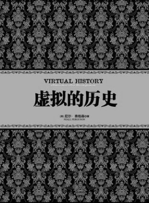

# ＜北斗荐书＞本期主题:当历史遇上量子物理学

**我们都很熟悉“蝴蝶效应”：“一只南美洲亚马逊河流域热带雨林中的蝴蝶，偶尔扇动几下翅膀，可以在两周以后引起美国德克萨斯州的一场龙卷风。”，那么当这个世界各个角落的无数只蝴蝶扇动翅膀，这个世界将会发生什么？更进一步，如果把人类历史某一刻存在的每个人比喻成一只只蝴蝶，他们进行着的行为比喻成蝴蝶翅膀的扇动，那么随之又会引发怎样的历史事件？也许正是意识到在“混沌理论”应用于人类世界的不可预测性，才有了卡尔·波普尔的《历史决定论的贫困》，如果我没有猜错，尼尔·费格森们敢于虚拟历史，并且结集为《虚拟的历史》正是因为卡尔·波普尔为其提供了坚实的理论基础。 ** 

# 本期主题:当历史遇上量子物理学

## 荐书人 / 瘦竹（北斗撰稿人）

 

我们都很熟悉“蝴蝶效应”：“一只南美洲亚马逊河流域热带雨林中的蝴蝶，偶尔扇动几下翅膀，可以在两周以后引起美国德克萨斯州的一场龙卷风。”，那么当这个世界各个角落的无数只蝴蝶扇动翅膀，这个世界将会发生什么？更进一步，如果把人类历史某一刻存在的每个人比喻成一只只蝴蝶，他们进行着的行为比喻成蝴蝶翅膀的扇动，那么随之又会引发怎样的历史事件？也许正是意识到在“混沌理论”应用于人类世界的不可预测性，才有了卡尔•波普尔的《历史决定论的贫困》，如果我没有猜错，尼尔•费格森们敢于虚拟历史，并且结集为《虚拟的历史》正是因为卡尔•波普尔为其提供了坚实的理论基础。

《虚拟的历史》中提到的重大的历史事件，有些我们相对熟悉，有些不熟悉，为了便于理解尼尔•费格森所称的“反事实设想”我们不妨先举个我们熟悉的历史的事件：

“如果亨利八世没有爱上安妮•博林，那就不会产生现在的美国，这听上去颇为合理。因为正是这场恋爱使得英国与罗马教廷决裂，不承认其将美洲赐予西班牙和葡萄牙的做法。而如果英国保持天主教国家的性质，美国很可能到现在还是西属美国的一部分。”（罗素《自由与组织》）

这就是典型的“反事实设想”，正如尼尔•费格森所定义的：“我们要进行的反事实设想不能只是幻想，而应该是以混乱世界中合理可能性的估测为基础对过去进行的模拟设想（也就是‘虚拟历史’的由来）。”

《虚拟的历史》三十多万字，尼尔•费格森的导言《虚拟的历史：有关过去的一种“混沌”理论》就差不多有十万言之巨，在导言里，尼尔•费格森除了在自己的老本行历史里随意穿行，对其他理论及著作的熟悉也无不让人惊叹，比如他熟悉黑格尔、马克思，他熟悉托尔斯泰、陀思妥耶夫斯基、博尔赫斯，除了人文领域，自然科学领域他也并不陌生，他知道“混沌”理论、知道“熵”，知道量子力学，那么他知道这些对于他又有什么用呢？你可问对了，别的不说，博尔赫斯的名篇《小径分岔的花园》其实想说的是“时间永远不停地在分岔，指向无数个未来。”，也就是说历史有无数种可能性，并且是同时存在的。而量子力说最著名的原理就是测不准原理，熟悉卡尔•波普尔身世的人自然知道他的《历史决定论的贫困》与现代科学特别是现代物理学的渊源。

尼尔•费格森引用他们的动机，他自己所说的再清楚不过：“如果这一代历史学家能像关注社会学、人类学与文学理论那样关注数学、物理学乃至古生物学，这本书或许10年前就出现了。”、“历史将成为一个不同科学学科的一个混合物，从气象学到法理学，每一种学科都会发挥自己的作用，而理想的历史学家将是一个全才。”至于为什么要“虚拟”历史，进行“反事实设想”他终于可以说清了：“如果一切历史都是（有可记载的）思想的历史，我们自然应该对人们曾思考过的一切可能的结果给予同等的重视，如果历史学家根据实际发生的那个结果抹杀了人们认为合理的其他的结果，他就别指望能‘真实地”再现过去，因为仅仅考虑已经实现的可能性实际上犯了最基本的目的论的错误。”

厘清了尼尔•费格森的“反事实设想”理念，再来阅读《虚拟的历史》就容易的多了。除了导言，《虚拟的历史》中涉及的历史事件只要上过中学历史课的人都会有所了解，其中包括英国内战、美国独立、爱尔兰独立、第一次世界大战、第二次世界大战，冷战、肯尼迪被暗杀、苏联瓦解，在这些对人类的历史影响深远的历史事件中，我们看到了政客们的争吵、权衡、讨价还价，看到了各种势力的明争暗战，看到了野心家们的美梦，黑暗中人们的挣扎，不幸中人们的哭泣，而在纷纷扰扰的“混沌”之中，历史完全可以是另外一个样子：查理一世不会被处死、美国不会独立、爱尔兰完全可以是在英国统治下的高度自治、一百年前德国主宰下的“欧盟”、希特勒统治下的英国、希特勒统治下的欧洲、不一样的冷战、肯尼迪执政下的越战持续、苏共领导下的苏联帝国的千年不倒，而这一切都只是无数种“反事实设想之一”。所有的“反事实设想”比之真实发生的历史，也许更好，也许更坏，但无论如何是不可预测的，谁叫历史是“贫困”的呢？

“在1915年和1916年，我学校中的朋友、同事约有一半死于战争。在其他的交战国中，我的同代人死亡的比例也不亚于此数。我在世上活得越久，我对恶毒地夺走这些人生命的行为便越发悲痛和愤慨。我不愿我的子孙后代再遭受同样的命运。这种人类犯下的疯狂罪行对我提出了挑战，我写这本书便是对这种挑战的反应之一。”这是英国另一位伟大的历史学家汤因比在他的《历史研究》序言中的句子，虽然尼尔•费格森们相信历史是“贫困”的，但他们同时相信，人类为了公平、正义的种种努力不会白费，我想汤因比的反应也正是他们的反应，这也就是《虚拟的历史》能够诞生的原因吧。 

本文原地址：[http://book.douban.com/review/5381354/](http://book.douban.com/review/5381354/)

**（推荐书籍：点击蓝色字体书目可在线浏览）******

**[《虚拟的历史》](http://data.book.163.com/book/home/009200250011/000BNeDW.html?touping)**

 

（采编：李冰心；责编：徐毅磊）

 
