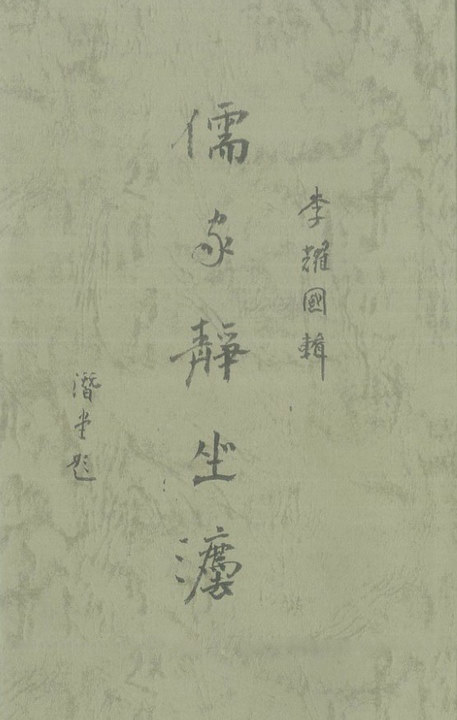

# ＜北斗荐书＞本期主题：《儒家静坐法》跋

**静坐调心之法，三教殆俱有焉；心斋坐忘，禅定止观，名目繁夥，不一而足。道门修持养炼，首重丹法；采合天地，反求诸身。乡前贤圆顿子陈先生撄宁尝云，修仙者，贵在收积虚空清灵之气，集于一身，复以吾人之神与此气配合而修养之，为时既久，则神气打成一片，而大丹始成。然肉体聚阴，若无阳气滋摄，难能点化，惟当以静坐之法行守窍之为，炼己去尘，务令静中真性、动中真意，并收于元神而调炼之。故曰静坐得法，炼己必就，采药能遂，结胎易成矣。**  

# 本期主题：《儒家静坐法》跋

## 荐书人 / 谷卿（暨南大学）

 

静坐调心之法，三教殆俱有焉；心斋坐忘，禅定止观，名目繁夥，不一而足。道门修持养炼，首重丹法；采合天地，反求诸身。乡前贤圆顿子陈先生撄宁尝云，修仙者，贵在收积虚空清灵之气，集于一身，复以吾人之神与此气配合而修养之，为时既久，则神气打成一片，而大丹始成。然肉体聚阴，若无阳气滋摄，难能点化，惟当以静坐之法行守窍之为，炼己去尘，务令静中真性、动中真意，并收于元神而调炼之。故曰静坐得法，炼己必就，采药能遂，结胎易成矣。

儒家静坐，志在息心宁神，滤绝平日之浮气，消涤夙昔之躁心。明季以还，阳明之说愈炽，而习持者甚众，其学有圆融天人道体、贯合三教理法之势。彼静坐之功，平实可行，阴阳得宜，一身静定，万念寂息，心猿栖树，意马系桩，无厌无求，乐适安闲，由此以习收放、辨勤惰、明内外、知荣萎，进以窥玄奥之关窍、达圣贤之视听，不亦速乎！

李君耀国，钩沉经籍，爬梳典笈，欲彰明儒家静坐之义法，昭显先贤治学之津梁，因辑成此编，持以命跋，为志数语而归之。壬辰仲春，宜城谷恕卿谨识。

#### 推荐书籍（点击蓝色字体书目可下载）：

[**《儒家静坐法（普及版）》**](http://ishare.iask.sina.com.cn/f/23713301.html)

 

（采编：李冰心；责编：徐毅磊）

 
