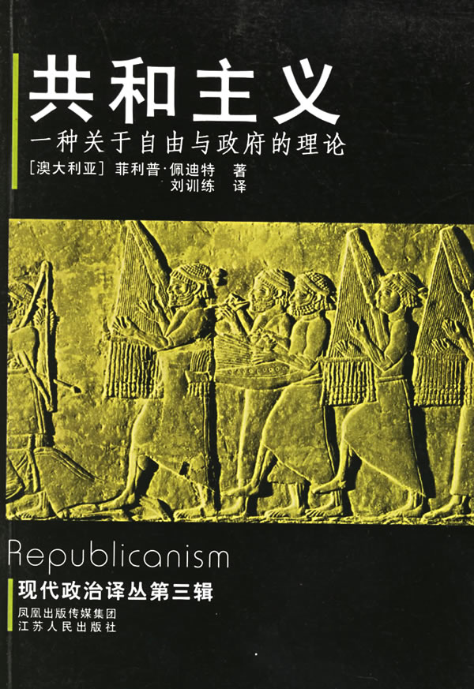

# ＜北斗荐书＞本期主题：《共和主义》读书笔记

有名的共和主义者很多，像Skinner, Pocock, Oakeshott, Arendt等都有重要影响，然而Pettit的《共和主义》一书或许是理解共和主义最好最系统的入门经典：Pettit不仅提供了一套独立的共和主义政治理论的概念框架，而且使得这一概念框架与共和主义的历史传统很好地融合起来。Pettit对共和主义的描述谈不上丰满细腻，却极为鲜明，此外，论述的清晰性也是一个巨大的优点。 

# 《共和主义》读书笔记

 

## 荐书人 / 江绪林（华东师范大学）

推荐书籍（点击蓝色字体书目可下载）：

[《共和主义：一种关于自由与政府的理论》](httpishare.iask.sina.com.cnf7773387.html) 刘训练译，南京：江苏人民出版社2006年版

有名的共和主义者很多，像Skinner, Pocock, Oakeshott, Arendt等都有重要影响，然而Pettit的《共和主义》一书或许是理解共和主义最好最系统的入门经典：Pettit不仅提供了一套独立的共和主义政治理论的概念框架，而且使得这一概念框架与共和主义的历史传统很好地融合起来。Pettit对共和主义的描述谈不上丰满细腻，却极为鲜明，此外，论述的清晰性也是一个巨大的优点。然而，其理论的完整性也不是没有代价的：Pettit的现代共和主义似乎与Rawls等支持的egalitarian liberalism（平等主义的自由主义）很难有实质性的区分；而且，Pettit的共和主义也似乎是一种较为狭隘的政治理论，未能面对更广阔的伦理世界：现代自由主义对“自由”的界定或辩护总是联系到对善

（goodness）问题的回答，而Pettit对“自由”的界定则似乎是纯政治性的。另外，Pettit无支配自由理论中蕴含的对agency的强调，似乎对rationalization的人类处境【马克思异化、卢卡奇物化、韦伯和哈贝马斯等的合理化】缺乏回应的可能：譬如，我们担心现代国家本身作为一种官僚机构在支配我们所有人，但在Pettit的共和主义理论中就缺乏这种考量，它对宪政主义似乎信心满满。

在“前言”中，Pettit介绍了写作的起源，与前一本书The Common Mind的关联。粗略说明将自由理解为非支配（non-domination）的路径，并且在传统的共和主义中找到支持后，Pettit说本书就是要勾勒出共和主义的自由观的主要内容。【04】

“导论”说，作为规范性理论，政治思潮总是一些关于合法性的竞争性话语（discourse），存在一种对话的维度。然而，不幸的是，关于非支配的共和主义传统却被忽视了，而这一传统的衰落则源自“18世纪末，当时公民身份开始扩展到拥有财产的男性之外”。【04】在流行的话语中，Populism强调大众民主，自由主义则总是与非干涉（non-interference）相关，而共和主义则以非支配为特点。不过Pettit也承认，有时候共和主义者与left-of-centre liberals之间存在严重叠合。【12-16】

第一章“消极自由与积极自由之前”考察了共和主义自由观的历史兴衰。伯林区分了消极自由和积极自由并且赞同前者，而这一区分是延续了Constant的现代人的自由/古代人的自由的区分。在Pettit看来，这一个人自由和民粹主义自由的二元区分是严重误导性的，因为它掩盖了理解自由的第三种方式：共和主义的自由。共和主义传统的谱系包括西塞罗、马基雅维利、哈林顿、孟德斯鸠和联邦党人。Pettit相信，“在消极自由与积极自由的划分之间仍然留有未被占据的哲学空间。”【26】

为了理解共和主义的自由观，首先需要区分支配（domination）和干涉（interference）的区别。存在无干涉的支配（如仁慈的主人），也存在无支配的干涉（如公正的法律）。“无支配与纯粹的无干涉之间最关键的区别恰恰就在于没有哪个人可以拥有这种干涉你的权力。”【31】在无支配的政治自由观念与政治自由的消极观念之间也存在一种共同的结构，“当一个人享有无支配时，他就在行动中免除了专断的干涉。”【32】虽然共和主义传统一再强调民主参与的重要性，但其首先关注的却是避免与干涉联系在一起的罪恶。民主控制的重要性来自于它是保护自由的手段这一事实。而“越来越强调民主确实使一些思想家偏离了自由主义阵营，而转向民粹主义立场。…卢梭…可能得为这种民粹主义观点的大行其道负有一定责任。”【39】

共和主义对消除干涉的强调是出于无支配自由的理想，而不是无干涉自由的理想。理由之一：在共和主义传统中，自由是根据自由和奴役、公民和奴隶的对立来定义的。如Harrington就强调，“一个人要想自由必须拥有物质资源…而自由的本质在于不必忍受这种依附和脆弱性。”【42】理由之二是，在共和主义的自由观中，干涉可以在不侵犯自由的情况下进行，因为非专断的干涉并不是支配，譬如良好法律的干涉。在共和主义传统中，自由被视为只存在良好法律体制下的一种地位。“具有重要意义的不仅仅是将自由等同于公民身份的共和主义观点，也是法律有助于创造自由的观点。”【48】在共和主义传统中，个人自由和自由的政制几乎是一回事。在Harrington看来，自由是liberty by the laws,而不是liberty from the laws,他所追求的是“法律的帝国。”Harrington的共和主义影响了美国革命的传统，在洛克的理论中都有反应，如洛克在《政府论》中说“法律的目的不是废除或限制自由，而是保护和扩大自由。”【53】

霍布斯是第一个将自由等同于无干涉的思想家，“自由就是物质上的强制和威胁性的强制的阙如。”【55】其追随者有菲尔默等人，之后反对美国独立的Tory党人,如John Lind等人。在这种变迁中公民自由（civil liberty）也为自然的自由（natural liberty）取代，也就是说自由被理解为自然的自由。这其中边沁的影响极大。他在给Lind的一封信中说：“自由的观念作为一种积极的观念无足称道：它仅仅是一种消极的观念；因此我将它定义为‘限制的阙如’”【58】而另一个促进了新的无干涉自由观流行的人则是William Paley,他清楚意识到从无支配自由观向无干涉自由观的转变。Paley支持这种转变，理由是：无支配自由混淆了手段和目的；无干涉自由从科学上更可取；无支配理想过于严苛。确实，前现代的共和主义无支配自由的公民理想仅仅适用于一部分男性精英，而18世纪启蒙带来的平等思想的普及使得这样的精英理想变得奇怪。“思想家扩大了他们关注的范围，从而将越来越多的人算作公民，坚持无支配的自由这一古老而厚重的理想似乎越来越不现实了。最好是为自由的理想进行瘦身。”【65】无干涉的自由观由此迅速取代了共和主义思想，而无支配的自由从政治思想史家的视野中消失了。

第二章“无支配的自由”从概念上更细致地考察将自由视为他人支配之阙如的含义。首先，行动者对他人的支配有三个特征：1、拥有干涉的能力【人身强制；意志强制；操纵；“一切干涉行为，不管是强制的还是操纵的，其干涉者的目的都是旨在通过改变可以获得的选择范围、改变分配给这些选择的预期收益以及控制选择的结果或实际收益，来恶化行动者的选择状况”；71】；2、建立在一种arbitrary basis之上【仅仅服从于行为者的任意意志，行动者可以随心所欲地选择做或不做它，程序意义上；不过，在实质意义上说，“确认某种国家行为是否专断和具有支配性是一个从本质上说关乎政治的事件。”；75】；3、在这种情况下，他人有权作出某种选择【支配不是在所有领域】。三个条件满足，支配就会成为社会中的一种common knowledge。Pettit特别强调，权力的非专断性并不取决于同意（consent）,而取决于进行有效辩论（contestability）的永久可能性。

Pettit进一步考虑了non-domination,“意味着他人在场时支配的缺席，而不是隔离所实现的支配的缺席。无支配是与自由人的公民角色联系在一起的。”【88】无支配代表了城市的自由，而无干涉则代表了荒野的自由。“无支配是某人在他人在场的情况下，借助社会设计而享有的一种地位：其中没有谁可以支配他。”【89】实现无支配的策略有两种：相互权力（reciprocal power）和宪政预防(constitutional provision)。前者依赖资源的平等，后者则试图通过引入合宪权威来剥夺他方专断干涉的权力。

无支配本身就是一种权力行使，“它代表了个人对自己命运的控制：行动者借以防范各种灾害降临于己的权力”【92】而免于专断权力的干涉，也意味着享有一种免于各种干涉的保障。回到他者的在场，共和主义的自由具有一种交互主体的意义。

在回应Paley的批评时，Pettit区分了威胁自由的因素与限制自由的因素。无支配的自由与无干涉的自由两者都认为，“我们应该在努力减少自由之威胁性因素的影响的同时努力减少自由之限制性因素的影响。两种观念的差别是，它们在不同的地方划定威胁性因素和限制性因素的界限。就无干涉的自由观而言，只有自然障碍才限制而不是威胁自由；而就无支配的自由管而言，同自然的障碍一样，非专断的故意干涉也只是限制了自由，而没有威胁自由。”【102】因此，非支配自由将非专断的法律是为限制性因素，而非威胁性因素。

第三章“作为一种政治理想的无支配”指出，共和主义传统将无支配的自由视为一种最高的政治价值。首先，无支配是一种工具性的个人善，带来三种好处：“缓解一个人的不确定性；家少对有权势者施展策略的需要；消除从属感。”【118】而且，无支配还是rawls意义上的一种基本善，“每一个人都需要享有无支配的自由，一旦缺乏这种自由，他们将沦为受制于策略和居于从属地位的人，这样的人是不能指望被作为人来恰当对待的。”【121】

无支配不是一种个人通过私人的、分散的手段就可以实现的价值，国家的有效干涉极为重要。仅仅依靠相互权力似乎无法实现无支配，必须依靠宪政预防策略，虽然这可能缩小人们享有不受支配的选择的范围和容易程度，“它将使他们相对无自由（nonfree）”【124】

Pettit认为，无支配自由的现代理想将涵盖所有人。他希望得到普遍认可的无支配理想成为有效激发人们塑造共同制度的灯塔。虽然这一点有怀疑，但Pettit说总得先尝试一下。【128-129】另外，无支配自由是一种目的论的而非道义论的理想。至于说无支配的强度和广度两个标准中，Pettit认为强度优先于广度【这种讲法有点粗糙】。

第四章“自由、平等与共同体”给作为一种政治理想的无支配加冕：“它既是一种独特的平等主义理想，也是一种社群主义理想；它支持了自由与平等、博爱的法兰西式联系”。【16】但说无支配自由理想会是一种平等主义的理由并不让人印象深刻，在结构性的平等主义和物质性的平等主义之间的区分很吻合主流，但看不到逻辑强大的理由。无支配自由是一种社群主义的善，因此打破了前现代共和主义的排他性。

第五章“共和主义的旨归（aim）：目标与政策”考察了“一个现代国家如果打算防止个人或群体凭借拥有不同层次的资源、不同层次的所有权（dominium）而对他人施加专断的干涉，它需要做什么”【17】。不过Pettit首先说，无支配自由的共和主义语言具有普遍的吸引力，能容纳环保主义、女权主义、社会主义和文化多元主义的诉求。这一点的论述很微弱。在dominium方面，外部防御和内部安全并非重点，重点是个人独立：“国家在为每个人提供独立---社会经济独立---时必须做什么”【207】Sen和Cohen都为这种独立提供了解释。共和主义必须采取一种保障经济社会独立的政策，因为“不享有社会经济独立这一事实将减少我享有无支配之自由的前景。”【208】那么这会要求何种激进的政策呢？Pettit说，“倡导一种福利国家并没有构成与古老共和主义传统的一种全然彻底的决裂”【213】。类似地，共和主义国家也必须追求经济繁荣，因为“它将由此减少支配的可能：提高社会中所享有之无支配的强度，或者增加不受支配只选择的范围或容易程度。”【213】另外，也应该关心确保无支配进入公共生活。在此，Pettit对公共空间收缩感到担忧。

第六章“共和主义的形式：宪政与民主”考虑了与统治权（imperium）相关的无支配问题。这里的问题是，“国家本身能够成为与统治权而不是所有权联系在一起的那种类型的支配的行动者。”【224】因此，目标是实现国家强制机关中存在的专断意志最小化。【225】这分为两个部分：宪政约束（constitutionalist constraint），以及对政策制定权力进行民主控制。

为了避免制度和动议被操纵，体系运作必须满足宪政主义的三个宽泛条件：1、用Harrington的话，体系应构成“法律帝国而不是人的帝国”；2、在不同部门间分散合法的权力；3、保证法律能抵制多数人的意志。这一“宪政主义能够通过合法建立的方式对有权有势者的意志加以约束，即使这些约束不存在于成文宪法中”【227】第一点即法律帝国与法治相关，譬如满足法律的普遍性、非回溯性、公开性和清晰性等要求。应“尽可能扩展法治的思想，尤其是原则行的决策优于特殊性决策的思想。”【229】分权可以提到Montesquieu对权力的功能分立，但还有两院制、联邦制等多种形式。反多数至上的措施包括修改法律的强要求、两院制、对法律宪政约束的认可、引入权利法案等。

再好的法律体系也必须为决策者保留自由裁量权。决策的非专断性要求可辩论性（contestability）而不是同意。这要求以辩论的模式理解民主。“只要人民单个地和集体地对政府的决定享有永久的论辩之可能，那么这个政府就是民主的，它就是一种为人民所控制的统治形式。”【243】辩论式民主有三个前提条件：1、辩论采取讨论而不是讨价还价的形式。这就是deliberative democracy的观点。2、辩论还需要是包容的。这需要一系列制度保障不同的声音能够被听到，譬如统计学代表权、独立调查、上诉权力、结社抗议和示威等权利。对金钱政治的限制。3、辩论的民主是回应的。措施是委员会、仲裁、独立的专业实体等建制。辩论式民主观与共和主义传统有某种亲和性，而与多头主义民主则形成了对比。

第七章“Checking the republic”考虑了在共和主义国家中应该有如何的规则来regulate那些掌权者。两种方法，奖惩和筛选。应以服从者为中心，即假设大家会遵循规则。

第八章“Civilizing the republic”考虑了如何将共和主义的制度构想和设计扩展或印刻到人们的心灵习性和规范中，也即形成公民社会中的civility。这大致意思是说有关共和主义的设想不能仅仅停留在法律或政治形式中，而必须沁入道德规范中，不过这里并没有说对独立道德的诉求。有三个理由说明需要Civility：对法律的服从；新的法律目标的表达；法律奖惩的有效执行【自由的代价是永恒的警惕】。另一方面，共和主义国家也能培育这种公民性：保证法律的合法性；培育无形之手；公民性的内化与同化。在具有这样的civility的社会中，会存在广泛的信任，而这种信任与警惕、无支配是相容的。 

（采稿：徐毅磊 责编：徐毅磊）

 
