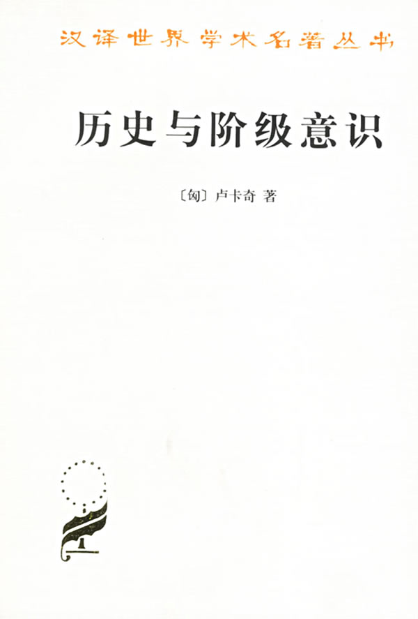

# ＜北斗荐书＞本期主题：《历史与阶级意识》读书笔记

**这是青年Lukacs在1919-1922年写的一些文章的结集，却是Lukacs最重要的作品，也是思想史上尤其是左派思想最重要的经典之一。剑桥20世纪政治思想史中说：“Lukacs是第一个严肃地评估黑格尔在马克思思想形成中的作用并重新把握到马克思思想的黑格尔维度的马克思主义者”。在我看来，该书或许最有价值之处有二：第一是有力地阐述了物化的概念。第二，从带有黑格尔色彩的历史概念和辩证法概念为起点，Lukacs对马克思主义做了雄心勃勃的建构性的再诠释。不管最终是否能令人信服，但得承认其对古典哲学的把握是系统而有力的，犹如一首磅礴的思想史诗。**

# **本期主题：《历史与阶级意识》读书笔记******

## **荐****书人 / 江绪林（华东师范大学）**

推荐书籍（点击蓝色字体书目可下载）

**[《历史与阶级意识》](http://ishare.iask.sina.com.cn/f/19305954.html)**

_杜章智等译，商务印书馆，1999年版_

这是青年Lukacs在1919-1922年写的一些文章的结集，却是Lukacs最重要的作品，也是思想史上尤其是左派思想最重要的经典之一。剑桥20世纪政治思想史中说：“Lukacs是第一个严肃地评估黑格尔在马克思思想形成中的作用并重新把握到马克思思想的黑格尔维度的马克思主义者”。【英文版，页284】。在我看来，该书或许最有价值之处有二：第一是有力地阐述了物化（Reification,Verdinglichung）的概念。马克思的异化（alienation），韦伯的理性化（rationalization）,Lukacs的物化，直到哈贝马斯的合理化或系统（rationalization/System）等概念大同小异，都真实而深刻地洞察了现代技术或合理化社会中人的某种普遍处境，这一洞见的深刻性足以超越任何表面的意识形态分歧，而成为理解现代社会或现代人的关键要素之一。第二，从带有黑格尔色彩的历史概念和辩证法概念为起点，Lukacs对马克思主义做了雄心勃勃的建构性的再诠释。不管最终是否能令人信服，但得承认其对古典哲学的把握是系统而有力的，犹如一首磅礴的思想史诗（尤其是“物化与无产阶级意识”一文）。可以这样说，马克思的名言，“哲学家们只是用不同的方式解释世界，而问题在于改变世界”，能够在Lukacs的理论中获得最清晰的理解和激活。因为Lukacs给予这句话一个历史主义或过程主义的本体论框架：“现实并不是现成的，而是生成的（The reality is not a being, it is becoming）【页302】”。

在第一篇文章“什么是正统马克思主义？”中，Lukacs说，马克思主义的正统仅仅是指一种方法，即辩证的方法。而只有辩证的方法，唯一能再现和把握现实，即具体的总体性（Die Konkrete Totalitat, Das Ganze）。这些概念的具体理解在其后面的文章中有更具体的体现和解释，不过在第二篇文章“作为马克思主义者的罗莎·卢森堡”中，Lukacs认为卢森堡很好地理解和实践了这种方法，而批评伯恩斯坦走上了使得马克思主义与资产阶级科学对接的修正主义道路。

第三篇“阶级意识”。马克思提出了“一种关于理论的理论，一种关于意识的意识”。“揭示了社会结构是历史地形成的…历史恰恰是这些形式的历史。”【102】而之前的资产阶级思想则“完全摒弃历史过程，并把现存的组织形式看做永恒的自然规律。”【103】历史也就是阶级意识或阶级意识的历史。 阶级意识是理性的反应， 是一种受阶级制约的对人们自己的社会的、历史的经济地位的无意识。“作为总体的阶级在历史上的重要行动归根结底就是由这一意识，而不是由个别人的思想所决定的，而且只有把握这种意识才能加以辨认。”【107】

前资本主义时代是等级制的时代，阶级利益和阶级意识没有以清晰的经济形式呈现出来、经济形式被纳入到法律形式中，“法律形式从根本上讲必然要干预经济关系。”【115】在前资本主义社会中，不能意识到所有社会关系的经济基础。因为等级意识掩盖了阶级意识。

随着资本主义社会，或者纯粹的经济划分的社会的建立，阶级意识也就进入了一个可能被意识到的时期。只有资产阶级和无产阶级两个纯粹的阶级。资产阶级的阶级意识在自己发展的顶峰会陷入自身的不可解决的矛盾。而革命的命运要取决于无产阶级的阶级意识是否成熟。

无产阶级的阶级意识的成熟有很多困难，因为这一意识内部就缺乏统一，有直接利益和最终目标的冲突，而眼前的局部利益甚至会掩盖阶级意识。机会主义就是把无产阶级的阶级意识降低到心理学水平，而真正的出路在于获得自觉性。 此文的论述貌似较为粗浅。

第四篇“物化和无产阶级意识”长达160多页，也是全书的精华所在。这篇文章的第一部分“物化现象”从分析商品开始，因为“商品问题…表现为资本主义社会生活各个方面的核心的、结构的问题。…能在商品关系的结构中发现资本主义社会一切对象性形式和与此相适应的一切主体性形式的原型”【146】

商品是“人与人之间的关系获得物的性质，并从而获得一种‘幽灵般的对象性’”，【147】而且“商品形式向整个社会的真正统治形式的这种发展只有在现代资本主义中才出现了。”【149】就商品是人与人的关系的物的表现形式而言，是人的物化。“劳动产品成了商品…人自己的活动，人自己的劳动，作为某种客观的东西，某种不依赖于人的东西，同人相对立。…在客观方面是产生出一个由现成的物以及物与物之间关系构成的世界…在主观方面，人的活动同人本身相对立地被客体化，变成一种商品。”【150-1】在这种物化中起作用的原则是“根据计算、即可计算性来加以调节的合理化的原则”。【152】随着合理化和物化的普及，“这种自我客体化，即人的功能变为商品这一事实，最确切地揭示了商品关系已经非人化和正在非人化的本质。”【157】

这一物化结构会在社会中普遍拓展，甚至“深入地、注定地、决定性地侵入人的意识里。”【159】也延伸到法律和国家结构中，法律和官僚系统也都合理化和机械化了，与商品具有同质性。

随着这种合理化或专门化而来的，则是整体图景的消失。科学越发展，月变成局部规律的形式的封闭系统，“抛开自己领域的各种存在问题”。【172】质的问题被抛在一边，专注于量的形式化。这也反应在理性自然法的理解中，如伏尔泰所言，“新的法律从何而来，从理性而来。”【176】法律被看成了一种形式上的计算体系。各专门科学“由于远离其概念形成的物质基础都有意识地放弃了对整体的认识。”【179】而要认识整体或存在，需要“通过专注于可认识事物、被认识事物的具体的、物质的总体来突破这种陷入支离破碎的形式主义限制时，才是可能的。”【179】

第二部分“资产阶级意识的二律背反”中开始清算形式主义，并且基于辩证的概念，以一种打通认识与实践的方式来梳理了近代思想的进程。当然这种打通认识与实践的做法未必能够得到当代知识论的认可。首先“近代批判哲学是从意识的物化结构中产生出来的。”【180】以康德为典型，近代哲学把理性的认识理解为自己的产物。“因为认识的对象是由我们自己创造出来的，因此，它是能够被我们认识的。”【182】理智把数学和几何为代表的形式体系把握为自己的本质。“近代理性主义的新颖之处就在于，随着它的发展而愈来愈坚持认为，它发现了人在自然和社会中的生活所面对的全部现象相互联系的原则。”【184】但是感性内容或“被给予的”是完全不可融化的，这反映在康德的“自在之物”概念的划界作用。因此，体系化的原则和对事实性（tatsachlichkeit）的承认必定是不能统一的。而“德国古典哲学的伟大、矛盾和悲剧正在于…它把握住了概念的被给予的内容的非理性特征，牢牢地抓住了这种特征，力求建立体系。”【189】但这不过是把形式和内容的逻辑对立推到了极点而已，其积极的含义是“奠定了辩证法的方法论基础。”【191】

克服形式与内容的对立或自在之物的第一种方法是内在化，即“存在可以被设想为是主体的产物，这时，就没有非理性的裂缝，没有彼岸的自在之物。”【195】费希特就是这么做的，其“主体能被设想为全部内容的创造者。”【196】 这种主体-客体的同一是基于活动（tatigkeit）。康德在《实践理性批判》中就试图把理论上不可克服的局限性看做从实践上可以克服的，而费希特就把实践或行为看做其同一哲学的方法论中心。但对立只是在更高的水平上出现了：实践和直观还是分裂的。

第二种办法是美学。有三种自然的概念：1、事件规律的总和；2、卢梭提示出的，与机械化对立的有机的自然；3、“自然意味着真正的人的存在，意味着人的真正的、摆脱了社会的错误的令人机械化的形式的本质：人作为自身完美的总体。”【215】在艺术和美学中可以发现这种自然。“艺术‘使先验的立场变成为普通的立场。’”【217】随着艺术原则而来的，是“直觉的知性”概念。康德就试图用判断力来沟通认识和实践。而在席勒那里，美学原则远远超出了美学范围，具有存在论的意义。“人，只有当他具有人这个词的完全意义的时候，他才游戏，而只有在他游戏的时候，他才是完全的人。”【218】因为“生活的全部内容只有成为美学的时候，才能不被扼杀”【219】所以世界必须美学化。但这只是回避问题：要么是把实践勾销了，主体成为纯直观的；要么美学原则被当成实践的，而代价则是知性变成了一种神话。

剩下只有辩证法之路了【虽然在我看来，辩证法与艺术原则的区别本质上并不明显】。在黑格尔那里，“辩证的过程发生了，…主体和客体之间的一成不变形式的僵硬对立融化了。”【223】 在辩证法中，“主体（意识、思维）同时既是辩证过程的创造者又是产物；只有当主体因此在一个由它自己创造的，它本身就是其意识形式的世界中运动，而且这个世界同时以完全客观的形式把自己强加给它…”【223】在辩证法中的基础概念是历史。“几乎在每一个不能解决的问题的后面，都隐藏着通向历史的道路，而这条道路也就是通向解决问题的道路。”【224】这里的关键是“要把全部现实看作为历史”，那么“我们实际上使自己提高到这样一种立场，在这种立场上，现实可以被把握为我们的行为。”【227】主体和客体在历史中获得了统一，“历史是从方法论上解决所有这一切问题的场所，而且具体地指出这个是历史主体的我们，即那个其行为实际上就是历史的我们。”【228】

但黑格尔虽然给出了辩证法，自己却陷入到了绝对精神的神话中，绝对精神吞噬了历史。 而事实上，辩证法必须超越资产阶级社会，因为“把辩证的方法当做历史的方法要靠那样一个阶级来完成…这个阶级就是无产阶级。”【232】

第三部分“无产阶级的立场”辨析了无产阶级在历史的辩证中的位置。“无产阶级的历史认识开始于对现在的认识，开始于对自己的社会地位的自我认识。”【245】 “它把资产阶级社会连同它的思想、艺术等等的产品看做自己方法的出发点。”【250】首先，只有当工人意识到自己是商品时，才能意识到自己的社会存在。“他的意识就是商品的自我意识；就是建立在商品生产、商品交换基础上的资本主义社会的自我认识、自我揭露。”【257】然而，认识到自己是商品这一点恰恰表明，“工人以物化过程和变成为商品，虽然毁灭他，使他的灵魂枯萎和畸变（只要他不是有意识地表示反抗），然而恰恰又使他的人的灵魂的本质没有变为商品。”【261】

单单意识到自己被物化为商品还远远不解决问题。无产阶级必须向深度挺进，“具有一种朝着社会总体前进的意向。”【263】无产阶级必须“好不含糊地，直截了当地，威风凛凛地厉声宣布，它反对私有制社会。”【264】。在这一历史过程中，“辩证法不是被带到历史中去的。辩证法来自历史本身。”【268】这里的关键是，“生成（becoming）表现为事物的真理。这就意味着，历史发展的倾向构成比经验事实更高的现实。”【273】而社会的发展倾向主要表现在社会结构的不停的质的变革中。

在这一历史的辩证中，“人就变成了一切（社会）事物的尺度，而其范畴和历史的基础则是由经济学的方法论建立起来的。”【279】独断主义在一个本质上静止的世界中打转，而所谓的人道主义则通过形而上学和神话逃避问题。【181-185】然而，个体不能成为事物的尺度，只有阶级才是。

对于生活在资本主义社会的人来说，物化是直接的现实，克服物化只有从实践上打破存在的物化结构。这一实践有其要点和限度，但根基已经奠定，那就是“现实并不是现成的，而是生成的。”【302】“只有当人能把现在把握为生成，在现在中看出了那些他能用其辩证的对立创造出将来的倾向时，现在，作为生成的现在，才能成为他的现在。”【304】认识与实践的能动性也处于某种微妙的关系中，“认识能真正变为实践的时机同样是由社会发展过程决定的。因此无产阶级的思维起初只是一种关于实践的理论，它只是逐步地转变为改造现实的实践的理论。”【306】

从总体上看了，Lukacs并没有质疑马克思的经济史观的，只是突出了历史的辩证法。其reality is becoming的概念与海德格尔的存在概念极为类似，不过实际上仅仅局限在历史的范围内，犹如一种政治美学，虽然Lukac尽力将美学和辩证法区分开来。

 

（采稿：徐毅磊 责编：徐毅磊）

 
