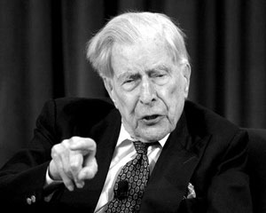

# ＜北斗荐书＞本期主题：《富裕社会》读书笔记

**在历史上，人类第一次摆脱了贫困，进入到了富裕社会，那么社会生活中的经济、政治和道德观念也应该做出相应的变迁：缓和或放弃那些在贫乏时代形成的严酷的观念，譬如“不劳动者不得食”，应该转而救济贫困，提供普遍的公共产品、减少不平等，因为社会已经富裕了，自然应该有更人道主义的观念。Galbraith是依赖对产业史和经济思想史的某种松散的梳理来建构其分析的，线索涉嫌过粗。其所谈及的概念和思想或许都能在当代经济学中以更专业的方式得到技术化的讨论，因而与其宏大结论之间的关联自然是成疑问的。但限于本人经济知识的欠缺，只能以掠影的方式简介其思路。**  

# **本期主题：《富裕社会》读书笔记******

## **荐书人 / 江绪林（华东师范大学）**

 

**推荐书籍（点击蓝色字体书目可下载）******

**[《富裕社会》](http://ishare.iask.sina.com.cn/f/10307080.html)**

_加尔布雷思著，赵勇译，江苏人民出版社，2009年版_**__**

Galbraith是哈佛大学经济学教授，60-70年代有名的“学术超男”，单单书就出版过56本，担任过大使、总统经济顾问，是约翰逊总统“伟大社会”演说的操刀人。但在经济专业学界却暗中遭受鄙视，萨缪尔森称他是“universal genius”，明褒实贬，意思是说，他无所不知，但经济专业方面够业余的。

《富裕社会》最早出版于1958年，中文译本早在1965年就有了，原因是Galbraith跟当时的中国政府关系非常好，曾盛赞文化大革命，几乎就是另外一个斯诺。《富裕社会》一书挺粗糙的，或许谈不上经典作品，但是作为特定时代（福利国家兴起和兴盛）的代言人作品，却具有思想文化史方面的重要价值；而且Balbraith的主旨向来是公平正义和缓解贫困，也切合了当下为急剧的社会文化变迁、贫富分化所苦的中国社会的脉动，是以重译本也算是正当其时。

《富裕社会》的基本观念是这样的：在历史上，人类第一次摆脱了贫困，进入到了富裕社会，那么社会生活中的经济、政治和道德观念也应该做出相应的变迁：缓和或放弃那些在贫乏时代形成的严酷的观念，譬如“不劳动者不得食”（230），应该转而救济贫困，提供普遍的公共产品、减少不平等，因为社会已经富裕了，自然应该有更人道主义的观念。Galbraith是依赖对产业史和经济思想史的某种松散的梳理来建构其分析的，线索涉嫌过粗。其所谈及的概念和思想或许都能在当代经济学中以更专业的方式得到技术化的讨论，因而与其宏大结论之间的关联自然是成疑问的。但限于本人经济知识的欠缺，只能以掠影的方式简介其思路。

Galbraith一开始就说：“福利国家的历史非常短暂，人类几乎在全部历史时期都非常贫穷…如今人类进入一个前所未有的大富大贵时期，人们也认为将来会是如此，美国更是如此。”【1】因而，用来解释普遍贫穷世界的经济理念应该需要根据富裕世界作出调整，这涉及到对“传统智慧”的攻击，即那些沉淀下来的理念，譬如“平衡预算”。

Galbraith通过追溯现代经济学的历史开始这一分析的。18世纪时国家财富第一次出现持续稳定的增长，经济理念也开始用现代形式来表述。Smith提出了一套自由经济社会的概念，靠竞争和市场来进行调节增加社会财富总量。Ricardo首先勾勒了现代经济学的结构，而马尔萨斯则揭示了工资铁律，并得出大众贫困在所难免的结论。当时的经济学给普通人描述的经济前景是相当灰暗的。这种阴郁的结论中也有一丝希望：“有些人兴旺发达，这就是价值之所在。人们不必在意毁灭和不幸，因为任何社会总会有毁灭和不幸，但必须注意机会。”【25】而在随后的Mill和马歇尔处在表现出对不平等、垄断和萧条的担忧。“在希望与乐观的假象之下，是挥之不去的对贫穷、不平等、不安全的恐惧。”【37】而美国早期最著名的经济学家Velben甚至加剧了主流传统中的忧虑和悲观主义。

斯宾塞的社会达尔文主义就具有这种经济学的冷酷精神，认为弱者遭受遗弃是进步的必要代价，而“适者生存”是正当的。不过民主的兴起和现代公司制度给予了社会达尔文主义以沉重的打击：“普通大众显然不太愿意投票支持可能促使他们遭到淘汰的自戕政策。…如果要使其在苦难中得以默许的存在，还需要一种保障机制。”【50】而现代公司显示出可以永存的特征。另外一方面，马克思则提出了激进的社会再分配主张。总而言之，直到20世纪30年代，主流经济学产生的背景是贫困，而其关注的主题就是：生产力、不平等和不安全感。这在30年代达到顶峰，“如一个人站在山谷中，全然不知他正面对着崇山峻岭般崛起的社会财富。”【64】

当然，变迁总是在进行之中。就贫富不均而言，各个时代都有人建议富人应该与穷人分享其财富。在争议中，各种理由被提出为贫富不均进行辩护，尤其是“它作为一种激励和资本源泉的功能作用。”【67】不过在现代社会史上，一个最显著的特点是对作为经济问题的贫富不均现象的关注兴趣的下降，而政府也没有做过任何认真的努力来改变现行的收入分配方式。主要的原因是，贫富不均“并没有显示出人们预见的促成暴力反应的趋势。”【70】另外一个原因是“近年来富人的政治和社会地位发生了剧烈的变化。”【71】财富的回报已经受到了很大限制，公开炫耀财富等行为会遭受社会的惩罚。并且“近几十年来，正是由于产值的增长，而不是因为收入的再分配，使普通人的福利获得了物质方面的巨大增长。”【78】围绕贫富不均论战的各方“已经将他们的注意力集中在产量增长的目标之上了。”【79】

经济安全，即保护个人不受经济不幸的影响，是另一个重要考量的因素。在现代企业发展过程中，内在风险已经大大降低。而对安全的关注是财富增长的结果：“人们从一个拥有很少的世界转换到一个有许多东西需要保护的世界。”【88】防止萧条和通胀是经济安全的必要条件。“减少经济不确定性与生产的增长之间不仅没有矛盾，而且两者之间存在密不可分的联系。”【93】“长久以来，对经济生活的关注，即对均等、安全和生产率的关注，现在已经集中到了对生产率和生产的关注之上了。…生产已经取代均等和安全问题，成为了人们关注的核心问题。”【96】将生产的重要性作为衡量绩效的标准是超越了党派的共识，成了“衡量我们文明的质量和进步的标准。”【100】生产率使得我们能柔化诸多紧张关系，尤其是贫富不均。提高生产的因素涉及：有效配置资源；劳动力供给增加，增加资本供给；技术革新。对生产的关注导致一些结果：生产自身创造需求，需求则依赖生产（想想Iphone 5）。这导致诸如分期付款等债务消费的行为。Galbraith又泛泛谈了下通货膨胀、利率的货币政策、财政政策。大致结论是，“通货膨胀不应该被视作反常之事，而应被视为一种正常的展望。”【179】

从另一个角度而言，对生产的关注是非理性的。譬如只把私人产品看做唯一重要的国民财富，而把公共服务看做一种必要的恶。现代经济学中糅合了对政府的强烈的不信任感。褒扬私人产品贬低公共产品的趋势有危险的后果。“我们私人生产商品所得的财富再很大程度上引起了公共服务的供应危机。”【181】公私之间的失衡，是社会紊乱的原因，而且“没有利用扩张公共生产的机会，我们错过了本来应该有的享受。”【186】而像教育等需要公共投资的东西很难由私人市场来承担。

至此，Galbraith对纯粹的，关注于生产和生产率的自由市场的批评昭然若揭。“本书所关注的问题是一种神话的奴役，这种神话因为商品生产的极端重要性和不可避免的困难，它现在已经成了我们生活的核心问题。”【201】 “在一个刚刚脱离野蛮的过渡中，勤俭和劳动是每个人的义务。…世界并没有义务供养每个人生活，不劳动者不得食。”【206】但现在人们“有机会逃离有效生产和不停劳动的奴役。”【207】这是从贫乏世界走向富裕世界时应该发生的。生产的重要性减退了，也应该减退。应该用别的东西替代或补充对生产的偏爱，相应的道德体系也应该有所变迁。

“收入和就业，而不是商品，成为我们基本的经济关注对象。…随着富裕程度的增加，我们更坚定地为每个人找工作。”【208】还应该打破生产和收入的关系，用别的东西取代生产作为收入的来源，譬如失业补偿制度，减少把生产当作收入来源的依赖。通过税收来恢复公共服务与私人领域的平衡。这儿没有什么精准的招儿，不过“富裕社会的另一个标准是在这些事情上存在相当程度的误差余地。”【222】

Galbraith还特别考虑了贫穷的问题。贫穷分为个案贫穷和孤岛贫穷。而随着赤贫的人数从多数状态像相对少数的状况转变，现在帮助穷人的政治努力，缺乏任何重大的政治吸引力，因为这些措施会冒犯更加富裕的大多数人。因而，赤贫问题似乎更加令人绝望。但显然的，贫穷是一种社会的耻辱，而Galbraith暗示着会支持福利国家消灭贫困。Galbraith也较乐观地考察了新兴阶层，那些工作更有乐趣，更受尊重、而不完全以收入为考量的阶层，譬如经济学教授、牙科医生、高级工程师等等。这代表着一种前景：将作为一种经济制度的辛劳彻底消除。“这并不是一个乌托邦的愿景，我们已经踏上了通向未来之路。”【239】

 

（采稿：徐毅磊 责编：徐毅磊）

 
