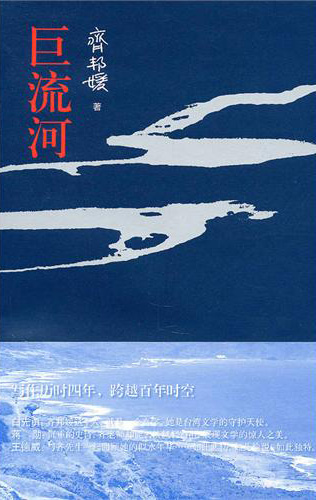
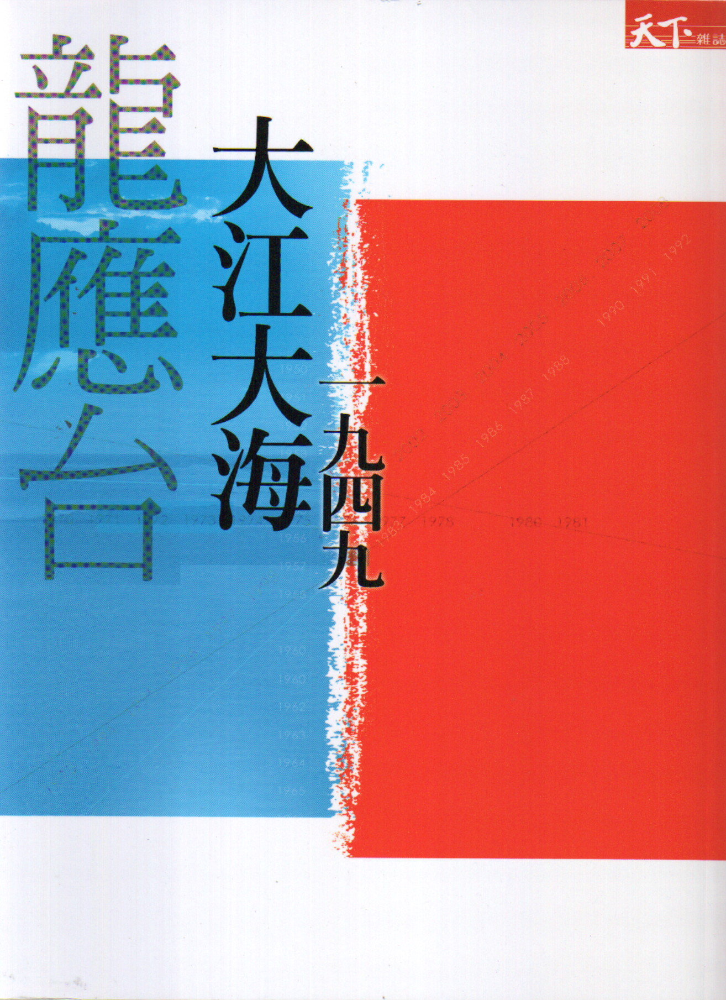

# ＜北斗荐书＞本期主题：《巨流河》和《大江大海》

 

# **本期主题：《巨流河》和《大江大海》******

## **荐书人 / 王钟的（中国人民大学）**

 

本来书的质量并不取决于是否畅销，前段时间我看到有同学回答“读书点名”的时候提到最不愿意读畅销书。可是畅销书有哪些呢，除了“毛语录”和《圣经》，我想四大名著也能归入畅销书的行列吧。这里提到的两本书都是不折不扣的畅销书，不过即便是酸得仿佛在醋坛子里泡了三年的文人也乐意谈论这两本书。去年阅读《大江大海1949》的时候，我已经附庸风雅了一番，现在刚翻完《巨流河》，趁着新鲜劲儿，忍不住做一个粗浅的比较。

《巨流河》是一本自传体小说，甚至称不上是小说，难得的是作者齐邦媛在行文中一直努力克制自己的主观情绪，因此这本书读起来是一种淡淡的冷静。而《大江大海1949》完全是作者主动的采访作品，其中当然也有个人家世传记的成分，不过这个传记其实是和龙应台本人的生活轨迹有一定距离的，不过相反，可以在旁观者心态下写作的龙应台，在这本书中延续了浓浓情绪。相较之下，个人情绪往往转化为政治立场的影射，这就显得两本书的呈现和作者的真实身份有一定的差距。出身革命党世家的齐邦媛，除了少许删节外，《巨流河》最终能够在大陆出版。而在政治立场上本可以更加超然的龙应台，那本《大江大海1949》在短期内看实在没有在大陆出版的可能。看来政治真是一个奇妙的东西，上代从政（后期不利），后代回避；上代没有明显政治血统，后代还忍不住谈论它。

就可读性而言，《巨流河》当然不及充斥龙氏煽情的《大江大海1949》。齐邦媛本质上是个学者，又是英文教授，国文功底固然深厚，但是只是体现在文平字正当面。龙应台虽然也是一个教授，本质上则是一个文学家，至少是个两手抓两手硬的角色，大至通篇布局，小到细节规划就从容得多。

事情往往有另外一个方面，《大江大海1949》出版不久，就遭到了各方面对细节的指责，记得李敖也忍不住有话要说。传言龙应台对历史细节的考证偏信一面之词，龙到后来写了一篇文章回复，可是到现在双方各执己见，也没有一个靠谱的说法。但是齐邦媛的文章，大体分为两个部分，第一个部分实际上是写其父齐世英的革命历史和政治起伏，第二个部分转向自己的个人史，还阐述了学术上的一些见解。第一个部分她算是历史有信力的见证人，也很方便访问到有证实力的知情人士，第二个部分主动权更把握在己，因此这样的文本在内容真实性上争议就小了很多。

当然这两本书都算不上反对某个政权的小说，那些对其的指责，如果从历史的眼光看，理应逐渐被容忍。两本书在大陆的不同命运，倒像是文化泛政治化的一个缩影。政治就是这么黏糊糊的，你不想谈它，它主动也要靠过来，你主动谈它了，它未必赏识你。否定台海割据一方的政治背景事实，当然是昏庸的，但是把民间的个人化表达以政治表达的思路处理，非黑即白的站队心态，倒显得肉食者的小肚量了。

#### **推荐书籍（点击****蓝色字体****书目可下载）：**

[**1****、《巨流河》**](http://115.com/file/aqydfhht)

[**2****、《大江大海1949》**](http://115.com/file/clt9v9r6)

（采稿：佛冉 责编：徐毅磊）

 
