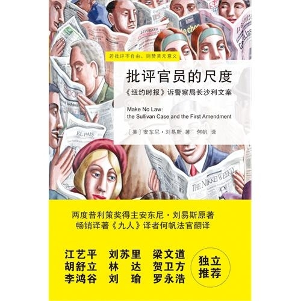

# ＜北斗荐书＞本期主题：《批评官员的尺度》读后感

 

# 本期主题：《批评官员的尺度》读后感

## 荐书人 / 刘三山（四川大学）

  **1.科技才是王道**

1962年，耶鲁法学院教授亚历山大撰文分析了美国南方几个城市抵制种族隔离运动的变化，结论是：“电视的传播已经极大地改变了公众的舆论。”

黑人不是一夜之间奋起反抗的，他们数百年来一直在反抗，但是，在电视普及之前，他们的诉求往往难以得到广泛的支持。毕竟文化精英阶层基本都是白人的天下，美国南方以外的地区的民众对南方的印象，仅仅限制于报纸上的图片和文字。如果有质疑的声音出来，赞同种族隔离制度的白人大议员大律师大记者大编辑大作家，只需要在议会进行一场激情洋溢的演说，或在报纸上发表一篇温情脉脉的“洁净典雅的白色庭院，温驯的黑人仆人，热情的白人庄园主……”类型文章，围观的人民就满意地散去了。

但是在电视普及之后，这样的美丽谎言，只需要一段十来秒的，黑人被暴打或被吊死的视频片段，就可以将其击得粉碎。人们开始怀疑，开始质问，更多的媒体开始进行调查和发表观点，公众的态度发生了迅速的转变。

如果说电视的普及彻底改变了美国60年代民权运动的进程的话，那么现代通信技术的发展对于当代中国社会又有什么影响呢？

2007年。

有人将这一年称之为中国的民意元年，重庆钉子户，厦门大散步，陕西纸老虎，上海反磁浮。仿佛一下子，诸多重大事件都被呈现到了公众的眼皮底下，第一次，强大舆论压力开始真正能影响到这个古老国家的命运，尽管只是一点，一点点。

但很少有人注意到社会的巨大进步背后科学技术所起到的重大作用。

08年，当我在网上点开不知名网友用山寨手机拍摄的无数段各地暴乱视频的时候，我突然意识到了，若干年后，当人们再次回首并评价对这个时代的中国社会影响最大的科技产品时，带摄像头的廉价山寨手机和各种视频分享网站必定要占有重要的一席之地。

想象一下，一个古老的国度，人们的思想沉若死水，保守的制度固若金汤，任何新的思想，言论，书籍都无法在民众当中普及。突然间，人民可以花不到半个月的收入就买到一个能拍照和摄像的手机，能把这些手机拍到的东西分享给其他人看，也能马上看到其他人分享的东西——矮油！我们要用这些东西做些事来不是么！额，冠希老师的艳照门是个不错的实践，但是，总有些其他更有意义的事情吧？——啊？还有那么多的社交网站和微博！嗯……让我好好想想……木哇哈哈哈哈……

于是历史就这么发生了：

04年，facebook正式上线；

05年，youtube成立，同年，中国山寨的土豆网成立，flickr（图片分享网站）被yahoo收购；

06年，中国的优酷网成立，twitter诞生；

07年，国内第一个模仿twitter的网站“饭否”诞生；中国“手机牌照”制度取消，山寨机成为正规军，同年，MTK（台湾联科发）手机晶片出货量高达1.5亿颗。而正是从07年开始，国内各种突发的重大公众事件，第一时间都有视频，图片上传到网络，并通过视频和图片分享网站迅速传播开来；

09年，伊朗绿色革命，参加革命的群众使用Twitter、Facebook、flickr和YouTube来联络和发布各种消息，一时间各种web2.0网站出尽风头；国内，饭否网在获得第一笔收入后不久便赶上“中国网络维护日”，之后便被有关部门强行关停，原因不明。蹊跷的是同年，新浪微博诞生；

10年，谷歌宣布不再接受自我审查和信息过滤，退出中国； 10年-11年，突尼斯，埃及，利比亚掀起茉莉花革命，又称facebook革命；

现代信息通信技术的发展，才是推动社会公平和制度变革背后最大的一股推动力，也是最硬邦邦的推动力。

“Look out honey, cause I'm using technology”

----Iggy Pop 《Search & Destroy》

没错，你们要小心了，我们可是有技术含量的。

 **2. 历史是一面镜子，镜子里面的我们都弱爆了！**

中国人看美国人为了争论言论自由的底线在哪里而窝里斗得不可开交的历史，简直就是在看一面镜子，里面无数生动的案例，都可以在我们这个只有短短60年历史的共和国里找到对应。 譬如，在20世纪初的美国，关于言论自由的解释曾经一度为“说可以随便说，但说出来不对就要负法律责任”。

但是到了20世纪中叶，一个观点逐渐成为共识，即如果言论自由只是“事前的自由，但事后则会追究责任”的话，那么其实言论自由等于无自由。

举个我国历史上著名的例子吧。

开国之初，知识分子犹豫着要不要批评官员，官员知道了，就说，好啊好啊，言论自由，欢迎欢迎~。于是知识分子放心了，敞开了批评，哇啦哇啦。批评完后，官员说慢着，你刚刚说的话明显有问题，你说这些是何居心？还有另外的一些人，你们这些人居然赞同这个人的错误的观点，又是何居心？要不要负法律责任？来人啊！把这些人都给我抓起来！

以上这个例子可能比较遥远，那就再举个小盆友们都很熟悉的例子吧：

班主任温和地对学生说，大家有什么意见就尽管提，对老师有什么看法就尽管说，老师不会往心里去的，不会记仇的。学生：好啊！哇啦哇啦哇啦……班主任脸一沉：那某某同学，你怎么说老师爱拖堂不对呢？老师爱拖堂还不是为了你们好！你这么说是何居心？你是否是对上次我拖堂太久害你尿裤子了怀恨在心？还有某某和某某，你们平时就不爱认真听讲，还不是因为你们我才拖堂……

所以中国人表示，你们美国人啊，狡猾狡猾的，居然提倡“不仅允许自由发言，而且要限制事后追究言论责任”，这怎么行！当年要是被你们识破了，我们毛主席的“百花齐放，引蛇出洞”还怎么搞啊！我们的班主任还怎么能整那些背地里说老师坏话的小盆友啊！

 **3. 法律的宽容**

如果允许人们运用行政，或者法律手段对任何报纸，媒体所发布的言论中不当之处进行追究，打击，那么会出现什么情况？大法官的答案是：不可避免的自我审查。

为什么？很简单，报纸，网站采用某篇文章，某篇报道，其不可能保证里面的所有材料都详尽准确，为了不背吃官司或受罚，编辑在报道一些具有争议的题材的时候必然选择放弃。这样就容易造成了自我审查，以及所有媒体在一些社会重大的有争议的问题上的集体失声

翻开美国的媒体历史，许多早期著名揭露腐败和社会问题的“扒灰者”其实也常常写过失实，夸大，扭曲的报道。但如果没有这些勇于爆料的记者，许多问题可能永远都无法见天日。

所以为了保持媒体在批评政府，和对公共事务发表意见时的言论活力，必须要对这方面尽量不做限制。

对报纸媒体的言论尚且网开一面，对公众的各种批评和言论则更是要完全不做任何限制。

在这里提到的“公众的各种批评和言论”，其实是一个很广泛的概念，从某著名影星接受采访时抨击政府，到你隔壁二大爷喝酒后大骂城管，都属于公众的言论。民众素质的良莠不齐决定了他们的言论也难免有偏颇和失真，扭曲，愚昧。法律对这些来自底层的批评和言论尽量宽容，而对来自政府和官员的言论尽量严格，是一种美德。

那美德的对立面是什么？是用对隔壁二大爷的标准来要求国家总理的言论，然后再用对国家总理的标准来要求你隔壁二大爷的言论。国家高官在大会上假话套话连篇众人习以为常，围脖上传了几条谣言CCTV就开始高呼“道德的底线在哪里？在哪里？”

1794年，麦迪逊在众议院的演讲中说道：“如果有检查言论的权力，也应带是人民检查政府言论的权力，不是政府检查人民言论的权力。”

 **4. 言论的自由市场**

但是还是很多人觉得，不行啊，这样不乱套了么？让这些人随便造谣，社会动乱了怎么办？

不会的，因为言论自由，所以不仅造谣自由，辟谣也是自由的。言论的市场好比市场经济一样，将各种言论产品，真话假话，好的观点烂的观点都摆在一起，所有的言论都放在一个平台上，进行公平竞争，接受公众和事实的检验。

说到这就不得不扯一下新浪围脖上的“围脖辟谣”和“辟谣联盟”。

其实如果辟谣组织也是来自民间自发的行为，估计很多人也都不会觉得有什么意见。但见鬼的是，围脖上的辟谣组织却有着深厚的官方背景，而且最后，这个联盟居然可以和新浪官方联手，拥有打击造谣者的权力，这就令人无法接受了。

每当我看到新浪辟谣随意封杀一个ID或让其停止发帖几天的时候我就会不由得开始想象：一场激烈的足球赛，一方的前锋冲到了禁区！对方后卫冲了上来！这名前锋将对方后卫拉倒！有犯规嫌疑！眼看就要射门了！这时候对方守门员冲了出来！举出了红牌！将这名前锋罚下了赛场！！

但是，诚如吾友包谷老湿所言，至少，现在的政府已经有通过讲道理的方法来和不同意见者辩论，这算是进步了。放过去，直接丢牢里了。

网上有许多人，一方面痛恨当局对言论自由的打压，另一方面又大呼“封杀凤姐”，“封杀造谣党”。

若想拥有自由发声的权力，就必须允许其他人也拥有自由发声的权力。我发表的一番洋洋自得的言论，在别人眼里可能不过是一派胡言，如果遇见不同政见者，可辩论，可探讨，但犯不着将人家封杀了。

话说回来，虽然网评员，和辟谣联盟的部分成员都拥有官方背景，但究其身份，其实都不过是体制内的小喽啰。其实网上斗得热闹非凡的一帮人，还只是人民内部自己斗自己。

这也是60年来共和国最杯具最可笑之处，从文革到现在，常常是民间各种观点和争论都已经激烈到极限了，但是其实不过是一帮草民在斗一帮草民。要去到中南海里，大明湖畔，常委们大多数时候都还是一副岁月静好，现世安稳的德性。

 **5. 深水区，灰色地带**

言论自由绝对不是完全没有边界，上世纪中期的一系列判决尽管极大拓宽了言论自由的疆域，但总有一天，“改革进入深水区”，触及到了自由的边界。大法官们必须坐下来，为言论自由划定一个界线，即便只是一个比较模糊的界线。

这条模糊的界线是：一个言论如果会导致“清晰且迫在眉睫”危险的话，则不在言论自由的范围之内。

此外，一个问题也逐渐被反复提出：媒体和报纸对普通人的批评，攻击和造谣，是否也能跟对政府和官员的批评和攻击一样享有极大的言论自由？对一个知名的公众人物呢？

书里也没给出个清晰的答案。毕竟现在的媒体已经成为了一个强大的势力（当然指的是在西方），所以此一时彼一时，或许现在应该对媒体的权力进行一些限制，防止其侵犯到一些普通公民的私人隐私，名誉和“独处的权利”。

此外还有，如果某条不当言论的确对某人造成了经济上的损失，是否应该追加巨额的惩罚性赔偿？等等。

但是，对于政府和对公共事务进行批评和讨论的言论自由，则毫无疑问是言论自由的权利当中最不受限制，最充满活力，也是最重要的核心部分。

 **6. 进化论，不是设计论**

即便是在美国，公众争取言论自由以及其他各项自身权利的过程也并非一帆风顺，中间各种曲折，各种倒退，最后经历了近300年，才逐渐成为了现在这个样子。而同性恋婚姻合法更是近几年才发生的事情。

展望美国的民权运动史和言论自由发展史，不由得感叹，尽管美国的开国先贤在费城制宪会议上搞出来的那部宪法放到现在都令人高山仰止，但也是靠这几百年来的27条各种修正案，以及每个时代最高法院的9名大法官对宪法做的精彩解释来让它历久弥新，保持生机勃勃的活力，以适应时代的需要。

所以如果说当今美国的优秀民主和法治制度是先人设计出来的，不如说是在漫长的历史当中逐渐演化而成的。

 **7. 你期盼圣人，你就永远得不到圣人。**

最后推荐一条视频，大家有空可以去看看：阿扁当年竞选台北市市长的视频。网友评论：“华语辩论史上的巅峰！过去神马地图炮，贴标签，地域攻击神马的都弱爆了！” 参加辩论的有三人：陈水扁，赵少康， 黄大洲。

陈是律师出身，言辞犀利，善于抨击腐败针砭时弊，但施政经验匮乏，而且老是喜欢打悲情牌，动不动就“我老婆被车撞，为了民主做出了牺牲……”；赵是前环保署署长，在市政方面，尤其是大型基建项目方面更是业务精通，但这次辩论居然上来主打爱国牌，大谈两岸局势台海危机，到最后有人不得不提醒“赵先生我们是在选台北市长，不是台湾总统……”；最后一位黄是当时现任市长，其实也是个能做点实事的人，康奈尔农学博士，李登辉的前辈，执政经验丰富，但此人的说话风格么……有网友评论说：TM的这货讲话跟大陆GCD官员一个德行啊！

推荐这条视频无它意，就是想让大家看看，真正实现民主了，会有什么不同。

时常听人说，实现民主了，实现言论自由了，又有什么不同呢？不还是同样的一批国民，一群人当中的另一批人去当官员么？水平能高到什么地方去呢？

这话不无道理，看了这个视频，你也会感叹，其实阿扁也就擅长抨击腐败，真的做事还做得不咋样；其实赵少康虽然做事不错，但这种慷慨激扬环球日报风格的演讲实在不适合一个市长；其实黄大洲尽管会做点事，但是官僚习气太重，班子效率低下……

你就算到了美国，也可以把历届总统的优缺点都分析得头头是道来：其实奥巴马也就会演讲，搞经济没啥本事；其实小布什也就靠反恐战争的人气连任，丫智商还不到100；其实克林顿还可以，就是不该招实习生……

公众能对自己的政府和领导人的优缺点如数家珍，而且可以随意批评，这就是最大的不同。

大家都清楚了政府的优缺点，便会在这些政府可能做砸的事情上格外打起精神监督；大家都可以随意批评，政府和当权者便在所有重大问题上都格外小心。结果自然不同。 最近喜欢看各类美式脱口秀节目，其中有个节目是最近几届新总统竞选获胜后都要去参加的脱口秀，在节目里拼命拿自己的缺点开涮。小布什在节目里自嘲当总统后要往图书馆里放带有图片的少儿图书（自嘲他的阅读困难症），奥巴马则自嘲说竞选答应女儿当了总统就给她买狗的诺言是“竞选诺言”（指不会兑现的诺言）。

更不要提囧司徒等人的晚间脱口秀节目了，更是将政治笑话发挥到极限。在野的，在任的，各类政府高官的笑话层出不穷。曾有人惋惜说，小布什卸任后，晚间脱口秀关于总统的笑料可能要少一半。但是现在看来，恩，奥巴马没有让人失望。

而这些只是美国宪法的第一修正案关于言论自由的条款所带来的诸多好处中，最微不足道的一个。

#### 推荐书籍（点击蓝色字体书目可下载）：

[**《批评官员的尺度》**](http://ishare.iask.sina.com.cn/f/22680123.html)

 

（采编：宋晓慧；责编：徐毅磊）

 
