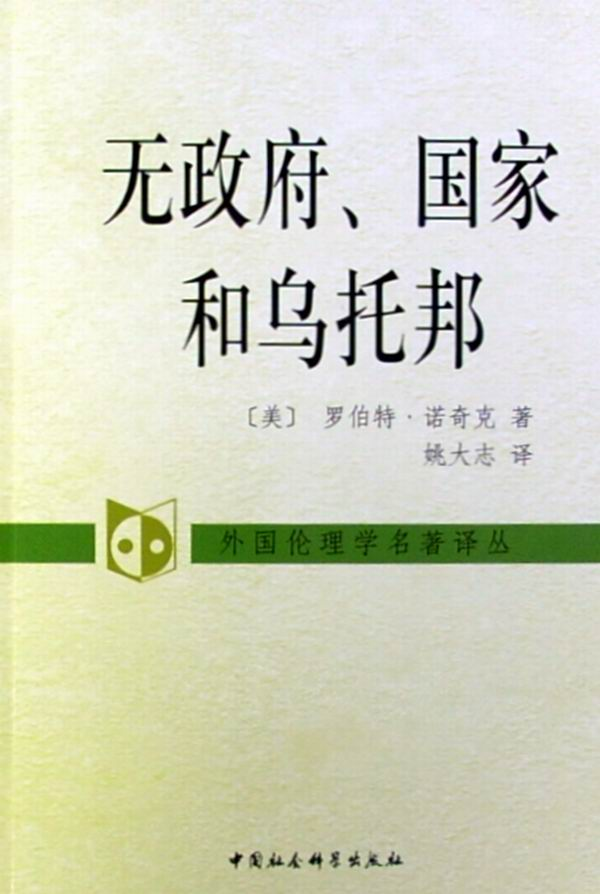

# ＜北斗荐书＞本期主题：《无政府、国家和乌托邦》读书笔记

 

# 本期主题：《无政府、国家和乌托邦》读书笔记

## 荐书人 / 江绪林（华东师范大学）

 

### 推荐书籍（点击蓝色字体书目可下载）

**[《无政府、国家和乌托邦》](http://ishare.iask.sina.com.cn/f/8151199.html)**

诺齐克著：姚大志译；中国社会科学出版社2008年版

Nozick此书的结构极为简洁优美，而且在展开论证的时候常常带有一种智识游戏的优越色彩，甚至是以谦逊的方式呈现这种优越的，仿佛常常在说：瞧，这儿引进了这样一个论点或论证策略，如果不被拒绝的话，那么就会导致这样的一个结论---虽然可能有些保留。但是随着文本的展开，Nozick的恃才放旷却常引人进入种种极端繁琐的技术细节而未必能让人清晰自顾。对Nozick此书最有力的批评可能是由G.A. Cohen在Self-Ownership，Freedom and Equality中提供的，也可以在Will Kymlicka的《当代政治哲学》页108-137见到：

Nozick的自我所有权观念未必能推导出绝对的财产所有权；而self-ownership观念也未必是对平等待人或“人是目的”的最好诠释。基于学习和教学的原因，本文仅限于仅尽可能重现Nozick的论述思路。

在“前言”一开始，Nozick就给出了著名的宣言“个人拥有权利，而且有一些事情是任何人或任何群体都不能对他们做的（否则就会侵犯他们的权利）。 这些个人权利是如此坚韧和意义深远，以至于它们向人们提出了国家及国家官员可以做什么的问题。”【01】Nozick由此思考的主要结论是：能够得到证明的是一种最低限度的国家（minimal state），其功能仅限于保护人们免于暴力、偷窃、欺诈以及强制履行契约等。全书分为三个部分，第一部分在批评无政府主义时为最低限度国家提供了辩护；第二部分主张，任何更多功能的国家（more extensive state）都无法得到辩护。在此Nozick阐述了一种正义的资格理论（entitlement theory），并批评了Rawls的平等主义的分配正义理论；第三部分转向了乌托邦理论，认为最低限度国家恰恰是乌托邦传统中合理的因素。在前言的最后，Nozick说自己“并没有展示出关于个人权利之道德基础的精确理论。”【07】

第一章“为什么要探讨自然状态理论？”。“在探讨国家应该如何加以组织之前，政治哲学的基本问题是：任何国家是否应该存在。为什么不是无政府呢？”【3】因此从无政府的“自然状态”开始是恰当的。无政府主义者主张：“如果没有国家我们会生活得更好；任何国家都必然侵犯人们的道德权利，从而本质上都是不道德的。”【5】如果能从一种人们有理由期望的最好的无政府状态开始，能够表明，“国家甚至将会比这种最好的无政府状态更加优越，是在现实中能够期望的最好的东西…那么这就为国家的存在提供了一种理论基础，就为国家提供了正当的辩护。”【5】Nozick说，从自然状态开始的对政治领域的解释是一种基本的潜在解释（基本和潜在是两个专门术语），而这种解释则从洛克的自然状态开始。

第二章“自然状态”。在洛克的自然状态中，个人处于一种完善的自由状态，在其中，自然法要求“任何人都不应该侵犯另一个人的生命、健康、自由和财产”。但也有种种不便：私人和个人执行自己的权利会导致无休止的争端，而且个人也可能缺少力量来enforce自己的权利。这时候，“由个人组成的群体可以形成相互保护的社团”【13】，即私人保护机构，而将所有侦查、拘捕、罪行的司法判决、惩罚和索取赔偿的功能都移交给私人保护机构。随着竞争，很快出现了支配性的保护性社团（dominating protective association）。“由于自发群体、相互保护的社团、劳动分工、市场压力、规模经济和合理自利的压力，从无政府状态中，产生出某种非常类似于一个最低限度的国家（minimal state）或一群拥有明确地理界线的最低限度的国家的东西。”【20】

这样一个支配性的保护性社团与国家有何不同？在回答这个问题之前，Nozick先区分了“看不见的手的解释（invisible hand explanation）”和“隐蔽的手的解释（hidden-hand explanation）”，在前者中，“那些看起来是人们有意设计的东西，并不是由任何人的意图所产生的”【23】；而在后者中，“那些看起来纯粹是一对互不相关的事实，则是个人或群体有意设计的产物。”【23】支配的保护性社团却似乎不同于最低限度的国家：1、按照Weber的传统，国家声称保有境内对强力的垄断权，而保护性机构则并没有做出这样的宣告，“它看起来也不具有做出这种宣告的道德合法性。”【30】，因而保护性机构缺少垄断因素；2、在国家中，生活在地理界线内的每个人都得到了或有资格得到保护，而保护性社团却只保护那些付钱购买保护的人。但Nozick说，这两点理由只是表面的，骗人的，都可以被克服，虽然需要一个复杂的论证。

第三章“道德约束和国家”。Nozick说，在私人的保护性社团制度和守夜人式的最低限度国家（minimal state）之间，还存在一种社会安排叫做超低限度的国家（ultra-minimal state）：它“保持着对所有强力适用的垄断权，从而排除了私人（或机构）对侵害进行报复和索取赔偿。但是，它只向那些购买了它的保护和执行保险的人提供保护和执行服务。没有向这个垄断机构付钱以得到保护契约的人则得不到保护。”【32】而最低限度国家就等于超低限度国家加上一个明显再分配的、由税收支持的，所有人享有的代金券制度，用以支付从超低限度国家购买保险。Nozick的这个区分是从道德上辩护最低限度国家的一个步骤。

Nozick认为，可以用两种方式看待权利（right）：或者纳入道德目标，即使得侵犯权利达到最小化的end-state；或者把权利当作对行为的一种边界约束（side constraints），“其他人的权利决定了对你的行为施加的约束。”【35】就诺齐克支持的后一种方式而言，其支撑的理论来自康德主义的根本原则：“个人是目的，而不仅仅是手段；没有他们的同意，他们不能被牺牲或被用来达到其他的目的。个人是神圣不可侵犯的。”【37】因此，边界约束其实表达了个人的神圣不可侵犯性。为什么不能主张：为了社会的整体利益，一些人应承受一些代价以使得其他人们获得更多的好处呢？“并不存在拥有利益的社会实体（social entity）…存在的只是个体的人”【39】Nozick说，“存在着不同的个人，他们拥有个别的生命，所以任何人都不可以为了他人而被牺牲，这是一个根本的理念。这个根本理念是道德边界约束之存在的基础，…也导向一种禁止侵害别人的极端自由主义的边界约束。”【40】

接下来Nozick进一步考虑了边界约束的位置和含义。人基于什么理由才具有不可侵犯的权利？那么动物是否也能享有不可侵犯的权利呢？涉及到动物的时候，或许常识会推荐一种“对动物的功利主义和对人的康德主义”的混合方案；通过体验机器（experience machine）的例子,Nozick认为，“我们想望的东西是在于实在的接触中过我们自己的生活。”【54】道德理论存在不确定性，譬如康德主义的边界约束观跟精英主义的等级约束观对人们实际的处境可能给出完全相同的道德判断。就Nozick坚持的康德主义的边界约束而言，其理由何在呢？道德约束关涉到的个人特性的备选答案是：感觉和自我意识，理性，自由意志，道德主体，灵魂。除掉最后一项，Nozick猜测，这些因素和“按照所选择的某种整体观念来调节和指导其生活的能力”合在一起，可以构成对生活的意义的一种理解：“一个人按照某种计划塑造其生活，就是以一种方式来赋予他的生活以意义；一个人只有拥有如此塑造其生活的能力，才能拥有富有意义的生活或者为富有意义的生活而努力奋斗。”【61】这是Nozick最基本的道德哲学观念。

第四章“禁止、赔偿和风险”。为了确定支配的保护机构可以如何对待独立者，本章研究了禁止风险的行为。权利存在道德空间中，在什么条件下越界或侵犯才是被允许的？Nozick设定自愿的同意为越界打开了大门【70】。那么，充分赔偿（状况停留在无差异曲线上）条件下可以么？充分赔偿是一个武断的标准，是不公正的，远远没有通过谈判确立的市场赔偿好。并且除了赔偿价格的公平性外，反对“赔偿就可以越界”还有其他理由，譬如，有些能够加以赔偿的行为会产生恐惧，甚至是普遍的恐惧。由此有些行为就基于会带来普遍恐惧而应该被禁止。还有另外一些理由禁止越界行为,“一种制度只要给予赔偿就允许越界，表明它把人用作手段…某些伤害可能是无法赔偿的；或者超出赔偿者的能力。”【84】

那么为何不禁止没有经过事先同意的所有越界行为，并对所有越界行为进行惩罚呢？因为这会给人们的生活带来大量的风险和不安全因素。有意外导致的越界，有时候事先同意也是难以获得的。在确定哪些（满足赔偿条件后）可允许的越界行为时，恐惧、交换利益和交易费用是需要考虑的因素，但这还不够形成方案。但总之，存在某些只要给予赔偿就能被允许的风险行为。

越界的风险行为可能带来伤害，而当伤害概率达到某个阀限就可能引发恐惧。因此如何禁止一部分行为以保证总体阀限不被越过？或许，那些不具有赔偿能力的人就应该被禁止某些风险行为。但这里的关键原则是：“人们应该为其被禁止的某些风险行为而得到赔偿。”【99】 第五章“国家”。在绕了那么大一个圈子做了些理论准备之后，Nozick回到了支配的保护机构如何对待独立者的问题，也即是国家产生的问题。独立者私人执行权利和正义可能是高度风险的：“他的程序包含了惩罚无辜者或过重惩罚有罪者的更高风险，或者是因为大家不知道他的程序是不是具有风险。”【105】那么禁止如何进行呢？Nozick首先排除 H. Hart的“公平原则”作为可选项。关键在于程序性权利即罪行的公共证明和确认犯罪的程序的选择。“每一个个人都确实拥有要求获得公共的信息或他可以得到的信息的权利。这些信息足以表明将用于他的正义程序是可靠的和公平的。”【121】而且个人拥有抵制不正义程序的权利。同时，任何人都没有权利使用相对不可靠的程序。这里Nozick给出了一个认识论的讲法“许多程序性的权利不是来自受动者的权利，而是来自关于行动者的道德思考。”【128】：“如果从事行为A会侵犯Q的权利，除非条件C得到满足，那么某个人若不知道C是否得到满足则不可以做A。”【127】

在上述背景下，支配的保护性社团虽然没有宣称垄断权，却因其权力而占有特殊地位：对其它人的正义程序进行强行禁止。它只禁止任何人对其委托人使用实际上有缺陷的程序就行。“由于自己的力量，它对自己的委托人处于一种作为终极强行者和终极审判者的实际地位。”【129】因此它拥有一种事实上的（de facto）垄断权。支配性的保护机构的领地并没有扩展到非委托人之间的争执。但它禁止独立者对其委托人强行权利。“既然这种禁止使得独立者不可能有效地以惩罚来威胁侵犯了他们权利的委托人，所以它使独立者在他们的日常行动和生活中无法保护自己免于伤害和严重损失。”【131】依据赔偿原则，独立者应该从委托人处获得赔偿，而费用最低的方式则是由支配性的保护机构为独立者提供保护服务。此处“禁止者需要支付的赔偿数额仅仅为，禁止所造成的损失额减去被禁止者在不被禁止的状况下也要负担的费用。”【132】 由此，支配性的保护机构满足了成为国家的两个必要条件：对地域内的强力使用拥有必要的垄断权，一切保护该地域内的所有人的权利。“从超低限度的国家到最低限度国家（“再分配”因素）的过渡在道德上也是合法的而且也没有侵犯任何人的权利。”【134】这种解释是一种看不见的手的解释。

第六章从略，考虑了一些反对意见。

第七章“分配正义”。Nozick说，“最低限度的国家是能够得到证明的最多功能的国家，任何更多功能的国家（more extensive state）都会侵犯人们的权利。”【179】本章考虑从分配正义角度为更多功能国家辩护的方案。Nozick反对“分配正义（distributive justice）”这个词，因为不是中立的（neutral），建议用“持有的正义（justice in holdings）”来取代之。

Nozick先提出自己的资格理论（entitlement theory），“如果一个人根据获取和转让的正义原则或根据不正义的矫正原则（由头两个原则所规定的）对其持有是有资格的，那么他的持有就是正义的；如果每一个人的持有都是正义的，那么持有的总体（分配）就是正义的。”【183-4】持有正义由三个论题组成：持有的原初获取；持有的转让；对持有的不正义的矫正。Nozick的资格理论是一种历史的、非模式的原则（历史的资格决定随后的分配之正当，一切取决于“它是如何发生的”）；而他所反对的是最终状态的原则（end-state principle）或模式化原则（patterned principle，以某种自然的维度或标准，如功绩、福利、效用等来衡量分配）。资格理论与各种模式处于随机关系中，其口号是“from each as they choose, to each as they are chosen.”【192】

在辩护的时候，Nozick举了篮球运动员Chamberlin的例子，既说明了资格理论的正当性，也说明end-state原则都会被自由或个人的自发行为所颠覆。“模式化的分配正义原则必然需要再分配的行为。…从一种资格理论的观点看，当其发生的时候，在分配确实是一种包含了侵犯人们权利的严重事情。”【201】对劳动所得征税等于是强迫劳动。“对X的所有权观念的核心是权利，即决定将用X来做什么的权利，以及在涉及X的各种受到约束的选项中选择哪一个应加以实现和尝试的权利。”【204】end-state原则“创制了别人对人们及其行为和劳动的（部分）所有权。这些原则涉及一种转换，即从古典自由主义者的自我所有观念转换为对其他人们的部分所有权。”【206】

Nozick通过诉诸洛克的获取理论来深化资格理论。洛克把对无主物的所有权看做是劳动与无主物相混合而产生的：界限何在？混合还是改良才创造了资格或所有权？关键在于，“无主物的占有是否使其他人的处境变坏了。”【210】洛克关于获取的的限制性条款（proviso）是，“有足够的和同样好的东西留给其他人共有。”【210】对这个限制条款，Nozick采取了较弱的解释。这个限制条款能否被满足是有争议的，Nozick在此并无令人信服的辩护。

接下来，Nozick开始分析和攻击Rawls的分配正义理论。《正义论》很伟大，可以承接Mill。但首先，需要分配的是社会合作产生的利益总额呢还是因为社会合作导致的利益增加值呢？Rawls没有区分，而直接认为是利益总额。并且，“为什么社会合作就产生分配正义的问题呢？”【220】能确定边际贡献，且有自愿交换，总而言之，资格理论就够了，没有再分配的容身之地。

再考虑“合作条件和差别原则”。Nozick指责说，在原初状态下的个人为何会选择一种关注群体而非关注个人的原则【228】。并且，差别原则虽然能赢得禀赋更差者的自愿合作，却没有理由赢得禀赋更优者的自愿合作。Rawls在禀赋更差者和禀赋更优者之间采取了偏袒前者的立场。

再考虑“原初状态与目的-结果原则”。Nozick说，无知之幕本来就与历史原则相排斥，把社会合作的利益当成了不知道从哪儿来的社会馅饼。Rawls的原初状态的构造程序导致只会产生end-state的正义原则。原初状态不包括丝毫的资格原则，而“如果任何一种这样的基本历史-资格观点是正确的，那么罗尔斯的理论就不是正确的。”【242】

在“宏观与微观”的小节中，Nozick质疑了Rawls的正义原则只适用于宏观的、社会的基本结构的假定。这种假定是没有道理的。Nozick还质疑了T. Scanlon对Rawls的一种辩护：“在差别原则与严格平等之间也不存在任何合理的原则。”【251】Nozick给出了两个平等主义的普遍原则可以比差别原则更能实现平等。

从“天资与任意性”小节开始，Nozick分析天资（natural assets）问题。Rawls之所以拒绝“自然的自由体系”是因为它允许分配受道德上任意的因素即天资或自然禀赋的不恰当影响。但在把自然禀赋完全归属于外部因素的时候，其实是清除了人的自主选择和自主行为等因素。但这种贬低人的自主和自我责任的做法与Rawls倡导的人的尊严却背道而驰。Rawls的正面理由是：自然禀赋和天资是不应得的，从道德上看是任意的。但这只有无理由地预设平等为不证自明的原理。并且“一种事实从道德观点看是任意的”这种讲法也模棱两可。可以意味着“对于这个事实成为这个样子，没有任何道德理由；或者，对于这个事实成为这个燕子，既没有道德意义，也没有道德后果。”【273】，就后一种意义而言，理性、选择能力和天资都不是道德上任意的。

总之，Rawls的分配正义方案把天资的总体看做一种集体资产。但这恰恰似乎没有认真对待人们之间的区别。只有把人与其才能、天资、能力和特性区分开来才能坚持Rawls的方案，而仍然认为没有损害人与人的区别。最后，Nozick说，差异原则可以看做某种近似的矫正原则。

第八章“平等、嫉妒和剥削等等”考虑了其它几种支持更多功能国家的理由并予以批驳。关于平等的论证，Nozick挑出了Bernard Williams的“内在目标”的观念：“履行该行为或分配该行为的唯一正当根据同内在目标的有效实现相关。”【281】但剥开表层，Williams只是没有论证地给出了这样一种主张：社会应该为其所有成员的重要需要提供保障。

考虑机会平等的概念。“如果某个拥有更好机会的人并不存在，那么一个拥有更差机会的人就会变得更好。更好机会者似乎…阻碍或妨碍拥有更差机会的人变得更好。”【284】Nozick承认这种洞见的力量，但相信这没有颠覆一种彻底的资格观念。因为“对事物的特殊权利充满了权利的空间，没有为存在于某种物质条件下的一般权利留有余地。”【286】 

关于自尊，Nozick说，嫉妒是平等主义的潜在基础。他分析说，嫉妒是因为在某些重要方面，得分低的人在得分高的人面前感到自卑。而自尊则以有差别的特性为基础。Nozick说，拉平绝非好方法，“社会为了避免自尊出现大范围的差别，最有希望的方法是使可供比较的方面不具有共同的权重，相反，应该有各种各样的不同方面和不同权重。”【295】Nozick这里的意思大致是说，做一个街头流浪乞丐，应该让自己流浪得很酷很有尊严，而不是去想着均贫富。

Nozick还谈到马克思的剥削概念。认为Marx的“社会必要劳动时间”依赖于竞争性市场的交换比率才能确定，而劳动价值理论不对。总之，“马克思的剥削是对经济学缺乏了解的人们的剥削。”【314】

Nozick还为“自愿的交换”做了一个有趣的辩护。26个男人和26个女人结婚的故事。A和A’是最被倾慕的，他们选择彼此，组成AA’，…Z同Z’是在优先次序后最后一对。“直到Z和Z’，而他们面对的选择是同对方结婚，或者干脆就不结婚。”【315】。Nozick说，别人的选择确实塑造了Z和Z’的外部环境，但不意味着他们的结婚不是自愿的。这辩护还是在于反对以剥削理由的平等追求。

第九章“民主过程（Demoktesis）”中试图在资格理论框架内继续讲述现代民主国家形成的故事：最低限度国家如何变成民主国家的。每个人拥有权利，他们把权利打包分类，出售、交易，最后的局面，社会变成了一个股东大会，每个人对任何事情都拥有微不足道的权利，而国家则对公民拥有巨大的权力。这就是民主制度。这只是Nozick的一个思想游戏。

第十章“一种乌托邦的框架”试图表明，最低限度国家是值得向往的，是能够容纳种种乌托邦想象和追求的框架。“在严格意义上，乌托邦必须对我们所有人都是最好的；对我们每一个人来说，它是可想象的最好世界。”【356】首先在模型中设想这样的一个世界所需要满足的条件：任何居民都无法想象另外一个更愿意居住的世界，虽然他们有想象和移民的权利。与这种模型相对的是各种各样的共同体，所以这样一种乌托邦是一个框架：“乌托邦将由各种乌托邦构成，在这些共同体中，人们在不同的制度下面过着不同的生活。”【373】有一些思路和理由支持框架：人们是不同的，也是复杂的。“乌托邦是各种乌托邦的框架，是这样一个场所，人们有权在理想的共同体中自愿地联合起来，去努力追求和实现他们关于美好生活的梦想，但是在这里，任何人都不能把自己的乌托邦梦想强加给别人。”【373-4】这像一个乌托邦观念的自助餐。Nozick区分出三种乌托邦：帝王式的、传教士式的、存在主义式的。帝王式的乌托邦被排斥在外。

Nozick最后说，描述过的乌托邦框架就相当于最低限度的国家，而这种国家作为乌托邦的框架，是一种鼓舞人心的梦想。“这种最低限度的国家把我们当作不可侵犯的个人，不可以被别人以某种方式用作手段、工具、器械或资源的个人；它把我们当做拥有个人权利的人，并带有由此构成的尊严。它通过尊重我们的权利来尊重我们，允许我们单独或同我们愿意的人在一起，在我们能力所及的范围内，在拥有同样尊严的其他个人的自愿合作的帮助下，来选择我们的生活，来实现我们的目的和我们的自我观念。”【399-400】

 

（采稿：徐毅磊 责编：徐毅磊）

 
