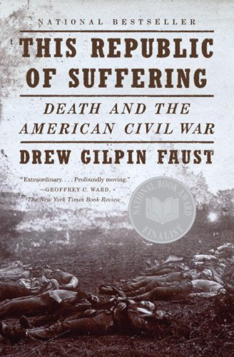

# ＜北斗荐书＞本期主题：《苦难之邦：死亡与美国内战》

# **本期主题：《苦难之邦：死亡与美国内战》******

## **荐书人 / 邵声（北京大学）**

美国内战是美国史学界的一个热点，研究热情长盛不衰，研究著作层出不穷，研究内容包罗万象，所涉范围横跨军事、政治、经济、社会等诸多领域，所及主题包括战役战术、国体政体、种族民族、观念习俗等诸多范畴。在许多人看来，这似乎已是个饱和的领域，做烂的话题，从中很难再有所创新。然而，作为战争最核心的内容——死亡，及其所蕴藏的丰富内涵，似乎鲜有人关注。战争导致死亡，这是常识，人尽皆知，但对于死亡引发的后果，产生的意义，知之者可能便寥寥无几。熟悉导致陌生，最熟悉的事物往往最为人所忽视，哈佛大学的德鲁·吉尔平·福斯特（Drew Gilpin Faust）教授的《苦难之邦》[①]（This Republic of Suffering: Death and the American Civil War） 一书便是力证。该书通过“死亡”这一话题，为我们展现了一段既熟悉又陌生的美国内战。

作者指出，人终有一死，古今皆然，因而死亡是人类永恒的主题。但是，受特定历史文化和时空环境的影响，在不同时代、不同地区，人们对待死亡的态度却大不相同。十九世纪中叶，美国爆发内战，战况前所未有，死伤空前绝后，科技与野蛮齐飞，战场与家园一色，这极大地冲击了美国人传统的死亡观念。随着阵亡人数节节攀升，“死亡”已超出其本身所承载的含义，颠覆了人们先前对生命终结的理解——死亡当发生于何人？何时？何地？何种境况？在今人看来，内战的意义在于废除了奴隶制，重新界定了“自由”、“公民身份”、“平等”等概念，扩展了联邦政府的权力，为美国未来扩张经济和拓展影响奠定了基础。但对当时的人来说，内战最大的影响是“死亡”。它令大量青年英年早逝，使死亡变得稀松平常，让人们终日提心吊胆。最终，这种“苦难经历”让人们超越了在种族、公民身份、国民身份上的分歧，通过牺牲和纪念，使美国南北再次走向联合。[②]

对福斯特来说，“死亡”并非静态，而是动态；不仅是结果，更是过程。在战争中，士兵有责任去战斗、杀戮、死亡，并引发屠杀、苦难、毁灭等相应后果。在当时，“死亡”并非仅为死亡本身，而是一项“业”（work），即“死亡之业”（the work of death）。该“业”包含努力和影响两义，及相互间的联系。在战争中，“死亡”不仅发生，还需“行动”（action）和“行动者”（agents），它必由人施加所致。内战期间，数百万将士都全力以赴致其敌人于死地。同时，“死亡”也需“参与”和“反映”，得由人去经历和面对。人若赴死，必须懂得在生命最后关头，应如何去应对、承受。在所有生灵中，唯有人才能意识死亡、预期死亡，这使人在面对死亡时，需对自己的行为做出抉择，这是人不同于牲畜之处。人性之独特在于人必需设法应对“死亡”。[③]

全书重在研究美国内战时的“死亡之业”，描述从1861到1865年，美国人如何遭遇和应对这项史无前例的重任。面对死亡，人并非仅是被动承受。即使是将死之人，他们也是行为者、参与者。他们预备死亡，想象死亡，涉险死亡，忍受死亡，设法理解死亡。“死亡”的出现与威胁，触动了美国人最根本的情感，使他们重新审视和定义自我。本书以个人如何遭遇死亡和杀戮开篇，探究这种遭遇如何改变社会、文化、政治，使得美国成为一个共患苦难的辽阔国度。“死亡”所带来的变化，有社会层面的，如妻子变为寡妇，孩童成了孤儿；有政治层面的，如黑人士兵为赢得公民身份和平等权，乐意为战，甘愿赴死；有哲学和精神层面的，如面对杀伐屠戮，美国人不得不探究战争灾难的意义和解释。[④]

这些变化使美国人面临一项巨大的任务。这项任务既非拯救或分裂国家，亦非终结或维系奴隶制，更非仅仅赢得军事胜利，而是如何面对战争对原有死亡观念及生命价值和意义所形成的冲击。面对冲击和变化，士兵和平民都努力使自己保持原有的信仰，适应新的变化。美国人不得不寻找（发现、发明、创造）新的方法和手段来应对六十多万死者：他们的死亡，他们的躯体，他们的损失。如何完成这一任务，将关系到如何重塑个人的生命和死亡，同时也关系到如何重新界定他们的国家与文化。“死亡之业”成了美国内战所面临的最根本、最迫切的任务。[⑤]

为破此题，作者先从“临终”（Dying）入笔，解答了何为“善终”（Good Death）？内战如何影响“善终”？人们如何维系“善终”？这种“善终”有无变化？如何变化？变化为何？等几个基本问题。在福斯特看来，内战之前，人们将军事冒险视作英雄壮举、无上荣耀，士兵须时刻准备、视死如归，他们的牺牲将变成文化的一部分，成为男儿气概、精忠报国、为教献身的典范。而这就是最初的“死亡之业”。尽管士兵喜好谈论荣耀征服，建国兴邦，击敌杀寇，但在内心深处，他们常把牺牲看成是自己的首要职责，将死亡看成是对上帝和国家的尽忠。因此，较之杀戮，他们更关注死亡，从而减轻自身所负的杀戮之责。看着周围那些行将气绝者，士兵努力面对自身死亡的可能性和意义。可以说，在士兵构建其内在情感与道德世界时，死亡所起的作用比杀戮要突出。[⑥]

之所以如此，有其深厚的文化原因——“善终”观念。在十九世纪中叶的美国，“善终”观念意义非凡，其源头有二，一为基督教的死亡理论，一为维多利亚时代的家庭传统。长期以来，“善终”在基督徒的生活中占据核心地位，其内容随世事变迁，与时俱进。到了十九世纪六十年代，“善终”的很多要素几乎已脱离了神学教旨，融入到美国南北中产阶级的行为和期望之中，成为流行全国的信仰，关注生命的意义和终结。而随着战争爆发，一种人皆信奉的“善终”观念逐渐形成。南北两地尽皆认同“死亡”意义非凡，不可估量，意味着绝对和唯一的永恒。死亡使人的临终状态成为永恒，并借此可以看到死者的未来。因此，每个人的临终时刻须由其亲人目睹、细看、解释、叙述，尤其是那些身负罪孽但望得拯救之人。同时，根据维多利亚时代的传统，人若要“善终”，需于临终之际，安卧家中床榻，调整心态，做好准备，留下遗言，在亲人陪同中死去。在该传统中，家庭是核心，亲人可借此完成一些基本仪式，给死者以慰藉，并目睹其临终时的精神状态，判断他们将来有无机会再于天国重逢。因此，人生倘若缺此篇章，未留下遗言，那么他的人生必将是残缺不全的。[⑦]

然而，内战打碎了这一传统。战争如拔地而起的山脉，撕裂了完整的家庭，窒碍了亲人的联系，如一道屏障横亘于死者与亲人之间。对死难将士来说，他们去家离乡，身死异地，弥留之际，既不能口述遗言，亦无法得到慰藉；对家属来说，他们千里阻隔，音讯全无，既听不到死者的遗言，亦看不到亲人的音容。面对这一挑战，将士、牧师、军医、护士通过各种方式，实现传统“善终”观念中的各项要素, 努力为生者与死者搭建沟通的桥梁，从而让死者走得安心，令家属觉得放心。[⑧]

在战场上，濒临死亡的士兵通过随身携带的亲人照片，想象自己在亲人环绕中“善终”，或将身边的医护人员当成父母兄妹，寻求“善终”。而在后方，家属希望得到关于死者临终时的信息，以确定其是否得以“善终”。由于缺乏正式和有效的信息渠道，死难将士的战友便首先挑起了重任，给死者家属寄家书，告知其亲人临终时的遗言和情状。在医院，医生则扮演起了相关中介角色。当然，有时候士兵希望自己能直接将信息传递给亲人，因此他们怀揣早已写好的书信奔赴战场；有些将士则在弥留之际奋笔疾书，告知家人自己的最后时刻。为了使死者家属安心，相关的信件都尽量照“善终”的要求写就。[⑨]

更恐怖的是，许多士兵在毫无准备的情况下突然战死，这对传统“善终”观念形成了冲击。按传统，死者若要“善终”，死前须对死亡做好心理准备。为解决这一问题，人们给出新的解释，即人生在世，年寿长短，皆有天数，非人力可违。在上帝眼中，死者辞世早已注定，无所谓有无准备。所以，对士兵来说，只要生前对死亡做出预期，有所表示，即便突然死亡，也不会被视为全无准备，不得“善终”。因而，他们及其周边的人反复强调死者死前已遇征兆，早有准备，从容赴死，死后必得拯救，希望借此宽慰远在家中的亲人。[⑩]

对于那些死时既无遗言，周遭又无他人的死者，人们只能通过其遗容来想象其临终时的状况。为了宽慰死者家人，写信者一般都把死者描述成安详平和的状态，从而使其亲人确信死者得到“善终”，死时并不孤单，死后将上天堂。为了符合“善终”的要求，他们还在吊唁信中描述死者生前举动如何圣洁，道德如何高尚，信仰如何坚定，以求死者家属确信死者灵魂确实得到拯救。[11]

通过这些方式，将士们无形地改变了传统的“善终”观念。新的死亡方式带来了新的宽慰方式，人们开始将爱国职责加入到宗教义务之中，骁勇善战、精忠报国、男儿气概开始成为评价死者是否“善终”的标准，这在非基督徒中较为明显。这使得为上帝效忠和为国尽忠这两项义务间的界限开始模糊，并进而形成一种新的趋势，即国家的宗教化和信仰的世俗化，精忠报国与信仰虔诚开始趋同。[12]

但对一些人来说，骁勇善战亦是可望不可求。尽管军官、牧师、护士、友人都尽其所能地将每个死亡都描写成“善终”，以慰藉死者家属。但对“善终”的强调并非总是通过叙述符合其要求的特征来实现，通过对“恶终”（Bad Death）的描述，也可起到相应的效果，比如信仰丧失、道德沦丧、临阵脱逃之人受到恶报或被执行死刑等等。这些反面素材，使士兵重新思考“善终”，并为之做好准备。[13]

在内战中，美国人努力为自己和战友建构“善终”，但随着战事发展，死亡激增，士兵对杀戮和牺牲的意义产生怀疑。尽管士兵连自己都不相信自己信中所言，并对原有的宗教理论表示质疑，但这些信填补了战场与家庭间的裂痕，克服了战争和杀戮所引发的冲击，将人们的情绪重新调回到十九世纪中叶主流观念对生死意义和目的的理解。在战争的剧烈变动中，人们靠坚守原有的信念来继续推动战争，忍受杀戮。传统文化为其提供了抚慰精神创伤的膏药，理想和信念可以减缓，乃至克服肉体上的痛苦，但死亡终究产生，无法回避，需得解释。对“善终”的描述无法抹掉战争所带来的杀戮。战争中的残酷杀戮，让士兵对杀人者和被杀者的人性提出质疑。[14]

杀戮是战斗的基本手段和目标。在内战中，杀戮对人性和传统文化的挑战更大,比死亡更需要勇气。士兵在杀戮时，既要在思想上和心理上克服宗教和情感的束缚，以便于他们适应新的战争技术和战术，[15]同时又要抑制杀戮，以免完全偏离原有的观念和文化，进而违背人性。对于战争来说，在确保战争目的正义的情况下，如何防止动机偏离，手段过度，结果惨重，人性扭曲，这是个永恒的难题。美国内战也需思考这一难题，但引发其思考的原因主要来自杀戮对传统“善终”观念的挑战。

由于杀戮和摩西十诫中的第六戒相违，与《圣经》的规定抵触。因而一些新的宗教解释应运而生，如杀戮不仅会得到宽恕，更是服侍上帝的需要；为正义而战不违背基督教的精神和职责等。南方人认为他们是抵御侵略，为正义而战；北方人则认为他们为捍卫国家统一而战，亦是正义之战。随着1862年《废奴宣言》的颁布，北方人认为自己乃是为废除罪恶的奴隶制而战，符合教义上的正义原则。借此，南北双方都为自己的杀戮行为找到适当的理由，使自己在实施杀戮行为时心安理得。[16]

尽管多数士兵厌恶杀戮，但职责、自卫、复仇使他们摆脱了负罪感，毫不犹豫地杀敌。然而，随着战事的加剧和死亡的激增，杀戮的目的和动机很快就偏离了原有的轨道。出于情感的需要,复仇逐渐成了士兵实施杀戮的主要原因。在战斗中，因道德和良心的束缚减少，士兵便大开杀戒，形同禽兽，并从中感受到乐趣和成就。此时，杀戮已成为他们的“事业”，是其作为士兵所需履行的职责。士兵发现，人类热衷杀戮的本性很容易打破社会力量对谋杀的束缚，杀戮的手段很容易超出必要的限度。[17]

但内战中特定的社会环境和技术手段挑战了原先的杀戮方式。战争初期，士兵仍按传统的方阵排兵布阵，行军打仗。在方阵中，个人被集体牵着走，形成了集体无意识。随着线膛枪和后膛枪的出现，枪械的射程、精度、频率都大幅提升；大批义务兵的加入，使得士兵普遍缺乏军事知识和经验，军官的指挥难度加大；战场地形日益多样，壕沟堡垒不断出现，这都使得原先的方阵战术被瓦解，士兵从集体中解放出来，对自己的杀戮行为拥有更大的自主权。由于内战都是近距离作战，士兵直面自己的敌人，感受杀戮的残忍，他们更有权决定自己是否开枪。[18]

对待敌人须毫不留情、无需人性，这是打破对杀戮束缚的一种普遍方式。军事训练和宣传都鼓励此类行为。受种族主义的影响，内战中黑人士兵境况特殊。在联邦军队眼中，黑人胆小怯弱，不配上阵杀敌。在联盟军队眼里，黑人参军，等同造反，当杀无赦，勿需留情。黑人对待战争和杀戮与白人大不相同。他们希望通过战斗来界定和主张自己的人性，而非纯粹的报复。黑人通过自己的牺牲来证明自己的男儿气概，他们为追求正义、平等和公民权而浴血奋战。因为奴隶制，杀戮和死亡对黑人便有了特殊意义。对黑人来说，杀戮既是合理报复，也是寻求解放，其目的正义，动机正当，手段适中，结果适当，人性解放。[19]

与此相反，白人士兵的人性在战争中备受扭曲。战后，狂热消退，杀戮暂停，理性复位，他们不得不面对杀戮所带来的累累尸首。面对惨痛的结果，士兵开始反思杀戮的目的、动机、手段，审视自己的人性，直面传统“善终”观念的拷问。杀戮使人惨死，过度的杀戮使人冤死。这种死亡令死者或痛苦，或猝然，或孤寂，或粉身碎骨，或悄无声息，或备受屈辱的死去；让家属或质疑，或忧虑，或恐惧，或绝望，他们的亲人在前线杳无音讯，生未见人，死未见尸，这让他们很难相信其亲人终得“善终”。而对于那些幸存者，杀戮残害了他人的生命，挑战了自己的信仰，他们面对自己人性扭曲所带来的后果，面对人性回归所带来的思考，痛苦不已，彷徨无措。望着漫野尸骨，不少人选择逃避，麻木冷漠，从而减轻负担，寻求解脱；而更多的人则选择面对，思考应对，以求维系传统，唤回人性。[20]

在当时的“善终”观念里，人死需得复生，而躯体便是载体，是该人始终存续的身份。躯体既是某一特定人的本体所在，同时是该人身份的具体标志。这便要求人在亡故后，其遗体需得妥善料理，体面安葬，祭缅祷祝。能否做到这点，将关系到传统可否维系，人性是否唤回，并进而影响到美利坚民族的前途与命运。因此，作者从“杀戮”（Killing）转入“埋葬”（Burying），探讨善后尸体对生者和死者的意义，对维系传统、唤回人性的影响。[21]

内战时，士兵一般希望自己死后遗体能运回故里安葬；如若不能，须就地安葬，至少也要妥善掩埋，使遗体免受敌人侮辱，野兽侵扰。开战初，为防病疫横行，南北两军都制定了规整有序的埋葬程序，并要求战地医院建立专门的病房和墓地，以供尸体安置。在条件允许下，医院人员会记下掩埋信息，提供体面葬礼，甚至营造墓地。但随战事升级，战场扩大，死亡激增，为死者提供坟茔几无可能。且因战事吃紧，人力物力捉襟见肘，大量尸体曝露山野，不及料理。[22]

交战中，因军事撤退、军士求生，大量尸首被弃战场，由获胜一方来料理。出于条件限制，士兵一般对己方尸首还能做到仔细清理，妥善掩埋，而对敌方尸首则草草处置，甚至视若无睹。倘若遇到数量巨大或腐烂发臭的尸首，士兵们或用绳索，或用刺刀，将尸体横拖倒拽，堆于一处。南北双方的士兵被分开掩埋，各方对己方被埋之人会努力确定其姓名和所埋之地，以便他日确认和重葬。由于埋葬任务过重，收尸队将大量尸体或填于战壕，或埋于坑中，或掩于溪谷。但因料理草率，许多掩埋处覆土较浅，一遇雨水，泥沙尽去，尸骨流失，遗体残破。此外，战争伊始，许多人视以棺入殓为死者的一种“体面”，使之有别于动物掩埋。但随后，殓尸用的棺椁也极为匮乏，许多人只得以毛毯将就。更有甚者，别说毛毯，连基本的衣物都缺乏。而一些士兵、盗贼、拾荒者则乘机盗取死者遗物。[23]

在掩埋过程中，不少士兵还担心所埋之人可能只是一时昏厥，并非真死。这反映了当时文化对生死间的界限难以清晰划定。为此，人们对永生的抽象含义和生命的生理标准产生怀疑。不过，只要条件允许，许多士兵会想尽办法，体面安葬其战友，从而维系传统的“善终”观念，比如为其置办棺椁墓地，或相应替代物；擦洗尸体，祝福祈祷。相较士兵，军官在埋葬问题上拥有更多的特权。军官死后，他们的遗体经防腐处理，殓入棺椁，船运至家，隆重下葬。[24]

死者需得帮助，生者亦需救援。在尸堆中搜索战友，是士兵反抗战争，找寻个人生命价值的一个过程。他们通过对死难的战友表示敬意，希望唤回人性，找寻自我，并借此强调自己崇敬人类生命的圣神，人类本身的正义，确定自己存在的目的，希望自己死后，他人也能尊重他。与此同时，罹难将士的家属也在苦苦挣扎。内战令家属和死者千里阻隔，无法及时了解信息，而伤亡报道却又频频讹误，致使许多家属都想亲眼看看亲人遗体，以确信他们确实已死，并无差错。战争初期，伤亡不大，许多州政府愿意，也有能力将死难士兵的遗体运回故里。但随着伤亡急剧攀升，美国原有的设施技术、后勤系统不堪重负，早期的这种做法就难以持续。此时，一些中介机构便应运而生，帮助家属记录、入殓、防腐、运送死者。但这些组织大多要收取费用，这使死者因家境不同而使死后待遇迥异。这种差异和商业化，令许多死者家属不满。他们认为这是将死者商品化，是对死者极大的侮辱。另外，对于大多家庭来说，运回亲人遗体，使其“善终”，所费甚大，这让大量普通家庭不堪重负。人们为此呼吁、抗议，最终迫使联邦政府介入，承担起了料理死者的各种职责。通过立法，联邦修建了专门的公墓，让每位阵亡者都得到平等对待，从而使其死亡意义和价值发生了转变。此时，公墓不仅仅是安置死者的坟茔，更是纪念这些为国殒命者的圣地。这使死者超越家族，开始具有公共的含义，其影响几乎重塑了美国。[25]

与此同时，战场的扩大，也使死者的意义和影响发生变化。随着战争蔓延，战斗无处不有，或田舍乡间，或园林街市；尸首无处不在，或宅院府邸，或稻田井中，战场与后方的边界开始模糊，战争日益渗透到寻常百姓的生活，使平民更深地卷入到战争之中。面对近在咫尺的战场和尸首，许多平民出于内心同情和客观需要，主动帮助军队料理阵亡将士的后事，埋葬尸体，表示哀悼。在此过程中，死者与生者的关系开始扩大，其意义发生变化，一个想象共同体逐渐出现。此时，将士们不仅是为个人和家族而战，更是为整个共同体浴血奋战；其牺牲不仅是其家人的损失，更是整个共同体的损失。在这共同体中，死者的姓名不重要，身份也不重要，重要的是他是为整个共同体的理想和目标而付出生命，使战争具有新的意义，对政治和文化产生重大影响。[26]

从此，个人和国家的联系更为紧密。内战让士兵用个人的生命换回了国家的生命，使美国民主的基础进一步深化。因而，对阵亡将士及其亲人来说，作为死者“本体”和“身份”载体的遗体，理当受到国家的妥善料理。但是，这种料理仅是“埋葬”还不够，还需“定名”（Naming），即确认每具遗体的身份和姓名，使其家属确信亲人已死，并得妥善安葬，从而符合传统的“善终”观念。[27]

然而，当时的美国无论是身份鉴定，还是信息传递，都存在巨大问题。内战爆发后，尽管南北双方都采取措施，要求战地医院记录死者信息，并交政府备案。但双方军队和政府都认为他们并无义务为死者家属提供信息，况且这些信息本身还时常错漏百出。因此，死者亲人只能通过联系死者生前战友或一些机构来获取相关信息，但这些渠道或不可靠，或不及时。许多士兵也开始在自己身边留下身份信息，或请平民记录下自己的信息，以供他人识别确定。此外，一些中介机构开始出现，通过收费为家属收集信息。不少家属还通过媒体，借助广告共享信息，确定亲人是生是死。[28]

对于一些杳无音讯的失踪者，家属也通过各种途径找寻。在他们看来，亲人倘下落不明，生死未卜，他们便难以确定其是否“善终”。但战争手段之残酷，有时让许多死者粉身碎骨，尸首不存，这冲击了当时的宗教观念。在当时看来，人死后，唯有灵魂安详，尸骨安好，方能永生。但死者是否如此，首在确定其身份姓名。最终，阵亡将士家属通过自己的行动促使政府承担起了确认死者并告知家属的义务。[29]

伴随着国家公墓的建立，政府日益认识到自己对阵亡者遗体（包括躯体和姓名）所负之责。在内战中，北方对个人权利的尊重使政府必须关注具体士兵的命运和与之相关的身份。敬重死者与尊重生者互为联系，密不可分。战后，政府着手对死者进行鉴别和重葬，从而重新界定了姓名和躯体的意义，以及国家对阵亡者的义务。[30]不过，对于生者来说，即使死者遗体得到妥善安置，也并不意味战争伤痛彻底愈合。精神和心理的愈合需要一个过程。在此期间，死者家属需面对和接受亲人死亡的事实，并重新认识和思考传统的“善终”观念。

为纪念死者，减轻痛苦，各地纷纷举行各种纪念活动。期间，人们用布道的方式界定死者生死的意义及死亡的实质。幸存者以“善终”观念为基础，借死者临终之语对死者生命价值再做评估。通过公开的纪念，人们聚在一起，形成该共同体共同的记忆。这些纪念最终将宗教仪式和爱国主义融在一起，使死者成为一个符号，一种象征。此时，死者的生死不仅属于个人和家庭，更属于整个共同体。相较传统“善终”，它不仅让死者个人不朽，使其成为社会精神的一部分，更将个人和国家紧密联系在一起，进而赋予国家不朽的意义（林肯之死便是典型）。[31]在哀悼过程中，人们既要表达悲伤，但又不能悲伤过度，需留意他人的痛苦，谨记自己的公共责任。因而，很多人化悲痛为力量，为军队和公众提供各种帮助，避免类似悲剧发生，从而由摆脱个人苦难转向解救公共苦难。[32]与此同时，人们的信仰也经历危机，发生转变。面对惨重的伤亡，扭曲的人性，人们不断询问：何为死？何为生？人能知之否？[33]

内战之前，由于圣经解释不一、科学不断发展，人们开始怀疑原有教义，宗教信仰出现危机。但对于死亡，宗教仍是最好的解释。在当时的观念中，死亡是暂时的，生命是永久的，人死只是将世俗的生命转为天国的生命。这种观念不但宽慰死者家属，还令士兵在面对死亡时，无所畏惧，奋勇向前。它成了人们肩负宗教义务和爱国职责的根本动力。[34]但随着战事发展，家庭破碎，原有的教义发生变化。死者在天堂不仅可以获得永生，且可以和家人完聚。这等于将维多利亚时代的家庭观嵌入宗教观念之中。在宗教世俗化同时，国家也开始宗教化、神圣化，并赋予死亡新的意义。通过修正原有的教义和传统，人们维持了原有的信仰，从而宽慰自己，缓解痛苦。[35]

但也有不少人因质疑内战，进而开始质疑上帝。他们质问：上帝既然仁慈，内战何以会爆发？国家为何要为此付出如此惨重的代价？而战败的南方更是对战争的目的、意义、代价产生质疑，并怀疑上帝是否已抛弃他们。于是，他们终日聚于教堂，寻求宽慰，形成了南部人特有的战争记忆。幸存者在战后备受各种死亡记忆的折磨，迷茫痛苦。还有一些人则反对死亡神圣的观念，认为死亡就是死亡，人死后进入的是坟墓，而非天堂，这些死亡并无光荣意义可言。但对绝大多数北方人和黑人来说，战争拯救了国家，阵亡将士为国捐躯，死得其所。[36]

正因如此，南北双方对战后的善后工作有着全然不同的反应。由于无法接受战败的事实，不少南方人在料理南部死者的同时，不时侮辱北方留在南方的尸首，不断迫害南部的黑人。这迫使国会通过了激进的重建方案，拨出专款用以善后北方阵亡将士的遗体。通过重葬工作和纪念活动，不少公墓在美国出现。这些公墓不同于传统的家族墓地，不仅是生者对死者的一种缅怀，更是对残酷战争的一种直观反映。借此，个人记忆逐渐融入到集体记忆之中。而奴隶制的废除，使大量黑人成为公民，更紧密了集体和个人，国家和公民之间的关系。对此，南方人深表不满。他们自发组织起来安葬、纪念南方阵亡者，通过形成属于自己的战争记忆，对抗北方的统治和重建。同时，在善后的过程中，阵亡人数的“统计”使个人和集体的关系更加紧密和复杂。不同于“定名”，抽象的统计数字虽然消除了死者间的具体差异，令死者获得形式上的平等，但它同时也使死者由具体变成抽象，抹杀了个人的牺牲和意义。

至此，美国内战接近尾声。福斯特在本书的结语（“幸存”（Surviving））中指出，内战虽令无数生命逝去，但更多的人则幸存下来，国家也幸存下来。战后的美国有许多变化， 如“生和死”，“宗教和世俗”，“战争与人性”，“个人与国家”等传统概念都与战前大不相同。但也有一些问题始终存在（如奴隶制虽被废除，但种族歧视依然存在），甚至至今仍困扰着我们（如怎样处理“战争和人性”间的关系）。

全书虽以“死亡”为话题，但核心是“人”，以“人”为出发点和落脚点，以“人性”为归宿。如何对待“死亡”和“死者”，便是如何对待“生者”？如何对待“人”？“人”何以为“人”？等一系列问题。对于“死亡”，人不仅仅是被动的承受者，更是积极的参与者，具有主观能动性，充满了选择。[37]书中大量使用日记、书信、碑文、官方记录等材料，通过当事人的文字，生动再现了内战中的“人”，以及“人”参与和推动下的内战。这使得内战不再是英雄们的故事，数据堆砌下的历史，而是一段属于每个人的经历和记忆。

尽管作者通过丰富的材料，客观的叙述，极具说服力地论述了“死亡”在内战中的作用。但我对作者的一些观点和判断仍持疑问，即“死亡”是否真的使南北双方在精神和心理上由分裂走向融合？或者说南北走向融合的原因是否就是“死亡”？[38]正如作者在五、六、七三章所说，由于对战争的目的和意义理解不同，对战时死者的善后存在差异，南北双方在战后形成了全然不同的战争记忆。这种记忆使南北双方形成了各自的想象共同体，强化了南北间的对立，“死亡”如何最终便能轻易使双方捐弃前嫌，重为一体？相反，作者在结语中则指出，是种族主义使南北双方的白人在战后再度联合。[39]

事实上，如书中第一章所说，“善终”在战前属于美国中产阶级的主流观念，而这个中产阶级必定不包括奴隶，甚至不包括绝大多数黑人，那么这种“善终”观念对黑人能有多大影响，值得疑问？况且，传统“善终”要求以家庭为核心，这对那些家庭脆弱，频遭拆散的奴隶来说，显然是不适用的。而书中第二章认为，在内战中，白人士兵与黑人士兵对战争的参与度，及其目的和意义的理解都存在不同，这必将导致双方对“人性”及其扭曲程度产生不同的理解。相较黑人，南北双方白人在“善终”和“人性”的问题上认识较为一致。然而，在战争中，双方伤亡不同，胜负有别，记忆相反，结局各异，使双方对“死亡”的目的和意义看法不同，这是否会影响双方对“死亡”、“善终”、“人性”等问题的看法？

与此相应，“个人和国家”这对范畴在书中也十分重要。作者认为，内战使个人之死超越家族范围，融入国家这一想象共同体当中，使得个人和国家的关系进一步紧密，加深了美国民主的内涵。但是，我想问，这种“国家”与“民主”是对谁而言的？对于北方人，或者北部白人和全体黑人来说，这种经历战火洗礼的“国家”和“民主”或许意义非凡，它们令北部死者死得其所，生者得以宽慰，黑人获公民权。但是，对于南部白人则全然不同，“国家”剥夺其“财产”，戕害其生命，侵犯其民主，带来了死亡。而这些“死亡”又如何能使南部的白人在精神和心理上真正认同“国家”，融入“国家”？如果他们被迫纳入战后“国家”，那么对南部来说，“民主”何在？进而，这些不同是否会影响黑人及南北白人对“苦难”的体会和理解？

这些问题作者或未回答，或未深究，值得我们仔细思考。

[①] Drew Gilpin Faust，_This Republic of Suffering: Death and the American Civil War _(New York: Alfred A. Knopf，2008).

[②] Ibid，xi-xiii.

[③] Ibid，xiv.

[④] Ibid，xiv-xvi.

[⑤] Ibid，xvii-xviii.

[⑥] Ibid，4-6.

[⑦] Ibid，6-10.

[⑧] Ibid，10-11.

[⑨] Ibid，11-17.

[⑩] Ibid，17-20.

[11] Ibid，20-24.

[12] Ibid，24-26.

[13] Ibid，27-29.

[14] Ibid，29-31.

[15] Ibid，32-33.

[16] Ibid，33-34.

[17] Ibid，34-38.

[18] Ibid，38-43.

[19] Ibid，43-55.

[20] Ibid，55-60.

[21] Ibid，61-62.

[22] Ibid，62-69.

[23] Ibid，69-75.

[24] Ibid，75-80.

[25] Ibid，85-100.

[26] Ibid，80-85.

[27] Ibid，101.

[28] Ibid，103-118.

[29] Ibid，118-135.

[30] Ibid，135-136.

[31] Ibid，137-165.

[32] Ibid，165-170.

[33] Ibid，209-210.

[34] Ibid，171-177.

[35] Ibid，177-189.

[36] Ibid，189-208.

[37] 全书各章节标题用的都是动名词，也证明了这一点。

[38] Ibid，129.

[39] Ibid，268.    

（采稿：徐毅磊 责编：徐毅磊）
