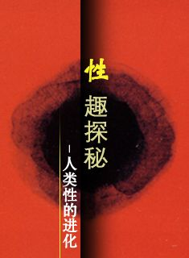

# ＜北斗荐书＞本期主题：何必有爱——荐《性趣探秘》

 

# 本期主题：何必有爱——荐《性趣探秘》

## 荐书人 / 沉樱（北京大学）

 

#### 推荐书籍（点击蓝色字体书目可下载）：

[**《性趣探秘》 **](http://ishare.iask.sina.com.cn/f/9842724.html)

恋爱过，也失恋过，即便如此，我至今仍然对于爱情存有美好的想象。所以我对于“爱情是人类大脑皮层某区分泌的一种递质”的结论在情感上难以接受。

《性趣探秘》是作者贾里德•戴蒙德从达尔文主义的人类学角度探讨人类的性，在承认人类的性活动是一个生物进化学上的问题这一假设前提下理解人类的性活动。尽管很难做到完全的客观公正，但是作者本着人类学“离我远去”的视角分析和尝试理解人类广义性行为，帮助理解这些行为是如何看似寻常而实则荒诞的，又是如何看似荒诞而实则利于进化的。作者既然如此，我也应当尽可能的摘除我对爱情的幻想，以及作为人类一员的固有偏见来阅读和理解作者的书中的思想，本着“离我远去”的心境去重新理解和审视自身的本能。由于重点探讨的是生物学对人类社会的启示，对于作者文中的大量生物学实例不做过多评述。

#### 内容概述和简评

作者在第一章列举了六点人类社会中被认为理所应当而鲜见于其他哺乳动物中的行为：

1．在多数人类社会中，多数男、女最终维持了长期的配偶关系（婚姻），对此，社会的其他成员视作一种契约，双方互相承担义务。配偶间反复性交，彼此都是主要的或者是唯一的性伴侣。相反，很多种哺乳动物的成年雄性和雌性都是独居的，至少在产仔期如此，两性相会只是为了交配。

2．除构成一个性的组合外， 婚姻还是共同抚育后代的伙伴关系。特别是人类的男性和女性一起共同照顾后代。而哺乳动物中的大多数雄性并不提供父性的关爱，精液是他们对后代以及临时配偶的唯一贡献。

3．尽管组成一对（偶见一夫多妻） ，丈夫和妻子（们）并不是作为独居的一对（像长臂猿）独占一块领地并不准其他夫妻侵犯。相反，他们在社会中和其他夫妻一起居住，为经济利益合作，共享社会领域。

4．人类婚姻中的配偶总是私下性交，而社会化的哺乳动物通常在其他成员面前落落大方地做爱。

5．人类的排卵期被掩盖了而不是广而告之。因此，多数人类的交情发生在不适宜受孕的时间。这就是说，人类性交主要是为了取乐，而不是为了受孕。但大多数哺乳动物中的成年雌性在排卵期和能受孕时用种种方法明显地通告自身生殖周期中的短暂时相。

6．所有女性在40岁或者50岁之后会进入绝经期，生育能力彻底丧失。而对于大多数野生哺乳动物来讲，绝经期的存在并不是一个普遍现象。

作者对于人类社会的规范形成了独到的见解：规范包含了对规范的违背：我们把某样事物称作"规范"，只是因为它比它的对立面（对规范的违背）更为普遍。延承这个逻辑，规范可以这样理解：既然理论的前提假设是人类性活动中的主流行为是一种生物进化之后的适应性行为（无论这种进化的结果是智慧的还是愚蠢的），这种利于种群生存繁衍的行为被以规范（道德、礼法等）的形式在种群社会中固化。反过来，凡是在性的伦理中被固化的行为，通常都可以寻找到它的进化学依据。但是事实上，这种阐述未必正确。为什么呢？之前阅读《生命的壮阔》时我们已经很明确了：生物的这种适应性的演化很可能只是一种因时因地下的结果，而无法预知更久远的未来的人类所作出的普遍行为（遵守规范或者触犯规范）是盲目的。承认了这个事实，我们在阅读作者对人类性活动倾向背后的进化学原因的揭示（更确切的说是推测）时就会更加客观。

雌雄两性都是自然选择的受惠者，为什么两性之间常常存在战争呢？为什么会有夫妻不和、吵架、婚外恋？为什么男性会压迫女性？作者给出的解释是，尽管两性都将在自然选择中受益，但父母各自有着不同的最佳策略来达到这一目的。这就产生了父母之间固有的冲突。有利于雄性遗传利益的行为模式未必有利于它的雌性配偶，反之亦然。这一残酷的事实正是人类痛苦的根源之一。

为什么男性更倾向于抛妻弃子远走高飞？从进化的角度上说有三个原因：

1、相形之下，雌性对于由此形成的受精胚胎的投资也要大于雄性，因为多数动物的卵子要比精子大得多。由于人类属于体内受精体内发育，雌性又要进行额外的时间和营养投资。

2、从理论上讲，双方都能够自由地寻求新欢，与之创造出更多的受精胚胎。但是，由于女性在哺乳期不能交配，因此，雌性在这段期间照顾子代并没有任何损失。

3、雄性相比雌性而言更不能保证子代血统的纯正性。进化的结论是，多数雄性哺乳动物选择了在交配后马上远离，去追逐更多异性并令其受孕，由那些雌性去养育孩子——希望那些和他有过一夕之欢的一个抑或更多的雌性的的确确怀上了它的孩子，并且成功地独立养育了孩子。

但是事实上存在着一个困境：在多数社会中抛妻弃子通常是一种比较普遍的现象，但这些社会中抛妻弃子被视为不道德的行为。这是什么原因呢？我认为这是因为从长远来看，男性的抛妻弃子对于自身的繁衍究竟是正作用大于副作用还是相反，这还是一个比较模糊的问题。因为从整个社会的角度而言，单身母亲并不利于子代的成长；另外花心的男人越多，每个家庭生育出父亲不明的子代的可能性就越大。而对于女性而言，由于前两种困境是客观存在的，照顾子代对于她们而言是相对明智的选择。而规范为什么会倾向于抵制男性花心呢？因为这是对女性一定好，对男性可能好的做法，而反面则是对男性可能好，对女性一定不好的做法。

之后的五段文字分别对于人类两性的五个具体的典型特征进行进化学的解释。

从生理基础上说，两性都具备哺乳的条件。事实上不少哺乳动物和少数男性确有分泌乳汁的现象出现。但是为什么男性没有进化这一潜能呢？因为在两性的战争中，泌乳有可能成为男人的累赘和劣势。一只发生突变，能够哺乳后代（或者以其他方式照顾后代）的了不起的雄性在繁殖速度上很快就会被其他自私的正常的雄性超过，因为那些雄性无需哺乳，因而能繁衍更多的后代。近年来，试管婴儿技术的发展在一定程度上消减着女性的固有困境，这为男性哺乳创造了人为的客观条件。可见男性哺乳的障碍不仅是生理上的，更有心理上的因素了：长久以来的社会分工促成了规范的形成，奶爸无疑将被千夫所指。

对大多数哺乳动物而言，排卵期是显性的，唯有人是个例外。而恰是人类的这一例外促成了人类的另一例外——一夫一妻制的规范。对于人类来讲，多数食物需要复杂的技术手段才能获得，这是蹒跚学步的婴儿无论是在技能上还是在智力上都无法企及的，由此人类的孩子至少在断奶后10年内仍需由他人提供食物，父母双方共同养育孩子无疑比一方独力承担要容易得多。于是女性保持对性的接受力，即便是在排卵期后也随时满足他交配的需要。这样，男人就会被吸引住，无需寻找新的性伴侣，甚至甘愿让她分享狩猎所得。因此，性娱乐被假定具有维系人类配偶共同养育后代的纽带作用。作者还通过实验说明了人类向一夫一妻制发展的两个步骤：首先，隐蔽的排卵期产生于乱交的或者配偶群式的物种；然后，随着隐蔽的排卵期出现后，物种向一夫一妻制转变。而其他动物的排卵期显性也有他们进化学上的考虑：

1．雄性精液的产生代价高昂，以致发生基因突变后精液产量降低的蠕虫，其寿命要比正常的蠕虫来得长一些。

2．性占用了时间，而这些时间本可以用于觅食。

3．两性交合时，有受惊和为肉食动物或敌人捕杀的风险。

4．老年人有可能因为性的紧张而疲累身亡： 法皇拿破仑三世在性交时中风，纳尔逊•洛克菲勒在性交时摔死。

5雄性动物间争夺发情的雌性不仅会伤害雄性，而且时常严重伤害雌性。

6．许多动物，包括人类还有在婚外性行为时被抓的风险。

第五章中，作者毫不吝惜的揭示了男性“建功立业”的野心背后的进化学动机——不是为了促进家庭的共同利益，乃是仍然没有逃脱扩大繁殖力的源动力！这种现象并不局限于个别热带狭小部落，而是在人类社会中普遍存在者，就是说，两性的战争也在以这一形式显现着。

第六章中，作者在寻找行为的终极目的而非近因机制的前提下讨论女性绝经期的进化学意义。如果机体的其他条件已经不具备机体的某些功能，那么仅有一个器官正常运作是无济于事的，也是不经济的。预期在生命的后一阶段继续保持生育能力生育出相对弱势的后代，更为明智的做法是用这个精力去照看教育子代以及在口口相传的时代里作为社会智慧的集聚者。

但是，作者并不认为人类所有的进化都是实际上利于生育的。其中的一些，如男性阴茎的增大、女性乳房的增大都只是一种虚假广告罢了。这些对于异性构成一种生殖能力强的假象而争取到更优质的交配对象，而实际上它们的尺寸与生育能力并无直接关联。它们的进化并非来自一条路径。这究竟是一种缺陷？还是有尚未查明的原因？可见人类性装备中最熟视无睹、似乎最一览无余的部件，也会有悬而未决的进化问题令我们惊讶不已。

#### 总结

作者的这些论述讲进化之美展示的惟妙惟肖，却也带给人们这样的慎思：对环境的适应性演化和种群演化过程中的分化是进步的？还是退步的？还是不确定的？作者的答案是，每一种进化都是有原因的，却未必是真正合理的。因此，判定这一问题的答案可能还需要更漫长的时间尺度的静观。

我认为，此书是一本非常适合男性阅读的书。介于作者对男性诸多特征行为原因的独到论述，此书将有助于男性更加了解自己的本能以及这种本能背后真实的诉求。例如，他们会看到，婚外情有对个人有利的作用，同时也存在着一种风险性。此书适合在两性战争中失利的女性阅读，因为这让她们更加清楚来自男性的冒犯的本质。从而能够早日从悲伤中自我解放，去寻求自身更大的价值。此书适合所有人类阅读。因为此书对规范的论述让人们得以充分认识到规范并非与自己的利益相违背。恰相反，规范是从长远角度保护人类自身利益的有力工具。

回到最初的问题。性趣背后的进化学意义让我对爱情失去信仰了吗？读罢此书，我的答案是——正相反，性趣的进化意义让我更加深刻的理解两性之爱。两性之爱并非纯粹的情感，而是感性与理性兼有的产物。处于本能的性吸引产生了两性最初的接近。但这并非爱情。这远非爱情。爱情是人类经过漫长进化积累了繁衍经验之后融入了社会规范的一种综合的情感，因为融入了祖先积累了漫长光景的智慧，爱情的排他、专一和恒久性成为即经济又能够满足人类心理愉悦感的情愫，让爱情成为人类生生不息的唯美动机。失去了这些，人类之爱该是多么苍白无力呢？

 

（来自北斗投稿邮箱 责编：徐毅磊）

 
