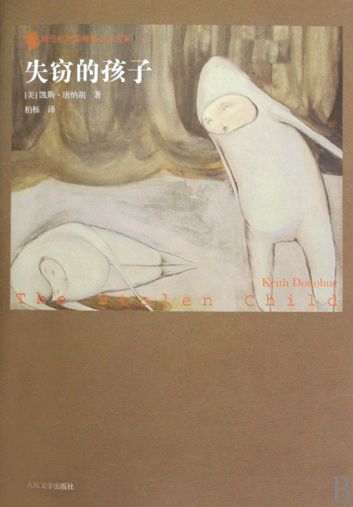

# ＜北斗荐书＞本期主题：凯撒的归凯撒，天主的归天主

# 本期主题：凯撒的归凯撒，天主的归天主

## 荐书人 / 谷卿（暨南大学）

  小时候，总听大人告诫：不要去水边玩，那里有水鬼。水鬼是淹死的人变的，等你一到水边，就被它拉下去顶替它，然后水鬼就又能做回人了。 这个充斥着自私、卑鄙的阴暗心理的传说让我一直不敢对湖沼江河有任何亲近的感觉和举动。 不同地域和国家的文化也自会有它的相似性。在爱尔兰的民间传说中，中国的水鬼改版成森林里的仙灵。这些坏仙灵们时常会趁夜偷走人类的小孩，再把自己伪装成这个孩子的模样，居住在人类的世界里，享受着本不属于他的人间的温情，并且将会像正常普通的人们一样，成长、工作、恋爱、结婚、生子、老去直至死亡；另一面，人类的孩子将会逐渐失去人类的特征，享有仙灵所有的魔力和特质，而其外在的形态，就永远是像童话里蓝精灵那样的孩童模样。 相同的故事被爱尔兰裔的美国作家凯斯•唐纳胡搬移到了宾夕法尼亚，出现在这位文学博士的处女作《失窃的孩子》中。 “造文”应当“为情”。在家里七个孩子中排行老四的唐纳胡，从小就觉得自己可能就是一个“换生灵”。我们会在阅读中发现，唐纳胡已经将自己过去和现在的不论合理与否的所有想法镕铸到他的文字中，他就是在描述自己痛苦的成长经历，以至于他的文字有时候显得相当的情绪化，但我们却又常常感觉不到，那是因为在作者情绪化的同时，我们也刚好或者惊喜或者颓唐，或者抱怨或者激奋起来。就像《出版人周刊》评论的那样：“对局外人来说，这成就了一本深刻的小说，因为那感情再自然不过了。” 但所有事情终归是“凯撒的归凯撒，天主的归天主”，这是《圣经》为我们作出的庄严而郑重的描述和预言。伴随着生命而来的，有许多固有的本质和特性，它们像一块块塑模，在对生命的外在形貌进行塑造的同时，还影响了生命的心灵和思想。缤纷而繁盛的生命世界因为这些塑模的不同而精彩。所以，当捣蛋的仙灵成为人类以后，他面临的是孤独，面临着身份的丢失和新一轮以及一轮又一轮的尝试与适应。铁凝女士在她那篇优美的散文《我有过一只小蟹》的最后写道：“远处是车的洪流，人的洪流。我忽然觉得小蟹就在其中。我甚至知道它在朝着哪个方向不停地奔走，那是一个美丽、迷人的地方。可是，你能闯过那车的洪流人的洪流吗？你走得那样急忙；你懂得去看那不停变幻的红灯绿灯吗？你的眼睛又是那样痴呆；你能逃过那些调皮孩子之手吗？也许一只小鸡、一只小鸟都能使你粉身碎骨……”就生命的历程而言，最大的困难就是“不了解”和“不适应”，而一旦克服了这两样最大的困难，生命的力量才会彰显，生命的光芒才会迸发。当然，远离人类文明而变成仙灵的孩子同样遇到了痛苦，像小说中的安尼戴，他已经忘却了自己的名字、家庭、身世，忘记了过去的所有，但潜隐在他生命最深处的零散琐碎的记忆，却日常敲击着他的心灵，并借助梦境重新向他靠近。在现实生活中，仙灵的世界也不是万象太平，不但环境是复杂的，形势是严苛的，他们还要为生存担忧和奔波，还要想尽办法来消耗那些消耗不掉的无聊光阴。从“有意义”到“无价值”的沦落，是每一个有着文明背景的社会人所不能容忍的，都必须为恢复自身在社会和文化方面所本身就具有的功能性而奋斗和努力。终于，安尼戴掌握了阅读的方法，他常常和斯帕克泡在图书馆，去汲取人类文明的精华。由于精神中的文化参与，安尼戴的思想发生了很多改变，包括他对斯帕克的感情。他试图回到家人的身边，但当他找到家人以后，莫名的距离和陌生让他再度陷入悲哀困苦的境地。 也许互换角色成为亨利和安尼戴人生的转折点。这令人想到卡夫卡的《变形记》。两个人的道路本来依循着自然的自我，现在却要努力地追寻对方的影子，去扮演一个扮演者的角色。特别是亨利，他渐渐发现自己有着演奏钢琴的奇异禀赋，这也是一直伪装着自己的他唯一伪装和掩蔽不了的。到后来，他历经艰辛苦难，寻找到一个德国少年钢琴家，却又惊奇地发现那其实就是自己：一百年前，一个钢琴神童被偷换到使他失去记忆的森林里。这个离奇的结果其实并不离奇，对钢琴的特殊感觉已经成为亨利身上流淌着的血液了。这证实了那句话：人呵，唯一骗不了的是自己。 大多数人照镜子的时候总会有一种怪异感，那是两个世界的影像，相似而对立。面对着自己，似乎心中还是会有一些紧张。所有人的人格都是双重的，一方面对自己有着经验性的认识，另一方面要接受来自不同方向的角色确证。双重人格决定了我们的矛盾。我们常常考虑一件事情的真实与否，可一旦涉及到自己，这些发问都最终不了了之。勿庸置疑，一切人格地位和社会角色都是由相应的文化背景支撑的，也是由文化综合力所产生的。个人、文化与社会——在仙灵的世界中，或许可以用“群体”来代替“社会”这个称谓，它们之间的关系，或者说互动性，正提示了人们认识自我的重要性。对于“自我”的找寻与确证，是人生最为重大的课题。从小到大，我们历经了那么多的角色转变，接受到了那么多不同的评介，是否会有助于增强自我认知的可信度呢？结果恰恰相反。因为这些使我们社会化的形式把过去所有对它的具体化发挥过促进作用的东西都包含在自身之中。当越发迷惑的我们读到亨利和安尼戴的故事时，真的会有一种似曾相识更或似曾遭逢的“触电般”的感觉。这部“写给大人的奇幻童话”埋藏着我们所有人曾经有过的失落与彷徨。 人生是一场漫长的旅行，就像安尼戴的寻找属于自己的过去、寻找他认为应该属于他的爱情而进行的征途。一个又一个的目标让我们不断鼓起勇气，但这些勇气的背后，还是有着很多的愧疚和无奈，因为我们扮演了很多不属于我们的不该扮演的角色。当所有得到最终的归结后，人格的精神还是化为本原。 “不背起自己的十字架而跟在我后面的，谁也不能成为我的门徒。”谢谢凯斯•唐纳胡，谢谢他提示起了我们那曾经的忘怀。 

### 推荐书籍（点击蓝色字体书目可下载）：

[**《失窃的孩子》**](http://ishare.iask.sina.com.cn/f/9347706.html)

（采稿：徐毅磊 责编：徐毅磊）
