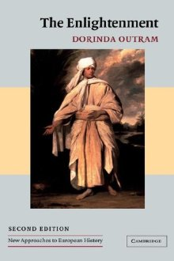

# ＜北斗荐书＞本期主题：启蒙世纪的漫漫长路

### 

### 

# **本期主题：****启蒙世纪的漫漫长路**

** **

### 

## **荐书人**** ****/ ****李兰希（Boston University）**

### 

### 

 **从伦敦铁塔的雨到巴士底狱的火——欧洲启蒙运动史阅读书目推荐** 被十七、十八世纪启蒙历史的各种文章轰炸折磨了一学期后，粗浅讲讲我个人对启蒙的理解：启蒙是一个个体自我感知天赋理性的存在的过程，是人学习如何运用自己的理智和判断力去看世界的过程。启蒙的主体只能是人自己，外人帮助颠覆某种信仰和价值观，并不是真正意义上的启蒙。除非人们通过对书籍和文章的阅读理解，提高自身独立思考能力，建立自己的价值评判体系，否则除了我们自己，别人都启蒙不了我们。启蒙不是对某种价值观的单纯推翻或塑造，而是利用自身理性智慧建立一个对不同价值观的独立判断标准，一种对真假善恶的自我评判尺度。 所以说，从不存在真正意义上的启蒙领袖。无人有能力去启蒙他人，也无人有资格随便以启蒙者狂妄自居，把他人放在“需要被启蒙的愚昧者”的地位上居高临下审判。启蒙本就是基于对人类理性的局限性和不可知的自然神的敬畏。用攻击性言论或非其他背叛理性的手段去颠覆他人信仰，只会让人从一种“蒙昧”转为另一种“蒙昧”，从对某一种意识形态的盲从转变为对另一种意识形态的盲从。另外，在某种程度上，用攻击性很强的方式去强行灌输某种价值观，本身就是一种反启蒙或“伪启蒙”。它或许可以是批评，可以是诘责，可以是警告，但绝对不是启蒙。历史的经验证明，这种“伪启蒙”可以是非常危险的，它对社会的危害甚至会超过原始的“蒙昧”，在大多数情况下，它的结果是历史的轮回。 另外，正如狄德罗在《百科全书》中所说，启蒙不是一件仅交给某一群人某一个时代来完成的任务，启蒙是一个自古希腊智者涌现时就开始的人类智慧发展进程，其本身始于久远、未有终结。这种进程并不会随着任何一群智者与哲人的死去而结束，不会随着1688年光荣革命的胜利而结束，也不会随着1789年法国大革命的爆发而结束。启蒙是人类对自身理性上限的探索与开拓，并不是作为某种政治运动或社会变革的工具而有意义，启蒙的存在本身就是终极意义。所以，狄德罗认为18世纪的欧洲启蒙运动只是这场未知尽头的人类进程中承上启下的一个瞬间，对人类的启蒙来说是一场奠基，绝不是胜利的终结。而对于我们这个时代来说，启蒙没有胜利，没有失败，更没有结束。因为我们既没有生活在人类历史上的第一个时代，也未必生活在最后一个时代。 那么究竟什么是启蒙？我想康德的一句话或许能简单地概括一个世纪的千言万语： Sapere Aude! （Have the courage to use your own understanding!） 整理了一些关于欧洲启蒙时代的阅读材料，希望那些写于启蒙时代的文章能帮助对“启蒙”感兴趣的同学更深入地了解欧洲启蒙世纪的历史。 

### 

### ****

### 

### **推荐书籍（点击下载整个压缩包）：**** **

**[启蒙书单压缩包](http://ishare.iask.sina.com.cn/f/15881729.html)**

**1****、关于“启蒙”的含义——"What is Enlightenment?"**

_1__）Ernst Cassirer恩斯特·卡西尔，德国“新康德主义”哲学家_ _ __“Enlightenment” （The Encyclopedia of the Social Sciences 547-552*）_ _2__）Peter Gay，耶鲁大学历史系教授_ _ __“The Enlightenment in the History of Political Theory,” Political Science Quarterly 69, no. 3 (1954): 374-389_ _3__）Robert Darnton, 罗伯丹屯，十八世纪法国文化史学家_ _“In Search of the Enlightenment: Recent Attempts to Create a Social History of Ideas,” The Journal of Modern History 43, no. 1 (March 1971): 113-132_ _4__）James Schmidt, “Enlightenment,” in The Encyclopedia of Philosophy, 2nd Edition._ _5__）Dorinda Outram, 罗切斯特大学历史系教授_ _"The Enlightenment"( __《启蒙运动》）1-10_ _6__）Condorcet 马奎斯孔多塞, Sketch for a Historical Picture of the Human Mind（《人类精神进步史表纲要》）_ _7__）Moses Mendelssohn 门德尔松, “On the Question: What is Enlightenment?”_ _8__）Immanuel Kant 康德, “Answer to the Question: What is Enlightenment?” （《什么是启蒙》）_ **2****、启蒙运动萌芽的社会背景——17世纪晚期的欧洲政治社会格局** _1__）Dorinda Outram,“The Enlightenment”, （《启蒙运动》）28-46_ _2__）Duc de Saint-Simon， “The Court of Louis XIV”_ _3__）Duchess of Orleans 奥尔良公爵，“Versailles Etiquette”（《凡尔赛礼仪》）_ _4__）Frederick the Great 腓德烈大帝，“Benevolent Despotism” （《开明专制》）_ **1688****光荣革命的启示：英国新教徒对于法国枫丹白露赦令的大反击** _1__）Louis XIV 路易十四, “Revocation of the Edict of Nantes” （《枫丹白露赦令》） 2）Bayle 皮埃尔·培尔，法国哲学家，“Miscellaneous Thoughts on the Comet of 1680 ”_ _3__）Locke 洛克, Second Treatise of Civil Government (《政府论》）_ _Letter Concerning Toleration __（《论宽容》）_ **3****、启蒙时代对宗教宽容的诉求与各种兴起的“异端”思潮** _1__）Outram, The Enlightenment （《启蒙运动》） 109-125 2）Daniel Defoe 丹尼尔笛福, 《鲁滨逊漂流记》 3）牛顿, Letter to Richard Bentley （《给Bentley的信》）_ _4__）Toland 托兰德，Christianity Not Mysterious （《基督教并不神秘》） 5）Collins 安东尼柯林斯, A Discourse of Freethinking （《论自由思想》）_ _6__）Rousseau 卢梭, “Profession of Faith of a Savoyard Vicar” （《薩瓦副主教的信仰告白》）_ _7__）Priestley 约瑟夫·普利斯特里, “Letter to Dr. Horsley”_ _8__）Paine 托马斯潘恩, The Age of Reason（《理性时代》）_ _9__） Gotthold Ephraim Lessing 莱辛, “On the Proof of the Spirit and Of Power,” （《未署名片断》）_ **泛神论、无神论、对宗教沦为政治工具和骗术的怀疑论的兴起** _1__）匿名作者, The Treatise of the Three Impostors （《三个江湖骗子的论述》）_ _2__）Julien Offray de la Mettrie 拉美特利, 机械唯物主义哲学家，Man, A Machine （《人是机器》）_ _3__）Baron D’Holbach 霍尔巴赫, System of Nature (《自然的体系》）——被后世称为“无神论的圣经”_ **伏尔泰与启蒙运动** _1)Philosophical Letters __《哲学通信》_ _2)Philosophical Dictionary, __《哲学辞典》_ _重点词汇:"Enthusiasm” “Faith” “Fraud,” “Freedom of Thought,” “Morality,” “Prejudices,” “Theist,” “Virtue”“The Ecclesiastical Ministry,” “Fanaticism,” “Religion,” “Sect,” “Superstition,” “Tolerance,” “Democracy,” “Equality，”“Fatherland,” 3)Treatise on Tolerance in Candide and Other Writings_  **4****、公共生活转型与公共领域崛起** **科学界的形成与自然科学兴起** _1)Outram, The Enlightenment (__《启蒙运动》）93-108 2)伏尔泰, Philosophical Letters （《哲学通信》）_ _3)__牛顿, “Mathematical Principles of Natural Philosophy," (《自然哲学的数学原理》）_ _4)Condorcet __马奎斯孔多塞, Historical Picture of the Human Mind（《人类精神进步史表纲要》）_ _5)__本杰明富兰克林, Experiments and Observations in Electricity （《电学实验与观察》）_ _6)Priestley__约瑟夫·普利斯特里, History and Present State of Electricity（《电的历史与现前状态》）_ **英国：“咖啡馆文化”的兴起与启蒙期刊《闲谈者》《观察者》的流行——公众意见萌芽** _1__）Outram, The Enlightenment （《启蒙运动》）11-27. 2）Lawrence Klein, “Coffeehouse Civility, 1660-1714: An Aspect of Post-Courtly Culture in England” The Huntington library Quarterly, Vol. 59, No.1, 1996; 30-51. 3）Richard Steele, The Tatler （《闲谈者》）_ _4__）Joseph Addison, The Spectator （《观察者》）_ **法国：女性引导的“沙龙文化”成为启蒙思想摇篮** _1__）D’Alembert 达朗贝尔, “Portrait of Mlle. De Lespinasse” 2）卢梭, Discourse on the Arts and Sciences （《论科学与艺术》）_ _3__）Dena Goodman, “Enlightenment Salons: The Convergence of Female and PhilosophicAmbitions,” （《启蒙时代沙龙：女性聚会和哲学家抱负》）_ **作家、出版家与书商——启蒙时代的阅读革命** _1__）伏尔泰, “On the Horrible Danger of Reading,”_ _2__）伏尔泰, “Liberty of the Press"（《哲学辞典》）_ _3)Robert Darnton __罗伯特达恩顿, Forbidden Best-Sellers of Pre-Revolutionary France (《法国大革命前被禁的畅销书》）_ **启蒙时代的地下社会: 敏感词迷雾中的另一个世界——共济会以及其他秘密社团** _1__）Lessing莱辛, “Ernst and Falk: Dialogues for Freemasons” (《共济会员对话录》)_ _2__）Margaret Jacob, Living the Enlightenment: Freemasonry and Politics in Eighteenth-Century Europe （《生活在启蒙时代：18世纪欧洲共济会与政治》）_  **5****、狄德罗与《百科全书》的启蒙理念（The Encyclopédie)** _1)D__’Alembert 达朗贝尔, “Reflections on the Present State of the Republic of Letters,”_ _2__）D’Alembert, “Preliminary Discourse to the Encyclopedia” （百科全书序言）_ _3__）Diderot 狄德罗, “The Encyclopedia” “Philosopher”_ _4__）Voltaire 伏尔泰, “Philosopher” （《哲学辞典》）_ **《百科全书》中的政治与社会理念** _1__）狄德罗，“Political Authority” “Natural Rights” 2）卢梭，“Political Economy”_ _3__）de Jaudcourt，“Natural Equality” 4）d'Argis,“Law of Nature”_ _5__）Saint-Lambert, “Luxury” (注：此君是伏尔泰挚爱夏洛特夫人的最后一任情人，夏洛特夫人为此君产子而亡，此后伏尔泰去往德国并为夏洛特夫人哀叹：她是一位伟人，唯一的缺点是她是一位女人）_ **狄德罗的唯物主义与道德哲学** _1） __“D’Alembert’s Dream” （《达郎贝尔之梦》）_ 2） _2__）“Rameau's Nephew” （《拉摩的侄儿》）_ **6****、苏格兰启蒙运动** **曼德维尔与哈奇森的世纪之争：苏格兰道德哲学奠基** _1__）Bernard Mandeville 曼德维尔, Fable of the Bees （《蜜蜂的寓言》）_ _2__）Frances Hutcheson 哈奇森, “Remarks Upon The Fable of the Bees.” 3）Frances Hutcheson 哈奇森, System of Moral Philosophy （《道德哲学体系》）_ _4__）Adam Smith 亚当斯密, Theory of Moral Sentiments （《道德情操论》）_ **苏格兰道德哲学的政治、经济学奠基：对于奢侈品与商业文明的批判与赞扬** _1__）Hume 休谟, “Of the Rise and Progress of the Arts and Sciences,”_ _2__）Hume 休谟, “Of Luxury”_ _3__）Adam Smith 亚当斯密, Lectures on Jurisprudence （《法理学演讲录》）_ _4__）Adam Ferguson 亚当·福格森, Principles of Moral and Political Science (《道德与政治科学原理》）_ _5__）Adam Smith 亚当斯密, The Wealth of Nations （《国富论》）_ **公共美德与个人利益** _1__）Montesquieu 孟德斯鸠, Spirit of the Laws （《论法的精神》）_ _2__）Adam Ferguson 亚当福格森, An Essay on the History of Civil Society （《论文明社会史》）_ **7****、启蒙运动局限性：殖民地探索、奴隶制与女性解放** **启蒙时代的航海探索与殖民文化** _1__）Outram, The Enlightenment （《启蒙运动》）47-59 2）Abbé Raynal, The Philosophical and Political History of the Settlements and Trade of the Europeans in the East and West Indies_ _3__）Rousseau卢梭, Discourse on the Origins of Inequality (《论人类不平等的起源》_ _4__）Diderot 狄德罗, “Supplement to Bougainville’s Voyage” （《布干维尔游记补遗》）_ **启蒙思想对于奴隶制与种族歧视的探讨——启蒙时代的民族主义** _1__）Outram, The Enlightenment（《启蒙运动》） 60-76 2）David Hume休谟 , “Of National Character” （《论国民特质》）_ _3__）Montesquieu 孟德斯鸠, 《论法的精神》_ _4__）“Negro (Natural History),” （《百科全书》）_ _5__）Thomas Jefferson 托马斯杰佛逊, Notes on the State of Virginia （《弗吉尼亚州纪事》）_ _6__）Joseph Priestley约瑟夫·普利斯特里 , A Sermon on the Subject of the Slave Trade 7）Thomas Paine 托马斯潘恩, “African Slavery in America” （《在美洲的非洲奴隶》）_ **启蒙与女性** _1__）Outram, The Enlightenment（《启蒙运动》） 77-92 2）Jean-Jacques Rousseau 卢梭, Emile（《爱弥儿》）_ _3__）“Woman” (Ethics),《百科全书》 “Woman”(Jurisprudence), 《百科全书》 4）Catherine McCaulay 凯瑟琳麦考利, Letters on Education_ _5__）Mary Wollstonecraft玛丽沃斯通克拉夫特 , Vindication of the Rights of Woman（《女权辩护》）_ _6__）Condorcet 马奎斯孔多塞, “On the Admission of Women to the Rights of Citizenship”_ _7__）Olympe de Gouges 奥兰普·德古热, The Rights of Women (《女性与女性公民权宣言》）_ **8****、1780年的欧洲：启蒙思潮成果及其影响** **启蒙在德国：莱辛与门德尔松的宗教理念** _1__）Mendelssohn 门德尔松, Letter to J. C. Lavater_ _2__）Lessing 莱辛, Nathan the Wise （《智者纳旦》） 3）Mendelssohn门德尔松， “On Lessing”_ **法国大革命前夜：导火索与暗涌** _1__）Outram, The Enlightenment （《启蒙运动》） 126-140 2）Beaumarchais 博马舍, The Marriage of Figaro （《费加罗的婚礼》）_ _3__） Abbé Sieyès 西哀士, "What is the third Estate?" (《什么是第三等级》）——法国大革命宣言_ _4__）“Declaration of the Rights of Man and Citizen,”（《人权宣言》）_ **参与法国大革命的英国力量:构建新圣城的乌托邦理想** _1__）Richard Price 普莱斯, “Discourse on Love of Our Country.” （《论爱国》） 2）Thomas Paine 托马斯潘恩, The Rights of Man （《人权论》）_ _3__）Joseph Priestley 约瑟夫·普利斯特里, “Of the Prospect for the Enlargement of Liberty, Civil and Religious, opened by the Revolution in France”_

（采稿：管思聪 责编：徐毅磊）
