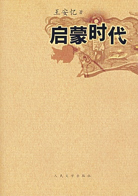

# ＜北斗荐书＞本期主题：告别理想乌托邦的青春年代——读《启蒙时代》

**在可以做梦的年纪，诸如革命之类的字眼就是某种私密又神圣的梦境，天然地带有浪漫主义的味道，就像在某种光芒下敞亮的原野，有种让人一往无前想要仗剑走天涯的空旷意境。在无数个叛逆又压抑的青春期和后青春期，这些梦幻般的字眼照亮了蒙昧的暗夜，组成了一个关于未来的、具有无限可能性的开放性文本——它们是特属于少年时代的理想乌托邦，有种超脱于那些鸡毛蒜皮、柴米油盐的琐屑人生和庸常命运的华丽，仿佛每一个细节都能引申出关于启蒙的诗篇，自有一种居高临下的仪式感。即便是被大时代的激情裹挟着无力反抗，可是，所有主动被动的反抗似乎最终都理所当然地指向了同一种狂热，这狂热是不羁的逃脱、是欢快的奔跑、是懵懂中祈盼那么一点星光然后指向通往神坛的捷径。**  

# 本期主题：

# 告别理想乌托邦的青春年代——读《启蒙时代》

## 荐书人 / 徐璐（浙江工商大学）

 

一张没有乌托邦的世界地图是没有价值的，因为它缺少了人类终要落脚的地方。

——王尔德

在可以做梦的年纪，诸如革命之类的字眼就是某种私密又神圣的梦境，天然地带有浪漫主义的味道，就像在某种光芒下敞亮的原野，有种让人一往无前想要仗剑走天涯的空旷意境。在无数个叛逆又压抑的青春期和后青春期，这些梦幻般的字眼照亮了蒙昧的暗夜，组成了一个关于未来的、具有无限可能性的开放性文本——它们是特属于少年时代的理想乌托邦，有种超脱于那些鸡毛蒜皮、柴米油盐的琐屑人生和庸常命运的华丽，仿佛每一个细节都能引申出关于启蒙的诗篇，自有一种居高临下的仪式感。即便是被大时代的激情裹挟着无力反抗，可是，所有主动被动的反抗似乎最终都理所当然地指向了同一种狂热，这狂热是不羁的逃脱、是欢快的奔跑、是懵懂中祈盼那么一点星光然后指向通往神坛的捷径。

可是革命之后呢？又或者说，革命本身，对于千万个日常起居、光尘弥漫的平常生活而言又意味着什么呢？王安忆的《启蒙时代》将镜头对准了轰轰烈烈、红红火火的文革大事件——红卫兵运动和知识青年上山下乡，让南昌、陈卓然、小兔子、小老大、阿明、舒娅、舒拉等南国北地的少男少女们从虚幻的大时代叙事画卷中走出来，在牵连着一粥一饭、一地鸡毛的“革命”图景中自由地展现着青春本身琐碎却又蓬勃的生命力——这图景已然不再是某种崇高的乌托邦意识形态，它像一条真实而又漫长的理性之路，通往另一种时代的真相，通往一代人的自我启蒙和内在成长。

故事从一九六七年和一九六八年冬春之交的上海开始，又在一九六八和一九六九年相交之际的上海结束。张爱玲说过：“日子过得真快，尤其对于中年以后的人，十年八年都好像是指顾间的事。可是对于年轻人，三年五载就可以是一生一世”。短短的时间跨度里，不同面孔的南国青春在大革命的名义下以最天真迷茫的形态开始了混乱而彻底的生长。来自革命家庭的南昌、陈卓然们在囫囵吞枣式的阅读和阅读之间沉迷于锋芒毕露的修辞、逻辑、辩论——就像漂浮在水面的无根植物，色泽鲜亮得耀眼又刺眼，却终究是惶惶然而只能顺流而下。马克思的《路易波拿巴的雾月十八日》，黑格尔的《小逻辑》，毛泽东的《湖南农民运动考察报告》，恩格斯的《反社林论》，乃至于过早步入成熟的静谧状态的小老大坐在他幽暗又娟秀的小客厅里诵读着屈原那些文字里枝蔓优美而洁净的香花异草，对于浮在暴戾岁月表象的青春而言，它们只是文字和知识单纯的累加，是脱口而出时那一份自信的与日俱增，是胸怀第三世界未来命运和无产阶级革命前途的背景，它们并不意味着独立思想的普照和人文情怀的滋养。你看这些似乎无忧无虑的年轻人，骑着单车从南国潮湿而明亮的阳光里驶过，车轮轻松地碾过那些树影葱茏的光阴，好像一切都尽在他们的掌握之中。然而，他们又无时无刻不是活在一种分裂和对抗里，并且伴随着一种潜伏着的焦灼。生长在革命家庭的南昌，有点儿忧郁和沉默却又表现出滔滔不绝的话锋的南昌，他可以和他的精神领袖陈卓然高谈阔论法国大革命、无产阶级革命和第三世界的运动，他可以和他的伙伴们义正辞严地要求嘉宝的祖父反思自己的剥削罪行，但他，乃至他的伙伴和偶像们回归到各自的生活中后甚至并不知道怎样面对自己的亲人。很多时候，日常生活对他们而言只是等同于沉默在生活底部的紧张、抗争、茫然无措，比如少年南昌厌恶照顾自己饮食起居的大姐，鄙夷自己那似乎总脱离不了托派式抑郁和小资产阶级知识分子软弱的温情的父亲。他们四处游谈，在市井巷陌、寻常人家里、在学校的礼堂和教室里指点江山又激扬文字，却还是不能免俗地陷入了各自青春期里维特式的烦恼和尴尬，并且因此而体验了带着疼痛的人生一课。也正是在这一课里，那个活得看似卑微实则纯澈的高医生告诉了少年南昌刻骨铭心的四个字：“光和真理”。

这是被革命口号、阶级斗争、道德审判给灌输大的一代人，这是活在热闹的虚无和空洞的浪漫中的一代人，这是被从文化传统的土壤中连根拔起随即又牺牲无数和爱、生命、尊严、思考有关的细节以及过程而匆忙奔向粗糙现实的一代人，这是动辄热血万丈祭出启蒙大旗、用力仰望理想神坛上的被膜拜者却最终将自己和其他大多数人都淹没在茫茫集体无意识浪潮中的一代人。而创造了一方自得其乐小天地的沙龙核心小老大，曾经在短暂的囚禁生涯中被真知开启另一种生命视野的纯净少年阿明，都是作者笔下某种真正理想的代言者。他们从关注生命深处最细微的体验开始，在年代和日子的夹缝中寻找着和时代主题格格不入的小美好、小情调，并在浮躁的青春期里迅速沉静下来，认真而庄重地将自我交还给自我，同时也交给自我构筑充满风景的精神生活的艰难使命。所以，植物、疼痛、数学、画、皖南的山水……它们不是毫无意义的单调词汇和概念，它们在个体的经验里获得了丰富的内在，并因此而成为个体发现自我的一个又一个契机和缘起。也正是在这些续断若离的自我认知和自我构建中，那些青春期所特有的躁动和不安才能被慢慢褪去，并因此而让自我走向更深远的启蒙之旅——这个看似肃穆而宏大的过程事实上被小老大、阿明们那些柔韧而清亮的小世界祛魅并得以彰显出思想在荒蛮中缓慢成熟的画面感和节奏感，像《关于莉莉周的一切》中所放映出来的青春一样带着和远方相连接的梦幻感，又轻盈又沉重

对于这些莽撞又可爱的少年们，王安忆在看似漫不经心的笔墨挥洒间为他们编织了截然不同的“革命”情境——如此的细碎，如此的家常，如此的小儿女。南国清澈的日光拂过他们轻快的身影，像静水流深，涤荡了某些人性的残酷和丑恶；注视着他们笑容和眼泪的树、花朵是这城市里秘密的见证者，也和他们一起成为了无数片断和叙述的组成部分，细腻、倔强、孤独；曾经被他们鄙视的小市民们的弄堂生活的烟火气因为层层民间历史的沉淀而愈显迷人，有种温情的幽默感，那是经过了鸡零狗碎的历练和大风大浪的折腾之后的中国式生存哲学，有冷眼旁观的俏皮和勇敢。这些全都是他们之前没有看到也不屑于看到的万象人生，而他们最终还是和他们当初竭力要逃离的这些达成了和解，就像是冬春交接之际的江河，冰封的表面下有逐渐温暖的暗流在两岸绿意的萌动中开始涌动。这是大历史和小人物一起走向解冻的过程，这也是无法被时代共名扼杀的民间原生态生命力的真正来源。

在故事的最后，陈卓然和南昌在交谈中明晰了对无法被革命所彻底改造的市井人生的尊重和理解——那里才真正蕴藏着物质和精神的创造力，也正是在这种认同和认识的经历中他们也开始真正抬起羞涩的脸迎向了从大时代边缘缝隙中照进来的理性的和煦光芒。南昌的父亲，那个总是被他鄙夷和远离的抑郁的托派，那个在革命之后“落伍”的人道主义者，那个痛苦于医人者却不能自医的失败的启蒙者，希望南昌们能够摆脱启蒙的宿命和失败的轮回，他温和而又苦涩的带着嘲讽意味的话语打破了少年南昌对理想乌托邦的最后一层迷信，让他在土崩瓦解后的意识形态废墟前和泪眼迷蒙间看到了他所生活的城市真正值得他热爱的理由、他所要坚持的对真正的信仰的追寻。

在痛苦和蜕变中告别某种过去继而走向充满希望的未来，是多么常见的青春主题，常见到很多时候我们已然浑然不觉这其中的种种质变具有多少激动人心的意义。可是那又如何呢？姑且让那些昂扬却无味的号角声渐渐消逝在我们告别时的转角处，时间最终会让我们成为热爱在阳光下谈论岁月的温情主义者。那些远去的光荣和梦想，就像过往青春里的清澈回响，当我们沉默的时候会让我们知道：总还有未完成时态的记忆，会和已经告别那些青春年代的我们一起，在这片土地上孕育出更有温度、更厚重的心灵成长以及一个更熠熠生辉的启蒙时代，而这一切或许如西川在《远游》中所描绘的那般：

在我灵魂的深处，

攀登者所攀登的是鸟类的阶梯，

在我灵魂的深处，

泅渡者所泅渡的是星光的海域。

率先归于泥土的人们，

又不仅仅是泥土，他们又是，

黎明的露水，黄昏纯净的笛声。

 

### 推荐书籍（点击蓝色字体书目可下载）：

[《启蒙时代》](http://ishare.iask.sina.com.cn/f/21004994.html)

 

（采编：黄霄 责编：徐毅磊）

 
