# ＜北斗荐书＞本期主题：宗教离我们有多远？

**【编辑按】前日开阳之文一出便引来一片口水论战，我的观点和某条评论中不同，宗教不应该作为一种敏感的话题，至少在北斗不应该。就我个人而言，我并不完全反对那位作者的观点，但正如评论中所说，作者对于其所作的论断缺乏数据与例证，在典籍的阅读上更可能是一片空白，同样的，这样的空白在一些持反对意见的评论中也有出现。所以应谷老师的要求将本期的荐书栏目换成这样一种具有回应形式的内容。谷老师给出了他本人的立场，也列出了这样一份处于中间立场的书单，希望可以给这场辩论的双方、及所有对宗教似有所悟实不甚详的读者们有所帮助。**  

# 本期主题：宗教离我们有多远？

## 荐书人 / 谷卿（暨南大学）

  最近不知校园网出了什么问题，我居然能登上北斗了。前天一登上，看到了一篇题为“[从中国佛道文化看中国近代落后的必然性以及基督教文化的天然民主性](/?p=10497)”（这话说得通吗？）的文章就让我感到震惊。在开头的“缘起”中，作者自言“能在三大宗教中游刃有余”、能“对三大宗教做最直观的比较”，这马上引起我极大的兴趣。不幸的是，几段文字看下来，我完全可以确定，这位作者根本就没有读过他在文中提到的任何一种宗教的经籍，从没有过对它们教义、思想和历史流变的研习和思考，只是以一种直观的感受意气为文。 作者在文中写到的与佛教道教相关的历史和事件，均是极为普及的小知识，然而竟能从其中轻率地得出“佛道文化须对中国近代落后负责”的结论，实在缺乏对文化的基本了解和尊重。作者根本不知道汉化的佛教与本土的道教本身是一个多么庞杂而繁复的系统，单说道教，鲁迅曾感叹中国文化的根底全在道教，这是他在传统文化中浸淫日久得出的结论，道教与中国社会各个子系统结合程度之紧密，是学者们都难以想象的。而对佛教的概念，作者似乎只知道一个禅宗，而置其它宗派门户罔顾，禅宗来禅宗去，连禅宗思想的要旨都没弄清楚，就敢胡乱棒喝，实在有点说不过去。文章说：“早期道家宣扬长生，结果使得皇帝追求长生术。早期中国佛家讲究出家修行，结果出现梁武帝几次出家而不顾国家事务的荒唐局面。后来佛道更是沦为贵族阶层的一种利禄工具，贪官可以用供养和尚来消除罪业，杀戮如麻的将军可以逃遁到佛教里以消除罪恶，这使得统治者和贵族能找到很好的借口替自身的罪恶辩护。而禅宗的方便之门，也给贵族和知识分子以逃避世俗事务的借口，使得整个国家不务实际，而以追崇浮华为风尚。”这段话读来令人喷饭，我甚至无法相信这篇文章的作者受过高等教育。可以说，作者对佛教道教的认识仅仅停留在中学教科书水平，其对儒家的理解同样混沌不明，在此不作赘评。 需要强调的一点是，文章处处可见“贵族”、“精英”的字眼，似乎一切文化只要是“贵族”、“精英”的，就必须被打倒。刘再复先生早就指出，贵族的对立面不是平民，而是流氓，中国历史上，所有精神层面的贵族都是有自尊、讲原则、不高调、甘淡泊的，他们才是中国文化与社会的发展力源。五四以来最大的祸害就是把贵族与平民对立，进行文化革命，最终使我们丧失了贵族精神传统，富、贵、闲在二十世纪全部被消灭，遂致高级审美趣味弱化，流氓精神、痞子精神肆虐，财富意义上的权贵在富了之后不知如何是好，更引发一系列的社会问题。其实，我早该通过标题看出此文的本质，什么叫“基督教文化的天然民主性”？世界上根本没有任何一种宗教是讲“民主”的，而一切痛恨、排斥文化者总会举起“民主”的大纛来拉帮结派、党同伐异，把高贵的精神踩踏在脚底。不能明白这一简单道理，我们永远认不清文化与政治的本质和关系。 

#### 推荐书籍（点击蓝色字体书目可下载）：

**1、[《佛教常识答问》](http://ishare.iask.sina.com.cn/f/12705516.html)**

[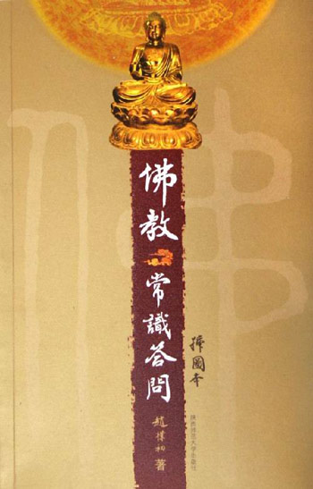](01431b0b-ae2b-4182-8175-a4c2745a8f55.jpg)

**2、[《道教文化新典》](http://ishare.iask.sina.com.cn/f/12823034.html)**

**[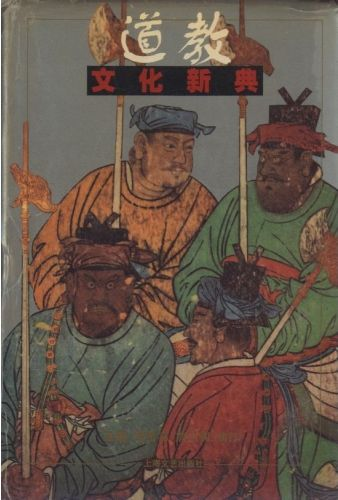](544cdfd2-81d2-4888-8f5b-ce4b24d2e6a9.jpg) **

**3、[《中国佛学源流略讲》](http://ishare.iask.sina.com.cn/f/10961822.html)**

[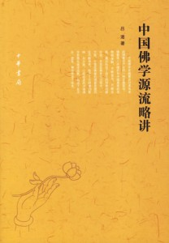](6f56f0d2-5e76-43c5-af5d-d563f59b4a24.jpg)

**4、[《汉化佛教与佛寺》](http://ishare.iask.sina.com.cn/f/15833412.html)**

**[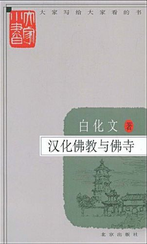](2093eafd-b3d2-4f04-a63e-15bfcc391899.jpg)**

** **

**5、[《中国道教史》](http://ishare.iask.sina.com.cn/f/12632564.html)**

[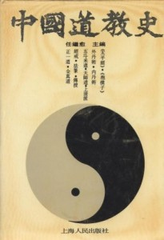](2f65da0b-a411-4ee7-85a7-ff6eb9024e42.jpg)

** **

**6、[《基督教的本质》](http://ishare.iask.sina.com.cn/f/4357869.html)**

[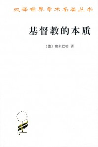](c1a9d240-0ae5-4a80-af6a-a18befdba768.jpg)

** **

**7、[《异端的权利》](http://ishare.iask.sina.com.cn/f/5400421.html)**

[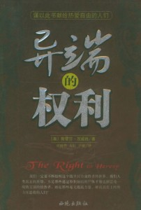](16b6e962-1fd1-4713-800e-e9a1b4793742.jpg)

** **

**8、《基督教神学原理》**

[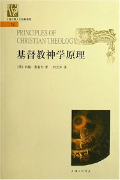](624e7ccc-1499-41a6-9b87-fc262e2d65c4.jpg)

** **

**9、[《为什么我不是基督教徒》](http://ishare.iask.sina.com.cn/f/9063077.html)**

[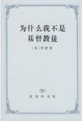](aee87f0d-df4a-44a4-bfa0-21f4b6d07586.jpg)

** **

**10、[《中国文化史导论》](http://ishare.iask.sina.com.cn/f/10426928.html)**

[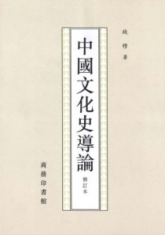](363f9050-06f3-4b13-8c55-f884fcba1753.jpg)

** **

**11、[《蒙元入侵前夜的中国日常生活》](http://ishare.iask.sina.com.cn/f/6014231.html)**

[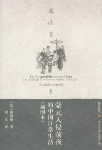](7fae26a7-e16d-4669-9fb2-5d1abdc58b0b.jpg)

** **

另附：龚鹏程教授“三教论衡”系列著作；葛兆光教授关于古代中国宗教与思想所有著作；及【原典】《五十奥义书》，《楞严经》，《金刚经》，《华严经》，《法华经》，《五灯会元》，《太平经合校》，《抱朴子内篇校释》，《周易参同契古注集成》，《云笈七签》，《老子想尔注校证》  

（采稿：徐毅磊 责编：徐毅磊）

 
