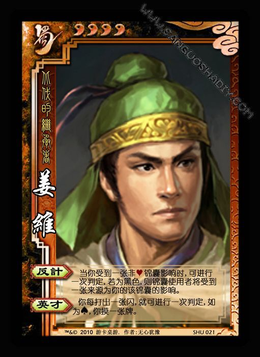

# ＜北斗荐书＞本期主题：小人物解析大名著

# 本期主题：小人物解析大名著

## 荐书人 / 徐毅磊（上海理工大学）

 许多人也许都曾经将四大名著作为自己的启蒙读物，但对不少人而言它们却同时处在一种尴尬的地位。在孩提时代并不一定能耐心地逐句通读、并不能很好地领略全篇，处在一种似是而非的状态，而成年后就已不再具有那份心情从头读来了。 倘若在年龄与阅读能力一定积累后再翻阅之，你总能找到一些新奇的地方，但更猛烈侵袭而来的，是你惊奇地发现名著中居然存在着不少时间错误、逻辑失严、事实矛盾的地方。你也许会生出原来名著由于写作环境的局限也不过如此的想法，也有可能怀着难以置信的心情通读几遍后豁然开朗，寻找到作者在这些明显疏漏背后的隐喻，当然这些隐喻也并非没有只是一种自圆其说的妄想猜测的可能，正如我们从小在语文课中必须经历的鲁迅文章的阅读题一般。 不过自名著产生以来，这种“自圆其说”看似都集中在《红楼梦》这一部之中并产生了规模不小的红学组织。于是乎其余的三部似乎被打上了军事计谋、绿林传说以及取经故事的烙印，似乎确无考究之意义了。 所幸在互联网时代总有闲人，在看似毫无深意的文字中抽丝剥茧，最后竟真的探寻出一套作者的真实意图出来，而那些作者本人却并不出版成书，只是以虚拟的网名享受解密背后的小众荣誉。 初看《西游记深度解析》抛出的解析蓝图时，只觉其荒诞而又琐碎，而一旦你进入了作者的逻辑领域与一定的解析程度后，你便会惊叹或许那个明朝老头真的是饱含深意。 于是先入为主的好人战胜坏人坚持到底的取经故事被完全改观，取而代之的是赤裸裸的丛林法则；取经不再是唐三藏的愿望而是西方佛派一手导演的双簧；吃唐僧肉长生不老不再被认为是一句为了制造劫难而放出的空话而成了真实发生过的事实；玉皇大帝在无能老二的伪装下藏着与之身份相符的决策者之形；取经之路更是一段上至天庭佛派、中至唐皇与四师徒、下至妖怪喽罗的利益博弈。 作为一部超长篇幅的解析，也许它并没有解决全部存在的逻辑问题。但即使并非是明朝老头的愿意，也可算作是一部不输原作的新作品。 而附录的《蜀汉最后的守护者》是巧妙地结合了三国志与三国演义的情节内容，以深入探讨的形式展开了原作中一些看上去被简单描写的战场计谋与事件发展，亦值得一读。 

### **推荐书籍（点击蓝色字体书目可下载）：**

[**1、《西游记深度解析》**](http://ishare.iask.sina.com.cn/f/15719556.html)

### 

[**2、《蜀汉最后的守护者》**](http://ishare.iask.sina.com.cn/f/15719557.html)

（责编：徐毅磊）
