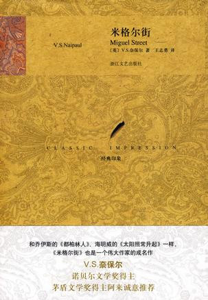
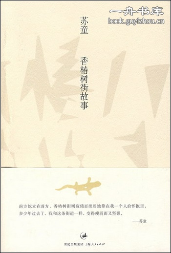
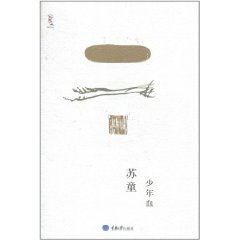

# ＜北斗荐书＞本期主题：少年与街道

# **本期主题：少年与街道******

## **荐书人 / 慕愁空（中国矿业大学）**

** **

** **

街道生活是少年记忆的开端。有多少故事会在一条街道上发生呢？答案是无数个。

V.S.奈保尔的《米格尔街》是通过一个孩童的视角讲述的。米格尔街的所在地是当时还是英国殖民地的特立尼达岛，作者出生与成长的地方。这不得不让人怀疑这本十几个短篇小说组成的小书或多或少具有自传色彩。在这条大街上，居住着一群贫穷卑微的小人物，男孩目睹着他们的悲欢遭遇。在孩子的眼里，垃圾车司机是最棒的职业，大人们都在做一些他难以理解的事想法也与他不同，从未做成过东西的木匠波普从前自顾自地做“叫不出名堂的事”时比他后来开始为人做家具赚钱时好的多。后来，男孩获得奖学金去英国留学，离开了米格尔街。就这样，男孩长大了。

然而苏童笔下的香椿树街是不同的，少年们在上面奔跑、斗殴、流血、死亡，但是从来不会长大。充满阴郁与血腥的南方小镇，少年们拉帮结派，忙于争夺霸主地位，在斗殴中死去是经常发生的事情。大人的世界总是那么肮脏可恶，少年们往往在发现这一点的瞬间失去纯真，变得与香椿树街上的任何人一样，残忍而卑劣。

《香椿树街的故事》和《少年血》两个短篇集里的故事都发生在香椿树街，主人公有男有女有老有少，但是主角还是那些奔跑的少年。兄弟姐妹之间并不关心，弱者总被欺负，称霸一时的瘸腿男孩也最终避免不了被人打败的命运——其他少年无法忍受一个瘸子称王称霸。连爱情都显得那么不美好，发现自己怀孕的女孩约男孩一起跳河自杀，她死了，他却没有。发生了这样的事情，男孩的父亲还是每天晚上爬到楼上女孩母亲的房间与其上床。充满了荷尔蒙的味道。也难怪这些少年心中没有爱。他们通通在香椿树街，与南方一起堕落了。

 

### **推荐书籍（点击蓝色字体书目可下载）：******

[**1****、《米格尔街》**](http://ishare.iask.sina.com.cn/f/6394844.html)

** **

[**2****、《香椿树街的故事》**](http://ishare.iask.sina.com.cn/f/7910440.html)

** **

[**3、****《少年血》**](http://ishare.iask.sina.com.cn/f/16672301.html)

** **

** **

** **

** **

（采稿：徐毅磊 ； 责编：徐毅磊）
