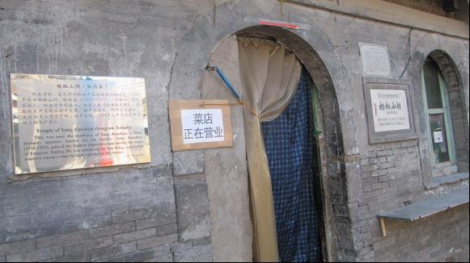
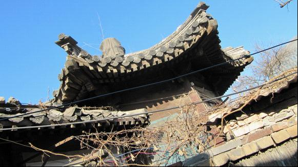

# ＜北斗荐书＞本期主题：崖山之后，再无华夏？——访杨椒山祠有感

# 本期主题：崖山之后，再无华夏？

# ——访杨椒山祠有感

## 荐书人 / 终南俗人（清华大学）

什么维系着炎黄子孙五千年的血脉？ 仓颉造的字，我们还在用；仪狄造的酒，我们还在饮。我们的书中叙写着汉击匈奴，唐服四疆；我们的祖辈讲述着苏武牧羊，文山不降。我们走路还踉跄，就开始念“人之初，性本善”；我们思想还蹒跚，就知道广陵散的绝响。 我知道汉谟拉比法典还有碎片，我知道迦太基古城只是有点残缺。但是，它们已不能为创造它们的人们所瞻仰：巴比伦人无法抵挡波斯的铁骑，突尼斯人亦只能想象汉尼拔翻越阿尔卑斯的壮举。然而，我们仰望长城，这里留下蒙恬的足迹；我们登狼居胥，这里飘扬过霍骠骑的旌旗。只有中国，只有中国，尽管历经休祲与兵燹，尽管饱受雨雪与风霜，依然绵延直到现在，仍旧踏步走向未来。 我只是有些迷惑。有没有那么一种东西，融入我们的精神，伴随着我们的血液。有没有那么一种东西，帮助我们开创“太仓有不食之粟，都内有朽贯之钱”的盛世，保护我们度过“白骨露於野，千里无鸡鸣”的乱世。有没有那么一种东西，使我们经历五胡乱华而不亡，承受靖康之难而无恙。 我有时就在想。 大概不是笑里藏刀口蜜腹剑，不是见利忘义恩将仇报。大概也不是浮梁买茶商人重利，不是丘杀少正文人相轻。不是“像被提了脖子的鸭子”的国民，不是卑颜屈膝的满口“奴才”。不是满脑子NBA只喜投身高盛摩根怀抱的少年，不是宅寝室打DOTA影响他人学习还厚颜发日志吵架的学生。更不应该是强拆的铲车轧过哀号的百姓，趟过淋漓的鲜血，不是沪蓉列车，不顾彻夜排队买不到一张返乡车票的民工，开设天价的豪华软卧。 是什么呢？坚韧的性格，顽强的毅力，屈伸的隐忍，圆滑的处事，这些，也许是使我们延续下去的原因。那么，什么是我们延续下去的意义？ 我想，也许是每个时代的可爱的人儿罢。不管如何压抑的时代，不管如何黑暗的庙堂，总是有那么些人，或独善其身，或兼济他人，闪耀着人性的光辉。他们的存在，才是一个民族延续的意义吧。 这，是前些日子我看《明朝那些事儿》想到的。 总说，崖山之后，再无华夏。自从陆秀夫背着少帝纵身一跃，传统中国亦随之中断。然乎，少帝之亡，投海殉死之臣十馀万，崇祯之殁，景山陪难之人一宦官。崖山之前为中国，崖山之后为支那。士子尽死，文人皆亡，百姓为异族之奴仆，文明随金戈而消亡。虽有朱明之复国，亦只汉唐之曲殇。 然而只要有那么些可爱的人儿，中国文明，便没有消亡。崖山之后，便如朱明，亦有此等人儿。 一直以来，对于明朝的印象，就是嗜杀的皇帝，篡位的皇帝，无能的皇帝，不上朝的皇帝，就是妒忌的妃子，夺权的太监，刺探的厂卫，失骨的士子。总觉得那是一个黑暗到不可理喻的时代，黑暗到不屑一读，每每看到明朝的书，总是随手放到一边去。 直到《明朝那些事儿》。 当年明月是个了不起的人。1600多万字的《明实录》，通读之人全国不到一百，他是其中之一。《明朝那些事儿》告诉了我很多，有几个片段印象很深。 正德帝朱厚照，贪玩，好色，尚武，无赖，开豹房，设宫妓，出边关，自封将。这样一个令人唾弃的无道昏君，当年明月说了一个故事。朱厚照想私过边关，出塞闯荡，无奈关守张钦不放。于是朱厚照动了无数的脑经，花了数月的心血，终于趁张钦不在，闯关成功。当年明月说：“在很多人看来，这充分反映了朱厚照的昏庸无能、不务正业、吃饱了没事干等等，总之一句话，他是个不可救药的昏君。但是很多人都忽略了这样一个细节：他躲避了张钦。怎样才能出关？答案很简单，杀掉张钦就能出关。以他的权力，杀掉一个御史十分简单，但他却没有这样做，而是选择了躲避。为什么？因为他是明白事理的，他知道张钦没有错，错的只是他自己而已。他懂得做皇帝的规则，并且也基本接受这个规则，但他实在无法按照这个规则去做，他只想自由自在地玩。” 张永，正德朝权宦，“八虎”之一。当年明月写了这么一些事：张永为了权力打倒了昔日的大哥刘瑾，他因为私仇而罢免吏部侍郎孟春，为了满足皇帝打仗的欲望他命令王守仁释放叛乱的宁王。但是当年明月也看到了这样一些事：他在城破之后指挥士兵招贴告示严禁抢劫，他给部下每人发一百两银子但是规定以后不准再拿百姓一分钱，他在王守仁孤立无援时挺身而出保其周全。 陆炳，嘉靖朝锦衣卫指挥使，有明一代三公三孤衔唯一的获得者。当年明月写了这么一些事：他贪财并且权力心重，他因为畏惧严嵩之威听由属下遭受迫害，他与严嵩合谋害死了诤臣夏言。但是当年明月也看到这样一些事：他担任锦衣卫指挥使后的第一件事是平反冤狱，他只向为富不仁的大户下手从不为难穷人，他经常拿钱出来接济正直贫困的大臣。 这是当年明月最了不起的地方，他以宽容之心看人，他以看常人的目光来审视历史人物：有良心，有理想，有贪念，有欲望。他教会我如何悲悯地看大奸大恶之人，他教会我如何批评地看光耀千古之人。奸蔡京亦有顺孝之德，文天祥也受好色之诟。不同于很多历史学者，当年明月不将自己置于道德制高点。他不会将岳飞平定农民起义的行为定性为“维护封建统治”的污点，他不会为唐太宗的开明政治加一句“尽管是为了维护其自身的封建统治”的评论。并且，他寻找恶人之所以为恶的一些无奈，并且愿意探求社会原因。这就比某些终日以抨击所有中国社会现象、不齿所有共党人物为业的“爱国者”强得多了。 某日，我读到杨继盛那一章。 杨继盛，嘉靖二十六年丁未科进士，明朝第一硬汉，嘉靖三十二年，于兵部侍郎任上，因以《请诛贼臣疏》死劾权臣严嵩而下狱致死。于锦衣卫诏狱中，因受廷杖，腿骨断裂，肌肉腐烂，乃以碎碗瓷片刮去腐肉。昔日关公刮骨疗伤，犹有名医在侧，辅以良刀，以酒棋分其心。杨继盛之举，前无古人，后无来者。 书中有一段从诏狱看守角度侧面描写的文字：“杨继盛继续着他的工作，腐肉已经刮得差不多了，骨头露了出来，他开始截去附在骨头上面的筋膜。掌灯的看守快要崩溃了，看着这恐怖的一幕，他想逃走，双腿却被牢牢地钉在原地，动弹不得。他曾见过无数个被拷打得惨不忍睹的犯人，听到过无数次凄惨而恐怖的哀嚎，但在这个平静的夜里，他提着油灯，面对这个镇定的人，才真正感受到了深入骨髓的恐惧和震撼。” 得知杨继盛故居——杨椒山祠即在北京，宣武门附近，我在考试后前往拜谒。 杨椒山祠在宣武门外大街达智桥胡同12号。胡同里尽是桂林米粉、陕西羊肉泡馍等小吃店。访至其处，发现今日杨椒山祠其状若斯 

 杨椒山乃北京城隍，如此对待城隍之城，有何面目忝居首都之位？入得祠堂，大失所望。祠堂已作卖菜之用，买菜之人毫不知其脚下供奉着北京的城隍、明朝的硬汉。怅然而出，念以椒山忧民之深，爱民之切，地下有知今日其居虽废，有益于一家穷困之营生，亦只是笑笑不会动怒罢。访得一老者，得知祠堂之后有一亭犹存，除此之外，再无他物。便往后走，发现有亭残破如此。亭下晒衣裤鞋袜，想是其内有人居住。 

 站在弄堂里，吹着冷风，我想，恰好五百年前，椒山先生是否就出生在这里，他的第一声啼哭，是否格外清脆？他是否在这旁边的田野里放过牛，他是否在隔壁村的私塾里念过书？他是否从这里出发前往被贬的狄道，他是否在这里挥笔写下《请诛贼臣疏》？这里有没有绕梁五百年杨继盛的声响，这里有没有馀味半千载杨继盛的墨香？当他明知必死而不顾，舍身蹈火而莫辞，斋戒三天，而做千古檄文，他的心中，更多的激愤，还是淡然？ 跪天跪地跪祖先，亦跪先辈豪杰。 出得胡同，对面是现代化的繁花似锦，回头一望，身后是五百年的风雨萧条。 

 浩气还太虚，丹心照千古。生前未了事，留与后人补。 这是杨椒山的绝笔。 有如此之人，何谓再无华夏。有如此之人，何谓再无中国。 步游三衢旁，惆怅念所思。岂为今朝见，恍惚诚有之。 岂有孤行士，垂涕悲故时。 

**（来自北斗投稿邮箱；责编：徐毅磊）**
