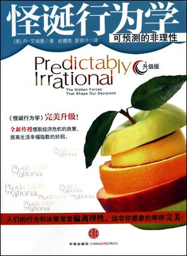

# ＜北斗荐书＞本期主题：常识——思考方式的养成

# 本期主题：常识——思考方式的养成

## 荐书人 / 谢熊猫（新加坡南洋理工大学）

 

常识，即“日常知识”，说的是众人皆知、判断准确，而且无需刻意研读和学习的知识。然而常识究竟包括哪些内容是没有准确定义的，关于常识的讨论也常常受限于主观理解和讨论对象。比如对于一群学物理的人来说，“不确定性原则”可以算作常识，而对于一些法学人来说“毒树之果”也是常识，这两组人在现代社会都算是高级人才，但是没有刻意的研读而要求去知晓对方人群的“常识”可能又苛刻了一点。而如果以一个律师不懂什么事“不确定性原则”而指责其没有常识，恐怕也不太妥当。

啰嗦以上这些，其实是想说，我认为的常识可能对于你来说不算作常识。所以我选的这几本书都是从思考方式养成角度对我有过帮助的，而不只是内容性的灌输。

《战略游戏》其实是本教科书，但它也是我所有用过的教科书里面唯一一本留在我书架上面的。这本书是经典的博弈论入门教材，作者是博弈论学界的权威Avinash Dixit。有个玩笑话说道：人类历史上的道德讨论，其实就是要把囚徒困境里面的两个囚徒由都认罪的象限转移到都不认罪的象限，哲学家和道德洁癖者的做法是以道德说服世人，宗教的做法是告诉人们“不听我的下地狱哦，亲！”如果你听不懂这个笑话，那就不妨看看这本书吧。

《黑天鹅》和《随机致富的傻瓜》都出自纳西姆·尼古拉斯·塔勒布之手。两本书讲的是紧密相关的好几个主题，总的来说都是人在思考问题时容易犯的错误，了解这几种人类思考方式的局限并不能让人变得更有常识，但是当再次在生活中碰到类似境况的时候，思考的方式就会多一个角度、多一种解读。

最初接触丹.艾瑞里的《怪诞行为学》是在学校的图书馆，翻看几页后立即去书店买了一本收藏。在《魔鬼经济学》之后铺天盖地的经济学科普读物中，这本是我最推荐的。比起那些和你讲述供需平衡、市场运作的书，这本里面讲到的经济学更加从“人”以及人的思考方式出发，看完之后让人不自觉地不惊呼，——原来我自己的思考过程之中还有这么多我不知道的小动作！

梁文道的《常识》时评集可以说是大名鼎鼎了。这本书涉及政治、媒体、公民社会等话题。与前几本不同，对于本就关注时事的人来说，这本书与其说是提供了一种新的思路，不如说是一个警醒——几年前的时评缘何今天看来还是没有落伍呢？这样的警醒怕是不只是《常识》一书，鲁迅骂过的那些又何尝不是？

 

### 推荐书籍（点击蓝色字体书目可下载）：

[**1、《战略游戏》**](http://ishare.iask.sina.com.cn/f/9743298.html)

[**2、《黑天鹅》**](http://ishare.iask.sina.com.cn/f/10104417.html)

[**3、《随机致富的傻瓜》**](http://ishare.iask.sina.com.cn/f/8164184.html)

[**4、《怪诞行为学》**](http://ishare.iask.sina.com.cn/f/17342657.html)

[**5、《常识》**](http://ishare.iask.sina.com.cn/f/8225617.html)

**（采编：余岚 责编：徐毅磊）**

  

