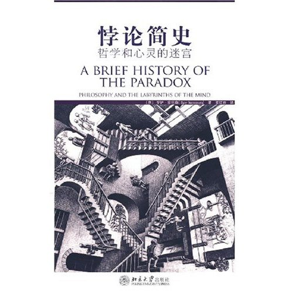
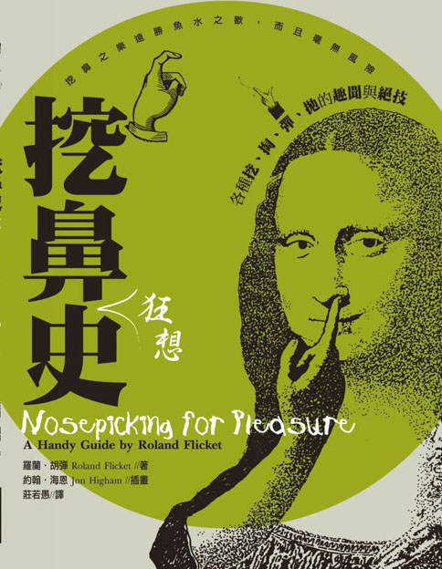
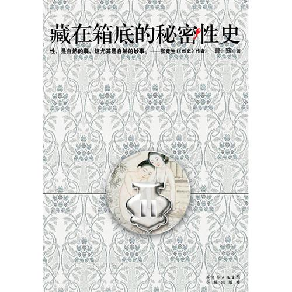

# ＜北斗荐书＞本期主题：异史杂读（一）

 

# **本期主题：异史杂读（一）******

## **荐书人 / 谷卿（暨南大学）**

 

从本周开始，我想选取一些关于历史的有趣的书籍，不定期地向大家作简单的介绍。当然，这个工作不一定由我一个人来做，爱读书、爱交流的朋友如果有合适的对象，也可以“异史杂读”系列的形式向书友们推荐。

 

### **推荐书籍（点击蓝色字体书目可下载）：**

**[《悖论简史》](http://ishare.iask.sina.com.cn/f/11457872.html)**

****

悖论就是让你左右为难。我有时候特别迷悖论，记得我最早想破脑袋也想不明白的一个故事是：有个人在荒岛被原始人抓到，这个部落崇拜正确之神和错误之神两个偶像，他们常将犯罪者押在两座神像面前，让犯罪者说一句话，如果此话正确就要处决在正确之神像前，如果此话错误就要处决在错误之神像前，最后这个落难荒岛的人说了一句话，使得酋长无法杀他，原因是他说了这样一句话：“我一定会被杀死在错误之神像前。”想把这样的问题想明白简直就是追着自己的影子跑，不过据说思维出现这种状况就叫“哲学”了。

**[《挖鼻史》](http://ishare.iask.sina.com.cn/f/19730045.html)**

****

这本115页的小书是十足的厕所书，大量的图片和有意恶搞的文字却也让人感觉到作者似乎很认真很严肃。最有意思的是犹如武功秘笈般的图解各种挖鼻方法，维多利亚交叉式、代换式、布里斯托转向式、开启反向标准弹道式、水手抛锚式、科西嘉推动式等等，复杂的挖鼻手法让读者叹为观止。书的后半部分，“为了解决诸多挖鼻同道的疑难杂症”，作者还给来信的常见问题做了细致的解答。

 

**《藏在箱底的秘密性史》**

****

因为《越来越》而知道曹寇，后来才看到他这本关于性的通俗读物，确实很通俗，很明显是受到高罗佩的影响，虽然学术意味不重，但材料比较丰富，而且就一些常见的材料来考说风俗史与精神史的功夫也是一大亮点。

**[《人类梦史》](http://115.com/file/aq1iwmzr)**

****

梦是人类精神世界中最隐秘的一个部分，人们也总是期望记住梦中的事、通过梦来进行心理测试和未来预测，我们甚至不知道梦的历史究竟有多长。这本书从有关梦的记载，到对于梦的解析，都有较为专业的论述。

 

（采稿：徐毅磊 责编：徐毅磊）

 
