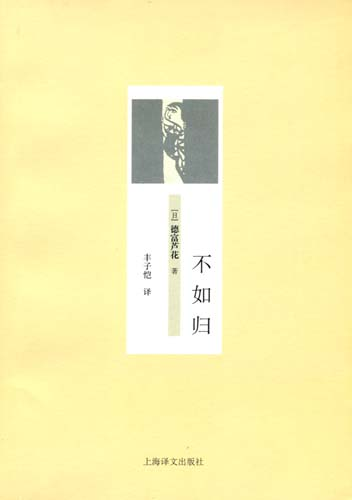

# ＜北斗荐书＞本期主题：怜悯与重生——读德富芦花《不如归》有感

**也许人是不应当只有一条命的。佛教里相信因果报应，前世今生。基督教里讲人忏悔赎罪后可以获得新生。抛开宗教不说，每个心死的人难道不希望可以从黑暗冰冷的洞穴里爬出来重生吗？重生需要集义所生的浩然之气和力拔山兮的盖世之气，重生要求一颗死掉的心仍然拥有不屈服的求生意志。 重生需要的条件太多，付出的代价太大。放弃它去做行尸走肉的自不必说，选择它的是真正的英雄不在话下。**

 

# **怜悯与重生**

# **——读德富芦花《不如归》有感**

## **荐书人 / 李冰心（重庆大学）**

 读了日本小说家德富芦花的《不如归》，丰子恺译，除了散文诗般的语言，脑子里还有两个词盘旋着挥之不去：怜悯与重生。  **子规啼，不如归。道是春归人未归，几日添憔悴。** 历史就像股市大盘一般，周而复始，有其规律可循。研究透彻的人，甚至可以从窥探过去中预见未来。然而，盘面的趋势永远是控制在拥有大额资金的人的手中，普通股民最多是拿着小钱跟在人家屁股后面笑笑而已。 我们是屁民，屁民却总在蚕食屁民。相煎何太急，在屁民中发生的概率远大于在曹操家的概率。  **俏冤家，在天涯。偏那里绿杨堪系马。困在南窗下，数对清风思念他。** 有时候看到弱者，便觉得有比自己更可怜的人，同情心和自豪感便代替了自卑和怯弱。在不需要怜悯自己的时候分出来一点心去怜悯别人。且不说本来应该有的东西不曾有，就连对自己的爱的附属品都成为了标榜自己的理由。 大家都是热锅里的蚂蚁，能活下来的不过是吃了点同类的被煮熟的肉。吃的时候只管填饱肚子，不看看吃的是什么，不想想自己会不会被吃。感觉疼痛的时候才想起来要找点药，哪有这么多好事呢。  **风飘飘，雨潇潇，便做陈抟睡不着。懊恼伤怀抱，扑簌簌泪点抛。** 一个人有几条命？当我问出这个不是一般愚蠢的问题之后，我反倒觉得有些自以为是起来。 我们常会听到这样一句话：我的心已经死了。说这话的人，他们的心大多都是了逃到了一个温度极低的洞穴之中，既无力前进，又没有退路。站直了会被洞顶磕着脑袋，坐下了又被不知名的野草扎到了屁股。一颗失去了血液补给的心在这种环境下，死亡应该是个挺不错的归宿。其实心能够死掉的人都是可敬佩的。即使他们孤苦伶仃的被感情或者理想抛弃在半路上，至少他们还有路可上。总在原地踏步的我甚至有点羡慕这样的死亡。  **雪纷华，舞梨华。再不见烟村四五家，密洒堪图画。** 也许人是不应当只有一条命的。佛教里相信因果报应，前世今生。基督教里讲人忏悔赎罪后可以获得新生。抛开宗教不说，每个心死的人难道不希望可以从黑暗冰冷的洞穴里爬出来重生吗？重生需要集义所生的浩然之气和力拔山兮的盖世之气，重生要求一颗死掉的心仍然拥有不屈服的求生意志。 重生需要的条件太多，付出的代价太大。放弃它去做行尸走肉的自不必说，选择它的是真正的英雄不在话下。 

** **

#### **推荐书籍（点击蓝色字体书目可下载）：**

**[《不如归》](http://ishare.iask.sina.com.cn/f/9348215.html)**

** **

** **

（采稿：徐毅磊；责编：徐毅磊）

 
