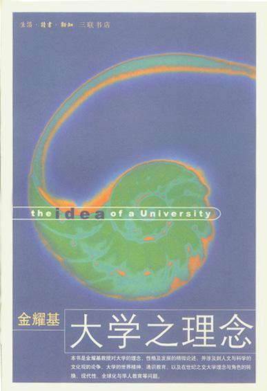
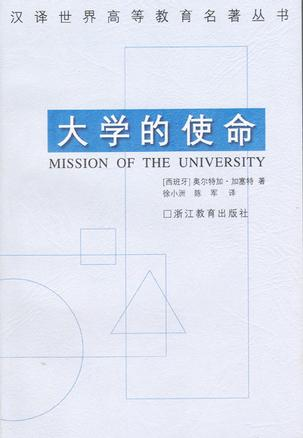
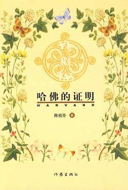
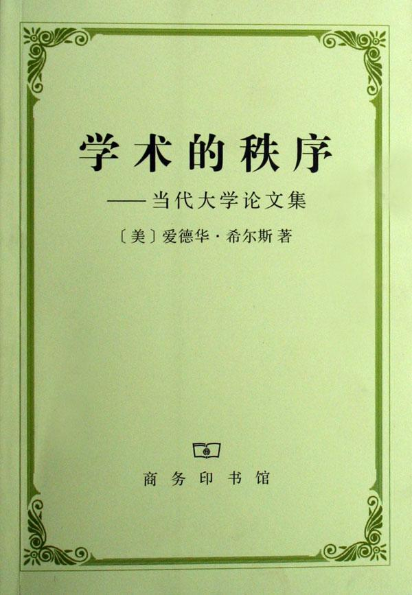
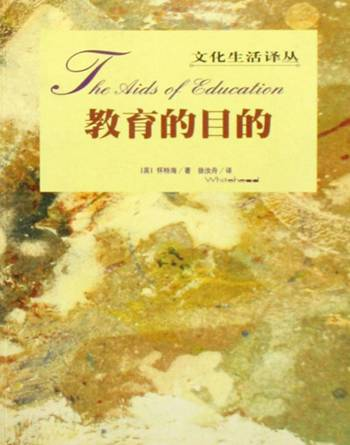

# ＜北斗荐书＞本期主题：我的大学谁做主

# 本期主题：我的大学谁做主

## 荐书人 / 谷卿（暨南大学）

  我想，任何一个现代人都一定不会小觑大学在国家的经济文化建设过程中所起到的不可替代的作用。北京大学陈平原教授在《中国大学十讲》一书的后记中则这样表述他的观点：大学制度的建立，包括其蕴含的学术思想和文化精神，对于传统中国的改造，是带有根本性的。 是的，在我们的心目中，理想的大学是智者的聚居地、是自由独立思想的摇篮、是科学和人文的殿堂，出入于这里的人们，无疑应该感到无比的自豪和骄傲。我从不认为大学的精神应当在不同的社会环境下作相应的调变——大学不应在较为低级的层面和较为切近的时段中为社会提供具体而微的服务，而应对社会作出一种精神性的引导。大学就该是最为单纯和洁净的地方，它的单纯和洁净来自学术品格的独立；只有独立的学术品格才能塑造独立的人格，而政治环境中的独立人格又是构建我们渴求的文明的政治环境的必要前提。 可是，在我们的现实中，行政的干预使得大学里的一切不再单纯独立。评职称、评级、评学科点、评建、评带头人、评学术基金……无数由政府部门出面组织的考评将大学里原本极为自主的运行模式打破了，权力意识开始在大学范围内滋蔓，甚至连尚未涉足社会的大学生们也逐渐变得世故起来，学着官场里的那一套做派来为人处事。这实在是大学的悲哀、教育的悲哀。 孔子曾感叹：“古之学者为己，今之学者为人。”其实这恰恰也是大学理想的本质和现实的表现之间的冲突。大学的教师、学生一旦不再为求得一种自由独立的精神和修养而治学、教学、求学，那么大学的精神便已经消亡了。雅斯贝尔斯在谈及大学观念时，也明确地强调这一点。他说：“大学应始终贯穿这一思想观念：即大学生应是独立自主、把握自己命运的人。他们有选择地去听课、聆听不同的看法、事实和建议，为的是自己将来去检验和决定。真正的大学生能主动地替自己订下学习目标、善于开动脑筋，并且知道工作意识着什么……这是一种精神上的升华，每一个人都可以感受到自己被召唤成为最伟大的人。” 我们需要一种无为的制度，而不是一套精严致密的管理模式。不要打扰我们，不要干预我们，我的大学我做主。或许这才最接近大学精神的本原。  

### 推荐书籍（点击蓝色字体书目可下载）：

[**1、《大学之理念》**](http://u.115.com/file/aq3pbx8s)

[**2、《大学的使命》**](http://ishare.iask.sina.com.cn/f/11169674.html)

**3、《哈佛的证明》**

**4、《学术的秩序》**

[**5、《教育的目的》**](http://ishare.iask.sina.com.cn/f/9199042.html)

**6、《创造未来》**

****

** **

（采稿：徐毅磊；责编：徐毅磊）

 
