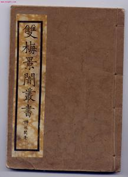
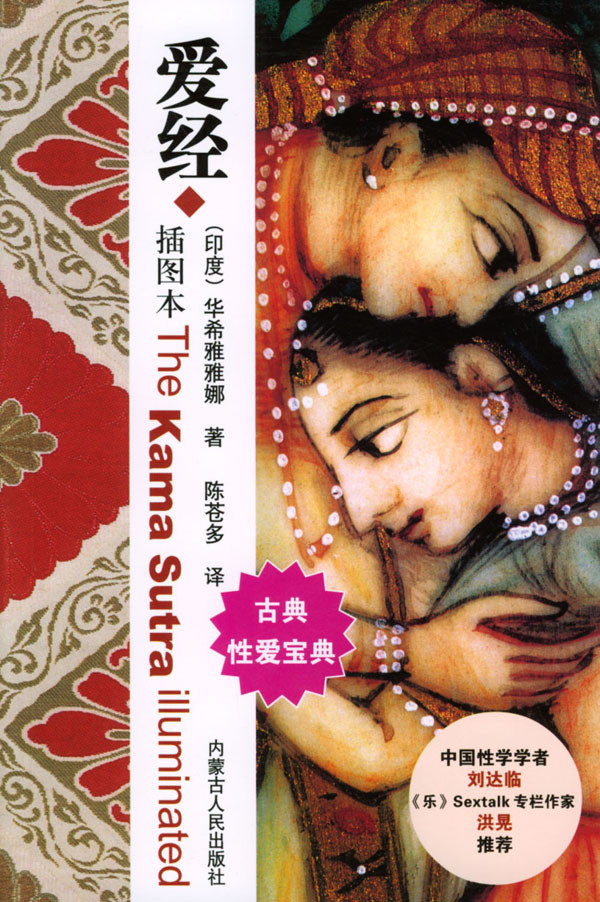
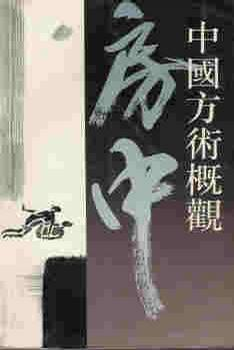
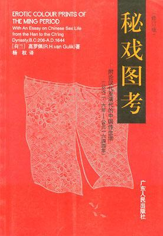
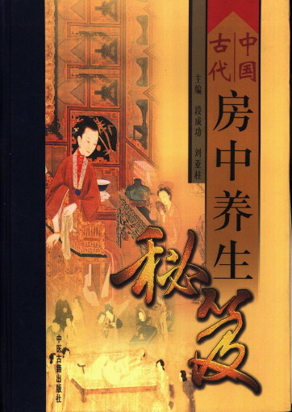
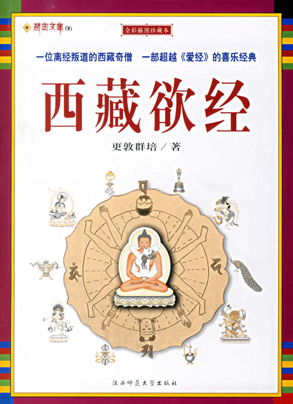

# ＜北斗荐书＞本期主题：房中损益

# 本期主题：房中损益

## 荐书人 / 谷卿（暨南大学）

看《蜗居》时，有一段情节，海藻对着宋思明耳边悄悄话，声音极小且无字幕，说完后娇羞浪笑不已，令人百思不得其解说的是啥，我料其中必有关键词被隐去。后得见未删节版，屏幕下方字幕中赫然出现四字：“九浅一深”。 九浅一深乃中国房中术术语，我最早见到此词，乃在幼时初读《二刻拍案惊奇》，其中有段描写：“甄监生就舞弄起来，按着方法，九浅一深，你呼我吸，弄了多时。”虽颇不能解，但终究知道是种秘法。后来览读愈多，所见愈繁，始知房中秘技多于导引行气密切相关，不特为技巧，更为性修炼、保养与治疗的一大途径。如马王堆《合阴阳》之仿生十节：一曰虎游，二曰蝉附，三曰尺蠖，四曰囷角，五曰蝗磔，六曰猿踞，七曰蟾诸，八曰兔骛，九曰蜻蛉，十曰鱼嘬。这一系列的体位姿势，实际上也是房中导引之术，不仅模仿动物姿势形态，更参以吐纳、意念等与之配合。 中国古代房中术，又称玄素之术、黄赤之道、接阴之道、御女之术等，与医药养生学中的泌尿科、男科、妇科、儿科等都有交叉。道教内丹学兴起之后，房中术的经典术语和理念内涵受到了改造，晚唐以来三教合流之势不衰，在宋金元时期出现了一大批内丹养炼名家，此时内丹术与房中术在技法上相互借鉴汲取，俱臻成熟。 唐人白行简有《天地阴阳交欢大乐赋》，载于敦煌遗书伯2539号卷子，虽非严格意义上的房中书，但其中性描写之部分颇多。叶德辉认为，此赋用词多俗言俚语，如文中所引男女做爱时所说甜言蜜语后来一直沿用，这种俚俗文风与作者是倡导新乐府运动的白居易之弟有关；又言赋中多引《素女经》、《洞玄子》之语，足证《洞玄子》为隋唐时期的作品，亦可见其时房中书在社会播传甚广，且已现见于士大夫口、文之中。最关键的是，以“赋”的形式叙写表述房中术内容，白氏此作可谓独一份也。 说明：高罗佩《中国古代房内考》曾在[“又提起那话儿”](/?p=5463)专题中荐过，兹不再列。 

**推荐书籍（点击蓝色字体书目可下载）：**

**1、《双梅影闇丛书》**

**[2、《爱经》](http://ishare.iask.sina.com.cn/f/14237147.html)**

**3、《中国方术概观·房中卷》**

[**4、《秘戏图考》** ](http://u.115.com/file/dn4ta8rb)

**[5、《中国古代房中养生秘笈》](http://u.115.com/file/dn4tceso)**

[** 6.《西藏欲经》**](http://u.115.com/file/aq2l21vb)

****

（采稿：徐毅磊 责编：徐毅磊）
