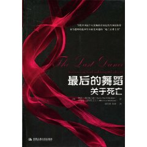
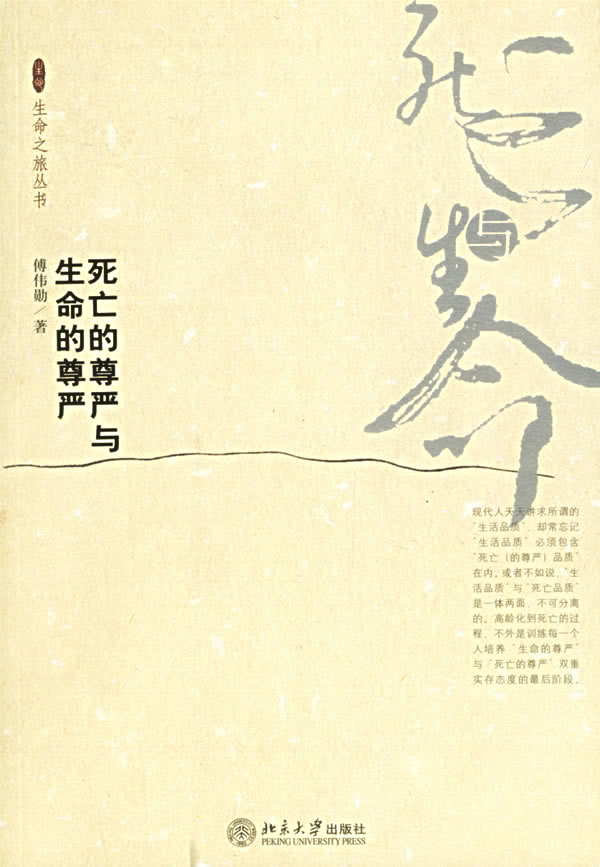
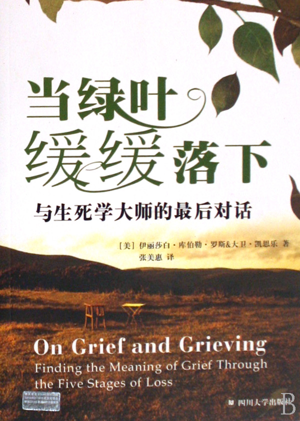
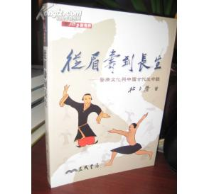
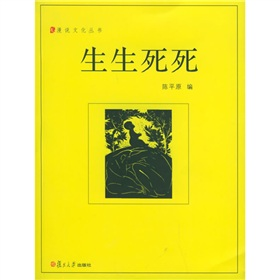
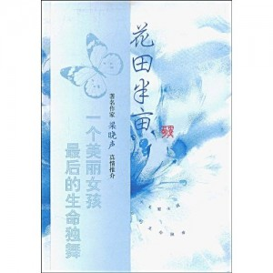

# ＜北斗荐书＞本期主题：未知死，焉知生？

 

# **本期主题：未知死，焉知生？******

## **荐书人**** ****/**** ****谷卿（暨南大学）******

 

周三下午，看到有人分享了陆遥遥的一篇日志，题目是“尽对人生的最后责任”。这时我才惊讶地知道，陆遥遥君患上了恶性胃癌。我并不认识陆遥遥，也不是他的校内“好友”，只从他人口中听说过几次，知道他曾为北斗提供过稿件，是一位颇有才华和学识的青年。在这样最好的时光，遭遇可恶可怕的癌症，面对生死的考验，真的是让人莫名哀惋和痛心。

我猜想，恶性疾病一定逼迫着陆遥遥君开始思考生死的问题。但看过他的日志，我发现他的母亲竟然已于四个月前离开了人世。这样的遭遇或许早就把其他人彻底打垮了。在死亡面前，一切可爱而值得我们珍视的东西被粗野地扫荡得一干二净。

陈纯在转发常远关于陆遥遥病况的状态时加了一句：“哲学就是练习如何死亡。”是的，死亡为什么可怕，因为从没有人深切地感知过它，没有人在经历它之后还能告诉其他人那是什么样的一种经历，而最糟糕的是，我们每个人又都必须最终直面它——令我们产生畏惧之感的永远不是强大的敌人，而是从没经历过的未来。哲学和宗教，就是让我们预想死亡的功课，让我们为死亡提供可能的设想。王右军说：“一死生为虚诞，齐彭殇为妄作。”人们总是希望在生命走到尽头、面对死亡的时候，自己能够坦然一点、潇洒一点、淡定一点，可是有几个人真的能在生死面前完全超脱呢？

陈平原教授有一篇文章，叫做《未知死，焉知生》，反用孔子“未知生，焉知死”之意。他在自己某部著作的后记中写道：父亲读过我这篇文章后，感叹道：“你长大了。”我想，一个人渐渐长大成熟，直至老病故去，大约就是在对死亡的体悟愈发深刻的同时，不断地感知到生的真谛吧。

生命如此美好、如此值得留恋。祝福陆遥遥君，祝福那些热爱生命的坚强的朋友！

**推荐书籍（点击蓝色字体书目可下载）：******

[**1****、《最后的舞蹈》**](http://u.115.com/file/e65crh6q)

** **

**2****、《死亡的尊严与生命的尊严》**

** **

**3****、《当绿叶缓缓落下》**

** **

[**4****、《从眉寿到长生》**](http://ishare.iask.sina.com.cn/f/16016753.html)

** **

[**5****、《此生未完成》**](http://ishare.iask.sina.com.cn/f/16834922.html)

** **

[**6****、《生生死死》**](http://ishare.iask.sina.com.cn/f/5527765.html)

** **

[**7****、《一公升的眼泪》**](http://u.115.com/file/clsi7939)

** **

[**8****、《花田半亩》**](http://ishare.iask.sina.com.cn/f/18268637.html)

 

（采稿：徐毅磊 责编：徐毅磊）

 
