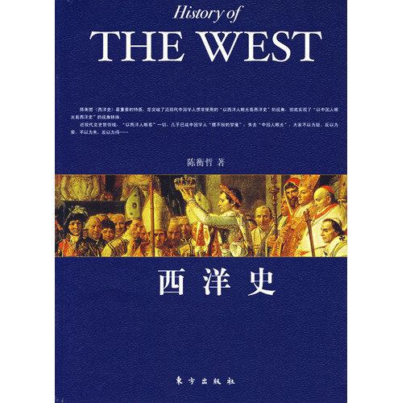
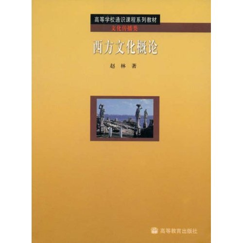
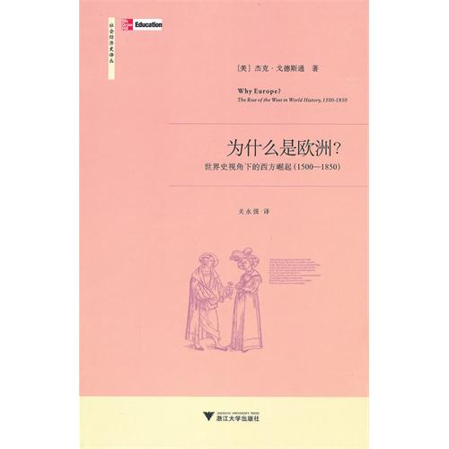
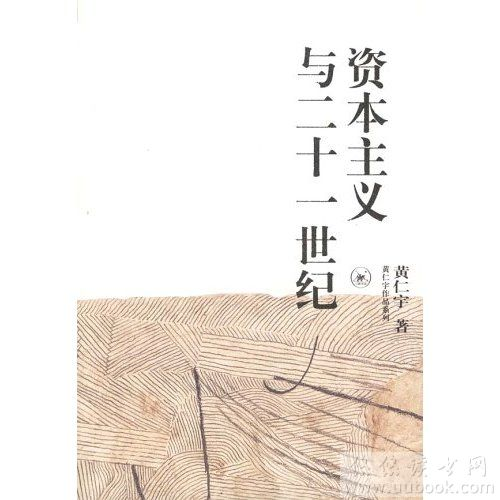

# ＜北斗荐书＞本期主题：欧罗巴的历史舞台

 

# 本期主题：欧罗巴的历史舞台

## 荐书人 /榕晨（武汉大学）

 

古往今来，欧罗巴一直是世界历史的主舞台，尤其是在十五世纪末哥伦布发现美洲新大陆之后的四五个世纪中，欧洲大陆的进程彻底地主导了整个世界的发展，从殖民地扩张到启蒙运动，从资本主义到社会主义，无论是船坚炮利还是思想文化，欧洲一直扮演着输出者与引路者的角色。另一方面，我们也知道，欧洲内部各个子文明间的分野十分巨大，耳熟能详如英国人的高远，德国人的严谨，法国人的浪漫，波兰人的豁达，俄国人的冷峻，这片面积几乎与中国相当的土地上竟然能够产生出如此之多的性格迥异的民族，其来龙去脉倒也很值得品味与探究。虽然在进入二十世纪之后，尤其是在遭受过两次世界大战的重创之后，欧洲在世界舞台上逐渐被边缘化，不仅仅被美国超越，更是遭到了介于东西之间的俄国以及中国崛起的挑战，但此时的欧洲却也开启了另一场或将影响世界的欧盟一体化进程，这片旧大陆的前景依旧值得期待。

总而言之，欧洲历史确实给任何一位想要探究人类社会的思考者提供了诸多的素材与切入点，此处推荐本人所读过的关于欧洲历史诸著作中的四本。

 

#### 推荐书籍（点击蓝色字体书目可下载）：

**陈衡哲[《西洋史》](http://ishare.iask.sina.com.cn/f/8550341.html)**

这是一本欧洲历史的启蒙教材，适合于对欧洲历史了解较少或者只想较初步地了解欧洲历史脉络的读者，在我所读过的欧洲历史书中也绝对属于上乘。作者陈哲衡是民国时代北大第一位女教授，此书写于民国时代，但是今天读来依然觉得十分通畅，语言简练，详略得当，对欧洲历史大脉络线条缕的非常清晰，容易让读者记忆。本书的不足便是限于篇幅，缺乏对历史现象背后更加深入的探究，但是作为一本基础入门读物，还是很不错的选择。此处想说一句，初读外国史，看中国人自己写的书还是要比看西方作者的外文中译本效果好的多。

**赵林[《西方文化概论》](http://ishare.iask.sina.com.cn/f/8179151.html )**

我在诸多场合给诸多朋友强烈推荐过此书。本书名为文化概论，但实际上更是一本西方文化思想史，作者赵林为武汉大学最受学生尊敬与欢迎的老师之一。本书虽是教科书，但足可当做散文来读，赵林的文笔极好，行文便如行云流水，文中穿插诸多令人惊叹的比喻，总能给读者留下极其深刻的印象。本书篇幅适中，对西方主要是西欧历史文化的进程做了细致的描述，其中也不时穿插作者自身的感悟与思考，传授性与诱导性并重，是对想要了解欧洲历史文化的同学不可错过的一本概论。

**杰克•戈德斯通[《为什么是欧洲？》](http://ishare.iask.sina.com.cn/f/16183558.html)**

这是一本美国人写的书，但是中文翻译极其流畅，阅读过程中基本没有理解障碍。

本书试图回答一个近几百年世界历史最宏大的问题，为何是欧洲而不是其他地区能够从历史中崛起并且主宰全世界，本书也是我所读过关于此问题解答最系统也是相对深刻的一本著作。作者从经济，宗教，社会，政治，科技等等角度将欧洲文明的发展与世界其他地区做横向比较，扫除许多对西方崛起的误解，并对诸多盛传的观点诸如韦伯的新教伦理观进行驳斥，许多地方皆有令人眼前一亮之感，发人深思。全书在对各观点的求证之时索引丰富，娓娓而谈，层层递进，却也不失趣味，可为大众所接受。

**黄仁宇《资本主义与二十一世纪》**

黄仁宇的书一向都值得品读。本书以议论为主，叙述为辅，作者较为详尽地阐述了威尼斯、荷兰、英国、美国等等西方地区与国家的资本主义发端之历史及其内在形成原因，涉及经济，社会，科技，文化等等角度的分析。本书指明资本主义的变革远非只是经济领域生产关系的转变，而是更是社会各个领域的转型与发展，实际上也批驳了“中国明代商品经济的发展是所谓资本主义萌芽”的说法。需要注意的是，该书篇幅较厚，分析较为细致，带有较强的学术味，远没有《万历十五年》《中国大历史》那般浅显易懂，所以比较适合有意于对欧洲资本主义历史做更深刻探究的读者。

 

（采编：余岚 责编：徐毅磊）

 
