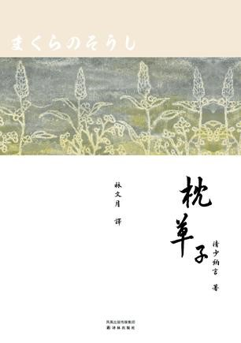
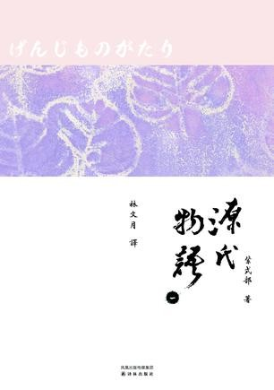
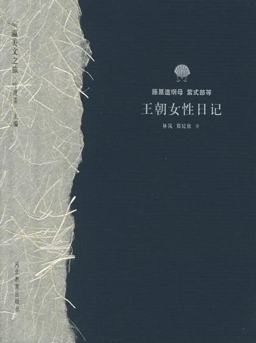
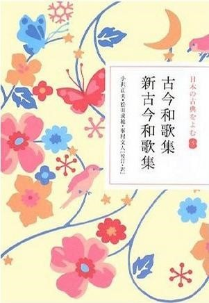
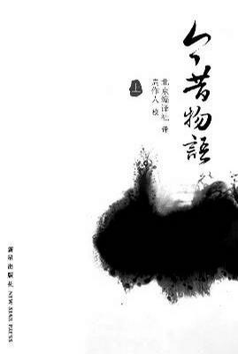

# ＜北斗荐书＞本期主题：洛中洛外——平安朝书籍推荐

# 

# 

# 本期主题：洛中洛外——平安朝书籍推荐

#### 

## 荐书人 / 王文嘉（北京化工大学）

#### 

所谓平安乐土，终究是帝王家的呓语罢了。即使雄才如恒武帝，可以倾全国之力一而再地迁都，超越唐土的隋炀建立一个千年不朽的都城，可当百僚们高歌“新京乐，平安乐土万年春”的时候，种继的遇刺，怀良的哀号，亿兆黔首在烦劳徭役下被践踏，被掩埋，被化为尘土的尸骸，累积于山海之间，怨气直上九霄，犹是空海大师的真言，亦不能安息着亡魂的怨恨。 总有人妄图打造一个治世，假若唐国的长安是对岸帝国长治久安的象征，那么东瀛的平安京，就一定要成为洛都，做一个人间的乐土。于是乎山城国的胜景、琵琶湖的秀丽，皆在这一马平川间铸就一个仿造大唐盛世的梦境。可谁料，无论是密宗的比丘僧抑或是本土的阴阳师，天文术数的谋划，奇门遁甲的测算，都无法掩饰这浩荡时代中人心的黑暗。从罗城门到禁里，市井巷里，殿阁之上终日上演着一幕幕弑亲灭口的演剧，平安乐土如若是帝王向黔首画的一个大饼，这个时代，其实是一个真正的人间地狱，或是说，一个在人间的纯由人引发的地狱。 赤炎吞噬应天巨门的惨烈，疫病肆虐花之御所的凄苦。天阶夜色凉如水，百鬼夜行于朱雀大道上，魑魅魍魉，山精 水怪，一应俱全。紫宸宫殿锁烟霞，宵小钻营乎殿阁之中，文武百官，天潢贵胄，率是如此。鬼影重重，妖气森森，鸭川上横流饿殍的浮尸，宇治旁穿行食人的恶犬。那个在芥川龙之介笔下的画作，那幅画，那张《地狱变》的惨烈而可怖的创作，就是这个时代人性最好的写照。所谓地狱，无非是人心的贪婪与丑恶，汇聚成世上最为阴森黑暗的颜色，加以残暴与丑恶，假无辜良民的手，行之而成的旷世邪恶。 但是还好，在这个人心黑暗世事动荡的平安朝，终究有一群人，有这样一群的男子女子，把自己的欢歌与泪水集结成册，用心灵的那份纯真与挚爱写成了诗篇，是以在一片幽黑里，撑起一支小小的蜡烛，点燃一丝温暖与不放弃。文道不衰，人伦不灭，道义长存。 那是清少纳言，纵使人生惨澹依旧笑对，将珍贵的快乐采撷下来，可用来当枕头的草子，即使黑夜来临依然为我们构筑一个梦幻，雪覆梅花，水晶念珠，美丽婴儿食草莓。 那是紫式部卿，即便与爱人笑忘庙堂，沉浮于御堂殿“此世即吾世，如月满无缺”的完满里，却将对这个世界的忧伤，自己对于情感的透彻，写在日记里；将朝朝暮暮的变换，年年岁岁的痴想，凝结在源氏的故事里，那里，有夕颜，有紫上，有浮舟。有欢笑，有哀歌。 那是藤原道纲母的哀怨，却又在一眸一笑一言一行见透露出的幸福与粉色的少女回忆，即使法兴院这般的冷落，这般的薄情负心，那个女子，她终究在等待中慢慢接受现实，却又被每一次不经意示意所打动心扉。即便是最终是在孤单与落寞里红颜萧瑟，君不见，她爱了，她始终在午夜梦回时流出泪，却又笑出声。 这是贯之的岁月，这是小町的年代，这是玄象唱和阿修罗之舞于罗城门上的日子，这是叶二奏响式部卿流泉于紫宸殿上的日子。这是古今人用灵魂在感悟自然，在聆听生灵，在创作和歌的日子。这就是平安，这就是人心，这就是真善美，不坠俗世，不沾庸尘，不为尧存，不为桀亡。 是以，将自己所看过的文字推荐给大家。 

#### 

**推荐书籍（点击蓝色字体书目可下载）：**

#### 

1、[《枕草子》 ](http://ishare.iask.sina.com.cn/f/15099422.html)

#### 

2、[《源氏物语》 ](http://ishare.iask.sina.com.cn/f/15423162.html)

#### 

3、《王朝女性日记》

#### 

4、[《古今和歌集》](http://u.115.com/file/clg5oyj8)

#### 

5、[《今昔物语》](http://ishare.iask.sina.com.cn/f/8884797.html)

#### 

#### 

（采稿：佛冉 责编：徐毅磊）

#### 
