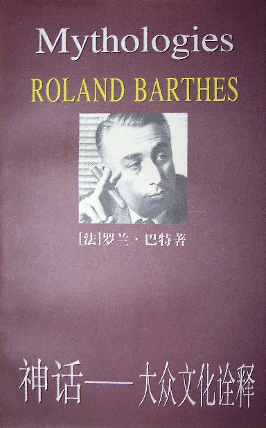
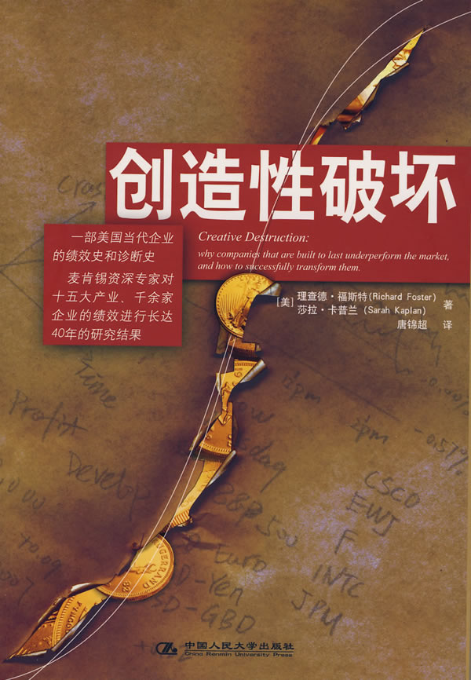
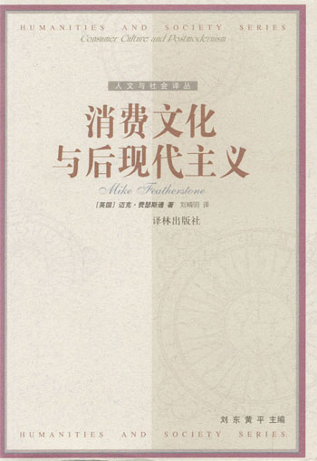
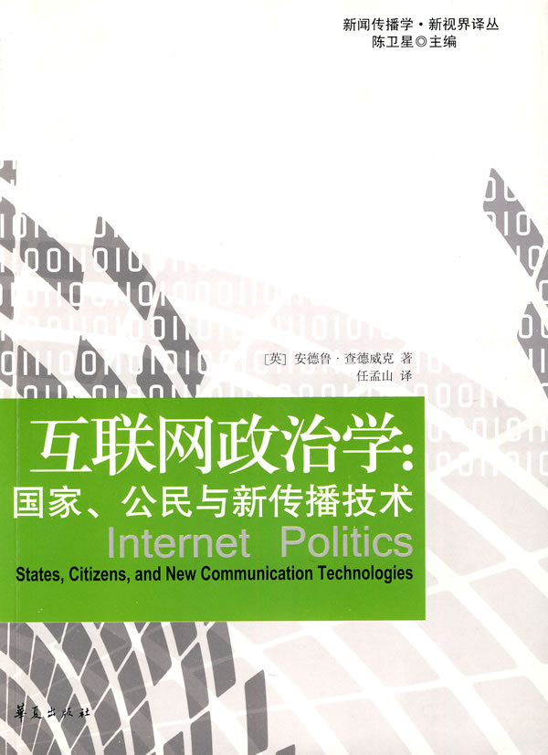
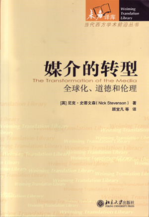
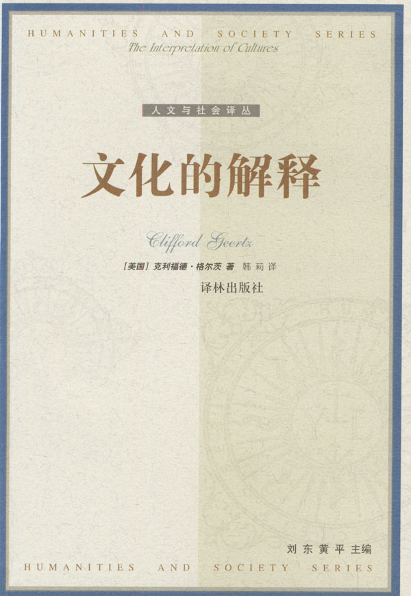

# ＜北斗荐书＞本期主题：消费意识与媒介市场

# ****

# **本期主题：消费意识与媒介市场******

** **

## **荐书人**** /**** ****谷卿（暨南大学）******

** **

****

全球化促进了“文化研究”的再扩大。“文化研究”的大量出现及其方法的多样化，使得大理论与大信仰逐渐减少并被再度弱化，且“文化研究”的对象不仅仅拘泥于学院派所理解的文化，而是近乎彻底地扩大到所有日常生活的各种形式的方方面面。格尔茨在《文化的解释》一书中援引的瓦尔德•古迪纳夫的话可能成为一个佐证：“一个社会的文化，是由个人必须知道或相信以便能够按该社会成员可以接受的方式操作的一切所组成的。”这个现象还联同全球化的另一影响即媒体自主性的增强这一事实一起，成为导致大众文化迅速崛起、精英文化不断衰落的重要因素。传媒的大众意识其实已经存在了很久,却一直苦于政治压力,不敢有悖官方的意识形态。但80年代以后，媒体的主体性较之以前有了很大的提高，于是纷纷迅速地向大众文化靠拢。大众文化的接受者始终占社会的大多数，这一事实令媒体对精英文化的态度开始冷淡、漠视，继而抛弃。消费要及时且要追求轻松愉快这一观念平移到文化上，就有大量“被侮辱与被损害的”形象、漫不经心的游戏语言、文化快餐、娱乐化和消遣性的文字涌现，犬儒主义占尽风流。而大众文化操控下的传媒则是滋养它们的母乳和展示它们的平台。北京大学教授陈平原在其所著的《当代中国人文观察》中指出：“在市场竞争中，通俗文化因其娱乐性容易被一般受众所接纳，又因其复制性可以批量生产，就牟取商业利润而言，精英文化决非其对手。在任何走向现代化的国家中，只要把文化推向市场，必然会出现通俗文化独领风骚的局面。”面对这样强势的大潮，传统文化精英们无力与之抗礼，因而他们中的大多数表现出了一种无奈、不理解，最终退守的精神状态。“穷则独善其身”再度被体现出来。

消费的中心地位的确立和大众文化主动权的提升，足以给我们众多的思考，我们的生活方式也很大程度上地为之一变。但这些变化是一种“润物无声”的默化潜移。了解它们实际上表现了我们对生活的关注。

### **推荐书籍（点击蓝色字体书目可下载）：**

[**1****、《神话：大众文化诠释》**](http://ishare.iask.sina.com.cn/f/15671813.html)

** **

[**2****、《创造性破坏》**](http://ishare.iask.sina.com.cn/f/16223956.html)

** **

[**3****、《知识分子为什么反对市场》**](http://ishare.iask.sina.com.cn/f/7671014.html)

** **

[**4****、《消费文化与后现代主义》**](http://ishare.iask.sina.com.cn/f/16918001.html)

** **

[**5****、《互联网政治学》**](http://ishare.iask.sina.com.cn/f/16286756.html)

** **

****

**6****、《媒介的转型》**

** **

[**7、****《文化的解释》**](http://ishare.iask.sina.com.cn/f/10748758.html)

** **

** **

（采稿：徐毅磊 责编：徐毅磊）
