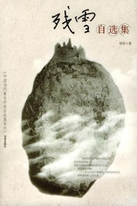

# ＜北斗荐书＞本期主题：灵魂深处的探索

### 

### 

# 本期主题：灵魂深处的探索

### 

## 荐书人 / 慕愁空（中国矿业大学）

### 

### 

阅读残雪实属偶然。前几日在室友书架上借得这本《残雪自选集》，便没头没脑地读了起来。看了下作者简介，五十年代生人，对我来说是比较陌生的一代作家。倒不是完全没听说过她，曾经看到某人评价她是中国仅有的两个真正作家之一，也许是独立作家。这句话是谁说的也忘记了，大抵是个外国人。 我想残雪的书是不适合作为消遣来阅读的，从她写在封面和扉页上的话就可以看出来：我将我写的作品称为纯文学，这是我的领域。是我内部的精神得以成形的方式。按照我的理解，在文学这个领域里，纯即意味着深，意味着向核心的突进。而在封底上的评价基本上都是外国作家的，诺贝尔文学奖的评审之一马悦然称其为“中国的卡夫卡”。 残雪的小说确实和卡夫卡有一些相似之处。作者简介里把她的小说称为“先锋小说”，也就是说，这不是传统的中国现实主义小说。这种非现实性体现在小说的诡异氛围、情节的荒诞性和对超自然现象的描写（主人公陷入一个无法走出的困境，如同进入另一个世界，这个世界的人和原来世界里的人完全不同）。阅读起来进度是很慢的，往往看着看着就不知所云了，对我来说，最大的困扰是小说的诡秘气氛让人心生抑郁，不得不停下来透一透气。 把小说部分看完，读书笔记就显得有趣多了。残雪把鲁迅、卡夫卡、博尔赫斯、莎士比亚等等经典作家的作品都解释为对人性、对美的探索，通过她的评论我们也可以反过来读懂她的小说——她自己在做的就是探索人性深处的东西。把文学作品的人当做人来分析当然是比把人当做阶级来分析有意思的多。我还记得高中时做过一道分析哈姆雷特形象的题，标准答案是：哈姆雷特是作者心中资产阶级的理想典型，但是现实如何如何，理想和现实的冲突如何如何，资产阶级理想无法实现，所以导致悲剧，等等。简直挑战我的想象力，我实在是看不出哈姆雷特的性格和资产阶级有什么关系。再看看残雪是怎么分析的：（讲到哈姆雷特复仇的过程）细细一想，每一个被杀的人其实都是王子的一部分，他杀掉他们，就是斩断自己同世俗的联系，而世俗，是孕育他的血肉之躯的土壤。 说了这么多关于其晦涩难懂的特点，最后还是要鼓励大家去读一读这本书，也许能发现一些从未想到的东西。 

### 推荐书籍（点击蓝色字体书目可下载）：

[《残雪自选集》](http://ishare.iask.sina.com.cn/f/10194428.html残雪自选集)

### 

### 

（采稿：徐毅磊 责编：徐毅磊）
