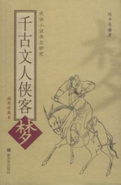
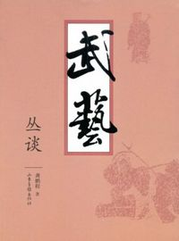
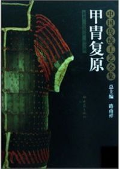
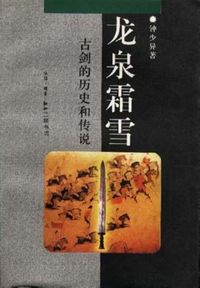
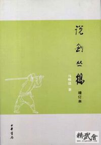
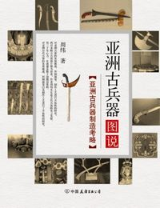

# ＜北斗荐书＞本期主题：犹把书灯照宝刀

**中国文学中的历代风流，不仅有吟诗品箫的雅士，还有弹剑而歌的侠客。翻看演义传奇，总有一股豪迈潇洒的身影让人激情澎湃，于是，武侠小说便成为男孩子侠客情怀的摇篮，发英雄梦的温床。但另一方面，武侠小说又扭曲了很多人看待武学的眼光，评价历史的视角，了解传统文化的路径。而武侠影视剧在其基础上的进一步渲染，更让这种扭曲扩大，“神功”让本属于人间的侠义精神慢慢变成了神话。我想，总应该有一些书，能让人了解更多的武学知识，能让人了解真实的武林，能让人知道冷兵器时代的真刀真枪。总应该有一些人，能纠正扭曲在国人心头的武学文化观念。**  

# 本期主题：犹把书灯照宝刀

## 序文/高天晨（东北大学） 荐书/谷卿（暨南大学）

 

中国文学中的历代风流，不仅有吟诗品箫的雅士，还有弹剑而歌的侠客。翻看演义传奇，总有一股豪迈潇洒的身影让人激情澎湃，于是，武侠小说便成为男孩子侠客情怀的摇篮，发英雄梦的温床。甚至很多人是通过武侠小说了解武术、了解历史、了解传统文化的。武侠小说能带动阅读，引发思考，给人以阅读享受固然是其积极的一面，但另一方面，武侠小说又扭曲了很多人看待武学的眼光，评价历史的视角，了解传统文化的路径。而武侠影视剧在其基础上的进一步渲染，更让这种扭曲扩大，“神功”让本属于人间的侠义精神慢慢变成了神话。所以，我总感觉，武侠小说有一种社会负面情绪的过度宣泄成分，夸张刺激的神功描写反而让读者的目光偏离了侠义的本质。所以，通过武侠小说了解武术的人，大抵有两种看法：第一，小说里的都是真的，中国武术玄妙之极。第二，小说里都是假的，武术都是编出来的。于是，我曾看到很多朋友真的找到“九阳神功”在揣摩练习，也看到很多朋友习练异域武功，言谈中充满了对中国武术的不屑。

我想，总应该有一些书，能让人了解更多的武学知识，能让人了解真实的武林，能让人知道冷兵器时代的真刀真枪。总应该有一些人，能纠正扭曲在国人心头的武学文化观念。

我与谷卿在网络相识。我们有一个共同的交点，便是龚鹏程先生。龚先生是一位学识广博的学者，难得的是他竟有一身涉猎南北门派的拳脚功夫。查看他的著作目录，竟有很多与武学有关。龚先生提出了“技击文化学”的观点，他在《武艺丛谈》中说道：“武术，应视为一种重要的文化表现方式，对其进行文化学的研究。目前此类研究，并未展开。盖以一般文人学士、鸿儒硕学皆不娴武术；而擅武艺者又多属武夫、为体育界人士，徒能演其技艺，不太明白其义理，更无力进行文化研究”。我习武十余年，对龚先生的观点颇为认同。其实武学不仅仅是一种技术，更因其在演练和技击中体现了中国人的哲学思考，武术可以以一种显要的方式证明某种哲学观点，让对方没有机会用繁冗的语言去回避问题偷换概念。我想“文无第一，武无第二”说的正是如此。任你说的天花乱坠，比一比拳脚便知深浅，较一较招式劲力，便晓高下。中国武学的体系庞杂，蕴含颇丰，细细观之，又会发现与其他文化艺术门类也有相通之处。比如武术与书法的关系：八极拳似魏碑，古朴稚拙、浑厚雄强；螳螂拳似行草，缠丝叠绕、虚实相应、快慢相接、气势连贯；太极拳似隶书，松肢放远、方圆并用、外柔内刚、形态端庄。

我所习武功，乃北派七星螳螂门，是以七星式为基础桩，演螳螂象形之功。其中最典型的动作七星式，是以“头，肩，肘，手，胯，膝，足”对应七星北斗而组成的七星连式。我想，这也许是我与北斗的一种缘分吧。下面推荐的这些书籍，都从不同角度对侠义精神，武学原理，兵器知识，武林轶事等进行了精彩的讲解和描述。愿朋友们在这些阅读中能引起共鸣，在生活的浪漫中多一份豪情，在诗意的生命中多一份潇洒自在。正像龚鹏程先生诗中所说：

昨夜秋江暗落潮，无边风雾压归桡。

归来不解金貂醉，犹把书灯照宝刀。

#### 推荐书籍（点击蓝色字体书目可下载）：

**1、[《千古文人侠客梦》](http://ishare.iask.sina.com.cn/f/6264086.html)**

**2、[《武艺丛谈》](http://ishare.iask.sina.com.cn/f/12507957.html)**

**3、[《甲胄复原》](http://ishare.iask.sina.com.cn/f/15531666.html)**

**4、[《逝去的武林》](http://ishare.iask.sina.com.cn/f/15428770.html)**

**5、[《龙泉霜雪》](http://ishare.iask.sina.com.cn/f/5667076.html)**

**6、[《说剑丛稿》](http://ishare.iask.sina.com.cn/f/7359571.html)**

**7、[《亚洲古兵器图说》](http://ishare.iask.sina.com.cn/f/6652056.html)**

 

（采稿：徐毅磊；责编：徐毅磊）

 
