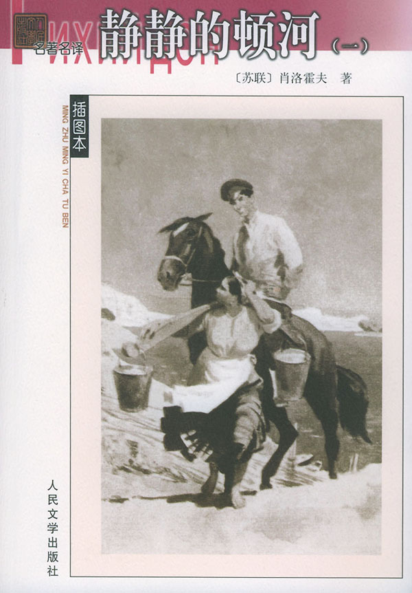
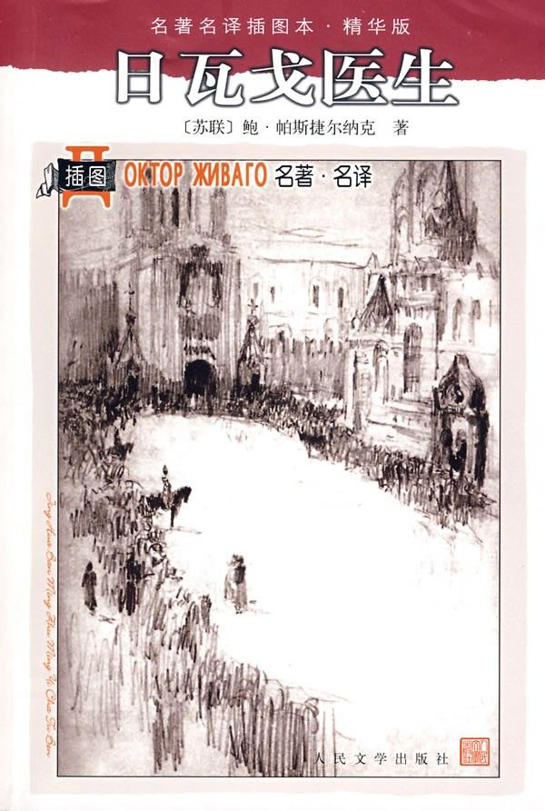

# ＜北斗荐书＞本期主题：生命与革命

 

# **本期主题：生命与革命**** **

## **荐书人 / 詹乃德（北京大学）**

 

### **推荐书籍（点击蓝色字体书目可下载）：**

[**1****、《静静的顿河》**](http://115.com/file/clou4mqf#)

****

[**2****、《日瓦戈医生》**](http://ishare.iask.sina.com.cn/f/8027492.html)

《静静的顿河》是由肖洛霍夫所写，历时14年，从1926年（作者年仅21岁），至1940年完成。书中以格列高里·麦列霍夫为主线，以一个哥萨克骑兵身份从一战到内战的过程。从中展现俄国从一战到十月革命，一直到余粮收集制实施后的，这段时期顿河地区底层民众的生活状况。

而这本书其实应该参照鲍里斯·帕斯捷尔纳克的《日瓦戈医生》来看，因为前者是以白军为视角，而后者以红军为视角的。事实上，《静静的顿河》选取的哥萨克骑兵虽主要是白军，但是以保卫顿河为目的，和白军有所不太完全一致，并且格列高里·麦列霍夫也反复地参与了红军。下面分几个方面对比一下，这两部著作，以展现在俄国革命过程中，对于生命与人性的理解。

首先，描写的对象。《静静的顿河》是选取一个普通的哥萨克格列高里·麦列霍夫，几乎没有接受的教育。正如后来他当上师长之后，仍被部下指责粗俗。性格上比较火爆，敢爱敢恨，正直，但是往往不免鲁莽，以自身的角度来理解这场战争。不论红军还是白军，任何一方滥杀无辜，他都会直接反对，所以没有完全一致的政治立场，唯有的是一致的正义感。 

《日瓦戈医生》的主要人物尤里·安德烈维奇·日瓦戈则是大学生，军医。所以与格列高里相比，在出身背景，生活习惯以及性格上相差很大。书中明显看出来日瓦戈医生比较有诗人气质，细腻，温和，善良，在革命过程中表现得比较柔弱，在生活层次上比较偏中层以上。从这两部著作上，也可以推断出来肖洛霍夫与帕斯捷尔纳克的不同生活背景。

事实上，肖洛霍夫基本上没有接受什么教育，完全自学成才，也可以猜测出来这个人性格比较直爽。而帕斯捷尔纳克显然就柔和一些，他自身修养较好，父亲是著名画家，为列夫.托尔斯泰作过像，并且与里尔克都有交往。可以看出帕斯捷尔纳克本身性格比较敏感，细腻。其实，他原本就是以诗人身份而获得声誉的。

其次，对于生命的态度。这点上，两者基本一致的，《静静的顿河》与《日瓦戈医生》都对于战争中生命的脆弱表示深层的伤感，一种人道主义同情。都是反对极端性的革命，但是在《静静的顿河》里面，格列高里·麦列霍夫在“一战”后期反对战争，对于上层的政治关注不多。仅仅关心于顿河地区的利益与生命，所以不论谁来侵害，谁侵害生命，格列高里.麦列霍夫都会起来反抗。所以，他反复地参加红军、白军，再红军，再白军。

而《日瓦戈医生》则是对于“十月革命”前的腐败明显否定性态度，因此欢呼“十月革命”像手术刀一样切除很多溃疡。基本上是支持革命的，只是反对革命的极端化，造就了很多时候生命在革命中失去轻重，导致滥杀无辜。日瓦戈医生目睹无辜的男孩被红军处死，心中难以磨灭的伤痛。而革命就像一发炮弹一样，很容易偏离原先的轨道，不可能完全精确。而在这样的过程中，个人往往失去意义，难以掌握自己的命运。就像帕沙.安季波夫一样，虽然当上某支部队的司令，最终还是被迫自杀。

对比可以看出，前者没有这么宽阔的视野，麦列霍夫在革命当前是无法决定自己的命运，按照他与英国中尉的饮酒中，对方比喻顿河的哥萨克虽然想保护自己的家园，维持稳定的生活，可是像一颗杏核。而“十月革命”的浪潮，就像一个手掌一样，随便一翻，就会把杏核翻在手心之中。相比整个国家而言，顿河地区仅仅处于漩涡之中，而很多顿河地区的人民没有这样的大局观，更无法决定自己地区的利益与生命。

第三，对于革命的思考。正如上面所说的那样，《静静的顿河》对于革命持一种暧昧态度，起初参加红军缘自厌倦一战，因为作战过于艰辛，并且生存率极低，想回去过自己安稳的小日子，“老婆孩子热炕头”的生活。可惜在革命当前无法抉择。事实上，这也是很多革命过程中低层民众的态度。

而《日瓦戈医生》欢呼“十月革命”，缘自看够了各种腐败与无耻。只是对于革命过程中，存在的流血同样感到痛心疾首。并且革命后的政权逐渐偏离了起初的理想，使得人民对于革命失望。这样就出现了悖论，一方面社会危机面前，盼望革命。可是真正革命机器启动后，又会有无数无辜生命付出代价，并且革命后，同样无法实现最初的设想，甚至严重偏离，导致一种对于社会悲观与失望。《日瓦戈医生》所描绘的心态也正是近代很多革命的经验与教训。

第四，关于爱情。《静静的顿河》里面的格列高里爱上一个有夫之妇，阿克西莉亚。并且围绕两人之间的感情，反复地展开，先是私奔，后阿克西莉亚又与李斯特尼茨基同居，格列高里闻讯后与其断绝关系，而阿克西妮亚后又被李斯特尼茨基抛弃。后阿克西妮亚与其夫复合，但是不久格列高里与之重逢，旧情复燃，始终在一起，断断续续一直到书中终尾。

而非常相似的是，《日瓦戈医生》中，尤里.日瓦戈也是爱上了有夫之妇拉拉·安季波夫，拉拉的丈夫后来当上红军某部队的司令。不过悲剧的是，《静静的顿河》里面的格列高里粗犷的性格也为他的家庭带来了不幸，先是因为和阿克西妮亚，自己的妻子为之自杀，幸而未遂，最终无法忍受格列高里与阿克西妮亚的旧情复燃，最终堕胎未遂而死。整个书中，格列高里妻子娜塔亚是非常不幸的，忠贞，美丽，善良，却不得不忍受心痛，并且死得很痛苦。

上面是两部著作的简单对比，至于其中更为深刻广阔的内容，需要仔细阅读，因为两部书都是如此博大深沉。通过对于革命中生命所体现的价值与思考来看，得出三个最为简短结论。

一方面，从政治学角度来看，如果改革可以得以实行的话，那么显然最佳方案，可惜很多时候改革往往根本无法实施或者解决。并且改革过程中，一定需要强硬人物来执行。作为好男人，好丈夫，追求高尚优雅的路易十六即位后，即致力于改革，可惜最终送上断头台。而改革无法实行的话，那么不彻底的革命显然是次优选择，可惜革命机器一旦启动就难以遏制，难免导致无辜受难，并且偏离轨道。而过于崇拜暴力革命的人，更是荒唐得不可救药。

另外一方面，对于生命尊重是理想政治行为的前提。可惜，在一个制度被压制很久的民众面前，生命往往显得毫无意义，也没有保障。粗暴的政治，会有粗暴的革命。而在这个社会中，个人想掌握自己的命运，显然是需要和家庭、国家与时代结合在一起的。唯有关注更为广阔的视野，才能明白自身所处的位置，决定自身的命运。遗憾的是，人生的悲剧性就在于，往往决定不了命运。

《静静的顿河》里面，哥萨克骑兵所关注的也仅仅在于每个人安稳的家庭生活。可惜战争剥夺他们这样机会，于是就转而追求顿河地区的独立与自治。而在革命洪流面前，往往又是不堪一击。《日瓦戈医生》所描绘的就是个人想追求并决定自己的生存，可惜始终无法做到。

最后，以俄国思想家亚历山大·赫尔岑一句话作为结语：“每一个时代，每一代人，甚至每一个生命，都有其自身的圆满性。”

 

（采稿：徐毅磊 责编：徐毅磊）

 
