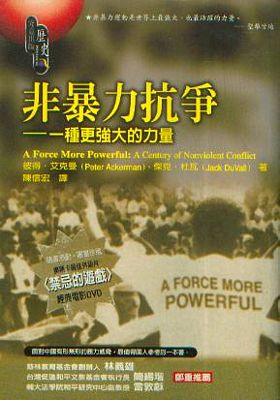

# ＜北斗荐书＞本期主题：社会运动如何重建心灵

 

# **本期主题：社会运动如何重建心灵******

## **荐书人 / 黄霄（北斗撰稿人）**

 

**推荐书籍（点击书目可下载）：**

**[《非暴力抗争》](http://ishare.iask.sina.com.cn/f/12667007.html)** ****

****

1930年3月12日拂晓，守候了整夜的人们开始祷告，吟唱灵歌。莫罕达斯·卡拉姆昌德·甘地走出他在印度古吉拉特小镇阿姆达巴德建立的萨巴玛提修行所，向情绪矛盾的人群发表演讲。“这场斗争不是一次公开表演：它是最后的抗争……我要求你们返回到这里时，要么已为自治献身，要么是它的赢家”，他说道。他将带领78名来自不同地区、宗教团体和种姓的修行所成员，路途240英里，经过多座古吉拉特农村，历时3周，在安丽莎大屠杀周年纪念日到达海边村庄丹迪，以这样的政治表演去向印度民众展示他所精心挑选的印度独立运动的开端——为抵制完全不公正的食盐税而自制食盐。

一个看似鸡毛蒜皮的小目标，值得如此大张旗鼓么？当时殖民统治印度的英帝国当局在此之前就得到情报并收到甘地写的公开信，但也自忖他们完全承受得了公民不服从，不过是少点食盐税罢了，印度总督欧文男爵也说：“甘地先生会发现，一把盐是不可能打垮大英帝国的。”

欧文应该为此而感到后悔。游行者进入每个村庄，都会有群众聚集起来，敲锣打鼓地欢迎。甘地发表简短演讲，批评食盐税“不人道”，声称食盐“非暴力抵抗”是一场“穷人的战斗”。他希望通过食盐运动让最底层的印度人以有实质意义的方式促进自治，而这不只和光荣的政治目标相关，也关于印度人对他们日常生活的控制。他的呼吁获得了印度民众积极的回应。4月5日抵达目的地丹迪的当晚，超过12000人聚集在这个小小的村庄。6日拂晓，甘地站在岸边，俯身掬起一团泥巴，象征着公民不服从的开始。和父亲一起在联合省镇子阿拉哈巴德售盐的贾瓦哈拉尔·尼赫鲁回忆：“就像一个弹簧突然松开了。制出的东西是好是坏真的不相干了；重要的是去触犯可恶的食盐法……”乌莎·梅塔也回忆起，她大婶和祖母把盐水带回家，熬出盐来，“然后她们扯开嗓子喊：‘我们违反食盐法了’。”

实际上，甘地曾痛感印度人民绵羊般顺从的习性，他在1917年说，自治需要一种“生命的全方位的觉醒”，它必须开始于个体的觉悟，“更重要的是内省性的活动。”而社会的重生本身并不是目的，它是非暴力行动的准备工作。印度存在着大量的对一场统一、系统的民族主义运动的障碍，如穆斯林和印度教徒之间的矛盾，公共生活对妇女和贱民的排斥，以及绝大多数印度人的贫困和无能。但甘地发起的非暴力运动改变了这一切。纳拉扬·戴赛说，在他们和甘地坐到一起之前，英国人“都是老爷，而我们顺从他们。但自那以后再也不会这样了。”在接下来5月份冲击达拉萨那食盐厂、在勒克瑙市哈慈勒佳尼商业街的游行，以及孟买焦帕蒂海滩游行，都成为了民众展现他们自身力量的非暴力典范。妇女们也热烈地参与到运动中来，可能有20000人在1930年入狱。拉合尔的一位学生抗议组织者说：“印度妇女给了英国政府沉重一击。我们再也不是……甘于待在四壁之内，胆怯、温和、目不识丁的那种印度妇女了……”

在超过一个世纪的时间里，统治者以和善自居，支持健全的经济和渐进式改革，只要印度人尽他们的本分，英国人就能维持这种假象。印度人反抗不公法律的不服从运动揭露了真相，它让人民真切的看到，一旦顺从缺位，英国人就会用棍棒和枪炮进行统治，如造成死伤上千的加利安瓦拉广场屠杀，以及达拉萨那食盐厂、哈慈勒佳尼商业街的暴力事件。瓦茨拉夫·哈维尔认为专制政权的弱点在于必须依赖人民的合作，因为它要求人们生活在谎言中，而那些找到“生活在真实中”的人将会开创“独一无二、具有爆炸性和无可估量的政治力量。”那些仍然生活在谎言中的人，只要——而且随时可能——被真相的力量所触动，“一个赤手空拳的平民百姓就能解除一个整师的武装。” 而社会运动就扮演着这样的关键“引爆点”。社会运动（尤其是非暴力运动）常常在成功转型之前，就为未来社会的良好自我治理提供了成熟公民社会以及活跃的社区组织的胚胎，通过发起自治运动以减少民众对当局的依赖，当局的镇压或无所适从又使其合法性受到大大削弱。最重要的是，社会运动恢复建立了强健自尊的社会心理背景，通过点燃个人行动的火花来培养人民对自己负责的习惯，重新激活了民众对正义、自由以及真相的渴望，使民众的内心不再被体制性的恐惧所控制，最后，民众的心灵得到了重建。往日的屈辱将成为现在的荣耀，正如纳拉扬·戴赛记得自己还是孩子的时候，他父亲（甘地的秘书）被抓住监狱时在警车后座里充满欣喜的叫喊：“这次不会少于两年！”

PS：本文主体部分是对《一种更强大的力量——非暴力抗争一百年》第二章“印度：自治运动”的改写。

 

（采稿：黄霄 ；责编：徐毅磊）

 
