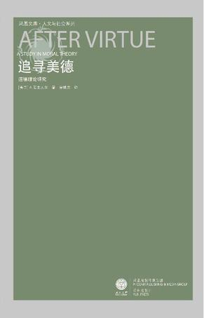
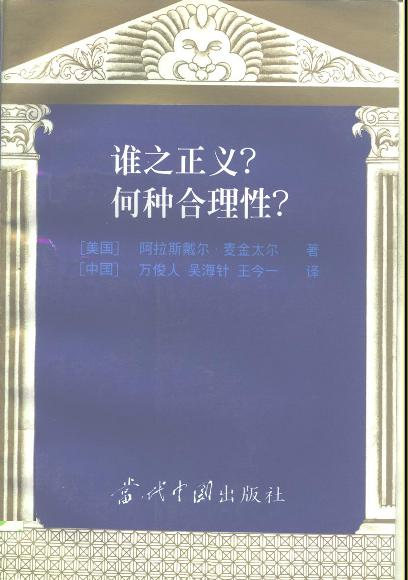
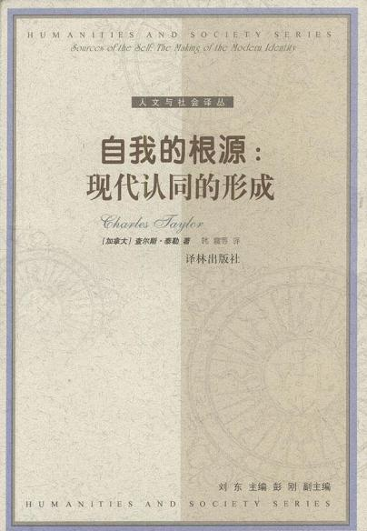
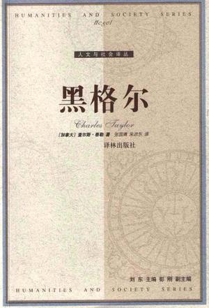
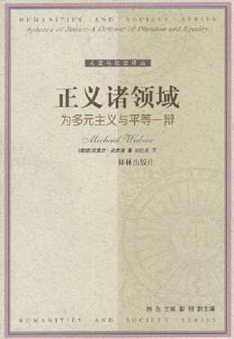
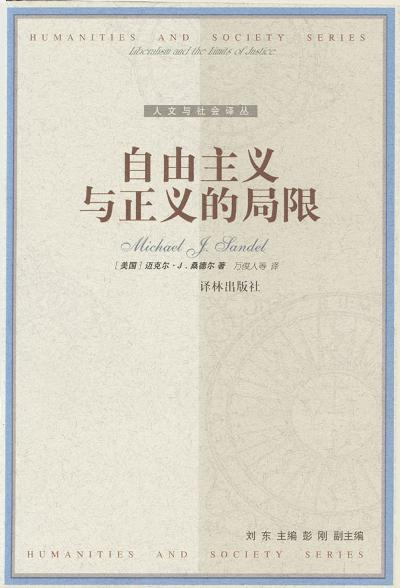
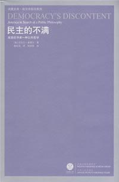

# ＜北斗荐书＞本期主题：社群主义：对手还是朋友？

# 

# 

# **本期主题：****社群主义：对手还是朋友？******

** **

## **荐书人**** /**** ****陈纯（中山大学）**

 很多人以为社群主义是作为自由主义的一个重要竞争对手而登上思想的历史舞台，其实在我看来，与其说社群主义是对自由主义的对立面，不如说它是自由主义的补充。同样的说法也可适用于共和主义，但绝对不适用于施特劳斯学派。  社群主义为自由主义补充了什么呢？至少在两点上，社群主义者的眼光要比自由主义者看得更悠远，不论向前还是向后。  第一点是社群主义者的自我观念。在罗尔斯看来（至少在《正义论》中是如此），自我是一个抽象的存在，先于任何后天获得的目的和属性，我们可以修改我们的目的，也可以改变我们的属性，因此，目的和属性都不是自我的本质部分；但在社群主义者看来，事情并不是这么简单。社群主义者认为，在自我的构成中，一些特殊的目的占据着极为重要的作用，这些目的可以被称为“构成性目的”，它们是自我区分于他者的一个标志。在这一点上，社群主义者无疑得到了古希腊传统的支持，德尔菲神庙和苏格拉底一生都在践行的那句“认识你自己”可以作为社群主义之自我观的卓越注脚，柏拉图在《会饮篇》中对“爱欲”与命运关系的精神论述也可让我们将“爱欲”与“构成性目的”作一恰当联想，更不用说亚里士多德的人之目的论学说。连对古典学钻研颇深的当代英国哲学家伯纳德·威廉斯也认为：“对人来说最困难的事情，不是实现我们的欲望，而是发现我们最深层的欲望。”将这些观点串联起来，我们确实能发现不少支持社群主义之自我观的理由。  问题是社群主义认为，这种“构成性目的”必须从个人所从属的社群之传统中发现，在这些传统中，有一些为漫长时间所检验，为我们的先人所认可的“善”或价值，如果我们不能发现这些价值并将这些价值认同为自我的目的，那我们的自我就会产生缺陷；这是一种叙述性的错位，我们无法将社群的记忆与个人所选择的目的整合成一个完整的叙事，而从社群主义的叙事同一性理论（人格同一性理论的一种）来看，这代表着我们将遭受同一性分裂之苦。  后来的自由主义者一般认可“构成性目的”对自我观念的重要性，但不认为这些构成性目的一定得来自社群的传统价值。孰是孰非，有待诸君省察。  第二点来自自由的社会条件，这方面的观点主要来自查尔斯·泰勒。泰勒认为，只有在某种社会条件之下，才有可能培养起自由主义者所强调的独立自主精神，这些条件包括：提供多种有意义选择的文化结构、评价这些选择的公共论坛、团结与政治合法性的先决条件。这方面的批评对罗尔斯这类左派自由主义者杀伤力不大，但对自由至上主义这种右派自由主义就有很强的针对性。自由至上主义者认为政府的作用就是保障公民的各种自由权利以及保证国防安全之类，其他东西，比如医疗、教育、收入分配等，政府不应该插手。但在社群主义者看来，仅有这些是不够的；一方面，一个自由社会仅靠在形式上保证每个人的自由权利是无法建立起来的，自由教育、社会文化、公民德性等因素对这种自由社会的存在来说也是必不可少，这里有些方面无疑需要政府有意培养和支持；另一方面，不同种类的自由也是不应该同等对待的，吸毒的自由和宗教信仰的自由，对一个自由社会来说，其重要性不可能是同等的，一种自由是否高于另一种自由不应该由政府来决定，但这并不意味着各种自由之间只有量上的可比较性。  泰勒对自由的社会社会条件方面的论述获得了大部分自由主义理论家的认可，而且，根据泰勒的逻辑，以赛亚·伯林对“积极自由”和“消极自由”的区分也许需要重新考量，因为按照泰勒的想法，某些积极自由其实比某些消极自由更值得保护。消极自由先于积极自由的说法是有失谨慎的。  

### **推荐书籍（点击蓝色字体书目可下载）：**

[**1****、《追寻美德》******](http://ishare.iask.sina.com.cn/f/13512335.html)

** **

** **

[**2****、《谁之正义？何种合理性？》******](http://ishare.iask.sina.com.cn/f/4525312.html)

** **

** **

**[3](http://ishare.iask.sina.com.cn/f/8291016.html)**[**、《自我的根源》******](http://ishare.iask.sina.com.cn/f/8291016.html)

** **

** **

[**4****、《黑格尔》******](http://ishare.iask.sina.com.cn/f/11353202.html)

** **

** **

[**5****、《正义诸领域》******](http://ishare.iask.sina.com.cn/f/7428723.html)

** **

** **

[**6****、《自由主义与正义的局限》******](http://ishare.iask.sina.com.cn/f/10067813.html)

** **

** **

[**7****、《民主的不满》******](http://ishare.iask.sina.com.cn/f/14220465.html)

（采编：余岚 责编：徐毅磊）

 
