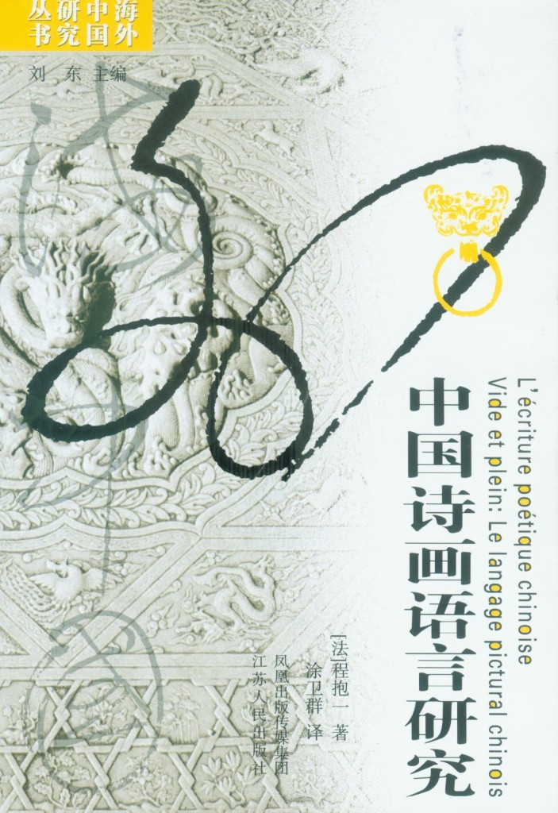
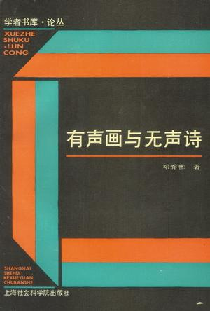
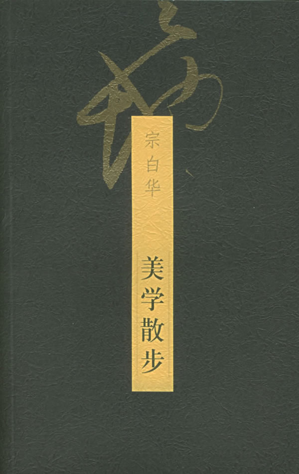
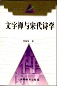
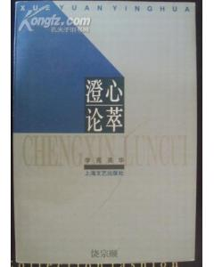
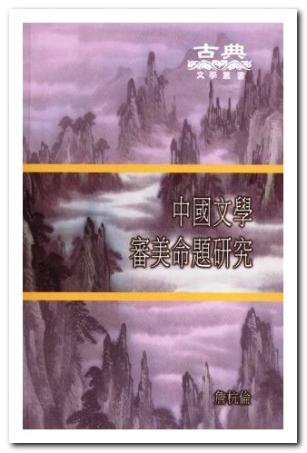

# ＜北斗荐书＞本期主题：神来笔笔华严时

 

# **本期主题：神来笔笔华严时******

## **荐书人 / 谷卿（暨南大学）**

 

历来多有论禅与画之关系者，如剖析禅之南北宗与画之南北宗间关系，又如论画与禅均有着力表现空灵之境界者。自北宋苏轼为王维画题跋以来，将画与诗相提并论者也代不乏人，现代美学大师宗白华有《中国诗画中所表现的空间意识》一文，以空间和境界为观照的重点来比较诗画的异同；学者钱锺书亦写有《中国诗与中国画》，广征博引，从文艺批评史的角度来论述诗与画的密切联系，其中花费大量笔墨谈论南北宗与禅宗和南北地域之论当始于六朝，可谓是论禅学、诗学与画学及其间关系的经典之作。

毕生致力于中国哲学思想特别是佛教文化研究的法国著名汉学家戴密微（Paul Demiéville）教授曾这样谈到他对中国思维模式与认知方式的看法：“中国思想的特质，在紧握现实，返回即时的直觉。在中国，‘抽象’与‘系统’几乎全为具体的直觉所代替。”“此种思想使吾人感觉困惑……但假如有一人加以品尝，便完全觉得抽象理论之无味。”戴密微教授早年主持翻译出版过《中国古典诗选》，对中国古代诗歌有很深的研究，他在一些关于中国禅宗肇始的论述中，屡有谈及佛经与诗歌的关系。上引一段话，正是戴密微教授长期研究禅学与诗学后所得的感受。我们同样认为，作为中国传统文化形式突出代表的诗与禅，它们的共通之处就在于都是源于“直觉”而现之“具象”。

禅是梵语“禅那”（Dhyana）音译的略称，意译则为“静虑”、“思维修”、“弃恶”等，是佛弟子的一种修持方法。禅宗主张不立文字、直指人心，即心是佛、顿悟见性，提倡的是一种直觉的、神秘的悟道、体道方式，反对以概念、判断、分析、推理的逻辑来参证。正是这样一种特殊的思维方式和修习方式，与诗歌艺术和诗学思想发生了多维度的交融和碰撞，互相影响、互彰互成。诗的创作方法、表现手段和禅的修持方法、表达方式都有着相通之处。

唐宋是中国诗学逐渐成熟和定型的时期，而此时的画学也从魏晋时代的懵懂性自觉发展为建立在实践基础上的深层自觉，如对“感兴”的体悟就深刻地表现出唐以后的论画者开始从对绘画本体论和品赏标准的关注转移到绘画创作上来，这种实践性较强的画论转型，也采纳了魏晋文论的理论成果；另一方面，诗画的交互性发展，也使得绘画的表现对象开始承载了越来越多的文化意涵，一些没有思想、感情、精神的花鸟、虫兽、山川、松石均被赋予了创作主体的情感，这种“比德”也使得中国画的意义空间大为拓展。可见，诗学、禅学与画学的相通之处，大可归结为诗家主张通过实地实时的感兴而非苦吟、摘句式地创作诗歌，禅家主张以“一触即觉”、刹那随机式的触兴方式悟道证果，画家主张目山水之胜而兴寓于心，激发创作的灵感；诗家用具体的比兴来丰富诗歌的意象，禅家用各种真实可感的譬喻来说明深奥的本体文体，画家则通过寄兴以表现画面内容难以言说的意外之意。

 

**推荐书籍（点击蓝色字体书目可下载）**

[**1****、《中国诗画语言研究》**](http://ishare.iask.sina.com.cn/f/19488742.html)

** **

[**2****、《有声画与无声诗》**](http://ishare.iask.sina.com.cn/f/6643435.html)

** **

[**3****、《美学散步》**](http://ishare.iask.sina.com.cn/f/17845942.html)

** **

[**4****、《文字禅与宋代诗学》**](http://ishare.iask.sina.com.cn/f/20120103.html)

** **

[**5****、《澄心论萃》**](http://ishare.iask.sina.com.cn/f/20200393.html)

** **

**6****、《中国审美命题研究》**

 

（采稿：徐毅磊 责编：徐毅磊）

 
