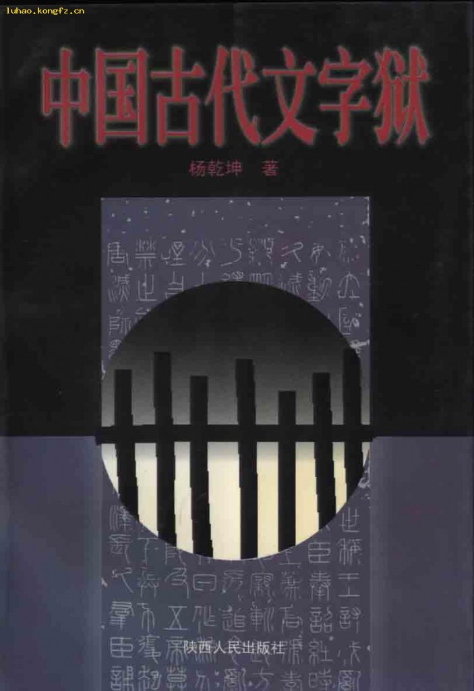
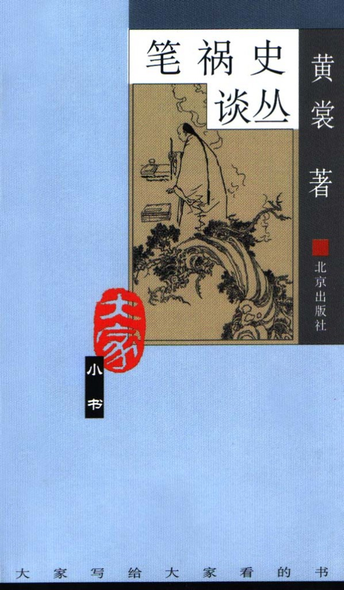
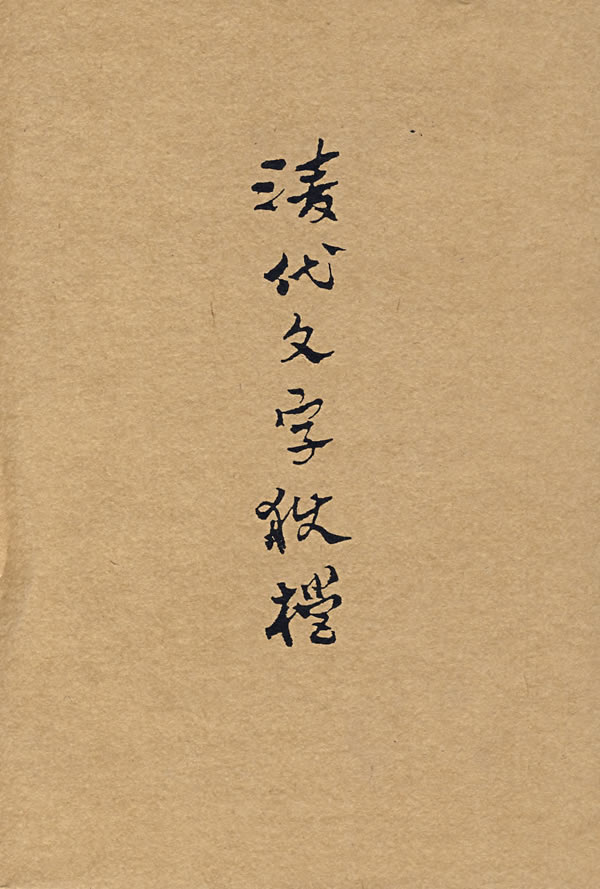
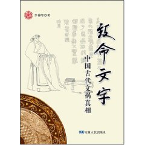
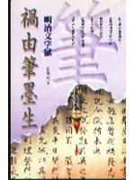
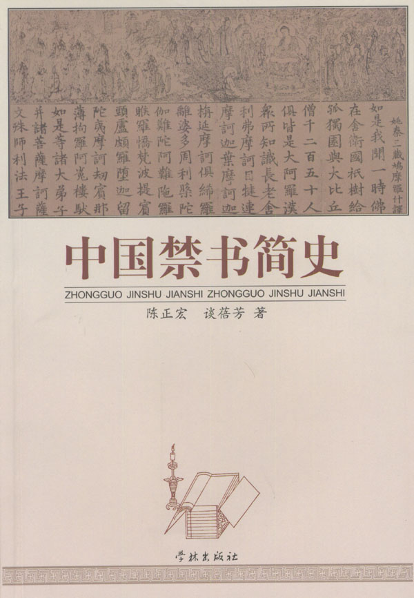
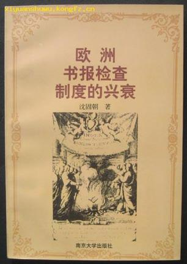

# ＜北斗荐书＞本期主题：笔祸与文难

# 本期主题：笔祸与文难

## 荐书人 / 谷卿（暨南大学）

 前不久，我因在人人网上转载了一些稍微敏感点的文字和图片，就被关进“小黑屋”，直到儿童节前夕还没被放出来。本来早就想着为北斗做一期关于文字狱方面的主题荐书，却因一直忙于琐事，竟致遗忘，此番被关“小黑屋”，倒是为我提醒了此事。 中国是文明古国，语言文字发达，传统不曾中断，但也就是这样的“文明”古国，其历史更充满着文明的反动。文明的每一次进步，都要付出极为高昂的代价。例如清修四库，看似文化盛举、重大工程，实际上此举删毁的书目实不知是四库在编书目的多少倍。 文祸的厉害之处不仅是书籍文献遭难，文化人和知识分子也在被消除、清灭之列。中国的一部文化发展史、知识分子命运史，就是一部笔祸文难史和文人血泪史，其间的血腥、暴虐令人触目惊心。文字狱在明清两代可谓造极，满清君权专制，明代亦然。但是，廷杖和厂卫的暴力并不能和满清对文人精神上的践踏奴役相比，中国文化的精英在清代彻底失去了创新的能力，文官结成的行政系统亦无法以其工具理性制衡君权，士大夫在威权之下无不气短，遑论志节？！虽然在强权面前，知识分子中并不缺乏太史简、董狐笔，但只要统治者稍微变换一下手法，他们的意志和战斗力就被迅速瓦解了，更不要说被放置在“人民”与“大众”的对立面来接受批判了。可见，敢于和极权斗争固然可贵，但若做不到对除学术外的一切它力不管不顾，仍然不能说是有独立的精神的知识人。 想到龚自珍有一句诗：“避席畏闻文字狱，著书都为稻粱谋”。近百年、特别是近半个多世纪以来，中国的现代化进程突出地表现为精英意识的衰微和传统文化资源的消亡，这个责任当然主要应由知识分子来承担，但是，究竟什么让我们软下来了？我们还能重新拾起人文价值的宝贵尊严和信心吗？我们到底究竟还能为“挽回”、“重构”做些什么？ 又想到龚自珍的另一句诗：“吟到恩仇心事涌，江湖侠骨恐无多”。笔墨世界，当然就是一个江湖，我们也实在渴盼这个江湖多一些真正的侠骨。 

### 推荐书籍（点击蓝色字体书目可下载）：

[**1、《中国古代文字狱》**](http://ishare.iask.sina.com.cn/f/11976284.html)

** **

[**2、《笔祸史谈丛》**](http://ishare.iask.sina.com.cn/f/8814326.html)

[**3、《清代文字狱档》**](http://ishare.iask.sina.com.cn/f/10496977.html)

[**4、《致命文字》**](http://ishare.iask.sina.com.cn/f/8831292.html)

**5、《祸由笔墨生》**

[**6、《中国禁书简史》**](http://ishare.iask.sina.com.cn/f/12420849.html)

**7、《欧洲书报检查制度的兴衰》**

** **

（采稿：徐毅磊 责编：徐毅磊）

  标签： 
