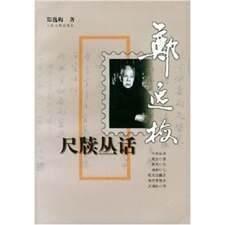
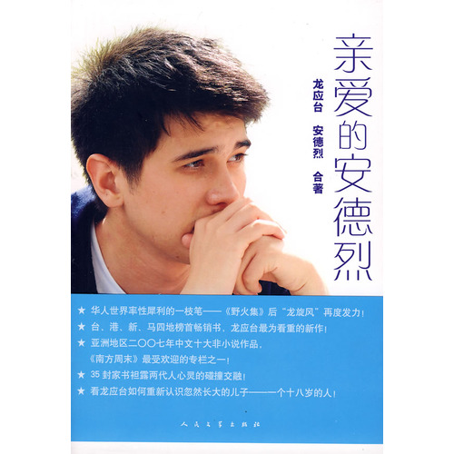
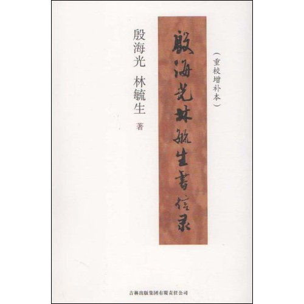
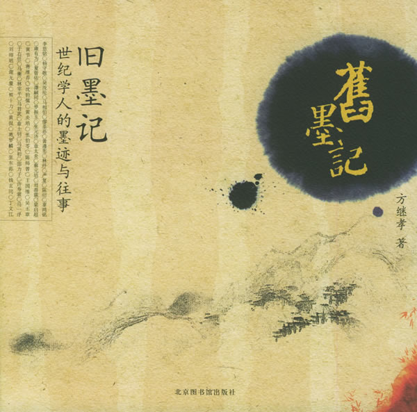
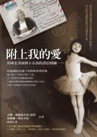
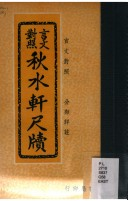

# ＜北斗荐书＞本期主题：纸短情长尺素书

 

# **本期主题：纸短情长尺素书******

## **荐书人 / 谷卿（暨南大学）******

  六年前，由中国国家博物馆、中国民间文艺家协会等共同发起过一次“抢救民间家书”工程，后来陆续出版了《家书抵万金》、《任鸿隽陈衡哲家书》、《抗战家书》等一系列图书，当时也确实有了一定的社会影响。其实，生活在新信息时代的人们，早已不能体味接发书函时的特殊感受了。虽然电子商务促发了物流业的勃兴，但“寄雁传鱼”的文字迢递似乎并未包纳其内。我们当然愿意做起事来加快步伐，但偶尔放慢脚步歇息一下，可能会更加深刻地感受到生活的情趣与真谛：周末的下午，阳光洒进书房，拉开书桌的抽屉，取出一封封旧日的书信，在阅读中回忆欢乐与愁苦、激动与沮丧，忽然惊觉：原来自己曾经这样的真实过。 中国文人似乎历来喜欢“玩花样”，尤其在小东西上“玩花样”。自薛涛以后，代有骚人或大匠专注于制笺之道，他们精绘精选画作，精工细刻，成就尺寸之纸。然而，这并不能视为所谓“玩物丧志”，在这些可爱的什物背后，透露出的是人们对生活的挚爱，以及文人们精微的情愫和细密的心思。 我曾在珠海某藏书家宅中见到《萝轩变古笺谱》一部，赵朴初题签、郭绍虞序、谢稚柳跋，乃上世纪八十年代由上海朵云轩按清绮斋旧藏明天启《萝轩变古笺》原样饾版拱花套色翻印者，观之颇能窥得天启原本全豹，所谓“触景而摹简端，雕镂极巧，尺幅尽月露风云之态，连篇传禽虫花卉之名。大如楼阁关津，万千难穷其气象，细至盘盂剑佩，毫发倍见其精神。”当时翻印由谢稚柳先生主持其事，仅印三百部，现在此笺谱的市价约在数十万元。 当年的鲁迅也是集笺达人。郑振铎在《北平笺谱序》中说：“鲁迅先生于木刻画夙具倡导之心，而于诗笺之衰颓，尤与余同，有眷恋顾惜之意，尝数与余言之，因有辑印北平笺谱之议。自九月始工，迄十二月竣事，其间商榷体例，访求笺样，亦颇费苦辛。”两人四处寻访，认真遴选，收入三百四十幅笺纸，得成《北平笺谱》六册，就是我们现在能够看到的样子。倘有闲钱，买一套收藏，得暇时一叶叶翻看，感觉一定很美妙；更若兴致来时，取一纸写上几句，寄给远方的朋友。试想一下，当他\她蓦地收到这翩然的来鸿，会是什么感受？ 朋友笑言我的“信生活”极频繁，盖每周总要去邮局数次之故。在同我书信往来的友朋之中，年纪最长者已九十高龄。我总是固执地认为，完成于纸面上的笔谈，在所谓的“风雅”之外，也是更加具象、立体，同时可堪反复品味思索的。 “白云过山峰也可传情”，文学史和艺术史大致等同于“传情史”。怎样小心地传递情爱，怎样把我们的情感表达得更明确而更有内涵，几乎是终我们一生都在思考和琢磨的事情。重拾书信，感受那片纸只字的款款温情，你会发现，“原来生活可以更美的”。 

### **推荐书籍（点击蓝色字体书目可下载）：**

[**1、****《尺牍丛话》**](http://u.115.com/file/bhih6qyp)

[**2、****《亲爱的安德烈》**](http://ishare.iask.sina.com.cn/f/14029858.html)

****

[**3、****《殷海光林毓生书信录》**](http://ishare.iask.sina.com.cn/f/13396664.html)

****

**4、****《旧墨记》**

**5、****《附上我的爱》**

****

[**6、****《秋水轩尺牍》**](http://ishare.iask.sina.com.cn/f/7994376.html)

 

（采稿：徐毅磊 责编：徐毅磊）

 
