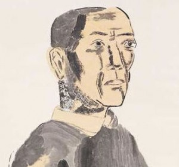
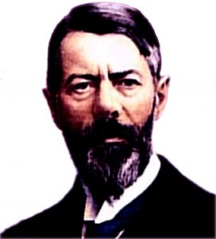

# ＜北斗荐书＞本期主题：置之死地而后生——读韦伯《以学术为业》有感

**摘要：面对时代的命运，韦伯无法告诉我们应当选择什么，但他告诉了我们应当如何去判断和选择。这才是这位思想的巨人留给我们的真正的财富。“以学术为业”的学者们当处于价值无涉的立场上来引导他人达到“头脑的清明”，而作为尚未踏入学术殿堂的普通人来说，唯有扩充知识，探求相互关联的事实，才能找到主导我们所有行为的终极价值观。**

 

# **本期主题：置之死地而后生**

# **——读韦伯《以学术为业》有感**

## **荐书人 / 李勃良（南京大学）**

 

偶然听说学科开山大师马克斯·韦伯有一篇文章叫作《以学术为业》，我便找来观摩。在反复读了数遍之后，总算大概把握了文章想传达的思想。虽然理解得并不透彻，但已经收获颇丰，达到了之前的目的。寥寥两万余字，内容之丰令人惊叹，而它给我的阅读感受就如同坐在一辆黑暗中的过山车中一样。

这篇演讲开头，平缓地比较德国与美国的学术环境，数百字以后，韦伯总结道，不仅是体制上的集体选择令学者有苦难言；并且由于学术的二重性，使得学者有能力同时满足大学对研究与教学这两种不同的需要成为了纯粹的运气。综上，他给出了结论，学术生涯就是一场赌博。随后，他抛出了一个令学者们避之不及却又避无可避的问题：“你能承受年复一年看着那些平庸之辈爬到你头上去，既不怨恨也无挫折感吗？”读到这个问题的时候我的大脑中不禁开始想象，一个落魄的青年学者坐在徒有四壁的家中，面对着一堆无人问津的手稿喟然长叹这样的画面。不觉中，掌中已渗满冷汗。

虽然开始时的热情被这当头的一盆冷水浇灭，心里想着：原来这并不是什么“励志演讲”啊。但内心兀自抵抗着，这不是只描绘了外部条件吗？学者们的内在志向才是发挥作用的关键。

之后，韦伯在分析科学研究的三大要素中提到，“灵感的想法”是“取得一项真正能够传之久远的成就”的最终条件。而另外的两大要素——“工作”与“热情”虽然也是必不可少，但并不能迫使“灵感的想法”产生。这样的状况就产生了一个“存在于一切科学工作中的风险”——“想法会不会来呢？”

韦伯通过回顾科学在西方历史中各个时代的功用，并与现代最新的观点作比较，得出了一连串的结论：“科学不是通向真实存在之路。”“科学不是通向艺术的真实道路。”“科学不是通向真正的自然之路。” “科学不是通向真正的上帝之路。”“科学不是通向真正的幸福之路。”最后借用托尔斯泰的话来总结道：“科学没有意义，因为它不能回答对于我们来说唯一重要的问题：‘我们应当做什么？我们应当如何生活？’”为了完善这个论断，韦伯甚至分门别类地介绍了各个学科的预设前提，并逐个地证明这些学科无法为它们的存在找到合乎逻辑的理由。

而韦伯却将话题转向别处，他提出“世界上不同的价值体系处于不可调和的相互冲突之中”，并将其比喻成“多神论”中神与神的冲突，这样的冲突是无法由科学来主宰的。

随后他（忽略科学是否有存在意义的探讨）在对科学的实际积极贡献进行分析时，提出了科学最重要的贡献——达到“头脑的清明”。这种“头脑的清明”能使一个人“对自己行为的终极意义作出说明”。另外，因为价值体系的不可调和，“科学是否值得成为人们的一项职业，科学本身是否是一项具有客观价值的职业”，也就成为了一种价值判断。一个无法逼迫他人肯定，也无法逼迫他人否定的自由的价值判断。而把学术作为一种志业的人自然是肯定科学的价值的。

然而，韦伯补充道，这样的价值判断并非可轻易下结论的。他告诫“盲目地将理智主义憎为头号恶魔的”的年轻人们，“魔鬼是位老者，要认识他，你们就得变老”。这意味着“如果想要驱除这个魔鬼，就不能像今天的人们所常做的那样，从它面前逃之夭夭，而是必须从头到尾看透他的伎俩，以便发现它的力量和限度”。

至此，一个文中最重要的观点终于产生了：今天，按照专业学科经营作为“职业”的科学，是通过认识相互关联的事实来服务于自我清明。

他说，“我们这个时代，因为它独有的理性化和理智化，最主要的是因为‘世界已被除魅’，这个时代的命运便是，那最高贵的终极价值观，已从公共生活中销声匿迹，它们或者遁入神秘生活的超验领域，或者进入了个人之间直接的私人交往的友爱中。”他认为，这样的时代是注定没有类似于以前的宗教的那种东西，能像燎原烈火一般，燃遍巨大的共同体，使他们凝聚在一起；更不会有先知和圣徒的出现。

至于不能接受着时代命运的人来说，韦伯说他可以平和而简单地回到教堂之中，以某种方式作出“理智的牺牲”，从而可以令人尊敬地、充满勇气地澄清自己的终极立场。但毫无作为，仅仅期待着新的先知和圣徒的做法却是不可取的。

最后，韦伯对处在时代中的人们说：“单靠祈求与等待，只能一无所获，我们应当去做我们的工作以满足‘当下的要求’，无论在为人处世还是履行我们的天职方面，都应如此。这其实是平实而简单的，不过条件是，每个人都找到了并服从握着他生命之弦的那个魔鬼。”

“投之亡地而后存，陷之死地然后生”，这篇演讲如同一场残酷的精神试炼，将学者的所有后路断绝，展现出最糟糕的状况，进行最本质的灵魂拷问。历经这样的磨练以后，学者的内在志向便能进入一种全新的境界：没有狂妄的自大，但敢于直面现实；平和而谦卑，但精神坚不可摧。

面对时代的命运，韦伯无法告诉我们应当选择什么，但他告诉了我们应当如何去判断和选择。这才是这位思想的巨人留给我们的真正的财富。“以学术为业”的学者们当处于价值无涉的立场上来引导他人达到“头脑的清明”，而作为尚未踏入学术殿堂的普通人来说，唯有扩充知识，探求相互关联的事实，才能找到主导我们所有行为的终极价值观。“找到了并服从握着生命之弦的那个魔鬼”，这是我们的义务，更是我们这样的普通人对这个世界所能作出的最伟大的贡献。

### **推荐书籍（点击蓝色字体书目可下载）：******

**[《以学术为业》](http://ishare.iask.sina.com.cn/f/11360297.html)**

 

（采稿：管思聪 责编：徐毅磊）

 
